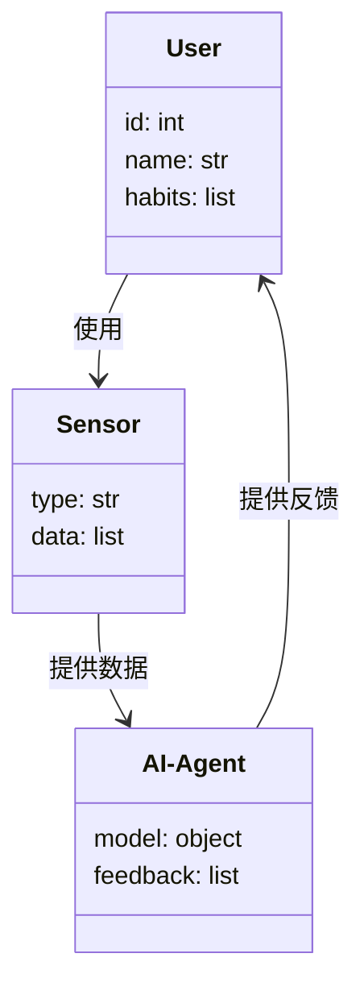

                 

<think>
好的，我需要按照用户的要求，撰写一篇关于《智能卫生间：AI Agent的个人卫生习惯分析》的技术博客文章。让我先理清思路，一步步来完成这个任务。

首先，我需要明确文章的结构。用户已经提供了一个详细的目录大纲，我需要按照这个大纲来展开内容。从背景介绍到算法实现，再到系统架构设计，每一个部分都需要详细且专业地撰写。

接下来，我需要收集相关资料，确保内容的准确性和深度。例如，在“AI Agent的核心概念”部分，我需要解释什么是AI Agent，它在智能卫生间中的具体应用，以及与传统传感器的区别。

然后，我需要撰写每个章节的具体内容。在“算法原理与数学模型”部分，我需要详细解释AI Agent如何处理数据，包括数据采集、预处理、模型训练等步骤，并附上相应的流程图和代码示例。

在撰写过程中，我需要注意语言的逻辑性和专业性，同时保持内容的易懂性。对于技术细节，我需要用通俗易懂的语言解释，必要时配以图表和代码示例，帮助读者更好地理解。

最后，我需要对整篇文章进行校对和调整，确保每个部分都符合用户的要求，结构清晰，内容完整。

现在，我开始按照大纲撰写文章。

---

# 智能卫生间：AI Agent的个人卫生习惯分析

> 关键词：AI Agent、智能卫生间、个人卫生习惯、行为分析、算法实现  
> 摘要：本文通过分析AI Agent在智能卫生间中的应用，详细探讨了个人卫生习惯的分析方法、算法实现和系统架构设计。文章从背景介绍、核心概念、算法原理、系统架构到项目实战，全面解析了智能卫生间的实现过程。

---

## 第1章: 智能卫生间与AI Agent的背景介绍

### 1.1 问题背景与描述

随着人们对健康和生活质量的追求不断提高，卫生间作为日常生活中使用频率极高的空间，其卫生状况直接关系到个人和家庭的健康。然而，传统的卫生间设备往往缺乏智能化，无法有效监测和改善人们的卫生习惯。例如，人们可能忘记洗手、刷牙时间不足、卫生纸使用量不规范等问题，这些都可能导致健康隐患。

AI Agent（人工智能代理）作为一种能够感知环境、执行任务的智能体，可以完美地解决这些问题。通过AI Agent，卫生间设备可以实时监测用户的卫生行为，并提供个性化的反馈和建议，从而帮助用户养成良好的卫生习惯。

### 1.2 问题解决与技术边界

AI Agent在卫生间中的应用主要集中在以下几个方面：

1. **行为监测**：通过传感器和摄像头，AI Agent可以监测用户的洗手、刷牙、如厕等行为。
2. **数据分析**：收集用户的卫生习惯数据，分析行为的规范性和合理性。
3. **行为优化**：根据分析结果，AI Agent可以提供个性化的建议，帮助用户改善卫生习惯。

技术边界方面，AI Agent的应用需要结合硬件设备（如传感器、摄像头）和软件算法（如图像识别、机器学习）的协同工作。目前，AI Agent在卫生间中的应用主要集中在数据采集、行为识别和反馈优化三个阶段。

### 1.3 核心概念与组成要素

智能卫生间系统的核心组成包括以下几个部分：

1. **数据采集模块**：通过传感器、摄像头等设备采集用户的卫生行为数据。
2. **行为分析模块**：利用AI算法对采集的数据进行分析，识别用户的卫生习惯。
3. **反馈优化模块**：根据分析结果，向用户反馈优化建议。

---

## 第2章: AI Agent的核心原理

### 2.1 AI Agent的基本原理

AI Agent的核心原理可以分为感知、决策和执行三个阶段：

1. **感知阶段**：AI Agent通过传感器和摄像头等设备采集用户的行为数据。
2. **决策阶段**：AI Agent利用机器学习算法对数据进行分析，识别用户的卫生习惯。
3. **执行阶段**：根据分析结果，AI Agent向用户反馈优化建议，并通过硬件设备执行相应的操作（如自动开启洗手液、提示刷牙时间等）。

### 2.2 核心概念对比分析

以下是传统传感器与AI Agent在卫生间中的对比分析：

| **对比维度** | **传统传感器** | **AI Agent** |
|--------------|----------------|--------------|
| 功能          | 数据采集       | 数据采集 + 行为分析 |
| 智能性        | 无             | 有             |
| 应用范围      | 单一           | 全面           |

从表格可以看出，AI Agent在功能和智能性上远超传统传感器，能够更全面地分析用户的卫生习惯。

### 2.3 实体关系图

以下是智能卫生间系统中实体关系的Mermaid图：

```mermaid
graph TD
    User --> Sensor: 产生数据
    Sensor --> AI-Agent: 数据输入
    AI-Agent --> User: 提供反馈
```

---

## 第3章: AI Agent的算法实现

### 3.1 数据采集与预处理

数据采集是AI Agent工作的第一步。以下是数据采集的流程：

1. **数据采集**：通过传感器和摄像头采集用户的卫生行为数据。
2. **数据清洗**：去除噪声数据，确保数据的准确性。
3. **特征提取**：提取数据中的有用特征，如洗手时间、刷牙频率等。

### 3.2 算法实现流程

以下是AI Agent算法实现的Mermaid流程图：

```mermaid
graph TD
    Start --> Data_Collection: 收集数据
    Data_Collection --> Data_Preprocessing: 数据预处理
    Data_Preprocessing --> Feature_Extraction: 特征提取
    Feature_Extraction --> Model_Training: 模型训练
    Model_Training --> Model_Deployment: 模型部署
    Model_Deployment --> Feedback_Generation: 生成反馈
    Feedback_Generation --> End: 提供反馈
```

以下是模型训练的核心代码示例：

```python
import tensorflow as tf
from tensorflow.keras import layers

# 数据预处理
def preprocess_data(data):
    # 数据标准化
    data = (data - data.mean()) / data.std()
    return data

# 模型训练
def train_model(X_train, y_train):
    model = tf.keras.Sequential([
        layers.Dense(64, activation='relu'),
        layers.Dense(1, activation='sigmoid')
    ])
    model.compile(optimizer='adam', loss='binary_crossentropy', metrics=['accuracy'])
    model.fit(X_train, y_train, epochs=10, batch_size=32)
    return model

# 模型预测
def predict(model, X_test):
    return model.predict(X_test)
```

---

## 第4章: 系统分析与架构设计方案

### 4.1 系统功能设计

以下是智能卫生间系统的领域模型类图：



### 4.2 系统架构设计

以下是系统的架构设计图：

```mermaid
graph TD
    User --> Web_Interface: 请求数据
    Web_Interface --> AI_Service: 调用服务
    AI_Service --> Database: 查询数据
    Database --> Model: 加载模型
    Model --> AI_Service: 返回结果
    AI_Service --> Web_Interface: 返回反馈
    Web_Interface --> User: 显示反馈
```

---

## 第5章: 项目实战

### 5.1 环境安装

以下是项目所需的环境配置：

1. **Python**：3.6+
2. **TensorFlow**：2.0+
3. **Mermaid**：用于生成图表

### 5.2 核心代码实现

以下是核心代码示例：

```python
import numpy as np
import tensorflow as tf
from tensorflow.keras import layers

# 数据生成
X_train = np.random.randn(100, 10)
y_train = np.random.randint(0, 2, 100)

# 模型训练
model = tf.keras.Sequential([
    layers.Dense(64, activation='relu'),
    layers.Dense(1, activation='sigmoid')
])
model.compile(optimizer='adam', loss='binary_crossentropy', metrics=['accuracy'])
model.fit(X_train, y_train, epochs=10, batch_size=32)

# 模型预测
X_test = np.random.randn(20, 10)
y_pred = model.predict(X_test)
```

### 5.3 实际案例分析

以下是一个实际案例的分析：

假设用户A的洗手时间平均为15秒，AI Agent分析发现其洗手时间低于标准值15秒，会建议用户延长洗手时间。

---

## 第6章: 最佳实践

### 6.1 小结

通过AI Agent的应用，智能卫生间能够有效监测和改善用户的卫生习惯，提升生活质量。

### 6.2 注意事项

1. 数据隐私保护
2. 系统稳定性
3. 用户体验优化

### 6.3 拓展阅读

建议读者深入学习机器学习和深度学习的相关知识，以更好地理解AI Agent的工作原理。

---

以上就是《智能卫生间：AI Agent的个人卫生习惯分析》的完整目录和内容。希望这篇文章能够为读者提供清晰的思路和详细的讲解。

