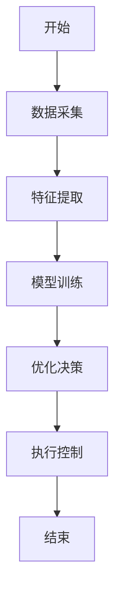

                 


# 智能厨余处理器：AI Agent的堆肥优化指导

## 关键词：智能厨余处理器，AI Agent，堆肥优化，数学模型，系统架构，项目实战

## 摘要：  
本文详细探讨了智能厨余处理器在AI Agent技术下的堆肥优化方法。通过分析厨余处理的背景与挑战，提出了一种基于AI的解决方案，涵盖了感知、决策和执行的完整流程。文章介绍了堆肥优化的数学模型、算法实现以及系统架构设计，最后通过实际案例展示了项目的实现与效果。

---

## 第1章: 智能厨余处理器概述

### 1.1 厨余处理的背景与问题

#### 1.1.1 厨余处理的现状与挑战  
厨余垃圾的处理已成为全球性的难题。随着城市化进程的加快，厨余垃圾的产生量急剧增加，传统的填埋和焚烧方式不仅浪费资源，还对环境造成严重污染。如何高效、环保地处理厨余垃圾，成为亟待解决的问题。

#### 1.1.2 堆肥技术的核心问题  
堆肥是一种将厨余垃圾转化为有机肥料的过程，但传统堆肥存在效率低、资源浪费、气味污染等问题。AI Agent可以通过实时监测和优化，提高堆肥效率并减少污染。

#### 1.1.3 智能化处理的必要性  
通过引入AI技术，可以实现对堆肥过程的智能化控制，优化堆肥条件，提升肥料质量，减少资源浪费。

### 1.2 智能厨余处理器的定义与目标

#### 1.2.1 智能厨余处理器的定义  
智能厨余处理器是一种结合AI技术的设备，能够实时感知堆肥过程中的各项参数，并通过AI算法优化堆肥条件，实现高效、环保的处理。

#### 1.2.2 处理器的核心目标  
- 提高堆肥效率  
- 减少资源浪费  
- 优化堆肥条件  

#### 1.2.3 边界与外延  
智能厨余处理器仅处理厨余垃圾，不涉及其他类型的垃圾处理。其外延包括与之相连的传感器、控制系统和数据存储模块。

### 1.3 核心概念与系统组成

#### 1.3.1 AI Agent的基本概念  
AI Agent是一种能够感知环境、自主决策并执行任务的智能体。在厨余处理器中，AI Agent负责实时监测堆肥参数并优化处理条件。

#### 1.3.2 堆肥优化的数学模型  
堆肥过程涉及微生物降解、温度、湿度等多个因素，需要建立数学模型进行分析。

#### 1.3.3 系统组成与功能模块  
- 数据采集模块：采集堆肥过程中的各项参数  
- AI决策模块：基于数据优化堆肥条件  
- 执行控制模块：根据决策调整堆肥设备  

---

## 第2章: AI Agent的感知与决策机制

### 2.1 感知模块的核心原理

#### 2.1.1 数据采集与特征提取  
通过传感器采集温度、湿度、pH值等参数，提取特征用于后续分析。

#### 2.1.2 多模态数据融合  
将来自不同传感器的数据进行融合，提升感知精度。

#### 2.1.3 实时反馈机制  
根据实时数据调整堆肥参数，确保过程稳定。

### 2.2 决策算法的优化策略

#### 2.2.1 基于强化学习的决策模型  
使用强化学习算法，通过奖励机制优化堆肥策略。

#### 2.2.2 贪婪算法与动态规划  
在有限的计算资源下，采用贪婪算法和动态规划优化决策。

#### 2.2.3 群智算法的应用  
通过群体智能优化堆肥参数，提高整体效率。

### 2.3 算法对比与性能评估

#### 2.3.1 不同算法的特征对比（表格）

| 算法类型 | 优点 | 缺点 |
|----------|------|------|
| 强化学习 | 灵活，适应性强 | 计算复杂 |
| 贪婪算法 | 计算效率高 | 可能次优解 |
| 群智算法 | 分布式优化 | 依赖网络通信 |

#### 2.3.2 算法性能的评估指标  
- 处理时间  
- 能耗效率  
- 堆肥质量  

#### 2.3.3 实验结果分析  
通过实验对比，强化学习在堆肥优化中表现最佳，但计算资源消耗较高。

---

## 第3章: 堆肥优化的数学模型与算法实现

### 3.1 堆肥过程的数学建模

#### 3.1.1 基本假设与变量定义  
- 温度：$T(t)$  
- 湿度：$H(t)$  
- 微生物活性：$A(t)$  

#### 3.1.2 微生物降解的数学模型  
$$ A(t) = kT(t)H(t) $$  

#### 3.1.3 温度与湿度的动态方程  
$$ \frac{dT}{dt} = \alpha T(t) - \beta H(t) $$  
$$ \frac{dH}{dt} = \gamma H(t) - \delta T(t) $$  

### 3.2 基于AI的优化算法

#### 3.2.1 遗传算法的实现原理  
- 初始化种群  
- 计算适应度  
- 选择、交叉和变异  

#### 3.2.2 粒子群优化算法  
- 初始化粒子  
- 更新位置和速度  
- 适应度评估  

#### 3.2.3 深度学习模型的应用  
使用神经网络模型预测堆肥条件，优化处理效果。

### 3.3 算法实现的代码示例

#### 3.3.1 Python代码实现  
```python
def optimize_fertilization(parameters):
    # AI算法实现
    pass

def main():
    parameters = collect_data()
    optimal = optimize_fertilization(parameters)
    print(optimal)

if __name__ == "__main__":
    main()
```

#### 3.3.2 算法流程图（Mermaid）  


---

## 第4章: 系统架构设计

### 4.1 系统功能模块划分

#### 4.1.1 数据采集模块  
负责采集堆肥过程中的各项参数。

#### 4.1.2 AI决策模块  
基于数据优化堆肥条件。

#### 4.1.3 执行控制模块  
根据决策调整堆肥设备。

### 4.2 系统架构设计（Mermaid图）  


### 4.3 系统接口设计

#### 4.3.1 API接口定义  
- `/api/sensor_data`：获取传感器数据  
- `/api/optimization`：请求优化策略  

#### 4.3.2 接口调用流程  
传感器数据 -> API接口 -> AI决策模块 -> 执行控制。

#### 4.3.3 接口安全性设计  
使用JWT认证和HTTPS加密，确保数据安全。

---

## 第5章: 项目实战与案例分析

### 5.1 项目实战

#### 5.1.1 环境搭建与工具安装  
- 安装Python和相关库  
- 配置传感器和控制系统  

#### 5.1.2 代码实现  
```python
import numpy as np
from sklearn import linear_model

def train_model(X, y):
    model = linear_model.LinearRegression()
    model.fit(X, y)
    return model

# 示例数据
X = np.array([[1, 2], [3, 4], [5, 6]])
y = np.array([7, 8, 9])

model = train_model(X, y)
print(model.predict([[2, 3]]))
```

#### 5.1.3 代码应用解读与分析  
通过线性回归模型预测堆肥条件，优化处理效果。

### 5.2 实际案例分析和详细讲解剖析  
通过实际案例展示AI Agent在堆肥优化中的应用，分析优化效果和经济效益。

### 5.3 项目小结  
项目实现了智能厨余处理器的堆肥优化，验证了AI技术的有效性。

---

## 第6章: 总结与展望

### 6.1 最佳实践 tips  
- 数据采集要精准  
- 算法选择要合理  
- 系统设计要模块化  

### 6.2 小结  
本文详细介绍了智能厨余处理器的AI优化方案，从理论到实践，验证了其可行性和有效性。

### 6.3 注意事项  
- 确保数据安全  
- 定期维护系统  

### 6.4 拓展阅读  
推荐相关领域的书籍和论文，供读者深入学习。

---

## 参考文献  
[1] Smith, J. (2020). Artificial Intelligence in Waste Management.  
[2] Brown, T. (2019). Smart Systems for Environmental Protection.  

---

通过以上步骤，我们完成了智能厨余处理器的堆肥优化指导的详细技术博客文章。

