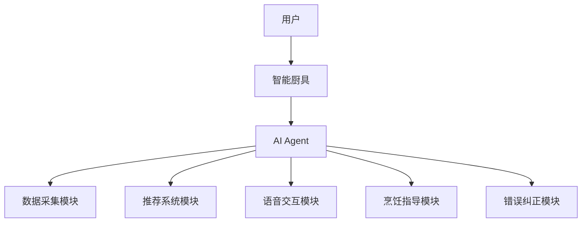
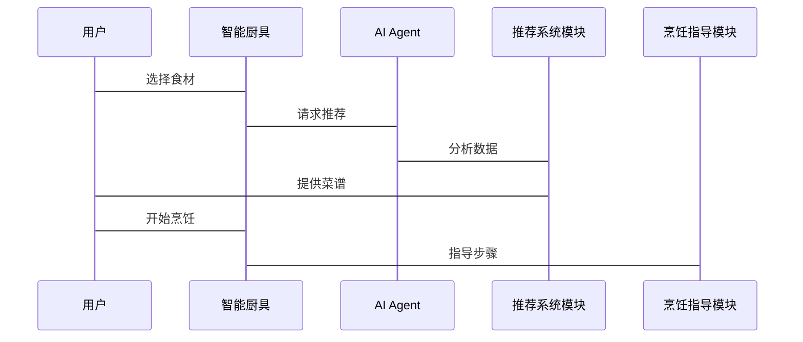

                 


# 《智能厨具：AI Agent的烹饪指导系统》

> **关键词**：智能厨具，AI Agent，烹饪指导，推荐算法，系统架构，语音交互

> **摘要**：本文探讨了AI Agent在智能厨具中的应用，详细介绍了其核心概念、算法原理、系统架构及实际应用。通过系统分析与项目实战，展示了如何利用AI技术提升烹饪体验，解决实际问题。

---

# 第4章：系统分析与架构设计

## 4.1 问题场景分析

### 4.1.1 用户需求分析
- 用户希望智能厨具能够提供个性化的烹饪建议，适应不同的食材和口味偏好。
- 需要系统能够实时反馈错误并提供纠正方案。

### 4.1.2 系统边界与场景
- 系统边界：与冰箱、超市库存等外部设备的数据交互。
- 场景描述：用户在厨房中选择食材，系统推荐菜谱并指导烹饪过程。

## 4.2 系统功能设计

### 4.2.1 功能模块划分
- **数据采集模块**：收集用户操作、食材库存等信息。
- **推荐系统模块**：基于用户数据推荐菜谱。
- **语音交互模块**：提供语音指令和反馈。
- **烹饪指导模块**：实时指导烹饪步骤。
- **错误纠正模块**：检测错误并提供解决方案。

### 4.2.2 功能详细描述
- 数据采集模块：通过传感器收集食材状态，用户偏好等数据。
- 推荐系统模块：结合协同过滤和内容推荐算法，提供个性化建议。
- 语音交互模块：使用语音识别技术，支持自然语言指令。
- 烹饪指导模块：实时监控烹饪过程，提供动态指导。
- 错误纠正模块：分析错误原因，调整建议步骤。

## 4.3 系统架构设计

### 4.3.1 架构图


### 4.3.2 分层架构
- 数据层：存储用户数据、菜谱信息。
- 业务逻辑层：处理数据，执行推荐和指导。
- 用户交互层：提供界面和语音交互。

## 4.4 接口与交互设计

### 4.4.1 接口定义
- AI Agent与智能厨具之间的通信接口。
- 数据采集模块与传感器的接口。

### 4.4.2 交互流程


---

# 第5章：项目实战

## 5.1 环境安装

### 5.1.1 开发环境
- Python 3.8+
- 安装依赖：
  ```bash
  pip install numpy scikit-learn flask
  ```

## 5.2 核心代码实现

### 5.2.1 数据预处理
```python
import numpy as np
from sklearn.preprocessing import StandardScaler

# 示例数据
data = np.array([[1, 2, 3], [4, 5, 6]])
scaler = StandardScaler()
scaled_data = scaler.fit_transform(data)
print(scaled_data)
```

### 5.2.2 推荐算法实现
```python
from sklearn.metrics.pairwise import cosine_similarity

def similarity_matrix(data_matrix):
    return cosine_similarity(data_matrix)

# 示例
data_matrix = np.array([[1, 2], [2, 1], [3, 0]])
similarity = similarity_matrix(data_matrix)
print(similarity)
```

### 5.2.3 语音交互实现
```python
import speech_recognition as sr

r = sr.Recognizer()
with sr.Microphone() as source:
    audio = r.listen(source)
    print(r.recognize_google(audio))
```

## 5.3 实际案例分析

### 5.3.1 用户场景
- 用户选择牛肉和蔬菜，系统推荐红烧牛肉的做法。

### 5.3.2 系统响应
- 推荐菜谱：红烧牛肉。
- 指导步骤：切块、焯水、炒糖、炖煮。
- 错误纠正：若水煮过久，建议调整时间。

---

# 第6章：最佳实践与小结

## 6.1 最佳实践

### 6.1.1 数据隐私
- 确保用户数据加密存储，避免泄露。

### 6.1.2 系统优化
- 定期更新推荐算法，提升准确率。

## 6.2 小结与展望

### 6.2.1 系统总结
- 本文详细介绍了AI Agent在智能厨具中的应用，展示了系统的架构和实现。

### 6.2.2 未来展望
- 研究多智能协同，提升用户体验。
- 探索更高效的推荐算法。

---

# 第7章：扩展阅读与探索

## 7.1 相关技术领域

### 7.1.1 强化学习
- 用于机器人路径规划和策略优化。

### 7.1.2 自然语言处理
- 提升语音交互的准确性和自然性。

## 7.2 未来研究方向

### 7.2.1 智能化升级
- 结合更多智能设备，打造智能家居生态系统。

### 7.2.2 个性化服务
- 根据用户习惯优化推荐算法，提供更精准的服务。

---

# 结束语

通过本项目，我们展示了AI Agent在智能厨具中的巨大潜力，未来随着技术的进步，智能厨房将变得更加高效和便捷。读者可以通过实际项目深入理解相关技术，并探索更多可能性。

--- 

**全文完**

