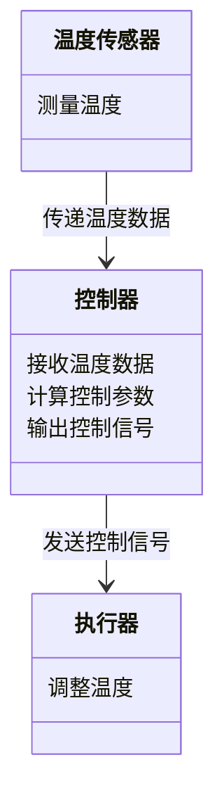
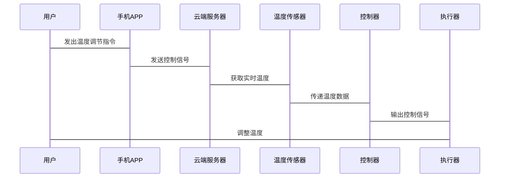

                 


# 智能厨具：AI Agent的烹饪温度控制

> 关键词：智能厨具，AI Agent，烹饪温度控制，物联网，人工智能

> 摘要：随着人工智能技术的快速发展，智能厨具逐渐成为现代家庭不可或缺的一部分。本文将深入探讨AI Agent在烹饪温度控制中的应用，从背景介绍、核心概念到算法原理、系统架构设计，再到项目实战和最佳实践，全面解析智能厨具如何通过AI Agent实现精准的温度控制，为读者提供一个从理论到实践的完整技术指南。

---

# 第一部分: 智能厨具与AI Agent的背景介绍

## 第1章: 智能厨具的发展历程

### 1.1 智能厨具的定义与特点
#### 1.1.1 智能厨具的定义
智能厨具是指通过物联网、人工智能等技术实现智能化操作的厨房设备，能够通过传感器、执行器和智能算法实现自动化控制。

#### 1.1.2 智能厨具的核心特点
- **智能化**：通过AI算法实现自动化操作。
- **联网化**：支持物联网，可以通过手机APP远程控制。
- **个性化**：根据用户习惯提供定制化服务。
- **高效化**：通过优化算法提高烹饪效率。

#### 1.1.3 智能厨具与传统厨具的区别
| 特性       | 传统厨具         | 智能厨具         |
|------------|------------------|------------------|
| 控制方式   | 手动操作         | 自动化控制       |
| 信息处理   | 无               | 支持传感器和AI算法|
| 连接性     | 离线             | 联网             |
| 个性化     | 无               | 支持             |

### 1.2 AI Agent的基本概念
#### 1.2.1 AI Agent的定义
AI Agent是一种能够感知环境、自主决策并执行任务的智能实体，能够在动态环境中实现目标。

#### 1.2.2 AI Agent的核心功能
- **感知环境**：通过传感器获取环境信息。
- **决策与推理**：基于感知信息做出决策。
- **执行任务**：通过执行器完成任务。

#### 1.2.3 AI Agent与传统控制系统的区别
| 特性       | 传统控制系统     | AI Agent         |
|------------|------------------|------------------|
| 智能性     | 基于固定逻辑     | 基于动态推理     |
| 学习能力   | 无               | 支持学习与优化   |
| 自适应性   | 无               | 支持自适应调整   |

### 1.3 烹饪温度控制的重要性
#### 1.3.1 烹饪温度对食物质量的影响
温度控制直接影响食物的烹饪效果，例如过高的温度可能导致食物焦糊，过低的温度可能导致食物未煮熟。

#### 1.3.2 温度控制在智能厨具中的作用
- **提高烹饪效率**：通过精确控制温度减少能源浪费。
- **优化烹饪质量**：确保食物在最佳温度下烹饪，提升口感。
- **提供个性化体验**：根据用户偏好自动调整温度。

#### 1.3.3 温度控制的挑战与解决方案
| 挑战       | 解决方案         |
|------------|------------------|
| 精度不足   | 使用高精度传感器|
| 动态变化   | 实时调整控制参数|
| 外部干扰   | 增强鲁棒性设计   |

---

## 第2章: AI Agent在烹饪温度控制中的应用

### 2.1 AI Agent的基本原理
#### 2.1.1 AI Agent的感知与决策机制
- **感知**：通过温度传感器获取实时温度数据。
- **决策**：基于感知数据和预设目标，通过AI算法做出控制决策。
- **执行**：通过执行器（如加热元件）调整温度。

#### 2.1.2 AI Agent的学习与优化算法
- **机器学习**：通过训练数据优化温度控制模型。
- **强化学习**：通过奖励机制不断优化控制策略。

#### 2.1.3 AI Agent的执行与反馈机制
- **执行**：根据决策结果驱动执行器。
- **反馈**：通过传感器实时反馈温度变化，形成闭环控制。

### 2.2 AI Agent在温度控制中的具体应用
#### 2.2.1 基于AI Agent的智能恒温器
- **应用场景**：用于保持厨房设备的恒定温度。
- **实现方式**：通过PID算法实现温度的精确控制。

#### 2.2.2 基于AI Agent的智能烤箱
- **应用场景**：根据食材种类自动调整温度和时间。
- **实现方式**：结合图像识别和温度传感器进行智能控制。

#### 2.2.3 基于AI Agent的智能电磁炉
- **应用场景**：根据锅底温度自动调节加热功率。
- **实现方式**：通过温度传感器和模糊控制算法实现智能调节。

### 2.3 AI Agent在烹饪中的优势
#### 2.3.1 提高烹饪效率
- **减少能源浪费**：通过精确控制温度和时间，降低能耗。
- **缩短烹饪时间**：通过优化算法提高烹饪速度。

#### 2.3.2 优化烹饪质量
- **均匀加热**：通过AI算法实现温度的均匀分布。
- **精准火候**：根据食材特性和用户偏好调整温度。

#### 2.3.3 提供个性化烹饪体验
- **定制化服务**：根据用户习惯推荐最佳烹饪方案。
- **远程控制**：通过手机APP实现远程监控和调整。

---

## 第3章: AI Agent与温度控制的核心概念

### 3.1 温度控制的基本原理
#### 3.1.1 温度传感器的工作原理
- **热电偶传感器**：通过不同金属材料的温差产生电压信号。
- **铂电阻传感器**：通过铂电阻的阻值变化反映温度变化。

#### 3.1.2 温度控制算法的基本类型
- **比例积分微分（PID）算法**：通过比例、积分和微分三项调节输出。
- **模糊控制算法**：通过模糊逻辑实现非线性控制。

#### 3.1.3 温度控制系统的组成与功能
| 组件       | 功能描述         |
|------------|------------------|
| 传感器     | 获取环境温度数据 |
| 控制器     | 处理数据并做出决策|
| 执行器     | 执行控制指令     |

### 3.2 AI Agent在温度控制中的核心功能
#### 3.2.1 数据采集与处理
- **数据采集**：通过传感器获取实时温度数据。
- **数据预处理**：对采集数据进行滤波和归一化处理。

#### 3.2.2 智能决策与控制
- **决策算法**：基于当前温度和目标温度，通过AI算法计算出控制参数。
- **控制策略**：根据决策结果调整加热功率或制冷功率。

#### 3.2.3 系统优化与自适应
- **自适应调节**：根据环境变化和用户反馈动态调整控制参数。
- **系统优化**：通过机器学习不断优化温度控制模型。

### 3.3 温度控制系统的数学模型
#### 3.3.1 PID控制算法的数学模型
PID算法的数学表达式为：
$$ u(t) = K_p \cdot e(t) + K_i \cdot \int_{0}^{t} e(\tau) d\tau + K_d \cdot \frac{de(t)}{dt} $$
其中：
- $u(t)$ 是控制输出
- $e(t)$ 是误差信号
- $K_p$、$K_i$、$K_d$ 分别是比例、积分、微分系数

#### 3.3.2 模糊控制算法的数学模型
模糊控制算法通过模糊逻辑将输入温度映射到输出控制量，具体步骤如下：
1. **模糊化**：将实数温度值转换为模糊语言变量。
2. **规则推理**：根据模糊规则生成控制决策。
3. **解模糊**：将模糊决策转换为具体的控制量。

---

## 第4章: 系统分析与架构设计方案

### 4.1 问题场景介绍
在智能厨具中，温度控制系统的实现需要考虑以下问题：
- 如何实现高精度的温度测量？
- 如何设计高效的控制算法？
- 如何保证系统的实时性和稳定性？

### 4.2 系统功能设计
#### 4.2.1 领域模型（Mermaid 类图）


#### 4.2.2 系统架构设计（Mermaid 架构图）


#### 4.2.3 系统接口设计
- **传感器接口**：通过I2C或SPI接口连接温度传感器。
- **执行器接口**：通过PWM信号控制加热元件。
- **网络接口**：通过Wi-Fi或蓝牙实现与手机APP的通信。

#### 4.2.4 系统交互设计（Mermaid 序列图）


---

## 第5章: 项目实战

### 5.1 环境安装与配置
#### 5.1.1 硬件准备
- 温度传感器（如DS18B20）
- 微处理器（如Raspberry Pi）
- 加热元件（如电热板）
- 无线通信模块（如Wi-Fi模块）

#### 5.1.2 软件安装
- 安装Python和必要的库（如Adafruit_Python_DHT）
- 安装物联网平台（如MQTT服务器）

### 5.2 系统核心实现
#### 5.2.1 温度传感器的代码实现
```python
import time
import board
import busio
from adafruit_dht import DHT22

# 初始化传感器
i2c = busio.I2C(board.SCL, board.SDA)
dht = DHT22.DHT22(i2c)

# 读取温度数据
def get_temperature():
    try:
        temperature = dht.temperature
        return temperature
    except:
        return None
```

#### 5.2.2 PID控制算法的代码实现
```python
def pid_control(setpoint, current_temp, Kp, Ki, Kd, integral, last_error, dt):
    error = setpoint - current_temp
    integral += error * dt
    derivative = (error - last_error) / dt
    output = Kp * error + Ki * integral + Kd * derivative
    return output, integral, error
```

#### 5.2.3 系统集成与测试
- **功能测试**：测试温度控制系统的精度和响应速度。
- **性能测试**：在不同环境下测试系统的稳定性和可靠性。
- **用户体验测试**：收集用户反馈，优化界面和功能。

### 5.3 实际案例分析
#### 5.3.1 智能恒温电炖锅的设计与实现
- **设计目标**：实现恒温炖煮功能。
- **实现步骤**：
  1. 安装温度传感器和加热元件。
  2. 配置PID控制算法。
  3. 实现与手机APP的通信。

#### 5.3.2 案例分析与优化
- **案例分析**：分析实际运行中的温度波动原因。
- **优化措施**：调整PID参数，增加抗干扰能力。

### 5.4 项目小结
- **项目成果**：成功实现了一个基于AI Agent的智能温度控制系统。
- **经验总结**：在实际开发中，硬件调试和算法优化是关键。

---

## 第6章: 最佳实践与总结

### 6.1 最佳实践
#### 6.1.1 系统设计
- **模块化设计**：便于维护和扩展。
- **容错设计**：增加异常处理机制。

#### 6.1.2 算法优化
- **参数调优**：根据实际需求调整PID参数。
- **算法升级**：引入机器学习算法进行优化。

#### 6.1.3 人机交互
- **简化操作**：设计直观的用户界面。
- **智能反馈**：提供实时的操作反馈。

### 6.2 小结
通过本文的详细讲解，读者可以全面了解AI Agent在烹饪温度控制中的应用，从理论到实践，掌握智能厨具的核心技术。

### 6.3 注意事项
- **安全性**：确保系统在高温环境下安全运行。
- **稳定性**：保证系统的长期稳定性和可靠性。
- **可扩展性**：设计时考虑未来的升级和扩展需求。

### 6.4 拓展阅读
- **推荐书籍**：《人工智能：一种现代方法》
- **推荐文章**：《基于物联网的智能厨房设计与实现》
- **在线资源**：IEEE和ACM的相关论文

---

通过以上内容，您可以系统地了解AI Agent在烹饪温度控制中的应用，从理论基础到实际案例，帮助您更好地理解和实现智能厨具的技术细节。

