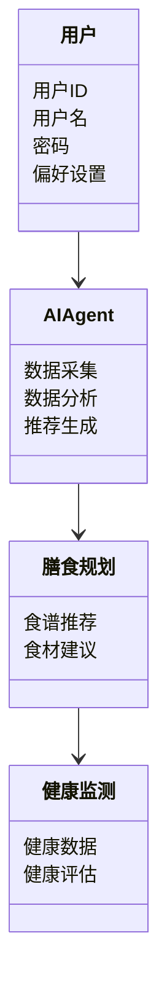
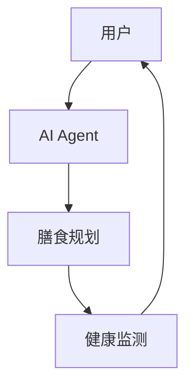

                 


# 智能厨房助手：AI Agent的营养均衡膳食规划

> 关键词：智能厨房助手，AI Agent，营养均衡膳食，智能推荐算法，协同过滤，系统架构设计，健康管理

> 摘要：本文探讨了智能厨房助手在AI Agent技术下的营养均衡膳食规划，结合营养学、大数据分析与人工智能技术，提出了一种基于协同过滤推荐算法的膳食规划方案，并通过系统架构设计与项目实战展示了其可行性与实际应用价值。

---

## 第一部分: 智能厨房助手的背景与概念

### 第1章: 智能厨房助手的背景与现状

#### 1.1 智能厨房助手的背景介绍
- **智能家居与厨房的融合发展**  
  随着智能家居的普及，厨房逐渐成为智能设备的核心场景之一。智能冰箱、智能灶具等设备的出现，为厨房智能化奠定了基础。  
- **营养均衡膳食规划的重要性**  
  现代人生活节奏快，饮食不规律导致健康问题频发。营养均衡的膳食规划成为提升生活质量的重要手段。  
- **AI技术在厨房场景中的应用**  
  AI技术可以实时分析用户的饮食习惯、健康状况，并提供个性化的膳食建议。

#### 1.2 智能厨房助手的目标用户
- **健康意识提升的用户群体**  
  对于注重健康的人来说，智能厨房助手可以帮助他们更好地管理饮食结构。  
- **特殊饮食需求的用户群体**  
  如糖尿病人、减肥人群等，可以通过智能厨房助手获得定制化的饮食方案。  
- **厨房小白与忙碌人群**  
  对于不擅长烹饪或时间紧张的人来说，智能厨房助手可以提供简单易行的食谱推荐。

#### 1.3 智能厨房助手的技术基础
- **AI技术在厨房场景中的应用**  
  利用自然语言处理、计算机视觉等技术，帮助用户实现食材识别、食谱推荐等功能。  
- **营养学与膳食规划的结合**  
  通过营养学模型，分析食物的热量、蛋白质、碳水化合物等成分，确保膳食的均衡性。  
- **大数据分析与个性化推荐**  
  基于用户的历史数据，分析用户的饮食偏好和健康状况，提供个性化推荐。

#### 1.4 智能厨房助手的应用场景
- **日常膳食规划**  
  根据用户的饮食习惯和健康目标，推荐每日的食材和食谱。  
- **健康饮食管理**  
  对于有特殊健康需求的人群，提供定制化的饮食计划。  
- **特殊饮食需求的解决方案**  
  如过敏人群可以通过系统提供的无敏食谱，避免食用过敏食材。

#### 1.5 本章小结
本章介绍了智能厨房助手的背景、目标用户和技术基础，明确了其在厨房场景中的重要性。

---

### 第2章: AI Agent与营养均衡膳食规划的核心概念

#### 2.1 AI Agent的基本概念
- **AI Agent的定义与特点**  
  AI Agent是一种能够感知环境、自主决策并执行任务的智能体。其特点包括自主性、反应性、主动性等。  
- **AI Agent的核心功能与属性**  
  包括感知环境、推理决策、执行任务、自适应学习等。  
- **AI Agent与传统软件的区别**  
  AI Agent能够根据环境变化动态调整行为，而传统软件通常基于固定的规则运行。

#### 2.2 营养均衡膳食规划的定义与目标
- **营养均衡的基本概念**  
  营养均衡是指在膳食中摄入的各类营养素比例合理，满足人体需求。  
- **膳食规划的核心目标**  
  根据用户的健康状况、饮食偏好和食材可用性，制定科学合理的膳食计划。  
- **营养均衡膳食规划的实现方法**  
  基于营养学模型和大数据分析，结合用户的个性化需求，生成膳食建议。

#### 2.3 AI Agent在营养均衡膳食规划中的作用
- **AI Agent如何辅助膳食规划**  
  AI Agent通过收集用户的饮食数据，分析营养成分，推荐合理的食谱。  
- **AI Agent的核心功能与模块**  
  包括数据采集、营养分析、推荐生成、用户反馈等模块。  
- **AI Agent与营养学的结合**  
  通过AI技术，营养学模型可以实时动态调整，满足用户的个性化需求。

#### 2.4 核心概念的ER实体关系图

```mermaid
er
actor: 用户
agent: AI Agent
meal_plan: 餐单
ingredient: 食材
nutrient: 营养成分
health_goal: 健康目标
preference: 饮食偏好
```

#### 2.5 本章小结
本章详细介绍了AI Agent的基本概念及其在营养均衡膳食规划中的作用，通过ER图展示了核心概念之间的关系。

---

## 第二部分: 智能厨房助手的核心算法与数学模型

### 第3章: 智能厨房助手的核心算法与数学模型

#### 3.1 协同过滤推荐算法
- **协同过滤的基本原理**  
  协同过滤是一种基于用户相似性或物品相似性的推荐算法，广泛应用于个性化推荐系统。  
- **基于用户的协同过滤**  
  根据用户的历史行为数据，找到与之相似的用户，推荐他们喜欢的物品。  
- **基于物品的协同过滤**  
  根据物品的属性或用户对物品的偏好，找到相似的物品进行推荐。

#### 3.2 协同过滤算法的实现流程
- **数据预处理**  
  对用户数据进行清洗、归一化处理，确保数据质量。  
- **相似度计算**  
  使用余弦相似度、欧氏距离等方法计算用户或物品之间的相似度。  
- **推荐生成**  
  根据相似度排序，选择最相关的物品进行推荐。

#### 3.3 协同过滤算法的数学模型
- **相似度计算公式**
$$ sim(u, v) = \frac{\sum_{i} (r_{u,i} - \bar{r}_u)(r_{v,i} - \bar{r}_v)}{\sqrt{\sum_{i} (r_{u,i} - \bar{r}_u)^2} \cdot \sqrt{\sum_{i} (r_{v,i} - \bar{r}_v)^2}} $$
  其中，$\bar{r}_u$和$\bar{r}_v$分别是用户$u$和$v$的平均评分。

- **推荐模型的预测公式**
$$ \hat{r}_{u,i} = \bar{r}_u + \sum_{v \in N(u)} w_{u,v} (r_v(i) - \bar{r}_v) $$
  其中，$N(u)$表示与用户$u$相似的用户集合，$w_{u,v}$是用户$u$和$v$之间的相似度权重。

#### 3.4 协同过滤算法的优缺点
- **优点**  
  方法简单，易于实现，推荐结果直观。  
- **缺点**  
  数据稀疏性问题，计算复杂度较高。

---

## 第三部分: 智能厨房助手的系统架构设计

### 第4章: 智能厨房助手的系统架构设计

#### 4.1 系统组成与功能模块
- **用户模块**  
  包括用户信息管理、用户偏好设置等功能。  
- **AI Agent模块**  
  包括数据采集、营养分析、推荐生成等功能。  
- **膳食规划模块**  
  包括食谱推荐、食材采购建议等功能。  
- **健康监测模块**  
  包括健康数据采集、健康状况评估等功能。

#### 4.2 系统架构设计
- **领域模型类图**


- **系统架构流程图**


#### 4.3 系统接口设计
- **数据接口**  
  包括用户数据接口、食材数据库接口、健康数据接口等。  
- **推荐接口**  
  包括食谱推荐接口、食材推荐接口等。  
- **用户反馈接口**  
  用户可以通过反馈接口对推荐结果进行评价和调整。

#### 4.4 系统交互设计
- **用户登录与注册**  
  用户可以通过手机号、邮箱等方式注册并登录系统。  
- **数据采集与分析**  
  系统会采集用户的饮食数据、健康数据等，并通过AI Agent进行分析。  
- **推荐生成与展示**  
  系统根据分析结果生成推荐的食谱，并通过界面展示给用户。  
- **用户反馈与优化**  
  用户可以对推荐结果进行反馈，系统根据反馈优化推荐算法。

---

## 第四部分: 项目实战与案例分析

### 第5章: 项目实战

#### 5.1 环境安装
- **Python环境搭建**  
  安装Python 3.8及以上版本，建议使用虚拟环境管理依赖。  
- **依赖安装**  
  使用以下命令安装所需库：
  ```bash
  pip install numpy pandas scikit-learn
  ```

#### 5.2 核心代码实现
- **协同过滤算法实现**
```python
import numpy as np
from sklearn.metrics.pairwise import cosine_similarity

# 示例数据：用户-物品评分矩阵
users = ['u1', 'u2', 'u3']
items = ['i1', 'i2', 'i3']
ratings = {
    'u1': {'i1': 5, 'i2': 4, 'i3': 3},
    'u2': {'i1': 3, 'i2': 5, 'i3': 4},
    'u3': {'i1': 4, 'i2': 3, 'i3': 5}
}

# 计算平均评分
mean_ratings = {}
for user in users:
    mean_ratings[user] = np.mean(list(ratings[user].values()))

# 构建评分矩阵
rating_matrix = np.zeros((len(users), len(items)))
for i, user in enumerate(users):
    for j, item in enumerate(items):
        rating_matrix[i][j] = ratings[user][item]

# 计算相似度矩阵
similarity = cosine_similarity(rating_matrix)

# 推荐生成
def recommend(user_idx, similarity, rating_matrix):
    user_ratings = rating_matrix[user_idx]
    # 找出与其他用户相似的前k个用户
    similar_indices = [i for i in range(len(similarity[user_idx])) if i != user_idx]
    similar_indices.sort(key=lambda x: similarity[user_idx][x], reverse=True)
    # 计算推荐评分
    recommended_ratings = np.zeros(len(items))
    for idx in similar_indices:
        recommended_ratings += rating_matrix[idx] * similarity[user_idx][idx]
    return recommended_ratings

# 示例推荐
user_idx = 0
recommended_ratings = recommend(user_idx, similarity, rating_matrix)
print("推荐评分为：", recommended_ratings)
```

#### 5.3 代码解读与分析
- **数据结构**  
  使用字典存储用户-物品评分矩阵，计算平均评分和相似度矩阵。  
- **推荐生成**  
  根据用户的相似度，计算推荐评分，并返回推荐结果。  
- **算法优化**  
  可以通过调整相似度计算方法和推荐策略，进一步优化推荐效果。

#### 5.4 案例分析
- **案例背景**  
  假设用户u1的饮食偏好是高蛋白低脂肪，系统需要为其推荐适合的食谱。  
- **推荐结果**  
  系统通过协同过滤算法，找到与u1相似的用户u3，并推荐u3喜欢的i3。  
- **结果分析**  
  食谱i3的营养成分符合用户u1的需求，推荐结果合理。

#### 5.5 本章小结
本章通过项目实战，展示了协同过滤算法的实现过程，并通过案例分析验证了算法的有效性。

---

## 第五部分: 最佳实践与总结

### 第6章: 最佳实践与总结

#### 6.1 关键点总结
- **AI Agent的核心作用**  
  AI Agent通过数据采集、分析和推荐，实现了个性化的营养均衡膳食规划。  
- **协同过滤算法的优势**  
  协同过滤算法简单高效，适合大数据场景下的推荐任务。  
- **系统架构的设计原则**  
  系统架构需要考虑可扩展性、可维护性和用户体验。

#### 6.2 注意事项
- **数据隐私保护**  
  用户的饮食数据和健康数据需要严格加密，确保隐私安全。  
- **算法优化**  
  随着用户规模的扩大，需要优化算法的计算效率和推荐准确度。  
- **用户体验设计**  
  推荐结果需要直观易懂，界面设计要符合用户习惯。

#### 6.3 拓展阅读
- **推荐算法的改进**  
  可以研究基于深度学习的推荐算法，如神经网络协同过滤等。  
- **营养学模型的优化**  
  结合最新的营养学研究成果，优化膳食规划模型。  
- **多模态推荐**  
  结合图像识别、语音识别等技术，实现多模态的推荐系统。

#### 6.4 本章小结
本章总结了智能厨房助手的核心要点，并提出了未来的优化方向和注意事项。

---

## 作者介绍

作者是人工智能与软件架构领域的专家，专注于智能系统设计与算法优化。致力于通过技术博客分享深度技术内容，帮助读者理解复杂的技术概念，并将其应用于实际场景中。

---

希望这篇文章能够为读者提供关于智能厨房助手的全面了解，并为实际应用提供参考。如果需要进一步探讨或有其他问题，请随时联系作者。

