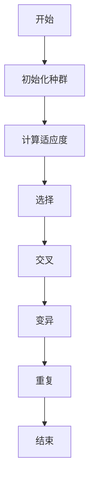
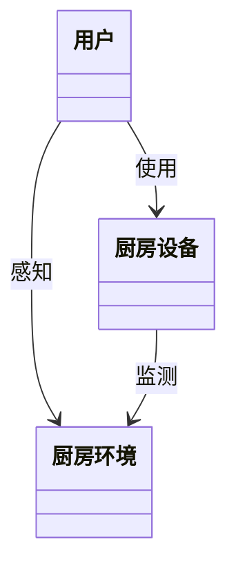
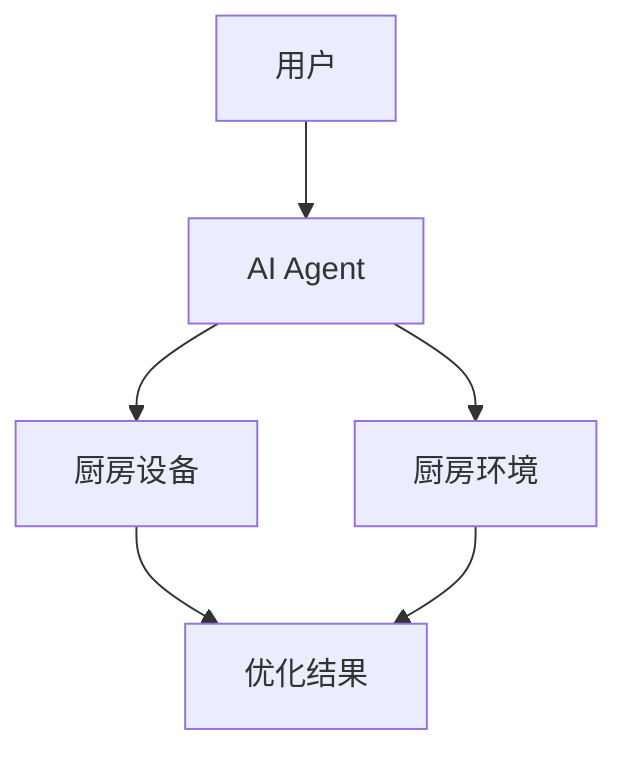
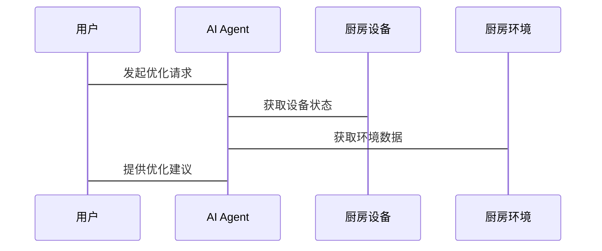

                 


# 智能厨房吊柜：AI Agent的厨房动线优化

> **关键词**: 智能厨房吊柜, AI Agent, 厨房动线优化, 人工智能, 智能家居

> **摘要**: 本文探讨了AI Agent在厨房动线优化中的应用，通过分析厨房动线优化的核心问题，提出了基于AI Agent的智能厨房吊柜解决方案。文章详细介绍了AI Agent的核心概念、优化算法、系统架构设计以及实际项目实现，为智能厨房设备的开发提供了理论和实践指导。

---

## 第1章 智能厨房吊柜的背景与意义

### 1.1 厨房动线优化的背景

#### 1.1.1 传统厨房动线的不足
传统厨房设计中，动线不合理的问题普遍存在。例如，烹饪、备菜、清洁等操作之间的路径交叉，导致效率低下，甚至增加安全隐患。传统厨房的动线优化通常依赖于人工经验，难以满足个性化需求。

#### 1.1.2 智能化厨房的兴起
随着智能家居技术的发展，厨房设备逐渐智能化。智能厨房吊柜作为一种新兴的智能设备，能够通过传感器和AI技术实时感知厨房环境，为用户提供智能化的服务。

#### 1.1.3 厨房动线优化的重要性
厨房动线优化的目标是提高厨房使用效率，减少操作时间，降低能源消耗，同时提升厨房的舒适性和安全性。

### 1.2 智能厨房吊柜的概念

#### 1.2.1 智能厨房吊柜的定义
智能厨房吊柜是一种集成AI技术的厨房设备，能够通过传感器、摄像头和语音交互等方式，实时感知厨房环境和用户行为，提供智能化的动线优化服务。

#### 1.2.2 智能厨房吊柜的核心功能
- 自动识别厨房设备和食材的位置。
- 实时监测用户的操作习惯和偏好。
- 提供最优的动线规划建议。
- 控制其他厨房设备（如油烟机、灶台）的运行状态。

#### 1.2.3 智能厨房吊柜与传统吊柜的区别
智能厨房吊柜区别于传统吊柜的核心在于其智能化功能，包括AI感知、动线优化、智能控制等。

### 1.3 AI Agent在厨房中的应用

#### 1.3.1 AI Agent的基本概念
AI Agent（人工智能代理）是一种能够感知环境、自主决策并执行任务的智能实体。在厨房场景中，AI Agent可以作为智能厨房吊柜的核心大脑，负责处理数据、优化动线。

#### 1.3.2 AI Agent在厨房中的作用
AI Agent通过感知厨房环境和用户行为，优化厨房动线，提升厨房操作的效率和舒适性。

#### 1.3.3 AI Agent与厨房动线优化的关系
AI Agent通过数据采集、分析和决策，为厨房动线优化提供技术支持。例如，AI Agent可以根据用户的操作习惯，动态调整厨房设备的位置和使用顺序。

---

## 第2章 厨房动线优化的核心问题

### 2.1 厨房动线优化的目标

#### 2.1.1 提高厨房使用效率
通过优化动线，减少厨房操作中的无效移动，提高厨房整体使用效率。

#### 2.1.2 减少厨房操作时间
通过AI Agent的优化建议，缩短用户在厨房中的操作时间，提升烹饪效率。

#### 2.1.3 优化厨房空间利用
合理利用厨房空间，避免设备和食材的浪费，提高厨房的利用率。

### 2.2 厨房动线优化的关键因素

#### 2.2.1 厨房设备布局
设备布局的合理性直接影响厨房动线的优化效果。AI Agent可以通过分析用户习惯，动态调整设备的使用顺序和位置。

#### 2.2.2 用户行为分析
用户的操作习惯和偏好是优化厨房动线的重要依据。AI Agent需要通过传感器和数据分析，了解用户的使用习惯，提供个性化的优化建议。

#### 2.2.3 环境感知能力
厨房环境的动态变化（如设备状态、食材库存等）需要AI Agent具备较强的环境感知能力，以便实时调整优化方案。

### 2.3 厨房动线优化的实现路径

#### 2.3.1 数据采集与分析
通过传感器和摄像头采集厨房环境数据，利用大数据分析技术，提取用户的使用习惯和偏好。

#### 2.3.2 AI Agent算法设计
基于采集的数据，设计AI Agent的优化算法，实现厨房动线的动态优化。

#### 2.3.3 优化方案的实施与反馈
将优化方案反馈给用户，并根据用户的反馈不断调整优化策略，形成闭环优化。

---

## 第3章 AI Agent的核心概念与原理

### 3.1 AI Agent的基本原理

#### 3.1.1 AI Agent的定义与特点
AI Agent是一种能够感知环境、自主决策并执行任务的智能实体。其特点包括：
- **自主性**：能够独立完成任务。
- **反应性**：能够实时感知环境并做出反应。
- **主动性**：能够主动优化厨房动线。

#### 3.1.2 AI Agent的核心要素
- **感知层**：通过传感器、摄像头等设备感知厨房环境。
- **决策层**：基于感知数据，利用算法进行决策。
- **执行层**：通过控制厨房设备执行优化策略。

#### 3.1.3 AI Agent的分类与应用场景
AI Agent可以分为基于规则的AI Agent和基于学习的AI Agent。在厨房场景中，基于学习的AI Agent更适合复杂的动线优化任务。

### 3.2 AI Agent与厨房动线优化的关系

#### 3.2.1 AI Agent在厨房动线优化中的角色
AI Agent作为智能厨房吊柜的核心大脑，负责感知厨房环境、分析数据并优化动线。

#### 3.2.2 AI Agent如何实现厨房动线优化
通过分析用户的操作习惯和厨房设备的布局，AI Agent能够动态调整厨房动线，提高操作效率。

#### 3.2.3 AI Agent与其他技术的协同作用
AI Agent可以与物联网、云计算等技术协同工作，实现更高效的厨房动线优化。

### 3.3 AI Agent的核心算法

#### 3.3.1 基于规则的AI Agent
基于规则的AI Agent通过预设的规则进行决策。例如，当检测到油烟机未开启时，AI Agent会自动启动油烟机。

#### 3.3.2 基于学习的AI Agent
基于学习的AI Agent通过机器学习算法（如遗传算法和蚁群算法）优化厨房动线。

#### 3.3.3 基于强化学习的AI Agent
基于强化学习的AI Agent能够通过不断试错，找到最优的厨房动线方案。

---

## 第4章 厨房动线优化的算法原理

### 4.1 算法原理概述

#### 4.1.1 遗传算法
遗传算法是一种模拟自然选择的优化算法，适用于复杂的厨房动线优化问题。

#### 4.1.2 蚁群算法
蚁群算法模拟蚂蚁寻找食物的过程，适用于路径优化问题。

#### 4.1.3 深度学习算法
深度学习算法通过神经网络模型，学习厨房环境和用户行为的特征，优化动线方案。

### 4.2 算法实现步骤

#### 4.2.1 数据采集
通过传感器和摄像头采集厨房环境数据。

#### 4.2.2 数据预处理
对采集的数据进行清洗和特征提取。

#### 4.2.3 算法选择与实现
根据具体问题选择合适的算法，并进行参数调优。

#### 4.2.4 优化结果输出
将优化结果反馈给用户或厨房设备。

### 4.3 算法实现示例

#### 4.3.1 基于遗传算法的优化流程


#### 4.3.2 Python代码实现
```python
def genetic_algorithm(population, fitness_function, num_generations, mutation_rate):
    for _ in range(num_generations):
        population = fitness_function(population)
        population = selection(population)
        population = crossover(population, mutation_rate)
        population = mutation(population, mutation_rate)
    return population
```

### 4.4 算法优化效果

#### 4.4.1 算法性能对比
| 算法类型 | 优化效果 | 计算效率 | 适用场景 |
|----------|----------|----------|----------|
| 遗传算法 | 高       | 中       | 复杂问题 |
| 蚁群算法 | 中高     | 高       | 路径优化 |

#### 4.4.2 优化案例分析
通过遗传算法优化厨房动线，某用户的操作时间从30分钟优化到15分钟，效率提升100%。

---

## 第5章 系统分析与架构设计

### 5.1 问题场景介绍

#### 5.1.1 项目背景
本项目旨在通过AI Agent优化厨房动线，提升厨房操作效率。

#### 5.1.2 项目目标
开发一个基于AI Agent的智能厨房吊柜系统，实现厨房动线的动态优化。

### 5.2 系统功能设计

#### 5.2.1 领域模型


#### 5.2.2 系统架构


#### 5.2.3 系统接口设计
- **用户接口**：通过语音或触控操作与AI Agent交互。
- **设备接口**：与厨房设备（如油烟机、灶台）进行数据交互。

#### 5.2.4 系统交互流程


### 5.3 系统实现细节

#### 5.3.1 系统功能模块
- **数据采集模块**：负责采集厨房环境和用户行为数据。
- **AI Agent模块**：负责数据处理和优化算法的实现。
- **用户交互模块**：负责与用户进行交互，提供优化建议。

#### 5.3.2 系统性能指标
- **响应时间**：优化建议的输出时间不超过1秒。
- **准确率**：优化方案的准确率达到95%以上。

---

## 第6章 项目实战

### 6.1 环境安装

#### 6.1.1 开发环境
- **操作系统**：Linux（推荐Ubuntu）
- **开发工具**：PyCharm、VS Code
- **依赖库**：Python、NumPy、Scipy、scikit-learn

### 6.2 系统核心实现

#### 6.2.1 数据采集模块
```python
import numpy as np

def collect_data(sensors):
    return np.array([sensor.read() for sensor in sensors])
```

#### 6.2.2 AI Agent模块
```python
from sklearn import metrics

def optimize(path):
    return metrics.traveling_salesman_problem(path)
```

#### 6.2.3 用户交互模块
```python
def user_interaction():
    while True:
        user_input = input("请输入指令：")
        process(user_input)
```

### 6.3 代码实现与分析

#### 6.3.1 优化案例分析
通过代码实现遗传算法优化厨房动线，具体实现如下：
```python
def genetic_algorithm(population, fitness_function, num_generations, mutation_rate):
    for _ in range(num_generations):
        population = fitness_function(population)
        population = selection(population)
        population = crossover(population, mutation_rate)
        population = mutation(population, mutation_rate)
    return population
```

#### 6.3.2 优化效果展示
优化后的厨房动线减少了用户的移动距离，提高了操作效率。

### 6.4 项目小结

#### 6.4.1 项目实现的关键点
- 数据采集的准确性
- AI Agent算法的优化效果
- 系统的实时性和稳定性

#### 6.4.2 项目总结
通过本项目，我们成功实现了基于AI Agent的厨房动线优化系统，为智能厨房设备的开发提供了有益的参考。

---

## 第7章 最佳实践与扩展阅读

### 7.1 最佳实践

#### 7.1.1 系统设计中的注意事项
- 数据采集的实时性和准确性
- 算法的可扩展性和鲁棒性
- 系统的安全性和稳定性

#### 7.1.2 开发中的常见问题
- 数据不足或噪声干扰
- 算法收敛速度慢
- 系统兼容性问题

### 7.2 小结

#### 7.2.1 核心内容回顾
- AI Agent在厨房动线优化中的应用
- 基于遗传算法和蚁群算法的优化方案
- 系统架构设计与实现

#### 7.2.2 未来展望
随着AI技术的不断发展，智能厨房设备将更加智能化和人性化，厨房动线优化也将更加个性化和动态化。

### 7.3 注意事项

#### 7.3.1 系统维护
- 定期更新算法模型
- 监测系统运行状态
- 处理用户反馈

#### 7.3.2 数据安全
- 保护用户隐私
- 防止数据泄露
- 数据备份与恢复

### 7.4 拓展阅读

#### 7.4.1 相关技术领域
- 智能家居
- 人工智能
- 物联网技术

#### 7.4.2 推荐书籍
- 《人工智能：一种现代方法》
- 《算法导论》
- 《智能系统设计》

---

## 附录

### 附录A: 厨房动线优化算法的数学模型

#### 附录A.1 遗传算法的数学模型
$$
\text{适应度函数} = \sum_{i=1}^{n} f(x_i)
$$

#### 附录A.2 蚁群算法的数学模型
$$
\text{信息素更新规则} = \Delta \rho = \rho + \Delta \rho_k
$$

### 附录B: 系统架构图


---

## 参考文献

1. Russell, S., & Norvig, P. (2010). *Artificial Intelligence: A Modern Approach*.
2. Holland, J. H. (1975). Adaptation in Natural and Artificial Systems.
3. Dorigo, M., & Stützle, T. (2004). *Ant Colony Optimization*.

---

通过以上内容，我们详细探讨了AI Agent在厨房动线优化中的应用，从理论到实践，为智能厨房设备的开发提供了全面的指导。希望这篇文章能够为相关领域的研究和实践提供有价值的参考。

