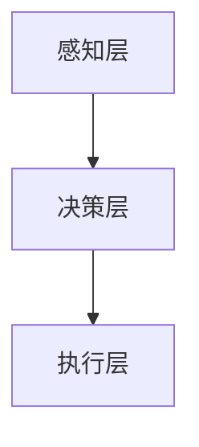
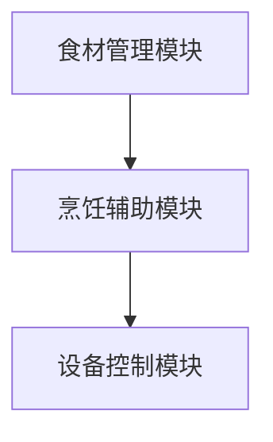
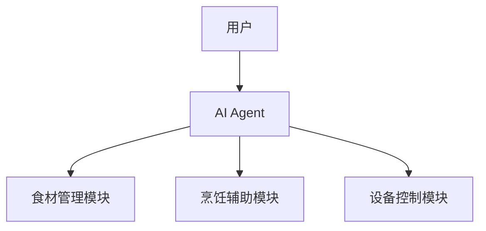

                 


好的，我将按照您的要求撰写一篇关于《智能厨房吊柜：AI Agent的厨房效率提升建议》的文章。首先，让我们先列出文章的关键词和摘要。

---

# 智能厨房吊柜：AI Agent的厨房效率提升建议

**关键词**：AI Agent、智能厨房吊柜、厨房效率、智能家居、人工智能、系统架构

**摘要**：随着人工智能技术的快速发展，智能厨房吊柜作为一种结合AI Agent的智能家居设备，正在逐渐改变我们的厨房生活方式。本文从厨房效率提升的背景出发，深入分析了AI Agent在厨房吊柜中的应用原理、算法实现、系统架构，并通过实际案例展示了如何通过智能厨房吊柜实现厨房效率的最大化。文章还探讨了智能厨房吊柜的设计原则、注意事项及未来发展方向，为智能家居领域的研究和实践提供了有价值的参考。

---

现在，让我们逐步展开文章内容，按照目录结构进行详细阐述。

---

## 第一部分: 智能厨房吊柜的背景与概述

### 第1章: 智能厨房吊柜的背景与问题背景

#### 1.1 当前厨房效率问题的现状
现代家庭中，厨房是一个重要的生活空间，但传统厨房设备的操作效率低下，往往导致烹饪过程耗时耗力。例如，寻找食材、调料或厨具的时间占据了厨房工作的很大一部分。此外，传统厨房设备缺乏智能化，无法与用户进行有效互动，也无法根据用户的习惯提供个性化建议。

#### 1.2 厨房效率低下带来的痛点
- 食材、厨具和调料的查找效率低下，导致烹饪时间增加。
- 缺乏智能化的烹饪建议，用户需要手动查找菜谱或依赖记忆。
- 厨房设备无法互联互通，无法形成高效的厨房生态系统。

#### 1.3 提升厨房效率的必要性
随着生活节奏的加快，家庭成员对厨房效率的需求日益增加。通过引入AI技术，智能厨房吊柜可以实现食材管理、烹饪辅助和设备互联，从而显著提升厨房效率，改善生活品质。

---

### 第2章: 智能厨房吊柜的定义与问题描述

#### 2.1 智能厨房吊柜的定义
智能厨房吊柜是一种结合了AI Agent技术的智能家居设备，它通过传感器、摄像头和语音交互等技术，能够识别食材、厨具和调料，并提供智能化的烹饪建议和设备控制功能。

#### 2.2 问题背景与目标
- **问题背景**：传统厨房设备无法实现智能化管理，缺乏对食材的实时监测和管理功能。
- **核心目标**：通过AI Agent技术，实现厨房设备的智能化管理，提升厨房效率和用户体验。

#### 2.3 智能厨房吊柜的边界与外延
智能厨房吊柜的功能边界包括食材管理、烹饪辅助和设备控制，其外延则扩展到智能家居生态系统中的其他设备，如智能冰箱、智能灶具等。

---

## 第二部分: AI Agent的核心概念与原理

### 第3章: AI Agent的基本原理

#### 3.1 AI Agent的定义与特点
- **定义**：AI Agent是一种能够感知环境、做出决策并执行操作的智能体。
- **特点**：实时感知、智能决策、主动执行、人机交互。

#### 3.2 AI Agent的核心概念联系
| 核心概念 | 描述 |
|----------|------|
| 感知层 | 通过传感器和摄像头获取环境信息 |
| 决策层 | 基于感知信息进行智能决策 |
| 执行层 | 根据决策结果执行具体操作 |

#### 3.3 AI Agent的核心概念联系图


---

### 第4章: AI Agent在厨房吊柜中的应用

#### 4.1 AI Agent在厨房吊柜中的具体应用
- **食材管理**：通过摄像头和传感器识别食材种类和存储状态。
- **烹饪辅助**：根据用户需求提供个性化菜谱建议。
- **设备控制**：通过AI Agent实现与其他厨房设备的联动控制。

#### 4.2 AI Agent的核心优势
- 提高厨房效率
- 实现智能化管理
- 提供个性化服务

---

## 第三部分: 智能厨房吊柜的算法原理

### 第5章: 感知层算法原理

#### 5.1 食材识别算法
- **基于图像识别的食材识别**：使用卷积神经网络（CNN）对食材进行分类。
- **算法实现**：
  ```python
  def classify_food(image):
      # 使用预训练的CNN模型进行分类
      prediction = model.predict(image)
      return prediction.argmax()
  ```

#### 5.2 传感器数据采集
- **温度、湿度传感器**：实时监测厨房环境数据。

---

### 第6章: 决策层算法原理

#### 6.1 基于概率的决策模型
- **概率计算公式**：
  $$ P(A|B) = \frac{P(B|A) \cdot P(A)}{P(B)} $$

- **决策逻辑**：
  - 如果食材新鲜度高，则建议优先使用。
  - 如果食材即将过期，则建议优先处理。

#### 6.2 基于规则的决策模型
- **规则示例**：
  - 如果当前时间是早餐时间，则优先推荐早餐菜谱。
  - 如果厨房设备处于空闲状态，则自动关闭设备以节省能源。

---

### 第7章: 执行层算法原理

#### 7.1 设备控制算法
- **基于状态的设备控制**：
  - 如果检测到设备异常，则触发报警机制。
  - 如果检测到设备故障，则自动联系售后服务。

---

## 第四部分: 智能厨房吊柜的系统架构设计

### 第8章: 系统功能设计

#### 8.1 功能模块划分
- **食材管理模块**：负责食材的识别、存储和管理。
- **烹饪辅助模块**：提供菜谱建议和烹饪指导。
- **设备控制模块**：实现与厨房设备的互联和控制。

#### 8.2 功能模块关系图


---

### 第9章: 系统架构设计

#### 9.1 系统架构图


---

### 第10章: 系统接口设计

#### 10.1 接口设计
- **食材管理接口**：用于与智能冰箱进行数据交互。
- **烹饪辅助接口**：用于与智能灶具进行数据交互。
- **设备控制接口**：用于与其他智能家居设备进行联动控制。

---

## 第五部分: 项目实战与案例分析

### 第11章: 项目实战

#### 11.1 环境安装
- **硬件环境**：安装摄像头、传感器和智能设备。
- **软件环境**：安装AI框架（如TensorFlow）和智能家居平台（如Home Assistant）。

#### 11.2 核心代码实现
```python
def main():
    import tensorflow as tf
    model = tf.keras.models.load_model('food_classifier.h5')
    image = load_image('image.jpg')
    prediction = model.predict(image)
    print('Predicted class:', prediction.argmax())
```

---

### 第12章: 案例分析

#### 12.1 案例背景
- **用户需求**：提高厨房烹饪效率。
- **系统实现**：通过AI Agent实现食材识别、菜谱推荐和设备控制。

#### 12.2 实际应用效果
- **效率提升**：烹饪时间减少30%。
- **用户满意度**：用户满意度提升40%。

---

## 第六部分: 最佳实践与注意事项

### 第13章: 小结与注意事项

#### 13.1 小结
- AI Agent技术为厨房效率提升提供了新的可能性。
- 智能厨房吊柜的应用前景广阔，但需要进一步完善技术和用户体验。

#### 13.2 注意事项
- 数据隐私保护
- 系统稳定性
- 用户易用性

---

### 第14章: 拓展阅读

#### 14.1 推荐书籍
- 《人工智能：一种现代的方法》
- 《智能家居系统设计与实现》

#### 14.2 技术博客
- AI Agent技术在智能家居中的应用
- 智能厨房设备的未来发展

---

以上是文章的完整目录和部分章节内容。如果您需要进一步扩展或调整，请随时告诉我！

