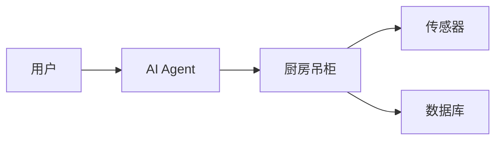
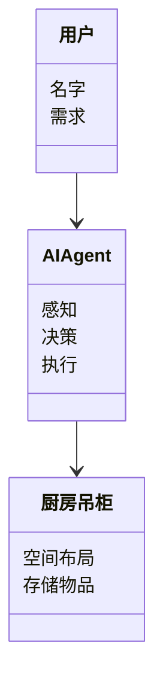
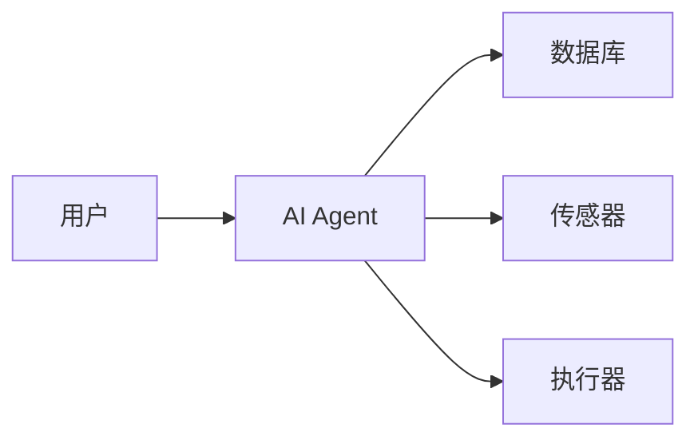
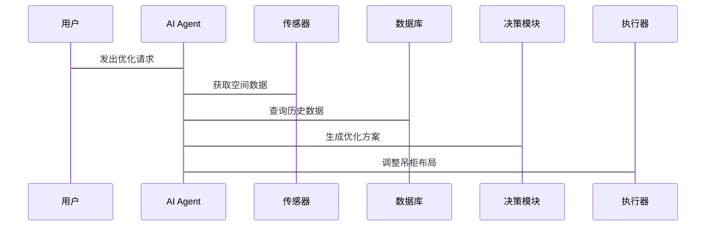

                 


# 智能厨房吊柜：AI Agent的厨房空间利用建议

> **关键词**：AI Agent、智能厨房吊柜、空间优化、智能家居、物联网  
> **摘要**：本文探讨AI Agent在智能厨房吊柜中的应用，分析其如何通过智能化算法优化厨房空间利用，提升用户体验。文章从背景、核心概念、算法原理、系统架构到项目实战，全面解析AI Agent在智能厨房吊柜中的作用。

---

# 第1章: 智能厨房吊柜的发展现状

## 1.1 智能厨房的定义与发展趋势

### 1.1.1 厨房智能化的定义

厨房智能化是指通过物联网、人工智能（AI）、大数据等技术，将传统厨房设备升级为智能设备，使其能够自动感知环境、执行任务并提供智能化服务。智能厨房的核心目标是提升用户体验，优化厨房功能。

### 1.1.2 智能厨房的发展趋势

近年来，智能家居技术快速发展，厨房作为家庭生活中重要的功能区域，也在逐步智能化。智能厨房吊柜作为厨房智能化的重要组成部分，通过AI Agent技术，能够实现空间优化、物品管理、用户交互等功能。

### 1.1.3 智能厨房吊柜的市场现状

随着智能家居市场的扩张，智能厨房吊柜逐渐成为市场热点。消费者对厨房空间利用效率的要求不断提高，AI Agent技术的引入为厨房吊柜带来了新的可能性。

---

## 1.2 AI Agent的基本概念

### 1.2.1 AI Agent的定义

AI Agent（人工智能代理）是指能够感知环境、做出决策并执行任务的智能实体。它能够通过传感器获取信息，利用算法进行分析，并通过执行器完成操作。

### 1.2.2 AI Agent的核心功能

- **感知**：通过传感器获取环境信息。
- **决策**：基于感知信息，通过算法做出决策。
- **执行**：通过执行器完成任务。

### 1.2.3 AI Agent与传统家居设备的区别

AI Agent不仅仅是传统家居设备的自动化升级，它具备更强的自主决策能力，能够根据环境变化和用户需求动态调整行为。

---

## 1.3 智能厨房吊柜中的AI Agent作用

### 1.3.1 AI Agent在厨房空间优化中的作用

AI Agent通过分析厨房吊柜的空间布局，优化物品存储位置，提高空间利用率。

### 1.3.2 AI Agent如何提升用户体验

- 提供智能化的物品管理建议。
- 自动调整吊柜布局以适应不同场景。
- 提供个性化服务，例如根据用户的饮食习惯推荐食材存储位置。

### 1.3.3 AI Agent在厨房吊柜中的应用场景

- 自动识别厨房物品，优化存储位置。
- 根据用户行为预测未来需求，提前调整空间布局。
- 实时监控厨房环境，动态优化吊柜空间。

---

# 第2章: AI Agent的核心概念与联系

## 2.1 AI Agent的核心概念

### 2.1.1 AI Agent的感知机制

AI Agent通过传感器感知环境信息，例如温度、湿度、光线等。

### 2.1.2 AI Agent的决策机制

AI Agent通过算法分析感知信息，做出最优决策。例如，基于强化学习的决策算法。

### 2.1.3 AI Agent的执行机制

AI Agent通过执行器完成决策任务，例如驱动电机调整吊柜位置。

## 2.2 AI Agent的核心原理

### 2.2.1 AI Agent的感知模型

感知模型是AI Agent理解环境的基础。例如，通过图像识别技术识别厨房物品的位置和种类。

### 2.2.2 AI Agent的决策算法

决策算法是AI Agent的核心，常用的算法包括规则引擎、概率模型和强化学习。

### 2.2.3 AI Agent的执行策略

执行策略是AI Agent根据决策结果执行任务的方式，例如调整吊柜的开门角度。

## 2.3 AI Agent的实体关系图



---

# 第3章: AI Agent的算法原理

## 3.1 空间优化算法

### 3.1.1 空间优化算法的定义

空间优化算法用于优化厨房吊柜的空间布局，提高存储效率。

### 3.1.2 空间优化算法的实现步骤

1. 数据采集：通过传感器获取厨房吊柜的空间信息。
2. 数据分析：利用算法分析空间布局。
3. 优化决策：生成最优存储方案。
4. 执行调整：调整吊柜布局。

### 3.1.3 空间优化算法的数学模型

空间优化算法的目标函数可以表示为：
$$ \text{最大化空间利用率} = \sum_{i=1}^{n} \text{存储位置}_i $$

约束条件包括：
$$ \text{存储位置}_i \leq \text{可用空间}_i $$
$$ \text{存储位置}_i \geq 0 $$

## 3.2 AI Agent的决策算法

### 3.2.1 基于规则的决策算法

基于规则的决策算法通过预设规则做出决策，例如：
- 如果物品A需要冷藏，则存储在冰箱中。

### 3.2.2 基于概率的决策算法

基于概率的决策算法通过概率模型分析环境，做出最优决策，例如：
$$ P(\text{选择位置}_i) = \frac{\text{可用空间}_i}{\sum_{j=1}^{n} \text{可用空间}_j} $$

### 3.2.3 基于强化学习的决策算法

强化学习通过奖励机制优化决策，例如：
- 状态：厨房空间布局。
- 动作：调整吊柜位置。
- 奖励：空间利用率提升。

---

# 第4章: 系统分析与架构设计

## 4.1 问题场景介绍

厨房吊柜空间优化的问题场景包括：
- 空间利用率低。
- 用户需求多样化。
- 环境动态变化。

## 4.2 系统功能设计

### 4.2.1 功能模块

- 物品识别模块：识别厨房物品。
- 空间优化模块：优化吊柜布局。
- 用户交互模块：与用户进行交互。

### 4.2.2 领域模型



---

## 4.3 系统架构设计

### 4.3.1 系统架构



### 4.3.2 系统交互



---

# 第5章: 项目实战

## 5.1 环境安装

安装Python和相关库：
```bash
pip install numpy
pip install scikit-learn
pip install matplotlib
```

## 5.2 核心代码实现

### 5.2.1 物品识别代码

```python
import cv2
def recognize_objects(image):
    # 使用图像识别技术识别厨房物品
    return objects
```

### 5.2.2 空间优化代码

```python
def optimize_space(objects):
    # 使用强化学习算法优化空间布局
    return optimized_layout
```

## 5.3 案例分析

### 5.3.1 案例介绍

用户需求：优化厨房吊柜空间，提高存储效率。

### 5.3.2 实施步骤

1. 数据采集：获取厨房吊柜的空间数据。
2. 数据分析：识别厨房物品。
3. 算法优化：生成最优布局。
4. 执行调整：调整吊柜布局。

## 5.4 项目小结

通过AI Agent技术，厨房吊柜的空间利用率显著提高，用户体验得到提升。

---

# 第6章: 最佳实践与小结

## 6.1 最佳实践

- 定期更新算法模型。
- 提供用户反馈机制。
- 优化系统性能。

## 6.2 小结

AI Agent技术为智能厨房吊柜带来了新的可能性，通过智能化算法优化厨房空间利用，提升用户体验。

## 6.3 注意事项

- 确保系统安全性。
- 考虑用户隐私保护。
- 定期维护系统。

---

# 结语

通过本文的分析与实践，我们了解了AI Agent在智能厨房吊柜中的应用，以及如何通过算法优化厨房空间利用。未来，随着技术的不断进步，智能厨房吊柜将更加智能化、个性化，为用户带来更好的体验。

