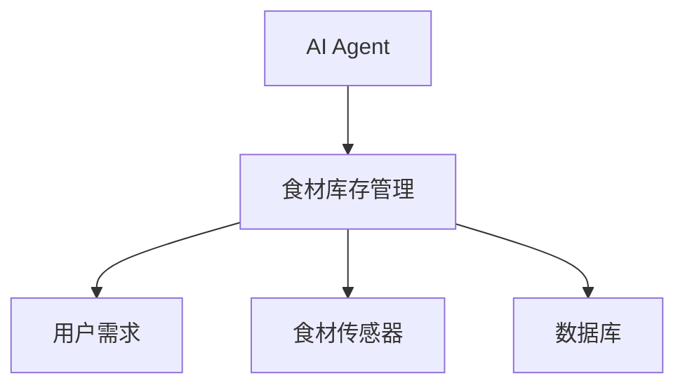
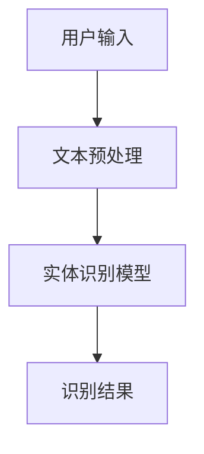
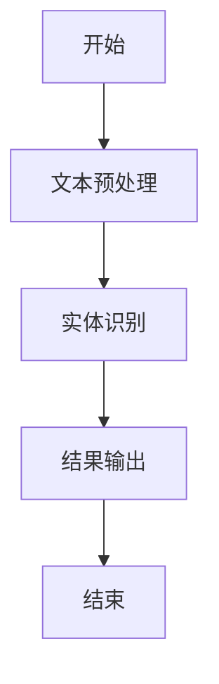
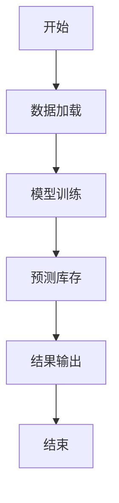
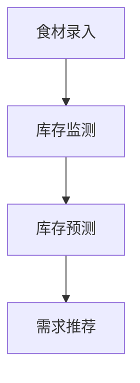
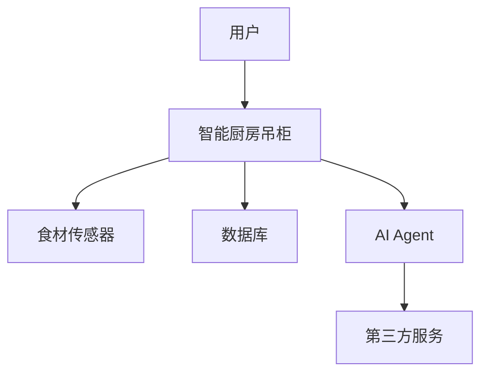

                 


# 智能厨房吊柜：AI Agent的食材库存管理

## 关键词：智能厨房吊柜，AI Agent，食材库存管理，物联网，人工智能

## 摘要：  
随着智能家居的普及，厨房作为家庭生活的核心场景之一，逐渐成为人工智能技术的重要应用领域。本文深入探讨了智能厨房吊柜这一创新设备，重点分析了AI Agent在食材库存管理中的应用。通过结合物联网、自然语言处理和机器学习等技术，本文详细阐述了AI Agent如何帮助用户实现智能化的食材管理，包括库存预测、食材识别、需求推荐等功能。文章从技术原理、系统架构到实际应用，全面解析了智能厨房吊柜的工作机制，并通过案例分析展示了其在提升家庭生活效率中的巨大潜力。

---

## 第一部分: 智能厨房吊柜的背景与概念

### 第1章: 智能厨房吊柜的背景与问题背景

#### 1.1 传统厨房食材管理的痛点
##### 1.1.1 食材库存管理的低效性
在传统家庭厨房中，食材管理通常依赖手动记录或记忆，这种方式不仅效率低下，而且容易出错。例如，用户常常忘记某些食材的保质期，导致食材浪费，或者在需要烹饪时发现缺少某种食材而临时外出采购。

##### 1.1.2 用户需求与现有解决方案的差距
现有的食材管理工具多局限于手机App或纸质记录，无法与厨房设备无缝结合。用户希望有一个智能化的解决方案，能够自动记录食材的购买时间、保质期，并在需要时主动提醒或推荐食谱。

##### 1.1.3 智能化管理的必要性
随着生活节奏的加快，家庭成员对厨房设备的需求逐渐从单一的储藏功能向智能化、便捷化方向发展。智能化的食材管理能够显著提升厨房使用效率，减少食材浪费，同时为用户节省时间和精力。

#### 1.2 AI Agent在厨房场景中的应用前景
##### 1.2.1 AI Agent的基本概念
AI Agent（人工智能代理）是指能够感知环境、自主决策并执行任务的智能实体。它可以基于传感器输入、用户指令或预设规则，完成特定的目标。

##### 1.2.2 智能厨房吊柜的场景化需求
智能厨房吊柜不仅是食材的存储空间，更是一个集成AI Agent的智能设备。它需要能够识别食材种类、监测库存量、预测食材消耗速度，并与家庭成员的饮食习惯相结合，提供个性化的食材管理服务。

##### 1.2.3 AI Agent在食材库存管理中的潜力
通过AI Agent，智能厨房吊柜可以实现食材的智能化管理，包括自动记录食材信息、智能推荐食谱、自动提醒补货等功能。这些功能不仅提升了厨房的使用效率，还能通过数据积累为用户提供更精准的服务。

#### 1.3 本章小结
本章从传统厨房管理的痛点出发，分析了AI Agent在智能厨房吊柜中的应用前景，强调了智能化食材管理的必要性和潜力。

---

## 第二部分: AI Agent与食材库存管理的核心概念

### 第2章: AI Agent的核心原理与食材库存管理的关系

#### 2.1 AI Agent的基本原理
##### 2.1.1 AI Agent的定义与分类
AI Agent可以根据智能水平分为简单反应式Agent和基于模型的反射式Agent。前者基于当前感知做出反应，后者则依赖于内部状态模型进行决策。

##### 2.1.2 AI Agent的核心功能模块
- **感知模块**：通过传感器或摄像头获取环境信息。
- **决策模块**：基于感知信息和预设规则做出决策。
- **执行模块**：通过驱动器或接口执行决策结果。

##### 2.1.3 AI Agent与食材库存管理的结合点
AI Agent可以通过感知食材的存储状态、用户行为模式等信息，优化食材管理策略。

#### 2.2 食材库存管理的流程与关键点
##### 2.2.1 食材库存管理的基本流程
1. **食材录入**：记录食材的种类、数量、保质期等信息。
2. **库存监测**：定期更新食材的剩余量和状态。
3. **库存预测**：基于历史数据预测食材的消耗速度。
4. **需求推荐**：根据库存情况推荐食谱或采购清单。

##### 2.2.2 食材库存管理的关键问题
- **食材识别的准确性**：如何准确识别不同种类的食材。
- **库存预测的准确性**：如何基于历史数据建立可靠的预测模型。
- **用户需求的个性化**：如何根据家庭成员的饮食习惯提供个性化的推荐。

##### 2.2.3 AI Agent在库存管理中的角色定位
AI Agent作为智能厨房吊柜的核心，负责整合食材信息、优化库存管理和提供智能化服务。

#### 2.3 AI Agent与食材库存管理的系统架构
##### 2.3.1 系统整体架构图


##### 2.3.2 关键模块的交互关系
- **AI Agent**：接收食材传感器数据和用户指令，决策并执行操作。
- **食材传感器**：监测食材的种类、数量和状态。
- **数据库**：存储食材信息和用户数据。
- **用户需求**：通过App或语音指令与AI Agent交互。

##### 2.3.3 系统边界与外延
系统边界包括智能厨房吊柜、食材传感器、数据库和用户界面。外延部分涉及食材供应链和第三方服务。

#### 2.4 本章小结
本章详细分析了AI Agent的基本原理及其在食材库存管理中的应用，强调了系统架构设计的重要性。

---

## 第三部分: AI Agent的算法原理与数学模型

### 第3章: AI Agent的算法原理

#### 3.1 自然语言处理（NLP）在食材识别中的应用
##### 3.1.1 NLP的基本原理
自然语言处理技术可以通过对食材名称的文本分析，实现对食材种类的自动识别。

##### 3.1.2 食材名称实体识别的算法流程


##### 3.1.3 基于深度学习的食材分类模型
- **模型选择**：使用卷积神经网络（CNN）或循环神经网络（RNN）进行食材分类。
- **训练数据**：需要大量标注的食材名称数据进行训练。

#### 3.2 基于机器学习的库存预测模型
##### 3.2.1 时间序列预测的基本原理
时间序列预测模型可以通过历史数据预测未来的库存状态。

##### 3.2.2 基于LSTM的库存预测模型
- **LSTM网络**：长短期记忆网络适合处理时间序列数据。
- **模型训练**：使用历史库存数据进行训练，预测未来的库存消耗速度。

##### 3.2.3 模型的训练与优化
- **训练数据**：需要标注的历史库存数据。
- **优化方法**：使用交叉验证和超参数调优提升模型性能。

#### 3.3 算法流程图
##### 3.3.1 实体识别流程图


##### 3.3.2 库存预测流程图


#### 3.4 本章小结
本章详细介绍了AI Agent在食材识别和库存预测中的算法原理，重点分析了NLP和LSTM模型的应用。

---

## 第四部分: 智能厨房吊柜的系统架构设计

### 第4章: 系统架构设计与实现

#### 4.1 系统功能模块设计
##### 4.1.1 功能模块划分
- **食材录入模块**：记录食材的基本信息。
- **库存监测模块**：实时监测食材的状态。
- **库存预测模块**：基于历史数据预测库存消耗速度。
- **需求推荐模块**：根据库存情况推荐食谱或采购清单。

##### 4.1.2 功能模块的交互关系


#### 4.2 系统架构设计
##### 4.2.1 系统架构图


##### 4.2.2 关键模块的实现
- **AI Agent**：负责整合传感器数据和用户指令，驱动系统运行。
- **数据库**：存储食材信息和用户数据。
- **第三方服务**：与食材供应链或电商平台对接，实现自动采购。

#### 4.3 系统接口设计
##### 4.3.1 API接口设计
- **食材录入接口**：用于录入食材的基本信息。
- **库存查询接口**：用于查询当前库存状态。
- **需求推荐接口**：用于获取食谱或采购清单。

##### 4.3.2 接口交互流程


#### 4.4 本章小结
本章详细分析了智能厨房吊柜的系统架构设计，重点介绍了功能模块划分、系统架构图和接口设计。

---

## 第五部分: 项目实战

### 第5章: 项目实战与案例分析

#### 5.1 项目环境配置
##### 5.1.1 硬件设备
- 智能厨房吊柜
- 食材传感器
- 摄像头

##### 5.1.2 软件环境
- Python 3.8+
- TensorFlow 2.0+
- Keras

#### 5.2 核心代码实现
##### 5.2.1 食材识别代码
```python
import tensorflow as tf
from tensorflow.keras import layers

# 定义食材分类模型
model = tf.keras.Sequential([
    layers.Conv2D(32, (3,3), activation='relu', input_shape=(64,64,3)),
    layers.MaxPooling2D((2,2)),
    layers.Conv2D(64, (3,3), activation='relu'),
    layers.MaxPooling2D((2,2)),
    layers.Flatten(),
    layers.Dense(128, activation='relu'),
    layers.Dense(num_classes, activation='softmax')
])

# 编译模型
model.compile(optimizer='adam', loss='sparse_categorical_crossentropy', metrics=['accuracy'])
```

##### 5.2.2 库存预测代码
```python
import pandas as pd
from sklearn.model_selection import train_test_split
from tensorflow.keras import layers

# 加载数据
data = pd.read_csv('inventory.csv')

# 划分训练集和测试集
train_data, test_data = train_test_split(data, test_size=0.2)

# 定义LSTM模型
model = tf.keras.Sequential([
    layers.LSTM(64, return_sequences=True),
    layers.LSTM(32),
    layers.Dense(1)
])

# 编译模型
model.compile(optimizer='adam', loss='mean_squared_error')
```

#### 5.3 案例分析与详细解读
##### 5.3.1 实际案例分析
通过一个家庭的食材管理案例，展示AI Agent如何优化库存管理和食谱推荐。

##### 5.3.2 代码实现分析
分析上述代码的实现细节，包括模型训练、数据预处理和接口调用。

#### 5.4 项目小结
本章通过实际项目案例，展示了智能厨房吊柜的实现过程，包括环境配置、代码实现和案例分析。

---

## 第六部分: 最佳实践与总结

### 第6章: 最佳实践与总结

#### 6.1 最佳实践
##### 6.1.1 系统优化建议
- 定期更新模型参数，提升识别和预测的准确性。
- 提供多种用户交互方式，如语音指令和手机App。

##### 6.1.2 数据隐私保护
- 加强用户数据的加密和权限管理，确保数据安全。

#### 6.2 小结
智能厨房吊柜通过AI Agent实现了食材的智能化管理，显著提升了厨房的使用效率和用户体验。

#### 6.3 注意事项
- 确保系统的可靠性和稳定性。
- 定期维护设备和软件，避免故障发生。

#### 6.4 拓展阅读
推荐进一步阅读相关领域的书籍和论文，深入研究AI Agent和物联网技术的结合应用。

---

## 附录: 参考文献

1. LeCun, Y., Bengio, Y., & Hinton, G. (2015). Deep learning. Nature, 521(7555), 436-444.
2. Goodfellow, I., Bengio, Y., & Courville, A. (2016). Deep learning. MIT Press.
3. Hochreiter, S., & Schmidhuber, J. (1997). Long short-term memory. Neural computation, 9(8), 1735-1780.

---

通过以上结构，文章详细阐述了智能厨房吊柜的背景、核心概念、算法原理、系统架构、项目实战和最佳实践，为读者提供了一个全面的技术视角。

