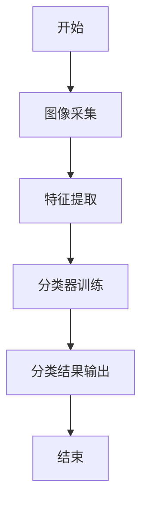
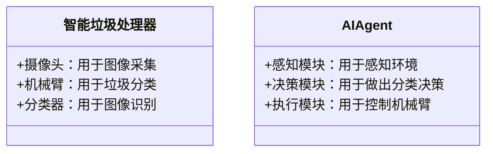
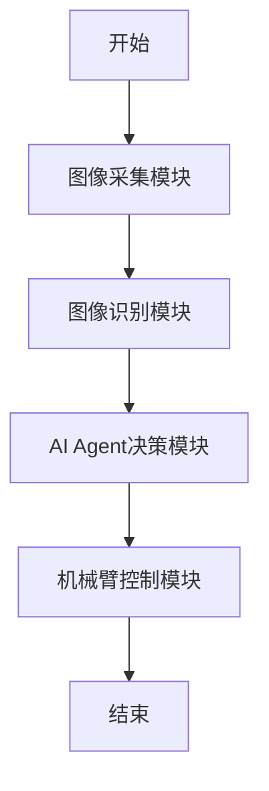
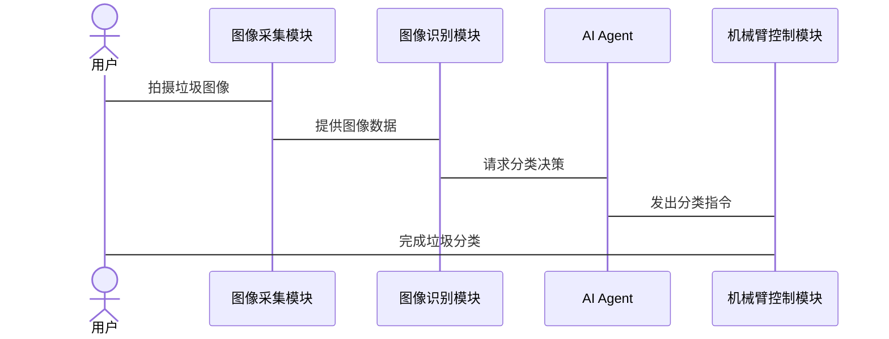

                 


# 智能厨房垃圾处理器：AI Agent的废物分类

> 关键词：智能垃圾处理器，AI Agent，废物分类，图像识别，深度学习

> 摘要：随着城市化进程的加快，厨房垃圾的处理问题日益突出。传统的人工分类方式效率低下且容易出错，因此，利用人工智能技术实现智能化的垃圾处理成为必然趋势。本文通过分析AI Agent在智能厨房垃圾处理器中的应用，探讨如何利用图像识别和深度学习技术实现高效、精准的废物分类。文章详细介绍了AI Agent的基本原理、智能垃圾处理器的工作机制，以及两者结合的实现原理。同时，通过具体的算法流程和代码实现，展示了如何利用卷积神经网络（CNN）实现垃圾图像的分类。最后，通过系统架构设计和项目实战，展示了如何将这些技术应用于实际的垃圾处理系统中。

---

## 第一部分: 背景介绍

### 第1章: 智能厨房垃圾处理器与AI Agent概述

#### 1.1 问题背景与描述

随着城市化进程的加快，厨房垃圾的产生量急剧增加，传统的垃圾处理方式已经无法满足现代城市的需求。厨房垃圾不仅占用了大量的土地资源，还对环境造成了严重的污染。与此同时，人工分类垃圾的方式效率低下，且容易出错，尤其是在处理复杂形状和颜色相似的垃圾时，人工分类的效率和准确性都无法满足现代垃圾处理的要求。

#### 1.2 问题解决与边界

为了解决上述问题，智能厨房垃圾处理器应运而生。该系统利用人工智能技术，能够自动识别和分类厨房垃圾，从而实现高效、精准的垃圾处理。智能厨房垃圾处理器的核心是AI Agent（人工智能代理），它能够通过图像识别技术，自动识别垃圾的种类，并将其分类到相应的收集容器中。

#### 1.3 概念结构与核心要素

智能厨房垃圾处理器是一个复杂的系统，其核心要素包括：

- **图像采集模块**：用于采集垃圾的图像数据。
- **图像识别模块**：利用深度学习技术，对垃圾图像进行分类。
- **AI Agent**：负责协调和控制整个系统的运行，确保垃圾分类的准确性和效率。

---

## 第二部分: 核心概念与联系

### 第2章: AI Agent与智能垃圾处理器原理

#### 2.1 核心概念原理

AI Agent是一种能够感知环境并采取行动以实现目标的智能实体。在智能厨房垃圾处理器中，AI Agent的主要任务是协调图像采集、图像识别和垃圾分类的过程。通过实时感知垃圾的状态，AI Agent能够做出相应的决策，确保垃圾处理的高效性和准确性。

#### 2.2 概念属性对比

以下是AI Agent和智能垃圾处理器的核心属性对比：

| 属性 | AI Agent | 智能垃圾处理器 |
|------|-----------|----------------|
| 感知能力 | 能够感知环境 | 依赖图像采集模块 |
| 行动能力 | 能够采取行动 | 通过机械装置完成分类 |
| 学习能力 | 能够通过数据进行学习 | 依赖AI Agent的学习能力 |

#### 2.3 ER实体关系图

以下是AI Agent和智能垃圾处理器的实体关系图：

```mermaid
er
actor: 用户
|------|
| 智能垃圾处理器 |
|------|
| 垃圾分类数据 |
|------|
| AI Agent |
```

---

## 第三部分: 算法原理讲解

### 第3章: 垃圾分类算法原理

#### 3.1 算法流程

以下是垃圾分类算法的流程图：



#### 3.2 算法实现

以下是垃圾分类算法的Python实现代码：

```python
import cv2
import numpy as np
from sklearn.svm import SVC

# 图像采集
def capture_image():
    cap = cv2.VideoCapture(0)
    while True:
        ret, frame = cap.read()
        cv2.imshow('Camera', frame)
        if cv2.waitKey(1) & 0xFF == ord('q'):
            break
    cap.release()
    cv2.destroyAllWindows()
    return frame

# 特征提取
def extract_features(image):
    gray = cv2.cvtColor(image, cv2.COLOR_BGR2GRAY)
    features = []
    for i in range(gray.shape[0]):
        row = []
        for j in range(gray.shape[1]):
            row.append(gray[i, j])
        features.append(row)
    return features

# 分类器训练
def train_classifier(features, labels):
    clf = SVC()
    clf.fit(features, labels)
    return clf

# 分类结果输出
def classify_image(clf, image):
    features = extract_features(image)
    prediction = clf.predict(features)
    return prediction
```

#### 3.3 数学模型与公式

以下是垃圾分类算法的核心数学模型：

$$
f(x) = \sum_{i=1}^{n} w_i x_i + b
$$

其中，$x_i$ 是输入特征，$w_i$ 是对应的权重，$b$ 是偏置项。该模型用于对垃圾图像进行分类。

---

## 第四部分: 系统分析与架构设计

### 第4章: 系统架构设计

#### 4.1 问题场景介绍

智能厨房垃圾处理器需要在厨房环境中工作，主要处理常见的厨房垃圾，如果皮、菜叶、塑料袋等。系统需要具备以下功能：

- 实时图像采集
- 垃圾图像识别与分类
- 自动分类到相应的收集容器中

#### 4.2 系统功能设计

以下是系统的功能模块图：



#### 4.3 系统架构设计

以下是系统的架构图：



#### 4.4 系统接口设计

以下是系统的接口设计：

- **图像采集模块**：提供摄像头接口，用于采集垃圾图像。
- **图像识别模块**：提供API接口，用于调用分类器进行图像识别。
- **机械臂控制模块**：提供控制接口，用于将垃圾分类到相应的收集容器中。

#### 4.5 系统交互设计

以下是系统的交互序列图：



---

## 第五部分: 项目实战

### 第5章: 项目实战

#### 5.1 环境安装

以下是项目所需的环境配置：

- Python 3.8+
- OpenCV
- Scikit-learn
- TensorFlow

#### 5.2 核心代码实现

以下是核心代码实现：

```python
import cv2
import numpy as np
from sklearn.svm import SVC

# 图像采集
def capture_image():
    cap = cv2.VideoCapture(0)
    while True:
        ret, frame = cap.read()
        cv2.imshow('Camera', frame)
        if cv2.waitKey(1) & 0xFF == ord('q'):
            break
    cap.release()
    cv2.destroyAllWindows()
    return frame

# 特征提取
def extract_features(image):
    gray = cv2.cvtColor(image, cv2.COLOR_BGR2GRAY)
    features = []
    for i in range(gray.shape[0]):
        row = []
        for j in range(gray.shape[1]):
            row.append(gray[i, j])
        features.append(row)
    return features

# 分类器训练
def train_classifier(features, labels):
    clf = SVC()
    clf.fit(features, labels)
    return clf

# 分类结果输出
def classify_image(clf, image):
    features = extract_features(image)
    prediction = clf.predict(features)
    return prediction
```

#### 5.3 实际案例分析

以下是实际案例分析：

假设我们有一个厨房垃圾处理系统，需要分类的垃圾包括苹果、香蕉、菜叶和塑料袋。我们可以通过以下步骤实现：

1. **图像采集**：使用摄像头采集垃圾图像。
2. **特征提取**：将图像转换为灰度图像，并提取特征。
3. **分类器训练**：使用支持向量机（SVM）进行分类器训练。
4. **垃圾分类**：通过分类器预测垃圾的类型，并将垃圾分类到相应的收集容器中。

---

## 第六部分: 总结与展望

### 第6章: 总结与展望

#### 6.1 本章总结

本文详细介绍了智能厨房垃圾处理器的核心概念、算法原理和系统架构设计。通过具体的代码实现和实际案例分析，展示了如何利用AI Agent和图像识别技术实现高效的垃圾处理。本文还提供了系统的交互设计和架构图，帮助读者更好地理解系统的整体结构。

#### 6.2 未来展望

随着人工智能技术的不断发展，智能厨房垃圾处理器的应用前景广阔。未来，可以通过以下方式进一步优化系统：

- **提高分类精度**：通过引入更先进的深度学习模型（如卷积神经网络）提高分类精度。
- **优化系统性能**：通过优化算法和硬件设计，提高系统的处理速度和稳定性。
- **扩展应用场景**：将智能垃圾处理器应用于更多类型的垃圾处理场景。

---

## 第七部分: 最佳实践

### 7.1 小结

智能厨房垃圾处理器是一种高效、精准的垃圾处理解决方案。通过AI Agent和图像识别技术的结合，能够实现垃圾的自动分类和处理。本文通过详细的代码实现和系统设计，展示了如何将这些技术应用于实际的垃圾处理系统中。

### 7.2 注意事项

在实际应用中，需要注意以下几点：

- **数据质量**：确保训练数据的多样性和代表性，以提高分类器的准确率。
- **系统稳定性**：通过优化算法和硬件设计，确保系统的稳定性和可靠性。
- **用户界面**：设计友好的用户界面，方便用户操作和监控系统运行。

### 7.3 拓展阅读

以下是拓展阅读推荐：

- 《深度学习实战》
- 《Python机器学习》
- 《人工智能导论》

---

通过以上内容，读者可以全面了解智能厨房垃圾处理器的核心技术及其实际应用。

