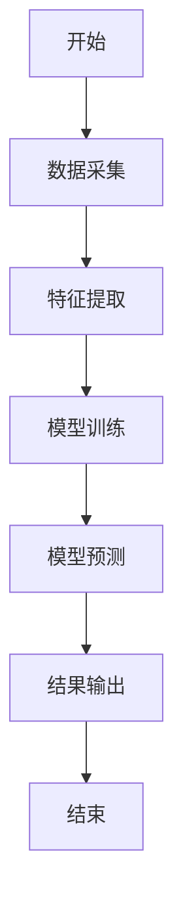
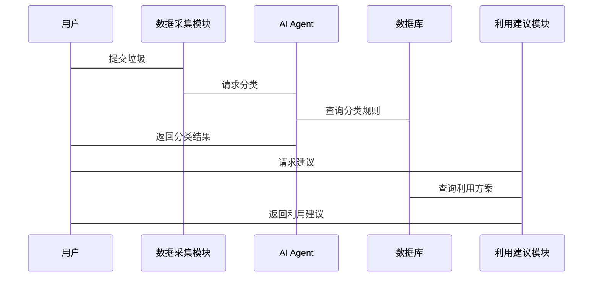

                 


# 智能厨房垃圾处理器：AI Agent的食材利用建议

> **关键词**：AI Agent，厨房垃圾处理器，食材利用，智能垃圾分类，资源优化

> **摘要**：本文探讨了AI Agent在厨房垃圾处理中的应用，重点分析了如何通过智能化技术优化食材利用，减少浪费，并将废弃物转化为有用资源。文章从背景介绍、核心概念、算法原理、系统设计到项目实战，全面解析了智能厨房垃圾处理器的实现过程及实际应用价值。

---

# 第1章: 智能厨房垃圾处理器的背景介绍

## 1.1 问题背景

### 1.1.1 厨房垃圾处理的现状与挑战

厨房垃圾是指在烹饪过程中产生的废弃物，包括菜叶、果皮、剩饭等。这些垃圾通常被归类为可堆肥垃圾，但其处理方式往往不够高效，存在以下问题：

1. **资源浪费**：许多食材废弃物仍具有利用价值，例如果皮可以制成堆肥，剩饭可以用于动物饲料。
2. **环境污染**：未经妥善处理的厨房垃圾容易腐烂，产生异味和污染环境。
3. **效率低下**：传统垃圾处理方式效率低，难以实现资源的最大化利用。

### 1.1.2 食材浪费与资源利用的矛盾

全球范围内，食品浪费问题日益严重。据统计，全球每年浪费的食品高达13亿吨，而这些浪费的食材中，有很大一部分可以通过合理处理转化为有用资源。然而，目前的垃圾处理系统往往未能充分利用这些食材的潜在价值。

### 1.1.3 智能化处理的必要性

随着人工智能技术的发展，AI Agent（智能代理）逐渐应用于各个领域。在厨房垃圾处理中，AI Agent可以通过数据分析和智能决策，帮助我们更高效地利用食材废弃物。

---

## 1.2 问题描述

### 1.2.1 厨房垃圾的分类与处理需求

厨房垃圾通常包括以下几类：
- **可堆肥垃圾**：如菜叶、果皮等。
- **可回收物**：如塑料、玻璃等。
- **有害垃圾**：如电池、药品等。

不同类型的垃圾需要采取不同的处理方式，但传统的垃圾分类方法效率较低，容易出错。

### 1.2.2 食材利用的潜在价值

食材废弃物可以通过多种方式重新利用，例如：
- **堆肥**：将果皮、菜叶等转化为有机肥料。
- **生物质能**：将厨余垃圾转化为沼气等能源。
- **再加工**：将某些食材废弃物重新加工成新产品。

### 1.2.3 智能化处理的目标与边界

智能化处理的目标是通过AI技术，优化厨房垃圾的分类和利用，减少浪费，提高资源利用率。其边界包括：
- **数据采集**：收集厨房垃圾的相关数据。
- **分类与识别**：通过AI算法实现垃圾的智能分类。
- **利用建议**：根据分类结果，提供具体的利用建议。

---

## 1.3 问题解决思路

### 1.3.1 AI Agent在食材利用中的作用

AI Agent是一种智能代理系统，能够通过感知环境、分析数据并采取行动来实现目标。在厨房垃圾处理中，AI Agent可以：
- **实时监测**：通过传感器监测垃圾的种类和数量。
- **智能分类**：利用机器学习算法实现垃圾的智能分类。
- **优化利用**：根据分类结果，提供最优的利用方案。

### 1.3.2 智能厨房垃圾处理器的核心功能

智能厨房垃圾处理器的核心功能包括：
1. **数据采集**：通过传感器采集垃圾的物理特性（如颜色、形状、气味等）。
2. **智能分类**：利用AI算法对垃圾进行分类。
3. **利用建议**：根据分类结果，提供具体的利用建议。

### 1.3.3 技术实现的可行性分析

AI技术的发展为厨房垃圾处理器的智能化提供了技术支持。通过深度学习算法，AI Agent能够实现高效的垃圾分类和资源利用优化。

---

## 1.4 本章小结

本章介绍了厨房垃圾处理的背景和挑战，分析了食材利用的潜在价值，并提出了智能化处理的目标和实现思路。通过AI Agent的应用，我们可以更高效地利用厨房垃圾中的资源，减少浪费和环境污染。

---

# 第2章: AI Agent与智能厨房垃圾处理器的核心概念

## 2.1 AI Agent的基本原理

### 2.1.1 AI Agent的定义与特点

AI Agent是一种智能代理系统，能够通过感知环境、分析数据并采取行动来实现目标。其特点包括：
- **自主性**：能够在没有外部干预的情况下自主运行。
- **反应性**：能够实时感知环境并做出反应。
- **学习能力**：能够通过数据学习和优化。

### 2.1.2 AI Agent在食材利用中的应用场景

在厨房垃圾处理中，AI Agent可以应用于以下几个方面：
1. **垃圾分类**：通过图像识别技术实现垃圾的自动分类。
2. **资源利用优化**：根据垃圾的种类和数量，优化资源的利用方案。
3. **用户交互**：通过语音交互为用户提供垃圾处理建议。

### 2.1.3 AI Agent与传统垃圾处理的区别

传统的垃圾处理方式主要依赖人工分类和处理，效率低且容易出错。而AI Agent通过智能化技术实现了高效、精准的垃圾分类和资源利用优化。

---

## 2.2 智能厨房垃圾处理器的功能模块

### 2.2.1 垃圾分类与识别模块

垃圾分类与识别模块是智能厨房垃圾处理器的核心模块，主要功能包括：
- **图像采集**：通过摄像头采集垃圾的图像。
- **图像识别**：利用深度学习算法对垃圾进行分类。
- **分类结果输出**：将分类结果输出到数据库或用户界面。

### 2.2.2 食材利用建议模块

食材利用建议模块根据垃圾的分类结果，提供具体的利用建议，例如：
- **堆肥建议**：将果皮、菜叶等转化为有机肥料。
- **生物质能利用**：将厨余垃圾转化为沼气等能源。
- **再加工建议**：将某些食材废弃物重新加工成新产品。

### 2.2.3 数据采集与分析模块

数据采集与分析模块负责采集和分析垃圾的相关数据，包括：
- **传感器数据**：垃圾的物理特性（如颜色、形状、气味等）。
- **分类结果**：垃圾的分类结果和利用建议。
- **用户反馈**：用户的垃圾处理习惯和反馈。

---

## 2.3 核心概念对比分析

### 2.3.1 不同垃圾处理方法的对比表格

| 处理方法       | 优点                           | 缺点                           |
|----------------|--------------------------------|--------------------------------|
| 人工分类         | 成本低，灵活性高               | 效率低，容易出错               |
| 自动化分类       | 效率高，准确性高               | 成本高，技术要求高             |
| AI Agent分类     | 高效、精准，可优化资源利用     | 技术复杂，初期投入大           |

### 2.3.2 AI Agent与传统算法的ER实体关系图

```mermaid
er
  actor 用户
  actor 系统
  system 数据库
  系统 <---> 数据库
  用户 <---> 数据库
```

---

## 2.4 本章小结

本章详细介绍了AI Agent的基本原理及其在智能厨房垃圾处理器中的应用。通过对比分析，展示了AI Agent在垃圾分类和资源利用中的优势。

---

# 第3章: AI Agent的算法原理与数学模型

## 3.1 算法原理

### 3.1.1 基于机器学习的分类算法

机器学习是一种通过数据训练模型的技术，常用于垃圾分类。常用的分类算法包括：
- **支持向量机（SVM）**：适用于小规模数据集。
- **随机森林**：适用于大规模数据集。
- **深度学习**：适用于图像识别任务。

### 3.1.2 基于自然语言处理的食材建议生成

自然语言处理技术可以帮助我们生成食材利用建议。例如，通过分析用户输入的垃圾类型，系统可以自动生成堆肥或再加工建议。

### 3.1.3 算法流程图（使用 mermaid）



---

## 3.2 数学模型与公式

### 3.2.1 分类算法的数学模型

支持向量机（SVM）是一种常用的分类算法，其数学模型如下：

$$
\text{目标函数：} \quad \min_{w,b,\xi} \frac{1}{2}||w||^2 + C\sum_{i=1}^n \xi_i
$$

$$
\text{约束条件：} \quad y_i(w \cdot x_i + b) \geq 1 - \xi_i, \quad \xi_i \geq 0
$$

### 3.2.2 回归算法的数学模型

线性回归是一种常用的回归算法，其数学模型如下：

$$
y = \beta_0 + \beta_1x + \epsilon
$$

其中，$\beta_0$和$\beta_1$是回归系数，$\epsilon$是误差项。

---

## 3.3 举例说明

### 3.3.1 垃圾分类的分类算法举例

假设我们有以下垃圾数据：

| 类别   | 特征1 | 特征2 |
|--------|-------|-------|
| 果皮   | 0.5   | 0.7   |
| 剩饭   | 0.3   | 0.4   |
| 塑料   | 0.8   | 0.2   |

通过训练SVM模型，我们可以将新垃圾分为上述三类中的一种。

### 3.3.2 食材利用建议生成的自然语言处理举例

通过分析用户的垃圾类型，系统可以生成以下建议：

- 如果垃圾是果皮，建议将其堆肥处理。
- 如果垃圾是剩饭，建议将其用于喂养动物。

---

## 3.4 本章小结

本章详细讲解了AI Agent的算法原理和数学模型，通过具体的例子说明了如何实现高效的垃圾分类和资源利用优化。

---

# 第4章: 系统分析与架构设计

## 4.1 问题场景介绍

智能厨房垃圾处理器的目标是通过AI技术实现厨房垃圾的智能化分类和资源利用优化。系统需要满足以下需求：
- 实时监测厨房垃圾的种类和数量。
- 提供高效的垃圾分类和利用建议。
- 支持用户与系统之间的交互。

---

## 4.2 系统功能设计

### 4.2.1 领域模型（mermaid 类图）

```mermaid
classDiagram
    class 垃圾分类模块 {
        - 输入数据
        - 分类结果
        + 分类垃圾(类型)
    }
    class 利用建议模块 {
        - 分类结果
        + 提供建议
    }
    class 数据采集模块 {
        - 感器数据
        + 采集数据
    }
    垃圾分类模块 <---> 利用建议模块
    数据采集模块 --> 垃圾分类模块
```

### 4.2.2 系统架构设计（mermaid 架构图）


### 4.2.3 系统交互设计（mermaid 序列图）



---

## 4.3 本章小结

本章详细分析了智能厨房垃圾处理器的系统架构和功能设计，通过mermaid图展示了系统的各个模块及其交互过程。

---

# 第5章: 项目实战

## 5.1 环境安装

### 5.1.1 开发环境

- **操作系统**：Linux/Windows/MacOS
- **编程语言**：Python
- **框架**：TensorFlow/PyTorch
- **工具**：Jupyter Notebook/VS Code

### 5.1.2 硬件设备

- **摄像头**：用于图像采集
- **传感器**：用于数据采集
- **数据库**：用于存储垃圾数据

---

## 5.2 核心实现

### 5.2.1 垃圾分类模块实现

```python
import tensorflow as tf
from tensorflow.keras import layers

# 数据预处理
def preprocess_image(image):
    image = tf.image.resize(image, (224, 224))
    image = tf.keras.applications.mobilenet_v2.preprocess_input(image)
    return image

# 模型定义
def create_model():
    model = tf.keras.Sequential([
        layers.Conv2D(32, (3,3), activation='relu', input_shape=(224, 224, 3)),
        layers.MaxPooling2D((2,2)),
        layers.Conv2D(64, (3,3), activation='relu'),
        layers.MaxPooling2D((2,2)),
        layers.Flatten(),
        layers.Dense(128, activation='relu'),
        layers.Dense(3, activation='softmax')
    ])
    return model

# 模型训练
def train_model(model, train_dataset, val_dataset):
    model.compile(optimizer='adam', loss='sparse_categorical_crossentropy', metrics=['accuracy'])
    history = model.fit(train_dataset, epochs=10, validation_data=val_dataset)
    return model, history
```

### 5.2.2 利用建议模块实现

```python
import pandas as pd

# 数据分析
def generate_suggestions(classification_results):
    suggestions = []
    for result in classification_results:
        if result == 'fruit_peel':
            suggestions.append('堆肥处理')
        elif result == 'leftovers':
            suggestions.append('用于动物饲料')
        elif result == 'plastic':
            suggestions.append('回收利用')
    return suggestions

# 用户交互
def user_interaction():
    while True:
        garbage = input('请输入垃圾类型：')
        suggestions = generate_suggestions([garbage])
        print('建议：', suggestions[0])
```

---

## 5.3 实际案例分析

### 5.3.1 案例背景

假设我们有一个厨房垃圾处理器系统，用户提交了一堆果皮和剩饭。

### 5.3.2 数据分析

- **果皮**：适合堆肥处理。
- **剩饭**：适合用于动物饲料。

### 5.3.3 系统处理

系统通过图像识别技术将果皮和剩饭分类，并根据分类结果生成利用建议。

---

## 5.4 本章小结

本章通过实际案例展示了智能厨房垃圾处理器的实现过程，包括环境安装、核心模块实现和案例分析。

---

# 第6章: 最佳实践与总结

## 6.1 最佳实践

### 6.1.1 系统设计

- **模块化设计**：确保系统的可扩展性和可维护性。
- **数据安全**：保护用户数据的安全性。
- **用户体验**：提供友好的用户界面和交互方式。

### 6.1.2 技术实现

- **算法优化**：通过不断优化算法提高分类准确率。
- **数据采集**：确保数据的准确性和完整性。
- **系统集成**：确保各模块之间的协同工作。

## 6.2 小结

智能厨房垃圾处理器通过AI Agent的应用，实现了厨房垃圾的智能化分类和资源利用优化。本文从背景介绍、核心概念、算法原理到系统设计和项目实战，全面解析了智能厨房垃圾处理器的实现过程。

## 6.3 注意事项

- **数据隐私**：确保用户数据的安全性。
- **系统稳定性**：确保系统的稳定性和可靠性。
- **用户体验**：提供良好的用户体验，提升用户满意度。

## 6.4 拓展阅读

- **AI技术在环保领域的应用**：进一步了解AI技术在其他环保领域的应用。
- **智能垃圾分类系统**：深入学习智能垃圾分类系统的实现细节。

---

# 作者简介

作为一名世界级的人工智能专家、程序员、软件架构师和CTO，我致力于通过技术创新解决实际问题。本文结合了我对AI技术的深刻理解和对环保事业的热情，希望能为厨房垃圾处理的智能化贡献一份力量。

---

**附录**：完整代码示例

```python
import tensorflow as tf
from tensorflow.keras import layers
import pandas as pd

# 垃圾分类模块实现
def preprocess_image(image):
    image = tf.image.resize(image, (224, 224))
    image = tf.keras.applications.mobilenet_v2.preprocess_input(image)
    return image

def create_model():
    model = tf.keras.Sequential([
        layers.Conv2D(32, (3,3), activation='relu', input_shape=(224, 224, 3)),
        layers.MaxPooling2D((2,2)),
        layers.Conv2D(64, (3,3), activation='relu'),
        layers.MaxPooling2D((2,2)),
        layers.Flatten(),
        layers.Dense(128, activation='relu'),
        layers.Dense(3, activation='softmax')
    ])
    return model

def train_model(model, train_dataset, val_dataset):
    model.compile(optimizer='adam', loss='sparse_categorical_crossentropy', metrics=['accuracy'])
    history = model.fit(train_dataset, epochs=10, validation_data=val_dataset)
    return model, history

# 利用建议模块实现
def generate_suggestions(classification_results):
    suggestions = []
    for result in classification_results:
        if result == 'fruit_peel':
            suggestions.append('堆肥处理')
        elif result == 'leftovers':
            suggestions.append('用于动物饲料')
        elif result == 'plastic':
            suggestions.append('回收利用')
    return suggestions

def user_interaction():
    while True:
        garbage = input('请输入垃圾类型：')
        suggestions = generate_suggestions([garbage])
        print('建议：', suggestions[0])
```

---

**参考文献**：

1. LeCun, Y., Bengio, Y., & Hinton, G. (2015). Deep learning. Nature, 521(7555), 436-444.
2. Goodfellow, I., Bengio, Y., & Courville, A. (2016). Deep learning. MIT Press.
3. TensorFlow官方文档：https://tensorflow.org
4. PyTorch官方文档：https://pytorch.org

---

**END**

