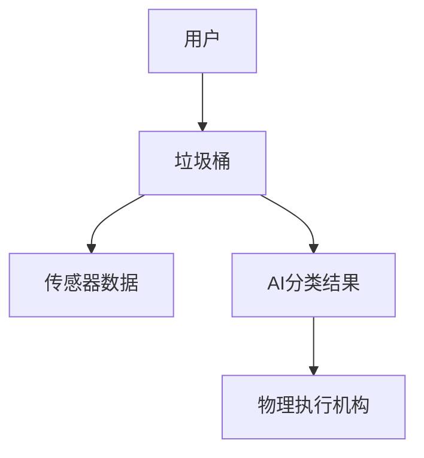
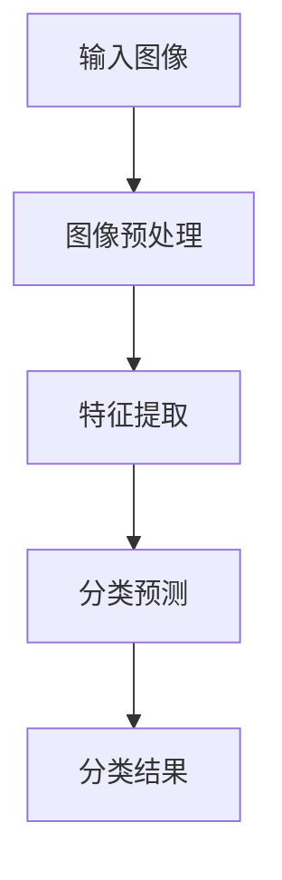

                 

# 智能厨房垃圾桶：AI Agent的厨余分类指导

> 关键词：智能垃圾桶、AI Agent、厨余分类、图像识别、机器学习、智能家居

> 摘要：本文深入探讨了AI Agent在厨余分类中的应用，结合图像识别、机器学习等技术，分析了智能厨房垃圾桶的设计原理、系统架构和实际应用场景。文章从问题背景、核心概念、算法原理、系统设计到项目实战，全面解析了AI Agent在厨余分类中的技术细节和实践方案。

---

## 第一部分: 背景与核心概念

### 第1章: 智能厨房垃圾桶的背景与问题描述

#### 1.1 厨余垃圾分类的重要性
- **1.1.1 厨余垃圾的定义与特点**  
  厨余垃圾是指厨房中产生的有机废弃物，主要包括食物残渣、果皮、菜叶等。这类垃圾具有易腐性、含水量高、气味重等特点，如果不进行分类处理，会对环境造成严重污染，同时也增加了垃圾处理的成本。

- **1.1.2 厨余垃圾分类的意义**  
  厨余垃圾分类能够减少环境污染，提高资源利用率，同时降低垃圾处理成本。通过分类，厨余垃圾可以被转化为有机肥料或生物质能，实现资源的循环利用。

- **1.1.3 当前厨余垃圾分类的现状与挑战**  
  当前，厨余垃圾分类主要依赖人工完成，效率低且容易出错。随着智能家居的普及，利用AI技术实现厨余垃圾分类的自动化成为趋势，但也面临技术成熟度不足、成本高等挑战。

#### 1.2 AI Agent在厨余分类中的应用背景
- **1.2.1 AI Agent的定义与特点**  
  AI Agent（智能代理）是一种能够感知环境、自主决策并执行任务的智能系统。它具备学习能力、适应性和自主性，能够在复杂环境中完成特定任务。

- **1.2.2 AI Agent的厨余分类需求**  
  厨余垃圾分类需要实时感知垃圾种类、形状、颜色等信息，并根据分类规则进行决策。AI Agent通过图像识别、传感器数据采集等技术，能够高效完成这一任务。

- **1.2.3 AI Agent的核心优势与价值**  
  AI Agent能够显著提高厨余分类的效率和准确性，同时减少人工干预，降低运营成本。此外，AI Agent还能够与其他智能家居设备联动，形成智能化的垃圾分类系统。

### 第2章: AI Agent与厨余分类的核心概念

#### 2.1 AI Agent的基本原理
- **2.1.1 AI Agent的感知、决策与执行模块**  
  AI Agent的三大核心模块是感知、决策和执行。感知模块通过摄像头、传感器等设备获取环境信息；决策模块基于感知数据进行分类判断；执行模块通过机械臂或指示灯完成分类操作。

- **2.1.2 AI Agent的感知技术**  
  感知技术主要包括图像识别和传感器数据采集。图像识别用于识别垃圾种类，传感器数据用于获取垃圾的物理特性（如湿度、重量等）。

- **2.1.3 AI Agent的决策与执行机制**  
  决策模块基于预设的分类规则和机器学习模型进行判断，执行模块则通过机械臂或指示灯完成分类操作。

#### 2.2 厨余分类的核心要素
- **2.2.1 厨余垃圾的物理特性**  
  厨余垃圾的物理特性包括颜色、形状、大小、湿度等，这些特性是分类的重要依据。

- **2.2.2 分类标准与规则**  
  厨余垃圾分类通常基于可回收物、湿垃圾、干垃圾等标准，分类规则需要与AI Agent的决策模块无缝对接。

- **2.2.3 分类结果的反馈机制**  
  分类结果需要通过可视化界面或传感器反馈，以便用户和系统进行调整和优化。

### 第3章: AI Agent与厨余分类的系统架构

#### 3.1 系统组成与功能模块
- **3.1.1 感知层：图像采集与传感器数据**  
  感知层通过摄像头和传感器获取垃圾的图像和物理特性数据，为决策层提供输入。

- **3.1.2 决策层：AI算法与分类逻辑**  
  决策层基于感知数据，利用机器学习模型进行分类判断，并生成执行指令。

- **3.1.3 执行层：分类结果的物理操作**  
  执行层通过机械臂或指示灯完成垃圾的分类操作，确保分类结果的准确性和效率。

#### 3.2 系统架构的ER实体关系图

---

## 第二部分: 算法原理与数学模型

### 第4章: 厨余分类的图像识别算法

#### 4.1 目标检测与图像分类
- **4.1.1 YOLO算法简介**  
  YOLO（You Only Look Once）是一种基于深度学习的目标检测算法，具有检测速度快、精度高的特点，适合用于实时的厨余垃圾分类。

- **4.1.2 Faster R-CNN算法原理**  
  Faster R-CNN是一种基于区域建议网络的目标检测算法，适合用于精度要求较高的厨余分类任务。

- **4.1.3 模型选择与优化策略**  
  根据实际需求选择适合的模型，并通过数据增强、模型剪枝等技术进行优化。

#### 4.2 垃圾分类的数学模型
- **4.2.1 分类器的损失函数**  
  常见的损失函数包括交叉熵损失和均方误差损失，用于衡量分类结果与真实标签的差异。

$$ L = -\sum_{i=1}^{n} y_i \log(p_i) + (1 - y_i) \log(1 - p_i) $$

- **4.2.2 优化器的选择与实现**  
  常用的优化器包括随机梯度下降（SGD）和Adam优化器，用于优化模型参数。

$$ \theta = \theta - \eta \frac{\partial L}{\partial \theta} $$

#### 4.3 算法流程图

---

通过以上思考过程，我们可以逐步构建智能厨房垃圾桶的AI Agent系统，涵盖从背景分析到算法实现的完整流程。

