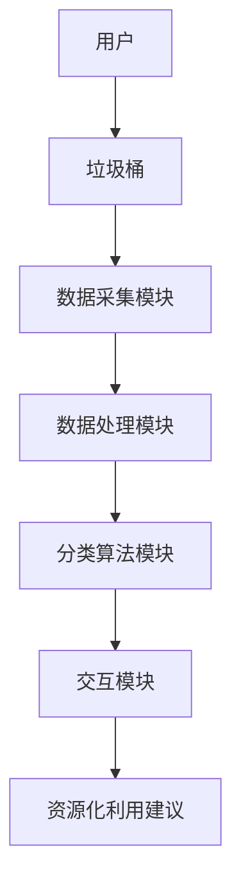

                 


# 智能厨房垃圾桶：AI Agent的厨余利用建议

**关键词**：智能垃圾桶、AI Agent、厨余垃圾、垃圾分类、机器学习

**摘要**：  
随着城市化进程的加快，厨余垃圾的处理问题日益突出。本文将探讨如何利用AI Agent技术，打造智能厨房垃圾桶，实现厨余垃圾的高效分类与利用。文章从背景介绍、核心概念、算法原理、系统架构到项目实战，全面分析智能垃圾桶的设计与实现，旨在为读者提供一份详尽的技术指南。

---

## 第一部分：智能厨房垃圾桶的背景与概念

### 第1章：智能厨房垃圾桶的背景介绍

#### 1.1 厨余垃圾处理的现状与挑战  
厨余垃圾是生活垃圾中的重要组成部分，主要来源于厨房废弃物，如果皮、菜叶、剩饭等。这些垃圾不仅占用了大量土地资源，还可能对环境造成二次污染。传统的垃圾处理方式效率低下，且难以实现精准分类。  

**问题描述**：  
- **问题背景**：厨余垃圾处理的低效性，导致资源浪费和环境污染。  
- **主要问题**：垃圾分类不准确，处理成本高，资源利用率低。  
- **解决思路**：通过智能化技术，实现厨余垃圾的精准分类与高效利用。  

**边界与外延**：  
智能厨房垃圾桶主要针对家庭厨余垃圾的分类与处理，外延可扩展至商业厨余垃圾的处理，以及与其他智能家居设备的联动。  

#### 1.2 智能垃圾桶的发展历程  
智能垃圾桶的出现，标志着垃圾处理从传统走向智能化的转折点。从最初的机械分类到如今的AI驱动，智能垃圾桶经历了以下几个阶段：  
1. **机械分类阶段**：通过机械装置实现简单的垃圾分类。  
2. **传感器识别阶段**：引入传感器技术，初步实现垃圾的自动识别。  
3. **AI驱动阶段**：结合机器学习和自然语言处理技术，实现智能化分类与建议。  

#### 1.3 AI Agent与厨余利用的结合  
AI Agent（智能代理）是一种能够感知环境、自主决策的智能系统。在厨余利用中，AI Agent可以实现以下功能：  
- **垃圾识别**：通过图像识别技术，快速分类厨余垃圾。  
- **资源建议**：根据垃圾类型，提供资源化利用的建议（如堆肥、回收利用等）。  
- **用户交互**：通过语音或APP与用户互动，指导垃圾投放。  

---

### 第2章：智能厨房垃圾桶的核心概念与联系

#### 2.1 AI Agent的核心原理  
AI Agent通过感知环境、分析数据、做出决策并执行操作，实现与用户的互动。其核心原理包括：  
- **感知层**：通过摄像头、传感器等设备采集垃圾信息。  
- **决策层**：基于机器学习算法，分析垃圾类型并生成处理建议。  
- **执行层**：通过机械装置或用户反馈，完成垃圾分类或资源化利用。  

#### 2.2 智能垃圾桶的系统架构  
智能垃圾桶的系统架构由以下几个模块组成：  
- **数据采集模块**：负责采集垃圾图像或传感器数据。  
- **数据处理模块**：对采集的数据进行预处理和特征提取。  
- **分类算法模块**：基于机器学习算法实现垃圾分类。  
- **交互模块**：通过语音或APP与用户互动，提供分类建议。  

**实体关系图**：  
```mermaid
er
  actor: 用户
  class: 垃圾分类
  instance: 垃圾桶
  attribute: 垃圾类型
  relation: "用户通过垃圾桶进行垃圾投放"
```

#### 2.3 核心概念的对比分析  
以下是AI Agent与传统垃圾桶的核心属性对比：  

| **属性**       | **AI Agent垃圾桶**             | **传统垃圾桶**             |
|-----------------|--------------------------------|-----------------------------|
| 分类能力         | 支持智能分类，识别多种垃圾类型 | 仅支持人工分类或简单机械分类 |
| 交互方式         | 支持语音或APP交互             | 无交互或仅限机械操作         |
| 处理效率         | 高效分类，减少人工干预         | 低效，依赖人工操作             |
| 可扩展性         | 支持远程更新与功能扩展         | 功能固定，难以升级             |

---

### 第3章：AI Agent的算法原理与实现

#### 3.1 分类算法的选择与实现  
在智能垃圾桶中，垃圾分类的核心算法可以采用随机森林或支持向量机（SVM）。以下是两种算法的优缺点对比：  

| **算法**   | **优点**                          | **缺点**                          |
|------------|-----------------------------------|-----------------------------------|
| 随机森林     | 鲁棒性强，适合小样本数据          | 对特征工程要求较高                |
| 支持向量机（SVM） | 分类精度高，适合线性可分数据      | 对高维数据处理能力较弱             |

##### 3.1.1 随机森林算法的实现  
随机森林是一种基于决策树的集成算法，通过投票机制实现分类。以下是其实现流程：  
1. 从训练数据中随机抽取样本，构建多棵决策树。  
2. 对每个垃圾样本，计算各棵决策树的投票结果。  
3. 根据投票结果确定垃圾类型。  

##### 3.1.2 SVM算法的实现  
支持向量机通过构建超平面实现数据的线性分类。以下是其数学模型：  
$$ \text{minimize } \frac{1}{2}||w||^2 + C \sum_{i=1}^{n} \xi_i $$
$$ y_i(w \cdot x_i + b) \geq 1 - \xi_i $$
$$ \xi_i \geq 0 $$  

#### 3.2 算法实现的代码示例  
以下是基于随机森林的垃圾分类代码示例：  

```python
from sklearn.ensemble import RandomForestClassifier
from sklearn.metrics import accuracy_score
from sklearn.model_selection import train_test_split

# 数据预处理
X = ...  # 特征数据
y = ...  # 标签数据

# 划分训练集与测试集
X_train, X_test, y_train, y_test = train_test_split(X, y, test_size=0.2)

# 初始化模型
model = RandomForestClassifier(n_estimators=100, random_state=42)

# 模型训练
model.fit(X_train, y_train)

# 模型预测
y_pred = model.predict(X_test)

# 模型评估
print("Accuracy:", accuracy_score(y_test, y_pred))
```

---

## 第四部分：系统分析与架构设计方案

### 4.1 问题场景介绍  
智能厨房垃圾桶的主要应用场景包括家庭厨房和小型商业厨房。用户通过垃圾桶投放垃圾，垃圾桶通过AI Agent实现垃圾的智能分类与资源化建议。

### 4.2 系统功能设计  
系统功能设计包括以下模块：  
- **数据采集模块**：负责采集垃圾图像或传感器数据。  
- **数据处理模块**：对采集的数据进行预处理和特征提取。  
- **分类算法模块**：基于机器学习算法实现垃圾分类。  
- **交互模块**：通过语音或APP与用户互动，提供分类建议。  

### 4.3 系统架构图  


---

## 第五部分：项目实战

### 5.1 环境安装与配置  
- **安装Python**：确保安装Python 3.8或更高版本。  
- **安装依赖库**：安装scikit-learn、OpenCV、SpeechRecognition等库。  

### 5.2 核心代码实现  
以下是垃圾桶AI Agent的核心代码示例：  

```python
import cv2
import numpy as np
from sklearn.ensemble import RandomForestClassifier

# 数据采集
def capture_image():
    cap = cv2.VideoCapture(0)
    ret, img = cap.read()
    cap.release()
    return img

# 特征提取
def extract_features(image):
    # 假设image是单通道灰度图
    features = []
    for i in range(image.shape[0]):
        for j in range(image.shape[1]):
            features.append(image[i][j])
    return features

# 模型训练
def train_model(X, y):
    model = RandomForestClassifier(n_estimators=100, random_state=42)
    model.fit(X, y)
    return model

# 分类预测
def predict_image(model, image):
    features = extract_features(image)
    prediction = model.predict([features])
    return prediction[0]
```

---

## 第六部分：最佳实践与小结

### 6.1 小结  
智能厨房垃圾桶通过AI Agent技术，实现了厨余垃圾的高效分类与资源化利用。本文从背景、核心概念、算法原理到系统架构，全面分析了智能垃圾桶的设计与实现。

### 6.2 注意事项  
- 在实际应用中，需注意数据隐私问题，确保用户数据的安全性。  
- 垃圾分类的准确率依赖于算法模型的优化，建议持续收集数据并更新模型。  

### 6.3 拓展阅读  
- 《机器学习实战》：深入了解机器学习算法的实现与优化。  
- 《智能系统设计》：学习智能系统的整体架构与设计方法。  

---

通过本文的分析与实践，我们能够更好地理解AI Agent在厨余利用中的巨大潜力，并为未来的智能化垃圾分类提供有益的参考。

