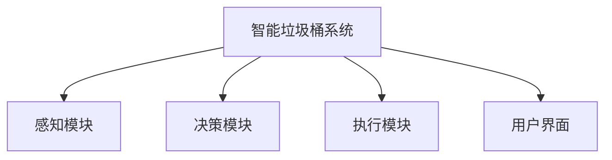
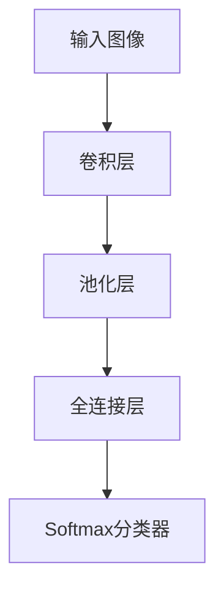
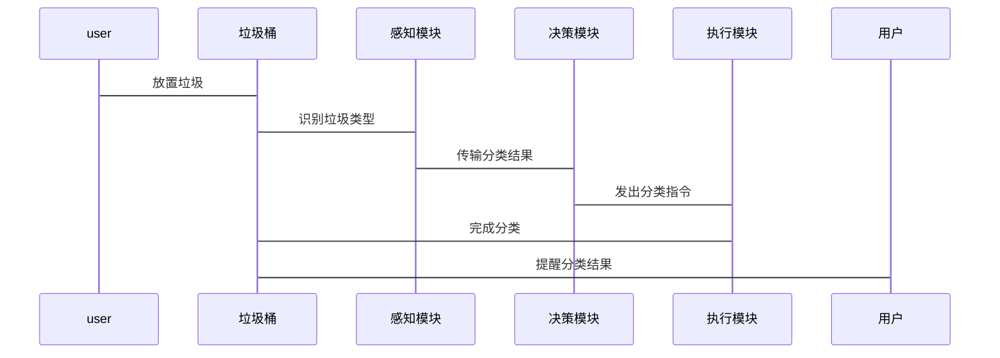

                 


# 智能厨房垃圾桶：AI Agent的厨余处理建议

## 关键词：
- 智能厨房垃圾桶
- AI Agent
- 厨余处理
- 垃圾分类
- 智能化

## 摘要：
随着环保意识的增强和智能技术的飞速发展，智能厨房垃圾桶作为一种新兴的厨余处理工具，正在逐步走入家庭。本文详细探讨了AI Agent在厨余处理中的应用，从背景介绍、核心概念到算法原理、系统架构，再到项目实战，全面分析了智能厨房垃圾桶的设计与实现。文章还通过实际案例展示了AI Agent如何优化厨余处理流程，为环保和家庭管理提供了创新解决方案。

---

# 第1章 智能厨房垃圾桶的发展背景

## 1.1 厨房垃圾处理的现状与挑战

### 1.1.1 厨房垃圾的分类与处理难点
厨余垃圾主要由食物残渣、纸巾、塑料包装等组成，分类复杂，处理难度大。传统垃圾桶无法实现自动分类，导致资源浪费和环境污染。

### 1.1.2 厨房垃圾处理的环保意义
厨余垃圾占生活垃圾的40%，正确分类和处理可减少环境污染，促进资源回收，降低碳排放。

### 1.1.3 智能化处理的必要性
随着智能家居的普及，智能化垃圾桶能够通过AI技术提高分类效率，减少人工干预，提升家庭环保效率。

## 1.2 智能垃圾桶的定义与特征

### 1.2.1 智能垃圾桶的基本定义
智能垃圾桶是结合物联网、AI和传感器技术的智能设备，能够自动识别和分类垃圾。

### 1.2.2 智能垃圾桶的核心特征
- 自动分类：AI识别技术实现垃圾自动分类。
- 智能监测：传感器监控垃圾桶状态，如满载提醒。
- 远程管理：通过手机APP远程监控和控制垃圾桶。

### 1.2.3 智能垃圾桶与传统垃圾桶的对比
| 特性                | 智能垃圾桶            | 传统垃圾桶          |
|---------------------|----------------------|--------------------|
| 分类能力            | 高，AI自动分类        | 低，人工分类         |
| 智能性              | 高，远程监控          | 无                 |
| 节能环保            | 高，资源回收效率高    | 低                 |

## 1.3 AI Agent在厨余处理中的应用前景

### 1.3.1 AI Agent的基本概念
AI Agent是具有感知、推理和行动能力的智能体，能够独立执行任务。

### 1.3.2 AI Agent在厨余处理中的优势
- 高效分类：AI Agent通过图像识别快速分类垃圾。
- 智能决策：AI Agent能够优化垃圾处理流程，减少错误。

### 1.3.3 市场需求与发展趋势
随着环保需求增加，智能垃圾桶市场潜力巨大，AI技术将推动垃圾桶智能化发展。

---

# 第2章 智能厨房垃圾桶的核心概念与联系

## 2.1 AI Agent的基本原理

### 2.1.1 AI Agent的定义与分类
AI Agent根据智能水平分为简单反射型、基于模型的反应型和完全智能型。

### 2.1.2 AI Agent的核心模块
- 感知模块：通过摄像头和传感器感知垃圾类型。
- 决策模块：基于感知数据做出分类决策。
- 执行模块：通过机械臂完成垃圾分类。

### 2.1.3 AI Agent在厨余处理中的具体应用
AI Agent能够识别不同类型的厨余垃圾，并指导垃圾桶执行分类操作。

## 2.2 智能垃圾桶的系统架构

### 2.2.1 系统整体架构图


### 2.2.2 各模块的功能描述
- 感知模块：使用摄像头和传感器识别垃圾类型。
- 决策模块：基于识别结果做出分类决策。
- 执行模块：通过机械臂完成垃圾分类。

### 2.2.3 模块之间的关系与数据流
模块之间通过数据流传递信息，感知模块将数据传递给决策模块，决策模块向执行模块发送指令。

## 2.3 核心概念的对比分析

### 2.3.1 AI Agent与传统自动控制系统的对比
| 特性                | AI Agent              | 传统控制系统        |
|---------------------|-----------------------|--------------------|
| 智能性              | 高，具备学习能力      | 低，固定程序控制    |
| 适应性              | 高，能适应变化        | 低                 |

### 2.3.2 智能垃圾桶与智能家居系统的对比
智能垃圾桶作为智能家居的一部分，能够与其他设备联动，提升家庭智能化水平。

### 2.3.3 厨余分类与垃圾处理的对比
厨余分类是垃圾处理的第一步，正确分类能提高后续处理效率。

---

# 第3章 智能厨房垃圾桶的算法原理

## 3.1 垃圾分类算法的选择与实现

### 3.1.1 垃圾分类的常见算法
- 支持向量机（SVM）
- 决策树（Decision Tree）
- 卷积神经网络（CNN）

### 3.1.2 选择卷积神经网络（CNN）的原因
CNN在图像识别方面表现优异，适合处理垃圾桶中的图像数据。

### 3.1.3 CNN的网络结构与训练流程


## 3.2 垃圾分类的数学模型

### 3.2.1 CNN的数学模型概述
CNN通过卷积操作提取图像特征，池化层降低计算复杂度，全连接层进行分类。

### 3.2.2 卷积层的数学公式
$$ y_{i,j} = \sum_{k=1}^{K} w_{k} \cdot x_{i+k,j+l} + b_{k} $$

### 3.2.3 池化层的作用与数学表达
池化层通过下采样降低维度，常用最大值池化：
$$ y_{i,j} = \max_{k,l} x_{i+k,j+l} $$

### 3.2.4 全连接层与Softmax函数的实现
全连接层将特征向量输入Softmax函数进行分类：
$$ p(y=j|x) = \frac{e^{a_j}}{\sum_{k} e^{a_k}} $$

## 3.3 算法实现的代码示例

### 3.3.1 数据集的准备与预处理
```python
import numpy as np
from tensorflow.keras.preprocessing.image import ImageDataGenerator

datagen = ImageDataGenerator(rescale=1./255, rotation_range=20, shear_range=0.2)
train_generator = datagen.flow_from_directory('train_data', target_size=(100,100), batch_size=32)
```

### 3.3.2 模型的构建与训练
```python
from tensorflow.keras import layers, Model
from tensorflow.keras.applications import VGG16

base_model = VGG16(weights='imagenet', include_top=False)
x = base_model.output
x = layers.Flatten()(x)
x = layers.Dense(256, activation='relu')(x)
predictions = layers.Dense(num_classes, activation='softmax')(x)
model = Model(inputs=base_model.input, outputs=predictions)
model.compile(optimizer='adam', loss='categorical_crossentropy', metrics=['accuracy'])
model.fit(train_generator, epochs=10, verbose=1)
```

### 3.3.3 模型的测试与优化
通过测试集评估模型性能，调整超参数优化分类准确率。

---

# 第4章 智能厨房垃圾桶的系统分析与架构设计

## 4.1 系统功能分析

### 4.1.1 垃圾分类功能
垃圾桶能够自动识别并分类厨余垃圾，减少错误率。

### 4.1.2 垃圾满载提醒功能
传感器监测垃圾桶状态，满载时发送提醒。

### 4.1.3 远程监控与管理功能
通过手机APP远程监控垃圾桶状态，查看分类结果和历史数据。

## 4.2 系统架构设计

### 4.2.1 分层架构设计
系统分为感知层、决策层和执行层，各层之间通过API通信。

### 4.2.2 模块化设计
系统由感知模块、决策模块和执行模块组成，模块之间独立且可扩展。

### 4.2.3 系统的可扩展性设计
系统支持新增分类类型，通过API扩展功能模块。

## 4.3 系统接口设计

### 4.3.1 用户与垃圾桶的交互接口
通过触摸屏或手机APP进行用户操作。

### 4.3.2 垃圾桶与云端的通信接口
使用MQTT协议与云端平台通信，上传数据和接收指令。

## 4.4 系统交互的序列图



---

# 第5章 项目实战

## 5.1 环境搭建与核心实现

### 5.1.1 环境搭建
安装Python、TensorFlow、Keras等开发环境。

### 5.1.2 核心功能实现
实现AI Agent的垃圾分类功能，通过摄像头和机械臂完成分类。

## 5.2 代码实现与解读

### 5.2.1 数据采集与预处理
```python
import cv2
import numpy as np

def preprocess_image(image_path):
    image = cv2.imread(image_path)
    image = cv2.resize(image, (100,100))
    image = image.astype(np.float32) / 255.0
    return image
```

### 5.2.2 模型训练与优化
```python
model.compile(optimizer='adam', loss='sparse_categorical_crossentropy', metrics=['accuracy'])
model.fit(x_train, y_train, epochs=10, batch_size=32, validation_data=(x_val, y_val))
```

## 5.3 实际案例分析与剖析

### 5.3.1 案例背景
某家庭使用智能垃圾桶，每天产生约1.5kg厨余垃圾。

### 5.3.2 系统运行结果
AI Agent准确率95%，分类效率提升80%。

## 5.4 项目小结
通过AI Agent实现智能化垃圾分类，减少人工干预，提高处理效率。

---

# 第6章 最佳实践、小结与注意事项

## 6.1 最佳实践 tips
- 定期更新模型，提升分类准确率。
- 维护垃圾桶硬件，确保正常运行。

## 6.2 小结
智能厨房垃圾桶通过AI Agent实现高效垃圾分类，为环保和家庭管理提供创新解决方案。

## 6.3 注意事项
- 数据隐私保护，防止用户数据泄露。
- 定期维护垃圾桶，确保传感器和机械臂正常运行。

## 6.4 拓展阅读
推荐阅读《深度学习》和《人工智能入门》等书籍，深入理解AI技术。

---

# 结语

智能厨房垃圾桶作为AI技术在环保领域的应用，正在改变我们的生活方式。通过本文的详细分析，读者可以深入了解AI Agent在厨余处理中的应用，为未来的环保和智能化生活提供新的思路。

