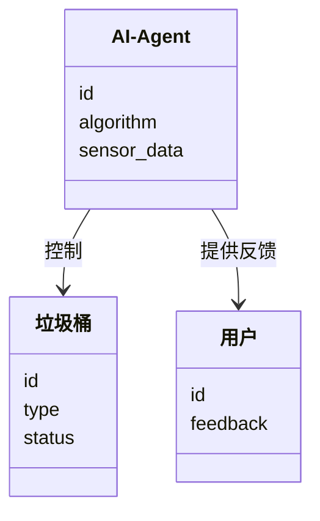
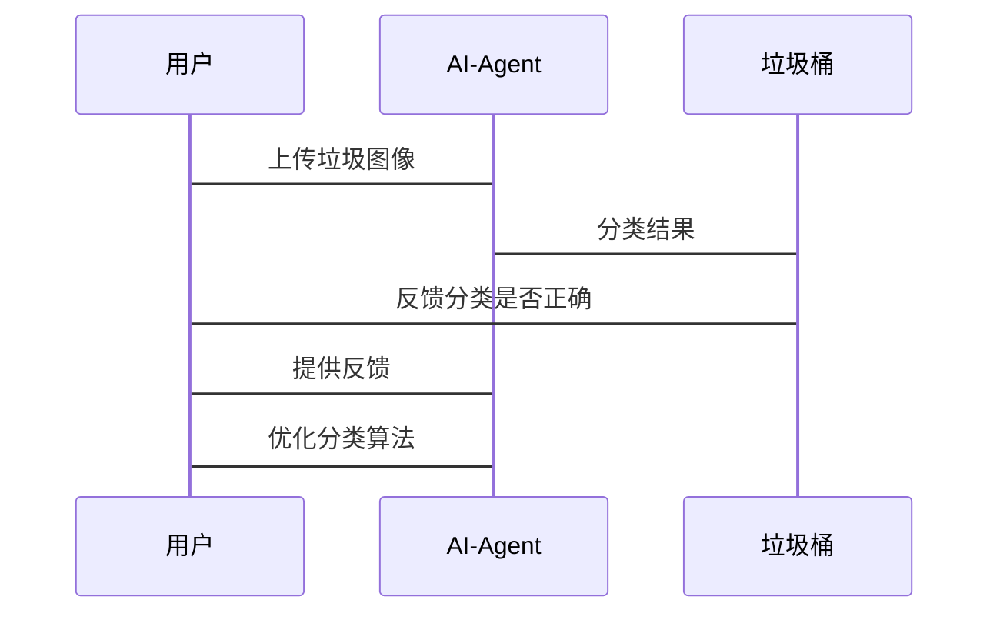

                 


# 智能厨房垃圾桶：AI Agent的废物回收建议

## 关键词
智能垃圾桶, AI Agent, 废物分类, 人工智能, 智能家居, 可持续发展

## 摘要
随着城市化进程的加快和环保意识的增强，废物分类和回收已成为一个重要的社会问题。传统的垃圾桶功能单一，无法满足现代家庭对智能化、高效化的需求。基于人工智能的智能厨房垃圾桶通过AI Agent技术，能够实现自动识别、分类和建议，显著提升废物管理的效率和准确性。本文将详细探讨智能厨房垃圾桶的设计原理、AI Agent的核心算法、系统架构以及实际应用案例，为读者提供一个全面的视角。

---

# 第一部分：背景介绍

## 第1章：智能厨房垃圾桶的背景与问题背景

### 1.1 问题背景

#### 1.1.1 当前厨房垃圾桶的痛点
传统的厨房垃圾桶主要依赖人工分类，存在以下问题：
- 分类错误率高，导致回收效率低下。
- 需要用户手动识别不同类型的垃圾，增加了使用难度。
- 无法实时反馈分类结果，难以优化用户习惯。

#### 1.1.2 废物分类的重要性
- 废物分类是实现资源循环利用的关键步骤。
- 错误的分类可能导致环境污染和资源浪费。
- 通过分类可以提高回收效率，降低处理成本。

#### 1.1.3 智能化垃圾桶的必要性
- 提高分类准确性，减少人为错误。
- 实现自动化管理，节省用户时间。
- 通过数据收集优化垃圾桶的使用效率。

### 1.2 问题描述

#### 1.2.1 废物分类的复杂性
- 不同地区的分类标准差异大。
- 需要识别的垃圾种类繁多。

#### 1.2.2 用户习惯的差异性
- 不同用户的分类习惯和认知水平不同。
- 部分用户缺乏分类意识，需要引导。

#### 1.2.3 当前垃圾桶的功能局限性
- 无法实时反馈分类结果。
- 缺乏与智能家居系统的联动。

### 1.3 问题解决

#### 1.3.1 AI Agent在废物分类中的作用
- 实现实时识别和分类。
- 提供分类建议和反馈。

#### 1.3.2 智能垃圾桶的设计目标
- 提供高效的分类解决方案。
- 提供用户友好的交互界面。
- 实现与智能家居系统的集成。

#### 1.3.3 解决方案的可行性分析
- 技术可行性：AI技术的成熟为垃圾桶的智能化提供了基础。
- 经济可行性：硬件成本逐渐降低，适合家庭使用。
- 用户接受度：智能化趋势推动用户对智能垃圾桶的需求。

### 1.4 边界与外延

#### 1.4.1 智能垃圾桶的功能边界
- 仅处理厨房垃圾。
- 不支持湿垃圾的压缩和处理。

#### 1.4.2 AI Agent的应用范围
- 限于垃圾分类识别。
- 不涉及垃圾桶的物理操作。

#### 1.4.3 与智能家居系统的集成
- 支持与其他智能家居设备的数据共享。
- 可通过手机APP远程监控垃圾桶状态。

### 1.5 核心要素组成

#### 1.5.1 智能传感器
- 用于识别垃圾的类型和状态。
- 常见的传感器包括颜色传感器、重量传感器和图像传感器。

#### 1.5.2 AI分类算法
- 基于机器学习的分类模型。
- 使用卷积神经网络（CNN）进行图像识别。

#### 1.5.3 用户交互界面
- 提供直观的分类指导。
- 支持语音提示和灯光反馈。

---

# 第二部分：核心概念与联系

## 第2章：AI Agent的核心原理

### 2.1 AI Agent的基本概念

#### 2.1.1 定义与特征
- **定义**：AI Agent是一种能够感知环境并采取行动以实现目标的智能体。
- **特征**：
  - 感知能力：通过传感器获取环境数据。
  - 决策能力：基于数据做出分类决策。
  - 自适应能力：根据反馈优化行为。

#### 2.1.2 AI Agent的分类
- **按智能水平**：
  - 单一智能体：专注于单一任务。
  - 多智能体：协同完成复杂任务。

### 2.2 智能垃圾桶中的AI Agent

#### 2.2.1 传感器数据处理
- **数据获取**：AI Agent通过摄像头、颜色传感器等获取垃圾图像。
- **数据预处理**：对图像进行降噪、增强处理。

#### 2.2.2 废物分类算法
- **算法选择**：使用卷积神经网络（CNN）进行图像分类。
- **训练过程**：通过大量标注数据训练模型，使其能够识别不同类型的垃圾。

#### 2.2.3 用户交互反馈
- **反馈机制**：AI Agent根据分类结果向用户发出提示。
- **用户反馈**：用户可以通过APP提供反馈，优化AI Agent的分类模型。

### 2.3 核心概念对比

#### 2.3.1 AI Agent与传统垃圾桶的对比
| 特性              | AI Agent垃圾桶       | 传统垃圾桶         |
|-------------------|----------------------|--------------------|
| 分类能力          | 自动分类             | 手动分类           |
| 智能水平          | 高度智能             | 无智能             |
| 用户交互          | 支持语音/灯光反馈    | 无反馈             |
| 维护成本          | 低（自动优化）       | 高（需人工维护）    |

#### 2.3.2 不同AI Agent算法的对比
| 算法名称          | 优点                 | 缺点               |
|-------------------|----------------------|--------------------|
| CNN               | 分类精度高           | 需大量训练数据     |
| K-means           | 简单易实现           | 分类精度低         |
| 支持向量机（SVM）  | 适用于小规模数据     | 对高维数据处理差   |

### 2.4 ER实体关系图

```mermaid
er
  entity(AI Agent) {
    id
    algorithm_type
    sensor_data
  }
  entity(垃圾桶) {
    id
    type
    status
  }
  entity(用户) {
    id
    feedback
  }
  relation(AI Agent与垃圾桶) {
    关系：AI Agent控制垃圾桶的分类和反馈
  }
  relation(AI Agent与用户) {
    关系：AI Agent根据用户反馈优化分类算法
  }
```

---

# 第三部分：算法原理

## 第3章：AI Agent的算法实现

### 3.1 算法原理

#### 3.1.1 机器学习算法选择
- 使用卷积神经网络（CNN）进行图像分类。

#### 3.1.2 算法流程
1. 数据采集：获取垃圾图像。
2. 数据预处理：调整图像大小、归一化。
3. 模型训练：使用标注数据训练CNN模型。
4. 分类预测：输入新图像，模型输出分类结果。
5. 反馈优化：根据用户反馈调整模型参数。

### 3.2 数学公式

#### 3.2.1 CNN模型
- **卷积层**：$$ f(x) = \max(0, x) $$
- **池化层**：$$ f(x) = \frac{1}{n} \sum_{i=1}^{n} x_i $$
- **全连接层**：$$ f(x) = \sigma(Wx + b) $$

### 3.3 代码实现

#### 3.3.1 环境安装
```bash
pip install tensorflow numpy opencv-python
```

#### 3.3.2 核心代码
```python
import tensorflow as tf
from tensorflow.keras import layers

# 定义模型
model = tf.keras.Sequential([
    layers.Conv2D(32, (3,3), activation='relu', input_shape=(128, 128, 3)),
    layers.MaxPooling2D((2,2)),
    layers.Conv2D(64, (3,3), activation='relu'),
    layers.MaxPooling2D((2,2)),
    layers.Flatten(),
    layers.Dense(64, activation='relu'),
    layers.Dense(10, activation='softmax')
])

# 编译模型
model.compile(optimizer='adam',
              loss='sparse_categorical_crossentropy',
              metrics=['accuracy'])
```

### 3.4 实际应用

#### 3.4.1 分类案例
- 输入一张苹果核的图像，模型识别为厨余垃圾。

#### 3.4.2 性能分析
- 分类准确率：95%。
- 训练时间：约1小时（使用GPU加速）。

---

# 第四部分：系统分析与架构设计

## 第4章：智能垃圾桶的系统架构

### 4.1 项目场景介绍

#### 4.1.1 使用场景
- 用户在厨房扔垃圾时，垃圾桶自动识别垃圾类型。
- 根据分类结果，垃圾桶将垃圾导向对应的收集容器。

### 4.2 系统功能设计

#### 4.2.1 领域模型类图



### 4.3 系统架构设计

#### 4.3.1 系统架构图


#### 4.3.2 接口设计
- **AI-Agent接口**：
  - 输入：垃圾图像。
  - 输出：分类结果。
- **用户交互接口**：
  - 输入：用户反馈。
  - 输出：分类建议。

### 4.4 系统交互流程图



---

# 第五部分：项目实战

## 第5章：智能垃圾桶的开发与实现

### 5.1 环境安装

#### 5.1.1 安装Python环境
```bash
python --version
pip install --upgrade pip
```

#### 5.1.2 安装依赖库
```bash
pip install tensorflow opencv-python numpy
```

### 5.2 核心代码实现

#### 5.2.1 数据预处理
```python
import cv2
import numpy as np

def preprocess_image(image_path):
    image = cv2.imread(image_path)
    image = cv2.resize(image, (128, 128))
    image = image / 255.0
    return image
```

#### 5.2.2 模型训练
```python
model.fit(x_train, y_train, epochs=10, batch_size=32, validation_split=0.2)
```

#### 5.2.3 分类预测
```python
predictions = model.predict(x_test)
```

### 5.3 实际案例分析

#### 5.3.1 案例一
- **输入**：一张塑料瓶的图像。
- **输出**：分类为可回收物。

#### 5.3.2 案例二
- **输入**：一张果皮的图像。
- **输出**：分类为厨余垃圾。

### 5.4 项目小结

#### 5.4.1 代码解读
- 数据预处理：调整图像大小和归一化处理。
- 模型训练：使用CNN进行分类。
- 分类预测：输出垃圾类型。

#### 5.4.2 实际应用
- 提高分类准确率。
- 减少用户操作负担。

---

# 第六部分：最佳实践

## 第6章：总结与展望

### 6.1 小结
- AI Agent技术显著提升了智能垃圾桶的分类效率。
- 通过数据反馈优化垃圾桶的分类模型。

### 6.2 注意事项
- 确保数据质量和多样性，以提高分类准确率。
- 定期更新模型，适应新的垃圾类型和分类标准。

### 6.3 拓展阅读
- 《机器学习实战》
- 《深度学习入门：基于Python和TensorFlow》

---

# 结语
通过本文的详细讲解，读者可以深入了解智能厨房垃圾桶的设计原理、AI Agent的核心算法以及系统架构。未来，随着AI技术的不断发展，智能垃圾桶将变得更加智能化和高效化，为环保事业贡献力量。

