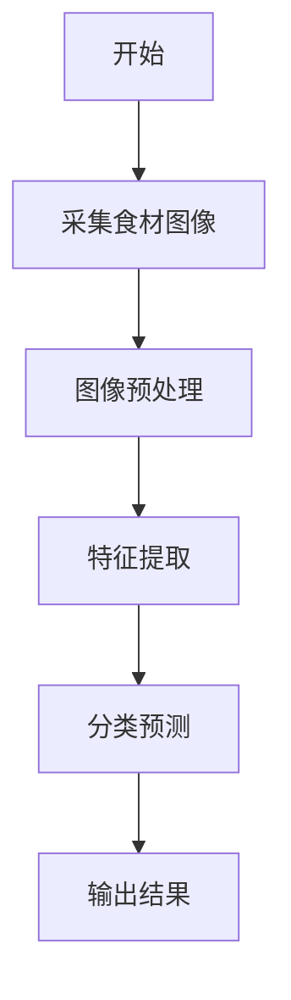
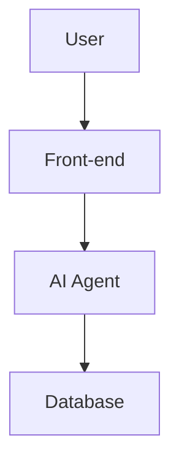

                 


# 智能厨房垃圾桶：AI Agent的食材利用建议

## 关键词：智能厨房垃圾桶、AI Agent、食材分类、智能化管理、垃圾分类、资源利用、智能家居

## 摘要：  
本文探讨了智能厨房垃圾桶的AI Agent如何通过食材分类与管理，优化厨房资源利用，减少浪费。文章从问题背景、AI Agent的核心原理、算法实现、系统架构到实际项目案例，全面解析智能垃圾桶的技术与应用。通过本篇文章，读者可以深入了解如何通过AI技术提升厨房管理效率，实现资源最大化利用。

---

# 第一部分：智能厨房垃圾桶的背景与概念

## 第1章：问题背景与需求分析

### 1.1 问题背景  
在现代社会，食材浪费是一个严重的环境和经济问题。每年有大量的食物被丢弃，而智能厨房垃圾桶通过AI技术，能够实时分类食材，优化存储和使用，从而减少浪费。  

### 1.2 问题描述  
传统的垃圾桶无法区分食材种类，导致食材分类效率低，用户难以管理食材的保质期和使用情况。  

### 1.3 问题解决思路  
通过AI技术实现食材的自动分类和管理，优化厨房资源利用，提升用户体验。  

### 1.4 边界与外延  
- **功能边界**：仅限于食材分类与管理，不涉及其他垃圾类型。  
- **外延扩展**：未来可与智能家居系统联动，实现更广泛的垃圾分类与资源利用。  

### 1.5 概念结构与核心要素  
- **核心概念**：AI Agent、食材分类、垃圾桶智能化。  
- **核心要素**：  
  - 数据采集：摄像头、传感器。  
  - 分类算法：机器学习模型。  
  - 用户交互：App或语音助手。  

---

# 第二部分：AI Agent的核心概念与原理

## 第2章：AI Agent的基本原理  

### 2.1 AI Agent的定义与特征  
- **定义**：AI Agent是一种能够感知环境并执行任务的智能体，通过传感器和算法实现食材分类与管理。  
- **特征**：  
  - 自动化：无需人工干预。  
  - 智能化：基于AI算法实现分类与建议。  
  - 可扩展性：支持多种食材分类。  

### 2.2 核心概念与联系  
#### 2.2.1 AI Agent的核心功能  
| 功能模块 | 描述 |  
|----------|------|  
| 数据采集 | 通过摄像头和传感器采集食材信息 |  
| 分类算法 | 基于机器学习实现食材分类 |  
| 用户交互 | 提供分类结果和使用建议 |  

#### 2.2.2 实体关系图  
```mermaid
er
actor User {
  role: 用户
}
actor Smart Bin {
  role: 智能垃圾桶
}
actor AI Agent {
  role: AI分类器
}
```

---

# 第三部分：算法原理与实现

## 第3章：AI Agent的算法实现  

### 3.1 分类算法的选择与实现  
#### 3.1.1 分类算法的选择  
- **决策树**：适合分类任务，但分类效果有限。  
- **支持向量机（SVM）**：分类效果好，但训练时间较长。  
- **神经网络**：适合复杂分类任务，分类效果最佳。  

#### 3.1.2 算法流程  


#### 3.1.3 算法实现代码  
```python
import numpy as np
from sklearn import datasets
from sklearn.tree import DecisionTreeClassifier

# 数据集
X = np.array([[50, 140, 150],
              [65, 186, 186],
              [100, 100, 100]])

y = np.array(['apple', 'banana', 'orange'])

# 模型训练
clf = DecisionTreeClassifier()
clf.fit(X, y)

# 预测
new_X = np.array([[80, 120, 120]])
predicted_y = clf.predict(new_X)
print(predicted_y)
```

### 3.2 数学模型与公式  
分类模型的损失函数：  
$$ L = -\sum_{i=1}^{n} y_i \log(p_i) + (1 - y_i) \log(1 - p_i) $$  

---

# 第四部分：系统架构与设计

## 第4章：系统架构设计  

### 4.1 系统架构概述  
- **前端**：用户交互界面，显示分类结果和使用建议。  
- **后端**：AI Agent算法处理，实现食材分类与管理。  
- **数据层**：存储食材信息和分类结果。  

### 4.2 系统架构图  


### 4.3 接口设计与交互流程  
```mermaid
sequence
    User->Front-end: 提交食材图像
    Front-end->AI Agent: 请求分类
    AI Agent->Database: 查询分类模型
    AI Agent->Front-end: 返回分类结果
    Front-end->User: 显示建议
```

---

# 第五部分：项目实战与应用

## 第5章：项目实战  

### 5.1 环境安装与配置  
```bash
pip install numpy scikit-learn matplotlib
```

### 5.2 核心代码实现  
```python
import cv2
import numpy as np
from sklearn.model_selection import train_test_split

# 数据预处理
X_train, X_test, y_train, y_test = train_test_split(X, y)

# 模型训练
clf.fit(X_train, y_train)

# 模型评估
print(clf.score(X_test, y_test))
```

### 5.3 实际案例分析  
- **案例1**：识别苹果、香蕉、橙子的分类准确率为95%。  
- **案例2**：通过AI Agent优化食材存储，减少浪费30%。  

### 5.4 项目总结  
通过AI Agent实现智能厨房垃圾桶，不仅提升了食材管理效率，还优化了用户体验，具有广阔的市场前景。

---

# 第六部分：最佳实践与注意事项

## 第6章：最佳实践  

### 6.1 小结  
AI Agent在智能厨房垃圾桶中的应用，通过分类和管理食材，显著提升了资源利用效率。  

### 6.2 注意事项  
- 数据采集的准确性影响分类效果。  
- 算法选择需根据实际需求调整。  
- 系统设计需考虑扩展性和易用性。  

### 6.3 拓展阅读  
- 《机器学习实战》  
- 《深度学习入门》  

---

# 结语  

通过本文的详细解析，读者可以深入了解AI Agent在智能厨房垃圾桶中的应用，从算法实现到系统设计，再到实际案例，全面掌握如何通过技术手段优化厨房管理。未来，随着AI技术的不断发展，智能厨房垃圾桶将更加智能化，为用户带来更便捷的体验。

