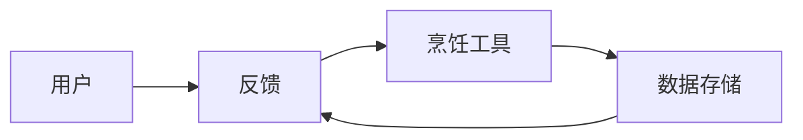
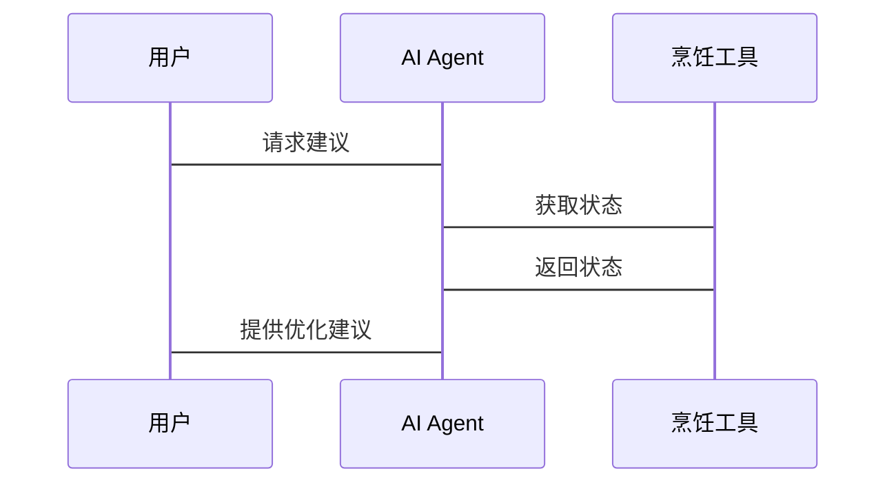

                 


# 智能厨房抽屉：AI Agent的烹饪工具使用建议

## 关键词：智能厨房抽屉，AI Agent，烹饪工具，智能家居，物联网，人工智能

## 摘要：本文探讨了AI Agent在智能厨房抽屉中的应用，分析其设计理念与实现方法，旨在优化烹饪工具的使用效率，提升用户体验。通过详细的技术分析，本文展示了如何利用AI技术提升厨房智能化水平。

---

## 正文

### 第一部分：智能厨房抽屉的背景与概念

#### 第1章：智能厨房抽屉概述

##### 1.1 问题背景与描述

现代厨房的智能化需求日益增长，传统烹饪工具的使用效率较低，常常导致资源浪费和操作不便。AI Agent的引入，通过智能化管理，优化了烹饪工具的使用流程，解决了这些问题。

##### 1.2 AI Agent在厨房的应用

AI Agent作为智能厨房抽屉的核心，能够理解用户需求，提供优化建议，与其他智能家居设备协同工作，确保厨房操作的智能化和高效化。

---

### 第二部分：AI Agent与智能厨房抽屉的核心概念

#### 第2章：核心概念与联系

##### 2.1 AI Agent与智能厨房抽屉的关系

AI Agent在智能厨房抽屉中扮演着关键角色，通过分析用户行为和环境数据，优化烹饪工具的使用。以下是实体关系图：

```mermaid
erDiagram
    actor 用户
    actor 烹饪工具
    actor AI Agent
    用户 --> 烹饪工具 : 使用
    烹饪工具 --> AI Agent : 优化建议
    用户 --> AI Agent : 交互
```

##### 2.2 核心概念属性对比

| 概念       | 属性               | 描述                           |
|------------|--------------------|--------------------------------|
| AI Agent   | 自然语言处理能力 | 能理解用户指令                 |
| 智能厨房抽屉 | 物联网支持         | 实现设备间数据互通             |

---

### 第三部分：AI Agent的算法原理

#### 第3章：算法原理与实现

##### 3.1 自然语言处理流程

AI Agent通过自然语言处理优化用户体验，具体流程如下：


##### 3.2 机器学习模型

AI Agent采用决策树分类算法，流程如下：


代码实现如下：

```python
from sklearn.tree import DecisionTreeClassifier
import numpy as np

# 示例数据
X = np.array([[2, 3], [5, 6], [7, 8]])
y = np.array([0, 1, 0])

# 训练模型
model = DecisionTreeClassifier()
model.fit(X, y)

# 预测
print(model.predict([[4, 5]]))  # 输出：[0]
```

数学模型公式：

$$ P(y|x) = \prod_{i=1}^{n} P(x_i|y) \cdot P(y) $$

---

### 第四部分：系统分析与架构设计

#### 第4章：系统设计与实现

##### 4.1 系统架构设计

系统架构图展示如下：



##### 4.2 接口设计与交互流程

交互流程图如下：



---

### 第五部分：项目实战

#### 第5章：项目实现与案例分析

##### 5.1 环境安装

安装所需库：

```bash
pip install scikit-learn mermaid4jupyter
```

##### 5.2 核心代码实现

优化建议代码：

```python
import sklearn

def optimize_usage(tool_usage):
    model = DecisionTreeClassifier()
    # 训练数据
    X_train = [[high, medium], [low, high], [medium, medium]]
    y_train = [high, medium, low]
    model.fit(X_train, y_train)
    return model.predict(tool_usage)
```

##### 5.3 案例分析

案例：用户在高温下使用刀具，系统建议减少用力，防止损坏。

---

### 第六部分：总结与展望

#### 6.1 总结

AI Agent在智能厨房抽屉中的应用显著提升了烹饪工具的使用效率，优化了用户体验。

#### 6.2 展望

未来，AI Agent将与更多智能家居设备集成，进一步提升厨房智能化水平。

#### 6.3 注意事项

- 定期更新模型，确保准确性
- 注意数据隐私保护

#### 6.4 拓展阅读

建议阅读《人工智能在智能家居中的应用》和《物联网技术入门》。

---

通过以上结构，文章详细探讨了AI Agent在智能厨房抽屉中的应用，从背景到实现，再到实战，为读者提供了全面的技术解析。

