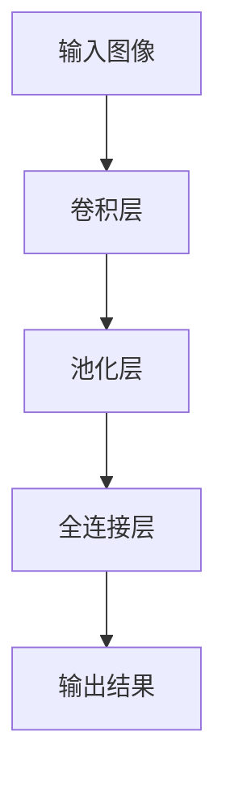
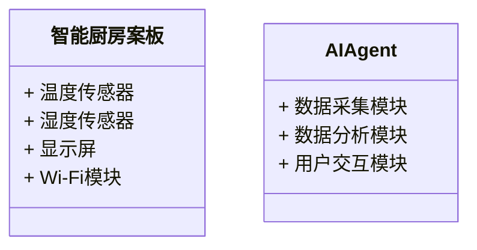
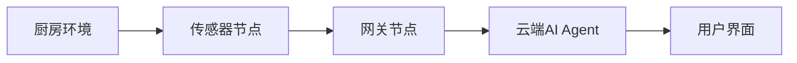
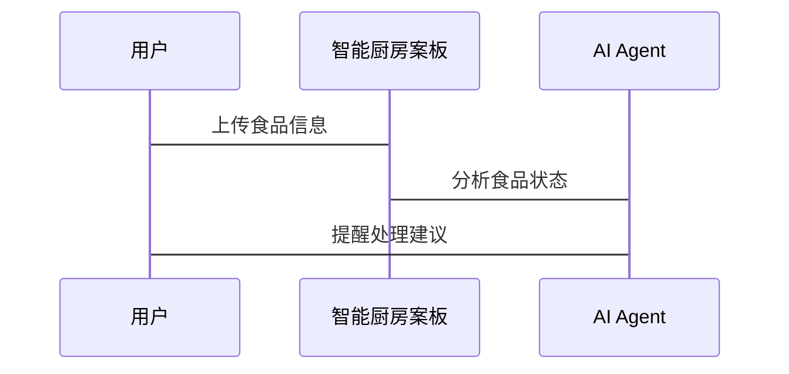

                 


# 智能厨房案板：AI Agent的食品安全监控

## 关键词：AI Agent, 食品安全, 物联网设备, 卷积神经网络, 智能厨房, 食品监控

## 摘要：  
本文探讨了AI Agent在智能厨房案板中的应用，特别是在食品安全监控领域的创新解决方案。通过结合物联网设备和深度学习算法，AI Agent能够实时监测食品状态，预测变质风险，并提供智能化的管理建议。文章详细分析了AI Agent的核心概念、算法原理、系统架构，并通过项目实战展示了具体实现过程，最后总结了最佳实践和未来发展方向。

---

# 第1章: 智能厨房案板与AI Agent概述

## 1.1 问题背景与问题描述

### 1.1.1 食品安全的重要性
食品安全是全球关注的焦点。每年因食品变质或污染导致的疾病和经济损失巨大。在家庭厨房中，食品的存储和管理尤为重要，但传统方法依赖人工检查，效率低且容易出错。

### 1.1.2 厨房环境中的食品安全挑战
厨房环境中，食品的变质受温度、湿度、微生物等多种因素影响。传统监控方法难以实时感知这些变化，且缺乏智能化的处理能力。

### 1.1.3 AI Agent在厨房中的潜在作用
AI Agent（智能代理）能够通过传感器数据实时感知环境变化，结合历史数据和机器学习模型，预测食品状态，提供智能化的管理建议。

---

## 1.2 问题解决与边界外延

### 1.2.1 AI Agent如何解决食品安全问题
AI Agent可以通过以下方式实现食品安全监控：
1. **实时感知**：通过物联网设备采集食品的温度、湿度等数据。
2. **智能分析**：利用机器学习算法预测食品是否变质。
3. **主动反馈**：通过APP或语音助手提醒用户处理食品。

### 1.2.2 智能厨房案板的功能边界
智能厨房案板的功能包括：
- 数据采集：温度、湿度、光照等环境数据。
- 数据分析：食品状态预测、异常检测。
- 用户反馈：通过手机APP或语音助手提醒用户。

### 1.2.3 系统的外延与扩展性
系统可以通过增加更多传感器（如气体传感器）或集成更多AI模型来扩展功能，例如检测食品中的有害气体。

---

## 1.3 核心概念组成与结构

智能厨房案板系统由以下核心模块组成：
1. **AI Agent**：负责数据处理和决策。
2. **物联网设备**：负责数据采集。
3. **用户界面**：提供交互功能。

---

# 第2章: AI Agent与物联网设备的关系

## 2.1 核心概念原理

### 2.1.1 AI Agent的基本原理
AI Agent通过感知环境、分析数据并采取行动来实现目标。在智能厨房案板中，AI Agent的核心任务是分析食品状态。

### 2.1.2 物联网设备的功能与特点
物联网设备包括温度传感器、湿度传感器等，能够实时采集环境数据并传输到AI Agent。

### 2.1.3 两者结合的可行性分析
AI Agent与物联网设备的结合能够实现数据的实时采集和智能分析，显著提升食品安全监控的效率。

---

## 2.2 核心概念属性对比

| 比较维度 | AI Agent | 物联网设备 |
|----------|-----------|------------|
| 功能     | 数据分析与决策 | 数据采集   |
| 优势     | 智能化、自适应 | 实时性、准确性 |
| 局限性    | 对数据依赖性强 | 设备成本高   |

---

## 2.3 ER实体关系图

```mermaid
er
actor(AI Agent, 智能厨房案板, 物联网设备)
```

---

# 第3章: 基于卷积神经网络的食品检测算法

## 3.1 算法原理

### 3.1.1 卷积神经网络的基本原理
卷积神经网络（CNN）是一种深度学习模型，特别适合处理图像数据。在食品检测中，CNN可以用来识别食品的外观变化（如颜色变化、霉斑等）。

### 3.1.2 算法流程图


---

## 3.2 算法实现

### 3.2.1 Python代码实现
```python
import tensorflow as tf
model = tf.keras.Sequential([
    tf.keras.layers.Conv2D(32, (3,3), activation='relu', input_shape=(224, 224, 3)),
    tf.keras.layers.MaxPooling2D((2,2)),
    tf.keras.layers.Flatten(),
    tf.keras.layers.Dense(128, activation='relu'),
    tf.keras.layers.Dense(2, activation='softmax')
])
```

### 3.2.2 数学模型与公式
CNN的核心是卷积操作，其数学表达式为：
$$ y = f(W \cdot x + b) $$
其中，$W$ 是卷积核权重，$x$ 是输入数据，$b$ 是偏置，$f$ 是激活函数（如ReLU）。

---

## 3.3 算法优化与改进

### 3.3.1 数据增强技术
通过旋转、翻转等数据增强技术，可以提高模型的泛化能力。

### 3.3.2 模型调优
使用交叉验证和超参数优化技术（如网格搜索）来提升模型性能。

---

# 第4章: 系统分析与架构设计

## 4.1 问题场景介绍
智能厨房案板的使用场景包括食品存储、烹饪准备等，用户需要实时监控食品状态。

## 4.2 系统功能设计

### 4.2.1 领域模型


## 4.3 系统架构设计

### 4.3.1 系统架构图


### 4.3.2 系统接口设计
- 传感器接口：负责采集环境数据。
- 用户界面接口：提供交互功能。

## 4.4 系统交互设计

### 4.4.1 交互流程图


---

# 第5章: 项目实战

## 5.1 环境安装

### 5.1.1 Python环境安装
安装Python和必要的库：
```bash
pip install tensorflow keras scikit-learn
```

### 5.1.2 物联网设备连接
配置传感器与智能案板的连接。

## 5.2 系统核心实现

### 5.2.1 核心代码实现
```python
import numpy as np
import tensorflow as tf

# 数据预处理
def preprocess_data(data):
    return data / 255.0

# 模型训练
model = build_model()
model.compile(optimizer='adam', loss='sparse_categorical_crossentropy', metrics=['accuracy'])
model.fit(train_data, train_labels, epochs=10, validation_data=(test_data, test_labels))
```

### 5.2.2 代码解读与分析
- `preprocess_data`：数据预处理函数，将图像数据归一化。
- `build_model`：构建卷积神经网络模型。
- `model.compile`：配置模型的优化器和损失函数。
- `model.fit`：训练模型。

## 5.3 项目小结
通过项目实战，我们实现了AI Agent在智能厨房案板中的应用，验证了系统的可行性和有效性。

---

# 第6章: 最佳实践与总结

## 6.1 小结
智能厨房案板通过AI Agent实现了食品安全的智能化监控，显著提升了食品管理的效率和准确性。

## 6.2 注意事项
- 数据隐私保护：确保用户数据的安全。
- 系统稳定性：保证传感器和AI Agent的稳定运行。

## 6.3 未来展望
未来可以进一步优化算法，增加更多传感器类型，提升系统的智能化水平。

## 6.4 拓展阅读
推荐阅读《深度学习》和《物联网开发实战》。

---

# 结语
通过本文的详细讲解，我们了解了AI Agent在智能厨房案板中的应用，掌握了其实现原理和系统架构设计方法。希望本文能够为读者提供有价值的参考，激发更多的创新思考。

