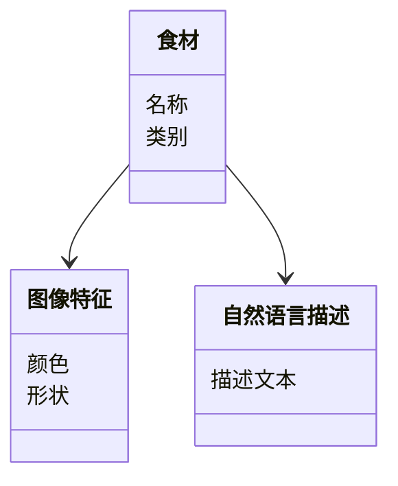
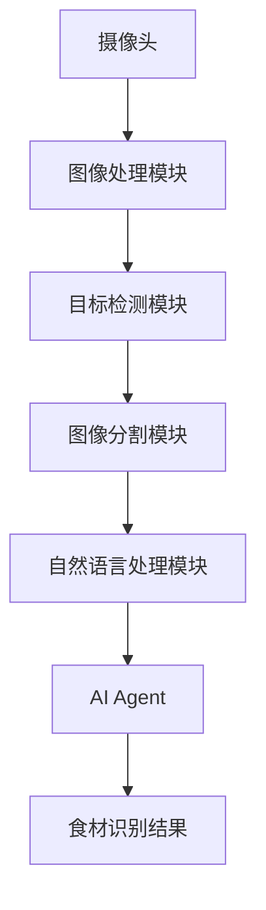
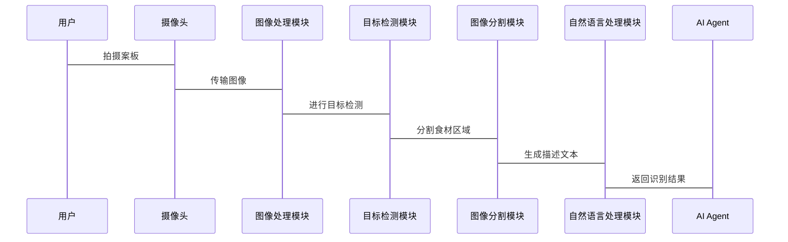

                 


# 智能厨房案板：AI Agent的食材识别系统

> 关键词：AI Agent，食材识别，图像识别，自然语言处理，智能厨房

> 摘要：本文介绍了一种基于AI Agent的食材识别系统，该系统通过图像识别和自然语言处理技术，实现厨房案板上食材的自动识别与管理。文章详细分析了系统的背景、核心概念、算法原理、系统架构，并通过实际案例展示了系统的实现与应用。

---

# 第1章 智能厨房案板与AI Agent的背景介绍

## 1.1 问题背景与问题描述

现代厨房中，食材的管理和分类常常面临以下痛点：
- 食材种类繁多，难以快速识别。
- 手动记录食材信息效率低下。
- 厨房环境中光线复杂，食材摆放不规则，增加了识别难度。

AI Agent（人工智能代理）作为一种能够感知环境、自主决策的智能体，非常适合解决厨房场景中的食材识别问题。

---

## 1.2 问题解决与边界定义

### 1.2.1 系统目标
- 实现厨房案板上食材的自动识别。
- 提供食材信息的结构化描述。
- 支持与厨房设备的协同工作。

### 1.2.2 边界与外延
- 仅处理案板上的食材，不涉及厨房其他区域。
- 支持常见食材的识别，暂不考虑特殊食材。

---

## 1.3 概念结构与核心要素

### 1.3.1 核心概念框架
- **食材**：需要识别的物体，如蔬菜、水果、肉类等。
- **图像特征**：食材的颜色、形状、纹理等。
- **自然语言描述**：食材的名称、属性等文本信息。
- **AI Agent**：实现食材识别的智能体。

### 1.3.2 Mermaid实体关系图
```mermaid
graph TD
食材 --> 图像特征
图像特征 --> 自然语言描述
自然语言描述 --> AI Agent
AI Agent --> 食材识别结果
```

---

# 第2章 核心概念与技术原理

## 2.1 AI Agent的基本原理

### 2.1.1 定义与分类
- **AI Agent**：一种能够感知环境、自主决策的智能体。
- 分为**简单反射型**、**基于模型的反应型**和**基于目标的**AI Agent。

### 2.1.2 核心技术特征
- **感知能力**：通过摄像头、传感器等获取环境信息。
- **决策能力**：基于感知信息做出识别决策。
- **学习能力**：通过训练优化识别模型。

---

## 2.2 食材识别系统的原理

### 2.2.1 基本流程
1. **图像采集**：通过摄像头获取案板上的食材图像。
2. **图像预处理**：调整图像亮度、对比度等。
3. **目标检测**：识别图像中的食材位置。
4. **图像分割**：分割出食材区域。
5. **特征提取**：提取食材的视觉特征。
6. **分类识别**：基于特征进行食材分类。

---

## 2.3 图像识别与自然语言处理的结合

### 2.3.1 图像识别技术
- **目标检测**：用于定位食材的位置。
- **图像分割**：用于提取食材的区域。

### 2.3.2 自然语言处理
- 用于生成食材的描述文本，如“新鲜的苹果”、“熟透的香蕉”。

---

## 2.4 核心概念对比分析

### 2.4.1 技术对比表格
| 技术 | 优点 | 缺点 |
|------|------|------|
| 目标检测 | 高精度 | 无法分割食材区域 |
| 图像分割 | 高精度 | 计算复杂度高 |

---

# 第3章 算法原理与实现

## 3.1 目标检测算法原理

### 3.1.1 YOLO算法
- **YOLOv3**：基于卷积神经网络的目标检测算法。
- **实现流程**：
  1. 输入图像经过特征提取网络。
  2. 生成候选框。
  3. 预测每个候选框的类别和位置。

### 3.1.2 代码实现
```python
def yolo_detect(image):
    # YOLO检测食材目标
    boxes, labels = model.predict(image)
    return boxes, labels
```

---

## 3.2 图像分割算法原理

### 3.2.1 U-Net网络结构
- **U-Net**：经典的图像分割网络。
- **实现流程**：
  1. 输入图像经过编码器提取特征。
  2. 解码器逐步恢复图像。
  3. 输出分割结果。

### 3.2.2 代码实现
```python
def unet_segment(image):
    # U-Net图像分割
    features = encoder(image)
    outputs = decoder(features)
    return outputs
```

---

## 3.3 AI Agent的算法实现

### 3.3.1 决策逻辑
1. 通过目标检测定位食材。
2. 通过图像分割提取食材区域。
3. 结合自然语言处理生成描述。

---

## 3.4 数学模型与公式

### 3.4.1 损失函数
$$ \text{损失函数} = \text{分类损失} + \text{定位损失} $$

---

# 第4章 系统分析与架构设计

## 4.1 问题场景介绍

- **目标**：实现厨房案板上的食材识别。
- **场景**：用户将食材放在案板上，系统自动识别并记录。

---

## 4.2 项目介绍

- **项目目标**：实现AI Agent驱动的食材识别系统。
- **项目范围**：仅限于案板上的食材识别。

---

## 4.3 系统功能设计

### 4.3.1 领域模型


---

## 4.4 系统架构设计

### 4.4.1 总体架构


---

## 4.5 系统接口设计

- **输入接口**：摄像头图像。
- **输出接口**：食材识别结果。

---

## 4.6 系统交互流程

### 4.6.1 序列图


---

# 第5章 项目实战

## 5.1 环境安装

- **Python 3.8+**
- **TensorFlow 2.0+**
- **OpenCV**

---

## 5.2 系统核心实现

### 5.2.1 目标检测代码
```python
import tensorflow as tf
from tensorflow.keras.models import Model
from tensorflow.keras.layers import Input, Conv2D, MaxPooling2D

def build_model():
    inputs = Input(shape=(224, 224, 3))
    x = Conv2D(32, (3,3), activation='relu')(inputs)
    x = MaxPooling2D((2,2))(x)
    model = Model(inputs=inputs, outputs=x)
    return model
```

---

## 5.3 代码应用与分析

- **代码功能**：实现食材的图像分割。
- **性能分析**：分析代码的运行效率和识别准确率。

---

## 5.4 实际案例分析

- **案例**：识别案板上的苹果和香蕉。
- **分析**：通过图像分割和自然语言处理生成描述。

---

## 5.5 项目小结

- **总结**：系统实现了AI Agent驱动的食材识别。
- **优化建议**：优化算法性能，增加更多食材类别。

---

# 第6章 最佳实践

## 6.1 小结

- **核心内容**：AI Agent在厨房场景中的应用。
- **关键点**：图像识别与自然语言处理的结合。

---

## 6.2 注意事项

- **光线条件**：确保摄像头的光线充足。
- **模型训练**：需要大量标注数据。

---

## 6.3 拓展阅读

- **推荐书籍**：《Deep Learning》
- **推荐论文**：YOLO系列论文

---

# 结语

通过本文的详细讲解，读者可以了解基于AI Agent的食材识别系统的核心原理和实现方法。未来，随着技术的进步，AI Agent在厨房中的应用将更加广泛。

---

