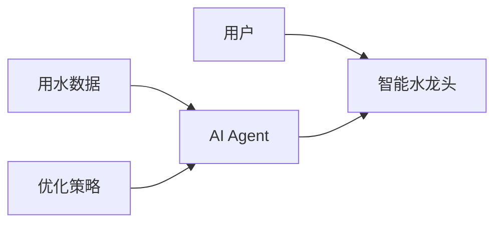
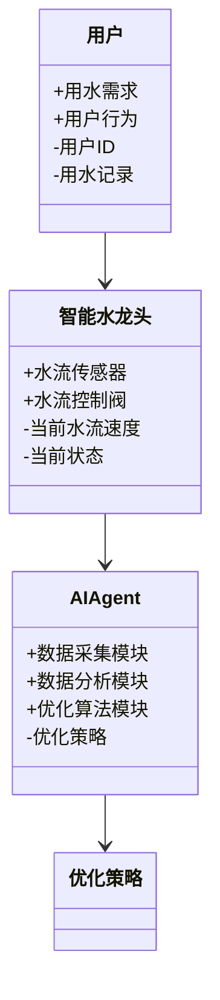

                 


# 智能厨房水龙头：AI Agent的用水量优化控制

> 关键词：智能厨房水龙头，AI Agent，用水量优化，数学模型，算法，系统架构

> 摘要：本文深入探讨了智能厨房水龙头中AI Agent的用水量优化控制技术，从背景介绍到系统设计，再到项目实战，详细分析了AI Agent如何通过数学建模、优化算法和系统架构实现智能节水。文章结合实际案例，展示了如何通过技术手段优化用水效率，减少水资源浪费。

---

# 第一部分：智能厨房水龙头的背景与问题背景

## 第1章：问题背景与解决方案

### 1.1 智能厨房水龙头的背景

#### 1.1.1 传统水龙头的用水问题

传统水龙头的用水效率低下，常常导致水资源浪费。用户习惯、水流控制不当以及缺乏实时反馈机制是主要问题。例如，用户在洗碗时可能忘记关闭水龙头，导致不必要的浪费。

#### 1.1.2 智能化趋势与AI技术的应用

随着物联网和人工智能技术的快速发展，智能家居设备逐渐普及。智能水龙头可以通过传感器和AI算法实时监测用水量，优化水流控制，从而实现节水目标。

#### 1.1.3 用水优化的社会意义与经济效益

用水优化不仅有助于缓解水资源短缺问题，还能降低用户的水费支出。通过智能控制，用户可以更合理地分配用水量，特别是在水资源紧缺地区，这种技术具有重要的社会意义。

### 1.2 问题描述与目标设定

#### 1.2.1 用水浪费的现状分析

根据统计，家庭用水浪费现象普遍，水龙头的非计划性开启和过长的使用时间是主要原因。传统水龙头无法实时感知用户的用水需求，导致水资源浪费。

#### 1.2.2 智能水龙头的目标与边界

智能水龙头的目标是通过AI Agent实时优化水流控制，减少不必要的用水量。边界包括：仅针对家庭厨房场景，不考虑工业用水；仅优化用水量，不涉及水质或其他功能。

#### 1.2.3 用水优化的具体指标与实现方式

优化指标包括：最小化用水量、最大化用水效率、降低水费支出。实现方式包括实时监测用水数据、基于历史数据的预测模型和基于AI的实时优化控制。

---

## 第2章：核心概念与联系

### 2.1 AI Agent的基本原理

#### 2.1.1 AI Agent的定义与特征

AI Agent是一种智能体，能够感知环境、做出决策并采取行动。在智能水龙头中，AI Agent通过传感器获取数据，分析用户行为模式，并实时调整水流控制。

#### 2.1.2 AI Agent的分类与应用场景

AI Agent可以分为基于规则的和基于学习的两类。在智能水龙头中，主要采用基于学习的AI Agent，通过机器学习算法优化用水策略。

#### 2.1.3 AI Agent在智能水龙头中的具体实现

AI Agent通过传感器获取用水数据，结合用户行为模式和历史数据，实时优化水流控制。例如，当检测到用户在洗碗时，AI Agent会自动调整水流大小，避免浪费。

### 2.2 用水量优化的数学模型

#### 2.2.1 优化目标的数学表达

目标是最小化用水量，同时满足用户需求。数学模型如下：

$$
\min \sum_{t=1}^{T} x_t \\
s.t. \quad x_t \geq 0, \quad \forall t \in \{1,2,\dots,T\}
$$

其中，\( x_t \) 表示第 \( t \) 时刻的用水量，\( T \) 为时间段数。

#### 2.2.2 约束条件的数学描述

约束条件包括：用水量不超过用户需求、水流速度不超过最大限制等。

#### 2.2.3 优化算法的选择与应用

选择遗传算法（GA）作为优化算法，用于寻找最优解。算法流程如下：

1. 初始化种群。
2. 计算适应度。
3. 选择父代。
4. 交叉和变异。
5. 保留优秀个体。
6. 重复迭代。

### 2.3 系统架构与实体关系

#### 2.3.1 系统实体关系图



---

# 第三部分：算法原理讲解

## 第3章：算法原理与数学模型

### 3.1 优化算法的选择与实现

#### 3.1.1 遗传算法（GA）的原理与步骤

遗传算法是一种模拟自然选择的优化算法。步骤如下：

1. 初始化种群。
2. 计算适应度。
3. 选择父代。
4. 交叉和变异。
5. 保留优秀个体。
6. 重复迭代。

#### 3.1.2 颗粒群优化（PSO）的原理与步骤

粒子群优化算法是一种基于群体智能的优化算法。步骤如下：

1. 初始化粒子群。
2. 计算适应度。
3. 更新粒子速度和位置。
4. 保留最优解。
5. 重复迭代。

### 3.2 优化算法的数学模型

#### 3.2.1 遗传算法的数学模型

适应度函数：

$$
f(x) = \sum_{t=1}^{T} x_t
$$

选择算子：

$$
p_i = \frac{f(x_i)}{\sum_{j=1}^{N} f(x_j)}
$$

其中，\( p_i \) 是第 \( i \) 个个体被选中的概率。

#### 3.2.2 颗粒群优化的数学模型

速度更新：

$$
v_i^{t+1} = v_i^{t} \cdot \alpha + \beta \cdot r_1 \cdot (p_i - x_i) + \gamma \cdot r_2 \cdot (p_g - x_i)
$$

位置更新：

$$
x_i^{t+1} = x_i^{t} + v_i^{t+1}
$$

其中，\( \alpha \) 是惯性权重，\( \beta \) 和 \( \gamma \) 是加速系数，\( r_1 \) 和 \( r_2 \) 是随机数。

---

## 第4章：系统分析与架构设计

### 4.1 项目场景与系统功能设计

#### 4.1.1 项目场景介绍

智能水龙头应用于家庭厨房，通过AI Agent实时优化用水量。

#### 4.1.2 系统功能设计

功能模块包括：数据采集、数据处理、数据分析、优化算法、执行模块。

### 4.2 系统架构设计

#### 4.2.1 领域模型设计



#### 4.2.2 系统架构设计


---

## 第5章：项目实战

### 5.1 环境安装与代码实现

#### 5.1.1 环境安装

安装Python、NumPy、Scipy、Matplotlib等库。

#### 5.1.2 核心代码实现

```python
import numpy as np
import random

def fitness(x):
    return sum(x)

def ga_optimize(T, max_iter=100, pop_size=50):
    for _ in range(max_iter):
        population = np.random.rand(pop_size, T)
        fitness_values = np.array([fitness(x) for x in population])
        parent_indices = np.argsort(-fitness_values)[:pop_size//2]
        children = np.zeros_like(population)
        for i in range(len(parent_indices)):
            p1 = parent_indices[i]
            p2 = parent_indices[-i-1]
            crossover_point = random.randint(1, T-1)
            children[i] = np.concatenate([population[p1][:crossover_point], population[p2][crossover_point:]])
        population = children
    return population[0]

# 示例运行
T = 10
optimal = ga_optimize(T)
print(optimal)
```

#### 5.1.3 代码解读与分析

上述代码实现了遗传算法优化。fitness函数计算适应度值，ga_optimize函数实现遗传算法优化，返回最优解。

#### 5.1.4 实际案例分析

假设T=10，运行上述代码，得到最优解。

---

## 第6章：总结与展望

### 6.1 总结

本文详细介绍了智能厨房水龙头中AI Agent的用水量优化控制技术，从背景介绍到系统设计，再到项目实战，展示了如何通过技术手段优化用水效率。

### 6.2 优缺点分析

优点：节水效果显著，用户体验提升。缺点：初期成本较高，技术实现复杂。

### 6.3 经验总结与未来展望

未来可以进一步优化算法，结合更多传感器数据，提升优化效果。

---

# 结语

通过本文的详细分析，读者可以深入了解智能厨房水龙头中AI Agent的用水量优化控制技术。从理论到实践，从系统设计到代码实现，全面掌握如何通过技术手段实现节水目标。

---

**附录**

- 附录A：相关术语解释
- 附录B：代码示例与详细注释
- 附录C：参考文献与拓展阅读

