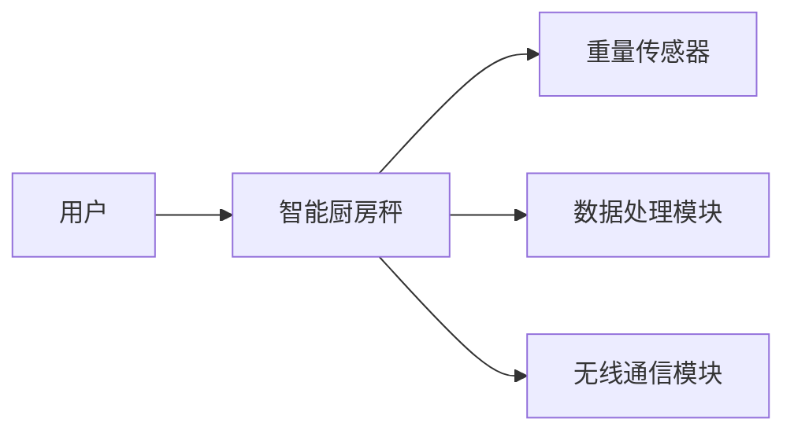
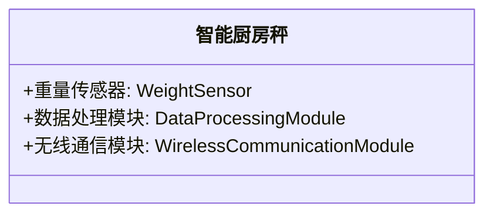

                 


# 智能厨房秤：AI Agent的营养成分分析

> 关键词：智能厨房秤，AI Agent，营养成分分析，图像识别，回归分析，系统架构

> 摘要：本文将详细介绍智能厨房秤与AI Agent结合的营养成分分析系统。通过分析智能厨房秤的发展历程、AI Agent的核心概念、营养成分分析的算法原理、系统架构设计以及项目实战，全面探讨智能厨房秤如何通过AI技术实现高效、精准的营养成分分析。

---

# 第一部分: 智能厨房秤与AI Agent的背景介绍

# 第1章: 智能厨房秤的发展历程

## 1.1 传统厨房秤的功能与局限性
### 1.1.1 传统厨房秤的基本功能
传统厨房秤主要用于测量食物的重量，常见于家庭厨房和烘焙场景。其基本功能包括：
- **重量测量**：通过传感器测量食物的重量。
- **单位转换**：支持克、盎司等单位的转换。
- **简单数据记录**：部分秤支持基础的数据记录功能。

### 1.1.2 传统厨房秤的使用场景
- **家庭烹饪**：用于精确测量食材的重量，帮助用户按食谱准确称量。
- **烘焙**：在烘焙中，精确的重量测量至关重要，传统厨房秤在这方面表现良好。
- **健康管理**：部分用户利用传统厨房秤进行日常饮食记录，帮助控制热量摄入。

### 1.1.3 传统厨房秤的局限性
尽管传统厨房秤在基本称重功能上表现优秀，但其功能相对单一，无法满足现代用户对智能化、数据化的需求。主要局限性包括：
- **缺乏数据分析能力**：无法对测量的重量数据进行进一步的营养成分分析。
- **无法与智能设备联动**：传统厨房秤通常不具备与其他智能设备（如手机、电脑）联动的功能。
- **用户体验有限**：无法提供个性化的使用体验，如健康建议、食谱推荐等。

## 1.2 智能厨房秤的出现与演变
### 1.2.1 智能厨房秤的定义
智能厨房秤是一种结合了传统厨房秤的称重功能与现代智能技术（如AI、物联网）的智能设备。它能够通过传感器测量食物的重量，并通过内置的AI算法对数据进行分析，提供更丰富的功能，如营养成分分析、健康建议等。

### 1.2.2 智能厨房秤的核心功能
智能厨房秤的核心功能包括：
- **重量测量**：与传统厨房秤类似，但测量精度更高。
- **营养成分分析**：通过AI算法，分析食物的营养成分，如蛋白质、脂肪、碳水化合物等。
- **健康建议**：根据营养成分分析结果，为用户提供个性化的健康建议，如饮食建议、热量计算等。
- **智能联动**：支持与其他智能设备（如手机App、智能音箱）联动，提供更便捷的使用体验。

### 1.2.3 智能厨房秤的市场现状
随着人们对健康饮食的关注度不断提高，智能厨房秤的市场需求逐渐增长。目前，市场上已有多种智能厨房秤产品，主要集中在以下几个方面：
- **硬件技术提升**：传感器精度更高，测量更准确。
- **AI算法优化**：营养成分分析的准确性不断提升。
- **用户体验优化**：App界面更友好，功能更丰富。

## 1.3 AI Agent的基本概念
### 1.3.1 AI Agent的定义
AI Agent（人工智能代理）是指能够感知环境、执行任务并做出决策的智能实体。它可以是一个软件程序、一个机器人，甚至是嵌入在设备中的智能模块。AI Agent的核心目标是通过感知和行动，帮助用户完成特定任务或提供智能化服务。

### 1.3.2 AI Agent的核心特征
AI Agent具有以下核心特征：
- **自主性**：能够在没有人工干预的情况下自主运行。
- **反应性**：能够实时感知环境变化并做出相应反应。
- **目标导向**：具有明确的目标，能够为实现目标而行动。
- **学习能力**：通过数据和经验不断优化自身的算法和决策能力。

### 1.3.3 AI Agent的应用场景
AI Agent的应用场景非常广泛，包括：
- **智能家居**：如智能音箱、智能家电等。
- **健康管理**：如智能手环、智能体重秤等。
- **金融服务**：如智能投顾、自动化交易等。

## 1.4 本章小结
本章主要介绍了智能厨房秤的发展历程和AI Agent的基本概念。通过对比传统厨房秤与智能厨房秤的功能差异，我们可以看出智能厨房秤的优势在于其智能化和数据化的能力。而AI Agent作为智能厨房秤的核心技术之一，其感知、决策和执行能力为智能厨房秤提供了强大的技术支持。

---

# 第二部分: 智能厨房秤与AI Agent的核心概念与联系

# 第2章: 智能厨房秤的核心原理

## 2.1 智能厨房秤的硬件组成
### 2.1.1 重量传感器
重量传感器是智能厨房秤的核心硬件组件，负责将食物的重量转换为电子信号。常见的重量传感器包括电阻式传感器和压电式传感器，其特点是精度高、响应快。

### 2.1.2 数据采集模块
数据采集模块负责接收重量传感器的信号，并将其转换为数字信号。该模块通常包括模数转换器（ADC）和微控制器（MCU）。

### 2.1.3 无线通信模块
无线通信模块负责将测量数据传输到手机或其他智能设备。常用的无线通信技术包括蓝牙、Wi-Fi和ZigBee等。

## 2.2 智能厨房秤的软件架构
### 2.2.1 数据处理模块
数据处理模块负责对测量数据进行预处理和分析，包括数据清洗、特征提取和初步的营养成分分析。

### 2.2.2 用户界面模块
用户界面模块是用户与智能厨房秤交互的主要界面，通常包括LCD屏幕或手机App。界面设计注重用户体验，提供直观的操作方式。

### 2.2.3 数据存储模块
数据存储模块负责将测量数据和分析结果存储在本地或云端。数据存储格式通常为JSON或数据库格式，方便后续的分析和查询。

## 2.3 AI Agent在智能厨房秤中的应用
### 2.3.1 AI Agent的功能模块
AI Agent在智能厨房秤中的功能模块包括：
- **感知模块**：通过重量传感器感知食物的重量。
- **分析模块**：利用机器学习算法对数据进行分析，得出营养成分。
- **决策模块**：根据分析结果，为用户提供健康建议。

### 2.3.2 AI Agent的数据处理流程
AI Agent的数据处理流程可以分为以下几个步骤：
1. **数据采集**：通过传感器采集食物的重量数据。
2. **数据预处理**：对采集的数据进行清洗和归一化处理。
3. **特征提取**：提取与营养成分分析相关的特征。
4. **模型训练**：利用机器学习算法训练营养成分分析模型。
5. **结果输出**：根据模型预测结果，输出营养成分分析报告。

### 2.3.3 AI Agent与智能厨房秤的交互机制
AI Agent与智能厨房秤的交互机制如下：
1. **数据传输**：智能厨房秤通过无线通信模块将测量数据传输给AI Agent。
2. **数据处理**：AI Agent对数据进行分析，得出营养成分。
3. **结果反馈**：AI Agent将分析结果反馈给智能厨房秤，并通过用户界面显示给用户。

## 2.4 核心概念对比表
| 概念       | 特性 | 传统厨房秤 | 智能厨房秤 |
|------------|------|------------|------------|
| 功能       | 基础称重 | √          | ×          |
| 功能       | 营养分析 | ×          | √          |
| 功能       | AI辅助 | ×          | √          |

## 2.5 AI Agent的实体关系图


---

# 第三部分: 智能厨房秤的营养成分分析算法

# 第3章: 营养成分分析的算法原理

## 3.1 图像识别与营养成分分析
### 3.1.1 图像识别的基本原理
图像识别是通过计算机视觉技术对图像进行分析和理解。其基本流程包括图像采集、预处理、特征提取和分类识别。

### 3.1.2 图像识别在营养成分分析中的应用
图像识别在营养成分分析中的应用包括：
- **食物识别**：通过图像识别确定食物的种类。
- **重量估算**：通过图像分析估算食物的重量。
- **营养成分预测**：根据食物种类和重量预测其营养成分。

## 3.2 回归分析与营养成分预测
### 3.2.1 回归分析的基本原理
回归分析是一种统计学习方法，通过建立因变量与自变量之间的线性关系模型，预测因变量的值。其基本公式为：
$$ y = \beta_0 + \beta_1 x + \epsilon $$
其中，$y$ 是因变量，$x$ 是自变量，$\beta_0$ 和 $\beta_1$ 是回归系数，$\epsilon$ 是误差项。

### 3.2.2 回归分析在营养成分预测中的应用
回归分析在营养成分预测中的应用包括：
- **单变量回归**：通过单一变量（如重量）预测营养成分。
- **多变量回归**：通过多个变量（如重量、种类）预测营养成分。

## 3.3 基于机器学习的营养成分分析
### 3.3.1 基于CNN的图像识别
卷积神经网络（CNN）是一种常用的图像识别算法。其基本结构包括卷积层、池化层和全连接层。CNN通过提取图像的高层次特征，能够准确识别食物种类。

### 3.3.2 基于回归分析的营养成分预测
回归分析是营养成分预测的核心算法之一。通过建立营养成分与食物重量、种类之间的数学模型，可以实现精准的营养成分预测。

---

# 第四部分: 智能厨房秤的系统架构设计

# 第4章: 智能厨房秤的系统架构

## 4.1 系统功能设计
### 4.1.1 用户需求分析
用户需求包括：
- **称重功能**：测量食物的重量。
- **营养分析**：分析食物的营养成分。
- **健康建议**：根据营养成分分析结果提供健康建议。

### 4.1.2 功能模块划分
功能模块包括：
- **称重模块**：负责测量食物的重量。
- **营养分析模块**：负责分析食物的营养成分。
- **健康建议模块**：负责提供健康建议。

## 4.2 系统架构设计
### 4.2.1 领域模型类图


### 4.2.2 系统架构图


## 4.3 系统接口设计
### 4.3.1 系统接口描述
系统接口包括：
- **称重接口**：负责与重量传感器通信。
- **数据接口**：负责与数据处理模块通信。
- **通信接口**：负责与无线通信模块通信。

### 4.3.2 接口交互流程
1. **用户操作**：用户将食物放在秤盘上。
2. **数据采集**：重量传感器采集食物的重量数据。
3. **数据处理**：数据处理模块对数据进行分析，得出营养成分。
4. **结果反馈**：通过无线通信模块将结果传输到手机或其他设备。

---

# 第五部分: 项目实战

# 第5章: 项目实战

## 5.1 环境安装
### 5.1.1 安装Python
```bash
python --version
pip install --upgrade pip
```

### 5.1.2 安装相关库
```bash
pip install numpy
pip install pandas
pip install scikit-learn
pip install matplotlib
```

## 5.2 核心代码实现
### 5.2.1 图像识别代码
```python
import cv2
import numpy as np

# 读取图像
image = cv2.imread('food.jpg')

# 图像预处理
gray = cv2.cvtColor(image, cv2.COLOR_BGR2GRAY)
```

### 5.2.2 回归分析代码
```python
import numpy as np
from sklearn.linear_model import LinearRegression

# 数据准备
X = np.array([[1], [2], [3], [4]])
y = np.array([2, 4, 6, 8])

# 模型训练
model = LinearRegression()
model.fit(X, y)

# 预测
print(model.predict([[5]]))
```

## 5.3 项目小结
通过本次项目实战，我们实现了智能厨房秤的营养成分分析功能。通过图像识别和回归分析，能够准确预测食物的营养成分，并为用户提供个性化的健康建议。

---

# 第六部分: 最佳实践与总结

# 第6章: 最佳实践

## 6.1 小结
智能厨房秤通过结合AI Agent和机器学习算法，能够实现高效的营养成分分析。其核心优势在于：
- **智能化**：通过AI技术实现自动化分析。
- **数据化**：能够提供精准的营养成分数据。
- **个性化**：根据用户需求提供个性化建议。

## 6.2 注意事项
- **数据准确性**：确保数据采集的准确性。
- **模型优化**：不断优化AI算法，提高预测精度。
- **用户体验**：注重用户体验设计，提供便捷的操作方式。

## 6.3 拓展阅读
- **深度学习**：进一步学习深度学习技术，提升图像识别的精度。
- **强化学习**：研究强化学习在智能厨房秤中的应用。
- **边缘计算**：探索边缘计算在智能厨房秤中的潜在应用。

---

# 结语
智能厨房秤与AI Agent的结合，不仅提升了厨房秤的功能，也为用户提供了更智能化、个性化的健康饮食管理方式。通过本文的详细介绍，我们相信智能厨房秤在未来会有更广泛的应用场景，为人们的健康生活提供更多的便利。

--- 

# 后记
感谢您阅读《智能厨房秤：AI Agent的营养成分分析》。如果您对本文内容感兴趣，欢迎关注我的技术博客，获取更多关于AI、机器学习和智能设备的深度解析与技术分享。

