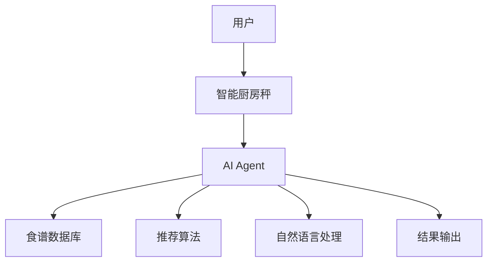
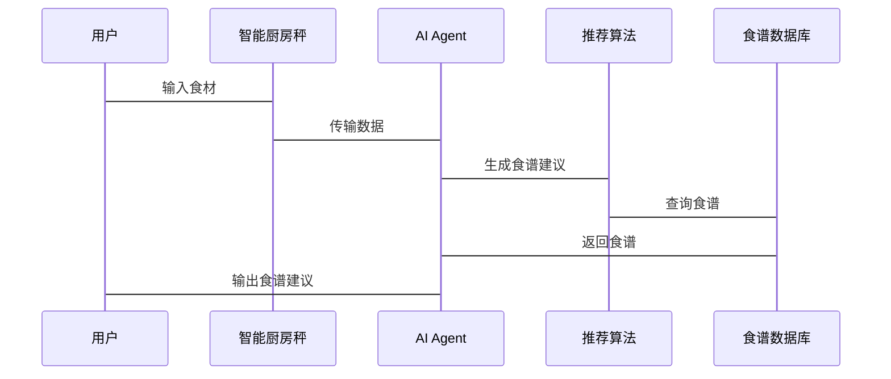

                 


# 智能厨房秤：AI Agent的食谱创新助手

## 关键词：
智能厨房秤, AI Agent, 食谱创新, 自然语言处理, 推荐算法, 系统架构

## 摘要：
智能厨房秤与AI Agent的结合为烹饪过程带来了智能化和个性化的革命。本文深入探讨了智能厨房秤的核心功能、AI Agent的工作原理，以及它们如何协同工作以创新食谱。通过自然语言处理和推荐算法，AI Agent能够根据用户需求生成个性化食谱建议。本文还详细分析了系统的架构设计、算法实现和实际应用场景，为读者提供了一套完整的解决方案。

---

## 第1章：智能厨房秤与AI Agent的背景介绍

### 1.1 智能厨房秤的定义与功能
智能厨房秤是一种结合了传感器和AI技术的智能设备，主要用于测量食材重量并提供烹饪建议。其主要功能包括：
- 实时重量测量
- 食谱推荐
- 营养分析
- 烹饪指导

### 1.2 AI Agent的定义与作用
AI Agent（智能代理）是一种能够感知环境并执行任务的智能系统。在智能厨房秤中，AI Agent的主要作用包括：
- 数据分析
- 食谱生成
- 用户交互

### 1.3 智能厨房秤与AI Agent的结合
智能厨房秤与AI Agent的结合使得烹饪过程更加智能化。AI Agent通过分析食材重量和用户偏好，生成个性化的食谱建议。这种结合不仅提升了烹饪效率，还让用户能够轻松尝试新的食谱。

---

## 第2章：智能厨房秤与AI Agent的核心概念

### 2.1 智能厨房秤的核心原理
智能厨房秤通过重量传感器采集食材重量，并将数据传输给AI Agent进行处理。AI Agent利用自然语言处理和推荐算法，生成食谱建议。

#### 2.1.1 数据采集与预处理
- 数据采集：智能厨房秤通过传感器获取食材重量。
- 数据预处理：对采集的数据进行清洗和标准化处理。

#### 2.1.2 数据分析与处理
- 数据分析：AI Agent对食材重量进行分析，生成用户可能感兴趣的食谱建议。

### 2.2 AI Agent的算法原理
AI Agent的核心算法包括自然语言处理和推荐算法。

#### 2.2.1 自然语言处理
自然语言处理用于理解和生成食谱描述。常用的模型包括Word2Vec和Transformer。

#### 2.2.2 推荐算法
推荐算法用于根据用户偏好生成食谱建议。常用的算法包括协同过滤和基于内容的推荐。

---

## 第3章：自然语言处理算法

### 3.1 自然语言处理的基本概念
自然语言处理（NLP）是研究如何让计算机理解和生成人类语言的学科。在智能厨房秤中，NLP用于解析食谱描述。

#### 3.1.1 词嵌入
词嵌入是一种将单词转换为向量的方法。常用的模型包括Word2Vec和GloVe。

#### 3.1.2 语言模型
语言模型用于生成连贯的食谱描述。常用的模型包括RNN和Transformer。

### 3.2 基于Transformer的食谱生成
基于Transformer的模型在食谱生成中表现出色。

#### 3.2.1 Transformer模型
Transformer模型由编码器和解码器组成。编码器用于理解输入，解码器用于生成输出。

#### 3.2.2 注意力机制
注意力机制用于捕捉输入中的重要部分。在食谱生成中，注意力机制可以帮助模型关注关键食材。

---

## 第4章：系统分析与架构设计

### 4.1 系统功能设计
智能厨房秤AI Agent系统的主要功能包括：
- 数据采集
- 数据处理
- 食谱生成
- 用户交互

### 4.2 系统架构图
以下是系统的架构图：



### 4.3 系统接口设计
系统接口包括：
- 智能厨房秤与AI Agent的通信接口
- AI Agent与食谱数据库的接口
- AI Agent与推荐算法的接口

### 4.4 系统交互流程图
以下是系统的交互流程图：



---

## 第5章：项目实战

### 5.1 环境安装
要运行智能厨房秤AI Agent系统，需要安装以下环境：
- Python 3.8+
- PyTorch
- Transformers库
- Mermaid工具

### 5.2 核心代码实现
以下是AI Agent的核心代码：

```python
import torch
from transformers import AutoTokenizer, AutoModelForSeq2Seq
import numpy as np

class AIAgent:
    def __init__(self):
        self.tokenizer = AutoTokenizer.from_pretrained('t5-base')
        self.model = AutoModelForSeq2Seq.from_pretrained('t5-base')

    def generate_recipe(self, input_weight):
        input_ids = self.tokenizer.encode(input_weight, return_tensors='pt')
        outputs = self.model.generate(input_ids, max_length=100)
        return self.tokenizer.decode(outputs[0], skip_special_tokens=True)

# 示例使用
agent = AIAgent()
recipe = agent.generate_recipe("200g 鸡肉")
print(recipe)
```

### 5.3 案例分析
假设用户输入200g鸡肉，AI Agent会生成以下食谱建议：
- 食材：200g鸡肉、适量的盐、胡椒粉、橄榄油
- 步骤：将鸡肉切块，用盐和胡椒粉腌制10分钟，煎熟即可。

---

## 第6章：最佳实践与总结

### 6.1 最佳实践
- 定期更新食谱数据库
- 优化推荐算法以提高准确性
- 提供多语言支持以扩大用户群体

### 6.2 小结
智能厨房秤与AI Agent的结合为烹饪过程带来了智能化和个性化的提升。通过自然语言处理和推荐算法，AI Agent能够生成个性化的食谱建议，帮助用户轻松完成烹饪。

### 6.3 注意事项
- 确保数据安全
- 提供用户友好的交互界面
- 定期维护系统以保持性能

### 6.4 拓展阅读
- 《深度学习入门》
- 《自然语言处理实战》
- 《推荐系统算法与实践》

---

以上是《智能厨房秤：AI Agent的食谱创新助手》的完整目录大纲和正文内容，希望对您有所帮助！

