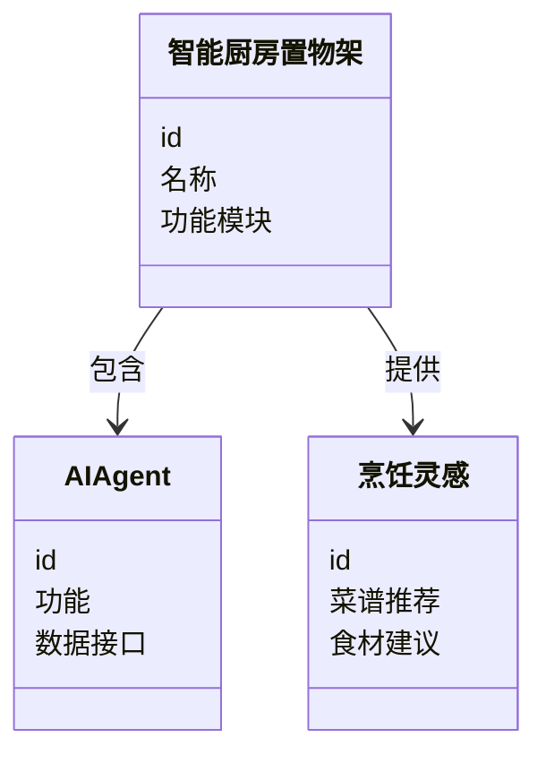
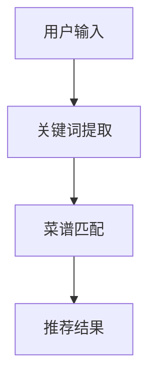
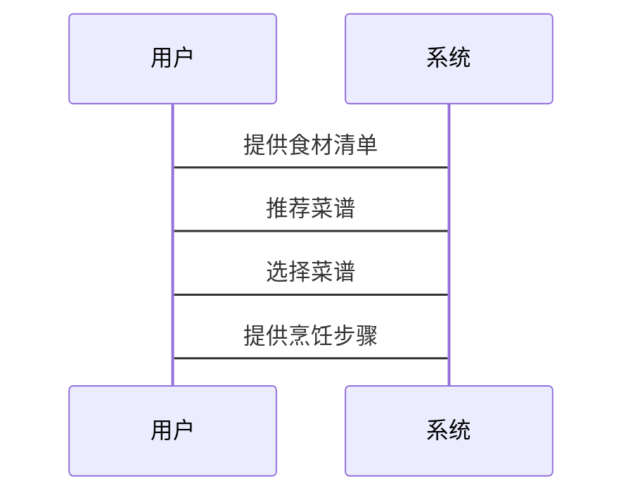

                 


# 智能厨房置物架：AI Agent的烹饪灵感激发

**关键词**：智能厨房置物架、AI Agent、烹饪灵感、自然语言处理、推荐系统、系统架构设计

**摘要**：本文探讨了智能厨房置物架结合AI Agent技术的可能性与应用，分析了如何通过AI Agent技术激发烹饪灵感，提升厨房管理效率。文章详细介绍了智能厨房置物架的核心概念、AI Agent的核心技术、推荐算法原理、系统架构设计以及项目实战等内容，为读者提供了从理论到实践的全面指导。

---

## 第一部分: 智能厨房置物架的背景与意义

### #1 章: 背景介绍

#### 1.1 问题背景
##### 1.1.1 厨房置物架的现状与问题
传统厨房置物架的功能相对单一，主要局限于存储食材和厨具，无法满足现代家庭对智能化、个性化的需求。用户在烹饪过程中常常面临以下问题：
- 食材种类繁多，难以快速找到所需食材。
- 缺乏智能化的食材管理，无法实时跟踪食材存量。
- 烹饪灵感不足，难以根据现有食材快速找到合适的菜谱。

##### 1.1.2 AI Agent在厨房中的潜在价值
AI Agent（智能代理）是一种能够感知环境、自主决策并执行任务的智能系统。将AI Agent技术引入厨房置物架，可以实现以下功能：
- 自动识别食材种类和存量，提供实时更新的食材清单。
- 根据用户偏好和食材存量推荐菜谱，激发烹饪灵感。
- 提供语音交互功能，方便用户快速获取烹饪指导。

##### 1.1.3 智能厨房置物架的目标与意义
智能厨房置物架的目标是通过AI Agent技术，将厨房管理与烹饪灵感激发相结合，为用户提供高效、便捷的厨房体验。其意义在于：
- 提高厨房管理效率，减少食材浪费。
- 满足用户对个性化烹饪的需求，提升烹饪体验。
- 推动智能家居技术在厨房领域的应用，为未来的智慧厨房奠定基础。

#### 1.2 核心概念与联系
##### 1.2.1 AI Agent的定义与特征
AI Agent是一种能够感知环境、自主决策并执行任务的智能系统。其主要特征包括：
- 感知能力：通过传感器、摄像头等设备获取环境信息。
- 决策能力：基于获取的信息，通过算法做出最优决策。
- 执行能力：通过执行机构完成任务。

##### 1.2.2 智能厨房置物架的功能模块
智能厨房置物架的功能模块包括：
- 食材管理模块：负责食材的识别、存储和管理。
- 推荐系统模块：根据食材存量和用户偏好推荐菜谱。
- 交互模块：支持语音交互、触控交互等多种交互方式。

##### 1.2.3 核心概念的ER实体关系图
```mermaid
er
    entity 智能厨房置物架 {
        id
        名称
        功能模块
    }
    entity AI Agent {
        id
        功能
        数据接口
    }
    entity 烹饪灵感 {
        id
        菜谱推荐
        食材建议
    }
```

---

## 第二部分: AI Agent的核心技术

### #2 章: AI Agent的核心技术

#### 2.1 自然语言处理技术
##### 2.1.1 NLP在烹饪灵感激发中的应用
自然语言处理（NLP）技术在烹饪灵感激发中的主要应用包括：
- **食材识别**：通过图像识别和自然语言处理技术，自动识别食材种类。
- **菜谱推荐**：根据用户的语言输入，分析用户需求并推荐菜谱。
- **语音交互**：支持用户通过语音指令与厨房置物架交互。

##### 2.1.2 基于关键词的菜谱推荐
基于关键词的菜谱推荐是通过分析用户的输入文本，提取关键词并匹配菜谱数据库中的菜谱。例如，当用户输入“番茄炒蛋”时，系统会匹配所有包含“番茄”和“鸡蛋”的菜谱。

##### 2.1.3 情境对话系统的实现
情境对话系统通过分析用户的上下文信息，理解用户的意图并提供相应的建议。例如，当用户说“我今天想做一道意大利菜”，系统会根据用户的语言习惯和偏好推荐意大利菜谱。

#### 2.2 推荐系统算法
##### 2.2.1 协同过滤推荐
协同过滤推荐是一种基于用户行为的推荐算法，通过分析用户的购买历史、浏览记录等信息，找到与用户相似的其他用户，并推荐他们喜欢的菜谱。

##### 2.2.2 基于内容的推荐
基于内容的推荐算法通过分析菜谱的属性（如食材、步骤等），找到与用户需求最匹配的菜谱。例如，当用户喜欢“甜味”的菜谱时，系统会推荐所有甜味的菜谱。

##### 2.2.3 混合推荐模型
混合推荐模型结合了协同过滤和基于内容的推荐算法，通过融合两种算法的优势，提高推荐的准确性和多样性。例如，系统会首先基于用户的偏好推荐菜谱，然后根据菜谱的属性进行进一步筛选。

---

## 第三部分: 算法原理与数学模型

### #3 章: 算法原理与数学模型

#### 3.1 推荐算法原理
##### 3.1.1 协同过滤算法
协同过滤算法通过计算用户之间的相似度，找到与用户相似的其他用户，并推荐他们喜欢的菜谱。相似度计算公式如下：
$$
相似度(i,j) = \frac{\sum_{k=1}^{n} r_{ik} \cdot r_{jk}}{\sqrt{\sum_{k=1}^{n} r_{ik}^2} \cdot \sqrt{\sum_{k=1}^{n} r_{jk}^2}}
$$
其中，$r_{ik}$表示用户$i$对菜谱$k$的评分，$r_{jk}$表示用户$j$对菜谱$k$的评分。

##### 3.1.2 基于内容的推荐算法
基于内容的推荐算法通过分析菜谱的属性，找到与用户需求最匹配的菜谱。例如，当用户喜欢“甜味”的菜谱时，系统会推荐所有甜味的菜谱。

##### 3.1.3 混合推荐模型
混合推荐模型结合了协同过滤和基于内容的推荐算法，通过融合两种算法的优势，提高推荐的准确性和多样性。例如，系统会首先基于用户的偏好推荐菜谱，然后根据菜谱的属性进行进一步筛选。

---

## 第四部分: 系统分析与架构设计方案

### #4 章: 系统分析与架构设计方案

#### 4.1 系统功能设计
##### 4.1.1 领域模型设计


#### 4.2 系统架构设计
##### 4.2.1 系统架构图


#### 4.3 系统接口设计
##### 4.3.1 接口设计
系统接口设计包括以下几个部分：
- 用户输入接口：支持语音输入和文本输入。
- 数据接口：与食材数据库和菜谱数据库进行交互。
- 输出接口：将推荐结果以文本或语音形式返回给用户。

##### 4.3.2 系统交互设计
系统交互设计包括以下几个部分：
- 用户输入：用户通过语音或文本输入需求。
- 系统处理：系统根据输入需求进行处理，生成推荐结果。
- 用户反馈：用户对推荐结果进行反馈，系统根据反馈优化推荐算法。

#### 4.4 系统交互流程
##### 4.4.1 交互流程图


---

## 第五部分: 项目实战

### #5 章: 项目实战

#### 5.1 环境安装
##### 5.1.1 安装Python
安装Python的最新版本（建议使用Python 3.8或更高版本）。
```bash
# 下载Python
# 安装Python
```

##### 5.1.2 安装依赖
安装所需的依赖库，例如：
- `numpy`
- `pandas`
- `scikit-learn`
- `transformers`

##### 5.1.3 安装TensorFlow
安装TensorFlow框架：
```bash
pip install tensorflow
```

#### 5.2 系统核心实现
##### 5.2.1 食材识别模块
食材识别模块基于图像识别技术，通过摄像头拍摄食材图片，识别食材种类和数量。
```python
import tensorflow as tf
from tensorflow.keras import models

# 加载预训练模型
model = models.load_model('ingredient_model.h5')

# 预测食材种类
def predict_ingredient(image):
    prediction = model.predict(image)
    return prediction.argmax(axis=-1)
```

##### 5.2.2 推荐系统模块
推荐系统模块基于协同过滤算法，根据用户的偏好推荐菜谱。
```python
import numpy as np

# 协同过滤算法
def collaborative_filtering(user_id):
    # 获取用户历史评分
    user_ratings = get_user_ratings(user_id)
    # 找到相似用户
    similar_users = find_similar_users(user_id, user_ratings)
    # 推荐菜谱
    recommended_recipes = get_recommendations(similar_users)
    return recommended_recipes
```

##### 5.2.3 交互模块
交互模块支持语音交互和文本交互。
```python
import speech_recognition as sr

# 语音识别
def recognize_speech():
    r = sr.Recognizer()
    with sr.AudioFile('input.wav') as source:
        audio = r.record(source)
        text = r.recognize(audio)
    return text
```

#### 5.3 代码应用解读与分析
##### 5.3.1 食材识别模块
食材识别模块通过图像识别技术，自动识别食材种类和数量。该模块使用了预训练的卷积神经网络模型，能够实现高效的食材识别。

##### 5.3.2 推荐系统模块
推荐系统模块基于协同过滤算法，通过分析用户的偏好和历史行为，推荐最符合用户需求的菜谱。该模块结合了用户数据和菜谱数据，能够实现高效的推荐。

##### 5.3.3 交互模块
交互模块支持多种交互方式，包括语音交互和文本交互。用户可以通过语音指令与系统交互，系统通过语音识别技术理解用户的意图并提供相应的服务。

#### 5.4 实际案例分析
##### 5.4.1 案例分析
以用户A为例，用户A喜欢意大利菜，系统会根据用户的偏好推荐意大利菜谱，例如“意大利面”、“披萨”等。

##### 5.4.2 优化建议
根据用户的反馈，系统可以进一步优化推荐算法，例如引入用户偏好因子，提高推荐的准确性。

#### 5.5 项目小结
通过本项目的实施，我们可以看到智能厨房置物架结合AI Agent技术的巨大潜力。未来，随着技术的不断发展，智能厨房置物架将为用户带来更加智能化、个性化的厨房体验。

---

## 第六部分: 最佳实践

### #6 章: 最佳实践

#### 6.1 小结
智能厨房置物架结合AI Agent技术，为用户提供了高效、便捷的厨房管理方式。通过本文的介绍，我们可以看到AI Agent技术在厨房中的广泛应用前景。

#### 6.2 注意事项
在实际应用中，需要注意以下几点：
- 数据隐私保护：确保用户的食材数据和菜谱数据的安全性。
- 系统稳定性：确保系统的稳定运行，避免因系统故障影响用户体验。
- 用户体验优化：根据用户的反馈不断优化系统功能，提高用户的满意度。

#### 6.3 拓展阅读
对于感兴趣的技术，可以进一步阅读以下内容：
- 《自然语言处理实战》
- 《推荐系统算法与实现》
- 《人工智能与智能家居》

---

通过本文的详细介绍，我们可以看到智能厨房置物架结合AI Agent技术的巨大潜力。未来，随着技术的不断发展，智能厨房置物架将为用户带来更加智能化、个性化的厨房体验。

