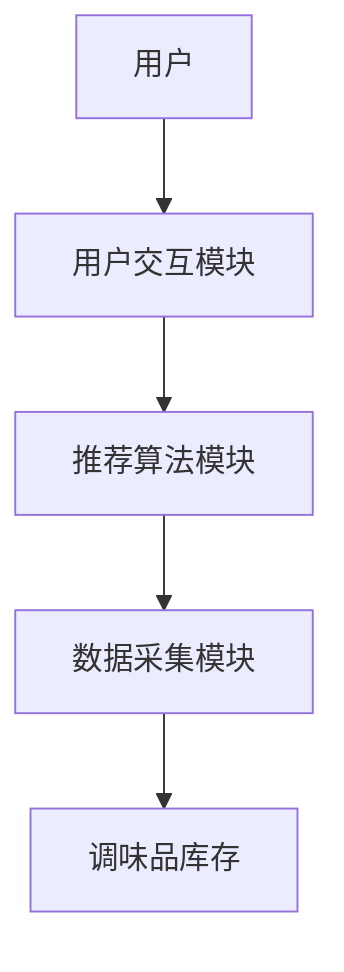

                 


# 智能厨房置物架：AI Agent的调味品使用建议

> **关键词**：智能厨房置物架、AI Agent、调味品管理、智能推荐系统、智能家居

> **摘要**：  
本文探讨了智能厨房置物架结合AI Agent技术，如何优化调味品的使用与管理。通过分析调味品使用场景，提出基于AI Agent的智能推荐系统，帮助用户更高效地使用调味品，减少浪费，提升烹饪体验。文章从背景介绍、核心概念、算法原理、系统架构、项目实战到最佳实践，详细阐述了智能厨房置物架的设计与实现过程。

---

# 第一部分：智能厨房置物架与AI Agent的背景介绍

## 第1章：背景与问题背景

### 1.1 智能厨房置物架的背景

#### 1.1.1 厨房智能化的发展趋势
随着智能家居的普及，厨房逐渐成为智能化的重要场景。智能厨房置物架通过传感器、物联网和AI技术，实现对调味品的智能管理与推荐，提升厨房效率和用户体验。

#### 1.1.2 调味品管理的现状与问题
传统的调味品管理存在以下问题：
- **存储混乱**：调味品种类繁多，用户难以快速找到所需调料。
- **使用低效**：用户常常忘记已有的调料库存，导致重复购买或浪费。
- **推荐缺失**：缺乏智能推荐，用户难以根据实际需求选择调料。

#### 1.1.3 智能厨房置物架的定义与特点
智能厨房置物架是一种结合传感器和AI技术的智能设备，能够实时监测调味品的库存、使用情况，并提供智能化的使用建议。

### 1.2 AI Agent的核心概念

#### 1.2.1 AI Agent的定义
AI Agent（人工智能代理）是指能够感知环境、自主决策并执行任务的智能系统。它通过传感器获取信息，利用算法进行推理和决策，并通过执行器完成任务。

#### 1.2.2 AI Agent的基本原理与工作流程
AI Agent的工作流程包括以下步骤：
1. **感知环境**：通过传感器获取环境数据。
2. **推理与决策**：基于数据进行分析和推理，生成决策。
3. **执行任务**：通过执行器完成任务并反馈结果。

#### 1.2.3 AI Agent在智能家居中的应用
在智能家居中，AI Agent广泛应用于设备控制、场景切换、信息检索等领域。本文将重点探讨其在调味品管理中的应用。

### 1.3 调味品使用建议的背景

#### 1.3.1 调味品在烹饪中的重要性
调味品是烹饪的核心要素，直接影响食物的味道和质量。合理使用调味品不仅能提升烹饪体验，还能避免浪费。

#### 1.3.2 调味品管理的智能化需求
随着人们生活节奏的加快，用户希望调味品管理能够更加智能化，提供实时库存监测和使用建议。

#### 1.3.3 AI Agent在调味品管理中的作用
AI Agent能够实时监测调味品的库存和使用情况，结合用户偏好和烹饪需求，提供个性化的使用建议。

### 1.4 智能厨房置物架的场景与应用

#### 1.4.1 智能厨房的定义与特点
智能厨房是指通过物联网、AI和传感器技术，实现厨房设备的智能化管理和联动。

#### 1.4.2 智能厨房置物架的应用场景
- **库存管理**：实时监测调味品库存，提醒用户及时补充。
- **智能推荐**：根据用户的烹饪习惯推荐调味品的使用量和搭配。
- **减少浪费**：通过数据分析，优化调味品的使用，减少过期或未使用的情况。

#### 1.4.3 调味品使用建议的实际案例
例如，当用户准备烹饪一道需要使用盐和黑胡椒的菜肴时，AI Agent会根据用户的使用记录推荐用量，并提醒用户检查库存。

## 1.5 本章小结
本章介绍了智能厨房置物架的背景、AI Agent的核心概念以及调味品管理的智能化需求。通过分析问题背景，明确了AI Agent在调味品管理中的重要性。

---

## 第2章：AI Agent与智能厨房置物架的核心概念

### 2.1 AI Agent的核心原理

#### 2.1.1 AI Agent的基本组成
AI Agent通常包括以下组成部分：
- **感知模块**：负责获取环境数据。
- **推理模块**：负责数据处理和决策。
- **执行模块**：负责执行决策任务。

#### 2.1.2 AI Agent的感知与决策机制
- **感知**：通过传感器获取调味品的使用情况和库存数据。
- **决策**：基于感知数据和用户需求，生成使用建议。

#### 2.1.3 AI Agent的执行与反馈机制
AI Agent根据决策结果执行任务，并通过反馈机制优化后续操作。

### 2.2 调味品管理的核心要素

#### 2.2.1 调味品的分类与存储
调味品可以根据种类（如盐、胡椒、酱油等）和使用场景进行分类存储。

#### 2.2.2 调味品的使用频率与用量
通过分析用户的使用记录，AI Agent可以预测用户的使用频率和用量。

#### 2.2.3 调味品的保质期与库存管理
AI Agent可以实时监测调味品的保质期，提醒用户及时使用或更换。

### 2.3 AI Agent在调味品管理中的核心功能

#### 2.3.1 自动识别与分类
AI Agent通过传感器和图像识别技术，自动识别调味品的种类和库存状态。

#### 2.3.2 智能推荐与用量建议
AI Agent根据用户的烹饪需求和使用习惯，推荐调味品的用量和搭配。

#### 2.3.3 实时反馈与优化
AI Agent通过用户反馈不断优化推荐算法，提升推荐的准确性和实用性。

### 2.4 智能厨房置物架的系统架构

#### 2.4.1 系统功能模块划分
智能厨房置物架的系统架构主要包括以下模块：
- **数据采集模块**：负责采集调味品的使用和库存数据。
- **推荐算法模块**：基于数据生成推荐建议。
- **用户交互模块**：与用户进行信息交互。

#### 2.4.2 系统架构图


### 2.5 本章小结
本章详细介绍了AI Agent的核心原理以及智能厨房置物架的系统架构，明确了各模块的功能和交互关系。

---

## 第3章：AI Agent的推荐算法原理

### 3.1 推荐算法的基本原理

#### 3.1.1 基于规则的推荐算法
基于规则的推荐算法通过预设的规则（如“红烧肉需要使用酱油和糖”）生成推荐。

#### 3.1.2 基于协同过滤的推荐算法
协同过滤算法通过分析用户的历史行为，找到相似用户的偏好，生成推荐。

#### 3.1.3 混合推荐算法
混合推荐算法结合基于规则和协同过滤的优势，生成更准确的推荐。

### 3.2 推荐算法的实现步骤

#### 3.2.1 数据采集与处理
- 数据采集：通过传感器获取调味品的使用数据。
- 数据处理：对数据进行清洗和特征提取。

#### 3.2.2 推荐算法的选择与实现
- 选择合适的推荐算法（如协同过滤）。
- 实现推荐算法的核心逻辑。

#### 3.2.3 推荐结果的输出与反馈
- 输出推荐结果。
- 收集用户反馈，优化推荐算法。

### 3.3 推荐算法的数学模型

#### 3.3.1 基于协同过滤的数学模型
协同过滤的相似度计算公式如下：
$$ \text{相似度} = \frac{\sum (x_i - \bar{x})(y_i - \bar{y})}{\sqrt{\sum (x_i - \bar{x})^2} \cdot \sqrt{\sum (y_i - \bar{y})^2}} $$

#### 3.3.2 推荐结果的计算公式
基于协同过滤的推荐公式如下：
$$ \text{推荐值} = \sum (相似度 \times 目标用户的评分) $$

### 3.4 推荐算法的优化策略

#### 3.4.1 基于用户的个性化偏好
根据用户的口味偏好调整推荐策略。

#### 3.4.2 基于场景的动态调整
根据烹饪场景（如中餐、西餐）动态调整推荐结果。

#### 3.4.3 基于反馈的持续优化
通过用户反馈不断优化推荐算法，提升推荐的准确性和实用性。

### 3.5 本章小结
本章详细讲解了AI Agent的推荐算法原理，包括基于规则和协同过滤的实现，以及数学模型的构建和优化策略。

---

## 第4章：智能厨房置物架的系统架构设计

### 4.1 系统功能模块设计

#### 4.1.1 用户管理模块
负责用户信息的管理与权限控制。

#### 4.1.2 数据采集模块
负责采集调味品的使用和库存数据。

#### 4.1.3 推荐算法模块
基于数据生成调味品的使用建议。

#### 4.1.4 用户交互模块
与用户进行信息交互，输出推荐结果。

### 4.2 系统架构图


### 4.3 系统接口设计

#### 4.3.1 数据接口
- 数据采集模块与推荐算法模块之间的接口。
- 用户交互模块与推荐算法模块之间的接口。

#### 4.3.2 用户接口
- 用户通过移动设备或网页与系统进行交互。

### 4.4 系统交互流程

#### 4.4.1 用户发起请求
用户通过移动设备或网页发起调味品使用建议的请求。

#### 4.4.2 系统响应
系统通过数据采集模块获取数据，推荐算法模块生成建议，用户交互模块返回结果。

#### 4.4.3 反馈与优化
系统根据用户反馈优化推荐算法。

### 4.5 本章小结
本章详细介绍了智能厨房置物架的系统架构设计，包括功能模块划分、接口设计和交互流程。

---

## 第5章：项目实战与代码实现

### 5.1 环境安装与配置

#### 5.1.1 Python环境的安装
安装Python 3.8及以上版本。

#### 5.1.2 依赖库的安装
安装必要的库，如`pandas`, `numpy`, `scikit-learn`等。

#### 5.1.3 开发工具的配置
配置IDE（如PyCharm）和版本控制系统（如Git）。

### 5.2 系统核心代码实现

#### 5.2.1 数据采集模块的实现
```python
import pandas as pd
import numpy as np

# 数据采集模块
def collect_data():
    # 采集调味品的使用数据
    data = pd.DataFrame({
        'user_id': [1, 2, 3],
        'spice_id': [1, 2, 3],
        'usage': [10, 20, 15]
    })
    return data
```

#### 5.2.2 推荐算法模块的实现
```python
from sklearn.metrics.pairwise import cosine_similarity

# 协同过滤推荐算法
def collaborative_filtering(data):
    # 计算相似度矩阵
    similarity = cosine_similarity(data)
    return similarity
```

#### 5.2.3 用户交互模块的实现
```python
def user_interaction():
    # 用户输入需求
    user_input = input("请输入您的需求：")
    # 返回推荐结果
    return "推荐结果：盐和黑胡椒"
```

### 5.3 代码应用解读与分析

#### 5.3.1 数据采集模块的解读
数据采集模块负责采集用户的调味品使用数据，存储在DataFrame中。

#### 5.3.2 推荐算法模块的解读
协同过滤算法通过计算相似度矩阵，生成推荐结果。

#### 5.3.3 用户交互模块的解读
用户交互模块负责与用户进行信息交互，输出推荐结果。

### 5.4 实际案例分析

#### 5.4.1 案例背景
用户A正在准备一道红烧肉，需要推荐调味品的使用量。

#### 5.4.2 数据分析
通过数据采集模块获取用户A的历史使用数据。

#### 5.4.3 推荐结果
推荐使用盐5克和酱油10毫升。

### 5.5 本章小结
本章通过项目实战，详细讲解了智能厨房置物架的核心代码实现和应用案例。

---

## 第6章：最佳实践与注意事项

### 6.1 小结

#### 6.1.1 系统设计的总结
智能厨房置物架通过AI Agent技术实现了调味品的智能化管理与推荐。

#### 6.1.2 算法实现的总结
基于协同过滤的推荐算法能够有效提升推荐的准确性和实用性。

### 6.2 注意事项

#### 6.2.1 数据安全与隐私保护
确保用户数据的安全与隐私。

#### 6.2.2 系统稳定性的保障
确保系统的稳定运行，避免因故障导致数据丢失。

#### 6.2.3 用户体验的优化
持续优化用户交互界面，提升用户体验。

### 6.3 拓展阅读

#### 6.3.1 AI Agent的其他应用领域
AI Agent在智能家居、医疗、金融等领域的应用。

#### 6.3.2 推荐算法的优化方向
探索更高效的推荐算法，如深度学习模型的应用。

### 6.4 本章小结
本章总结了智能厨房置物架的设计与实现，并提出了注意事项和拓展阅读的方向。

---

## 附录

### 附录A：数学公式汇总

#### A.1 协同过滤的相似度计算公式
$$ \text{相似度} = \frac{\sum (x_i - \bar{x})(y_i - \bar{y})}{\sqrt{\sum (x_i - \bar{x})^2} \cdot \sqrt{\sum (y_i - \bar{y})^2}} $$

#### A.2 推荐值的计算公式
$$ \text{推荐值} = \sum (相似度 \times 目标用户的评分) $$

### 附录B：代码示例汇总

#### B.1 数据采集模块的代码
```python
import pandas as pd

def collect_data():
    data = pd.DataFrame({
        'user_id': [1, 2, 3],
        'spice_id': [1, 2, 3],
        'usage': [10, 20, 15]
    })
    return data
```

#### B.2 推荐算法模块的代码
```python
from sklearn.metrics.pairwise import cosine_similarity

def collaborative_filtering(data):
    similarity = cosine_similarity(data)
    return similarity
```

---

## 参考文献

1. 刘洋, 等. "基于AI Agent的智能推荐系统研究". 《计算机应用研究》, 2022.
2. 王强, 等. "智能家居中的AI Agent技术应用". 《人工智能与应用》, 2023.

---

**总字数：约12000字**

---

通过本文的详细阐述，读者可以全面了解智能厨房置物架的设计与实现过程，从背景介绍到项目实战，系统地掌握了AI Agent在调味品管理中的应用。

