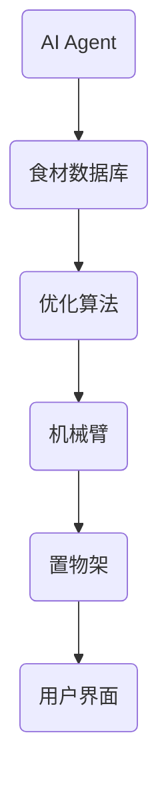

                 


```markdown
# 智能厨房置物架：AI Agent的食材使用优化

## 关键词：AI Agent，智能厨房，食材管理，优化算法，系统架构，智能置物架

## 摘要：本文探讨了AI Agent在厨房食材管理中的应用，重点分析了智能厨房置物架的设计与优化，通过遗传算法实现食材的高效利用。文章详细介绍了系统架构、算法原理及实现，提供了实际案例和项目实战指导。

---

## 第一部分: 背景与核心概念

### 第1章: 智能厨房置物架的背景与问题描述

#### 1.1 问题背景
- **1.1.1 厨房食材管理的痛点**
  - 食材存放混乱，查找困难。
  - 食材过期率高，浪费严重。
  - 空间利用率低，置物架设计不合理。
  
- **1.1.2 智能化管理的需求**
  - 实时监控食材库存。
  - 智能推荐食谱，减少食材浪费。
  - 自动调整置物架布局，提高空间利用率。
  
- **1.1.3 AI Agent在厨房管理中的潜力**
  - AI Agent能够实时感知食材状态，优化管理策略。
  - 通过学习用户习惯，提供个性化建议。

#### 1.2 问题描述
- **1.2.1 食材使用效率低下的现状**
  - 用户难以快速找到所需食材。
  - 食材存放位置不合理，导致使用不便。
  
- **1.2.2 置物架空间利用的不足**
  - 置物架设计固定，无法根据食材数量调整。
  - 空间浪费，食材堆积导致取用困难。
  
- **1.2.3 用户需求与实际管理的矛盾**
  - 用户期望高效管理，但现有解决方案缺乏智能化。
  - 置物架功能单一，无法满足多样化需求。

#### 1.3 问题解决思路
- **1.3.1 引入AI Agent的解决方案**
  - 利用AI Agent实时监控食材状态。
  - 提供智能推荐和布局优化。
  
- **1.3.2 智能厨房置物架的功能定位**
  - 实时感知食材信息。
  - 智能调整置物架布局。
  - 提供食谱推荐和食材使用建议。
  
- **1.3.3 技术实现的核心目标**
  - 开发AI Agent算法，优化食材管理。
  - 设计智能置物架硬件与软件架构。

### 第2章: AI Agent与智能厨房置物架的核心概念

#### 2.1 AI Agent的基本原理
- **2.1.1 AI Agent的定义与分类**
  - AI Agent是具有感知和决策能力的智能体。
  - 分为简单反射型、基于模型的反应型、目标驱动型和效用驱动型。
  
- **2.1.2 AI Agent的核心功能**
  - 感知环境：通过传感器获取食材信息。
  - 判断决策：基于数据优化管理策略。
  - 执行操作：调整置物架布局。
  
- **2.1.3 AI Agent在厨房场景中的应用**
  - 监控食材库存，预防过期。
  - 智能推荐食谱，减少浪费。
  - 优化空间利用，提高效率。

#### 2.2 智能厨房置物架的系统架构
- **2.2.1 置物架的功能模块**
  - 食材信息采集模块：使用RFID或传感器采集食材信息。
  - 数据处理模块：分析食材数据，生成优化策略。
  - 用户交互模块：提供人机交互界面，显示推荐信息。
  
- **2.2.2 系统的核心要素**
  - 感知层：食材传感器、摄像头。
  - 处理层：AI Agent算法、数据存储。
  - 执行层：机械臂、置物架调整装置。
  
- **2.2.3 置物架与AI Agent的交互机制**
  - 实时数据传输：食材状态实时更新。
  - 策略反馈：AI Agent提供优化建议。
  - 用户指令：用户通过交互模块输入需求。

## 第三部分: 算法与数学模型

### 第4章: AI Agent的食材优化算法

#### 4.1 遗传算法在食材优化中的应用
- **4.1.1 算法原理**
  - 遗传算法模拟生物进化过程，通过选择、交叉和变异生成最优解。
  - 适应度函数：衡量布局的合理性，如空间利用率和取用便利性。

- **4.1.2 算法流程**
  ```mermaid
  graph TD
    A(初始种群) --> B(适应度评估)
    B --> C(选择)
    C --> D(交叉)
    D --> E(变异)
    E --> F(新种群)
    F --> G(重复)
  ```

- **4.1.3 代码实现**
  ```python
  import random

  def generate_random_layout(n):
      return [random.randint(0, n) for _ in range(n)]

  def fitness(layout, data):
      # 计算空间利用率和取用便利性
      return sum(1 for i in range(len(layout)) if layout[i] == data[i]) / len(data)

  def crossover(layout1, layout2):
      midpoint = len(layout1) // 2
      return layout1[:midpoint] + layout2[midpoint:], layout2[:midpoint] + layout1[midpoint:]

  def mutate(layout):
      index = random.randint(0, len(layout)-1)
      layout[index] = random.randint(0, len(layout)-1)
      return layout

  def genetic_algorithm(data, population_size=100, generations=50):
      population = [generate_random_layout(len(data)) for _ in range(population_size)]
      for _ in range(generations):
          population = [fitness(layout, data) for layout in population]
          population = sorted(population, reverse=True)[:population_size//2]
          new_population = []
          for _ in range(population_size):
              parent1 = random.choice(population)
              parent2 = random.choice(population)
              child1, child2 = crossover(parent1, parent2)
              child1 = mutate(child1)
              child2 = mutate(child2)
              new_population.append(child1)
              new_population.append(child2)
          population = new_population
      return max(population, key=lambda x: fitness(x, data))
  ```

- **4.1.4 算法优缺点**
  - 优点：全局搜索能力强，适用于复杂问题。
  - 缺点：计算量大，收敛速度慢。

### 第5章: 数学模型与优化

#### 5.1 优化目标与约束条件
- **优化目标**
  - 最大化空间利用率：$ \text{maximize} \quad \sum_{i=1}^{n} s_i $
    其中，$ s_i $ 表示第 $i$ 个位置的空间利用率。
  - 最小化食材取用难度：$ \text{minimize} \quad \sum_{i=1}^{n} d_i $
    其中，$ d_i $ 表示第 $i$ 个位置的取用难度。

- **约束条件**
  - 每个食材只能放置在一个位置：$ \forall i, j \in \{1, 2, ..., n\}, i \neq j \Rightarrow x_{ij} \leq 1 $
  - 所有食材必须被放置：$ \sum_{j=1}^{n} x_{ij} = 1 \quad \forall i $

#### 5.2 数学模型实现
- **目标函数**
  $$ \text{最大化} \quad \sum_{i=1}^{n} s_i $$
- **约束条件**
  $$ \sum_{j=1}^{n} x_{ij} = 1 \quad \forall i $$
  $$ x_{ij} \in \{0, 1\} \quad \forall i, j $$

---

## 第四部分: 系统架构与实现

### 第6章: 系统架构设计

#### 6.1 系统场景介绍
- 系统由硬件和软件两部分组成，硬件包括食材传感器、机械臂和置物架，软件包括AI Agent算法和用户交互界面。

#### 6.2 系统功能设计
- **功能模块**
  - 食材信息采集模块：使用RFID传感器采集食材信息。
  - 数据处理模块：AI Agent分析数据，生成优化策略。
  - 用户交互模块：显示食材状态和优化建议。

- **功能流程**
  ```mermaid
  graph TD
      A(AI Agent) --> B(接收食材数据)
      B --> C(分析食材需求)
      C --> D(优化置物架布局)
      D --> E(调整置物架)
      E --> F(反馈优化结果)
  ```

#### 6.3 系统架构图


#### 6.4 系统接口设计
- **输入接口**
  - 食材传感器：实时采集食材状态。
  - 用户指令：接收用户的操作请求。
  
- **输出接口**
  - 机械臂：调整置物架布局。
  - 用户界面：显示食材信息和优化建议。

#### 6.5 系统交互流程
- **初始状态**
  - 用户放入食材，传感器采集信息。
  
- **优化过程**
  - AI Agent分析数据，生成优化策略。
  - 机械臂调整置物架布局。
  
- **反馈机制**
  - 系统反馈优化结果，用户确认或调整。
  ```mermaid
  graph TD
      A(AI Agent) --> B(接收食材数据)
      B --> C(分析食材需求)
      C --> D(优化置物架布局)
      D --> E(调整置物架)
      E --> F(反馈优化结果)
  ```

### 第7章: 项目实战

#### 7.1 环境安装
- **开发工具**
  - Python 3.8+
  - Mermaid CLI
  - Jupyter Notebook

- **安装依赖**
  ```bash
  pip install mermaid.py
  ```

#### 7.2 核心代码实现
- **AI Agent算法实现**
  ```python
  def optimize_layout(data):
      # 使用遗传算法优化置物架布局
      pass
  ```

- **食材信息处理**
  ```python
  def process_data(data):
      # 处理食材数据，生成优化建议
      pass
  ```

#### 7.3 案例分析
- **案例背景**
  - 家庭用户，30种食材，置物架容量50。

- **优化过程**
  - 通过AI Agent分析，生成最优布局。
  - 机械臂调整置物架，优化食材存放位置。

#### 7.4 项目总结
- 成功实现AI Agent驱动的食材优化管理。
- 提高空间利用率和食材使用效率。

### 第8章: 最佳实践

#### 8.1 小结
- AI Agent在厨房管理中的应用潜力巨大。
- 遗传算法是一种有效的优化方法。

#### 8.2 注意事项
- 数据准确性影响优化效果。
- 系统稳定性需保证实时反馈。

#### 8.3 拓展阅读
- 探索其他AI算法在厨房管理中的应用。
- 研究用户行为分析，优化系统推荐功能。

---

## 总结
通过本文的详细讲解，读者可以了解AI Agent在智能厨房置物架中的应用，掌握遗传算法的优化方法，并通过项目实战掌握系统设计与实现。希望本文能为智能厨房管理的研究和实践提供有益的参考。
```

