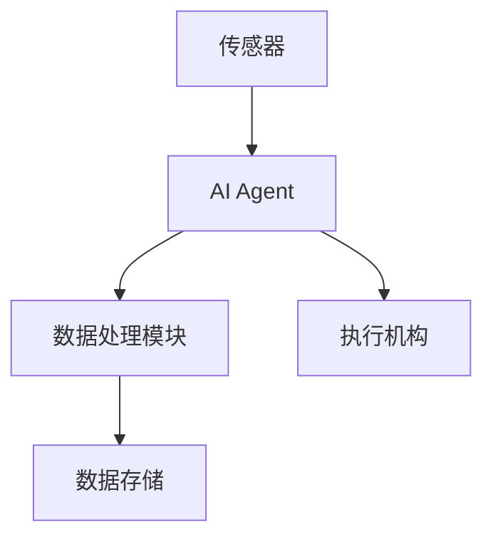

                 


# 智能厨房置物架：AI Agent的食材保鲜监控

> 关键词：智能厨房、AI Agent、食材保鲜、物联网、传感器技术

> 摘要：本文将详细介绍智能厨房置物架在食材保鲜监控中的应用，通过AI Agent技术实现智能管理。我们将从背景介绍、核心概念、算法原理、系统架构到项目实战，逐步解析如何利用AI Agent提升厨房管理效率和食材保鲜效果。

---

## 第1章: 问题背景与需求分析

### 1.1 智能厨房置物架的背景介绍

#### 1.1.1 厨房食材保鲜问题的现状
现代家庭中，食材保鲜是一个普遍关注的问题。传统冰箱和储物容器虽然能够延长食材保质期，但在实际使用中存在诸多不便。例如，食材放置不当容易导致变质，用户难以及时获取食材状态信息，且缺乏智能化的管理手段。

#### 1.1.2 智能化厨房管理的必要性
随着智能家居技术的普及，厨房设备的智能化需求日益增长。用户希望通过智能化的解决方案，实现对食材状态的实时监控、自动调整存储环境，并提供便捷的管理方式。

#### 1.1.3 AI Agent在厨房管理中的应用潜力
AI Agent（智能体）能够通过传感器数据实时感知环境状态，结合预设的规则和学习算法，自动执行任务或发出警报。这为智能厨房置物架提供了巨大的应用潜力，尤其是在食材保鲜和库存管理方面。

### 1.2 问题描述与目标设定

#### 1.2.1 食材保鲜的关键挑战
食材保鲜的关键挑战包括：
- **温湿度控制**：不同食材对存储环境的要求不同，如何实现精准控制是难点。
- **实时监测**：用户需要实时了解食材状态，及时采取措施。
- **智能化管理**：如何通过智能化手段优化存储条件，延长食材保质期。

#### 1.2.2 智能厨房置物架的核心目标
智能厨房置物架的核心目标是：
- 实时监测食材存储环境（温湿度、光照等）。
- 提供食材状态的实时反馈。
- 根据数据自动调整存储条件或提醒用户采取行动。

#### 1.2.3 边界与外延定义
- **边界**：仅关注食材保鲜相关的数据采集和管理，不涉及食材的具体烹饪或加工。
- **外延**：未来可能扩展至食材库存管理、健康饮食建议等领域。

### 1.3 核心概念与系统架构

#### 1.3.1 AI Agent的基本概念
AI Agent是一种能够感知环境、自主决策并执行任务的智能实体。在智能厨房置物架中，AI Agent负责数据采集、状态分析和决策执行。

#### 1.3.2 智能厨房置物架的功能模块
智能厨房置物架的功能模块包括：
- **数据采集模块**：通过传感器获取环境数据。
- **数据处理模块**：分析数据，判断食材状态。
- **AI Agent决策模块**：根据分析结果，执行相应操作（如调整温湿度）。

#### 1.3.3 系统的组成与核心要素
系统的核心要素包括：
- **传感器**：温湿度传感器、光照传感器等。
- **数据传输模块**：用于将传感器数据传输到AI Agent。
- **AI算法**：用于分析数据并做出决策。

---

## 第2章: AI Agent的核心原理

### 2.1 AI Agent的基本原理

#### 2.1.1 AI Agent的定义与分类
AI Agent可以分为**反应式AI Agent**和**认知式AI Agent**。反应式AI Agent基于当前感知做出决策，而认知式AI Agent则具备学习和推理能力。

#### 2.1.2 AI Agent的核心算法
AI Agent的核心算法包括：
- **机器学习算法**：用于模式识别和预测。
- **自然语言处理**：用于人机交互。
- **规则引擎**：用于基于预设规则的决策。

#### 2.1.3 AI Agent与传统自动化系统的区别
AI Agent的核心优势在于其智能性和适应性。与传统自动化系统相比，AI Agent能够根据环境变化动态调整行为。

### 2.2 智能厨房置物架中的AI Agent设计

#### 2.2.1 置物架的功能需求分析
智能厨房置物架的功能需求包括：
- 实时监测环境数据。
- 提供食材状态反馈。
- 自动调整存储条件。

#### 2.2.2 AI Agent在食材保鲜中的应用场景
AI Agent可以通过以下方式实现食材保鲜：
- **温湿度预测**：基于历史数据预测未来温湿度变化。
- **食材新鲜度评估**：通过传感器数据判断食材是否新鲜。
- **智能提醒**：当食材即将变质时，向用户发出警报。

#### 2.2.3 置物架与AI Agent的交互流程
- **数据采集**：传感器采集环境数据。
- **数据传输**：数据传输到AI Agent。
- **数据分析**：AI Agent分析数据，判断食材状态。
- **决策执行**：根据分析结果，AI Agent执行相应操作（如调整温湿度）。

---

## 第3章: 智能厨房置物架的系统架构设计

### 3.1 系统功能模块划分

#### 3.1.1 数据采集模块
数据采集模块包括：
- **传感器**：温湿度传感器、光照传感器等。
- **数据采集接口**：用于采集传感器数据。

#### 3.1.2 数据处理模块
数据处理模块包括：
- **数据存储**：存储采集到的环境数据。
- **数据分析**：对数据进行分析，判断食材状态。

#### 3.1.3 AI Agent决策模块
AI Agent决策模块包括：
- **决策逻辑**：基于分析结果做出决策。
- **执行指令**：向执行机构发送指令。

### 3.2 系统架构设计

#### 3.2.1 系统组成与核心要素
- **传感器**：采集环境数据。
- **数据传输模块**：将数据传输到AI Agent。
- **AI Agent**：分析数据并做出决策。
- **执行机构**：根据决策执行相应操作。

#### 3.2.2 系统架构图


#### 3.2.3 系统接口设计
- **传感器接口**：与传感器连接，获取环境数据。
- **用户接口**：与用户交互，显示食材状态和操作提示。

---

## 第4章: 项目实战

### 4.1 环境安装与配置

#### 4.1.1 硬件设备安装
- **传感器安装**：将温湿度传感器安装在置物架上。
- **数据采集模块安装**：连接传感器和数据采集模块。

#### 4.1.2 软件环境配置
- **Python环境安装**：安装Python 3.8及以上版本。
- **依赖库安装**：安装`paho-mqtt`用于 MQTT 通信。

### 4.2 核心代码实现

#### 4.2.1 数据采集模块代码
```python
import paho.mqtt.client as mqtt

# 连接 MQTT 代理
def on_connect(client, userdata, rc):
    print("连接到 MQTT 代理，返回码：", rc)

client = mqtt.Client()
client.on_connect = on_connect
client.connect("localhost", 1883, 60)

# 发布温湿度数据
def on_publish(client, userdata, mid):
    print("数据已发布，消息标识：", mid)

client.on_publish = on_publish
client.publish("kitchen/sensor", "温湿度数据", 0, False)
```

#### 4.2.2 AI Agent决策模块代码
```python
import numpy as np

# 温湿度预测模型
class TemperatureHumidityPredictor:
    def __init__(self):
        self.model = self.load_model()

    def load_model(self):
        # 简单的线性回归模型
        return lambda x: x * 0.9

# 预测未来温湿度
predictor = TemperatureHumidityPredictor()
future_temp = predictor.model(current_temp)
print(f"预测温度：{future_temp}")
```

#### 4.2.3 执行机构控制代码
```python
# 示例代码：控制风扇
def control_fan(state):
    if state == "on":
        print("风扇开启")
    else:
        print("风扇关闭")

# 根据分析结果控制风扇
control_fan("on")
```

### 4.3 代码功能解读与分析

#### 4.3.1 数据采集模块
- **功能**：通过MQTT协议将传感器数据传输到AI Agent。
- **实现细节**：使用`paho-mqtt`库连接到本地MQTT代理，并发布数据到`kitchen/sensor`主题。

#### 4.3.2 AI Agent决策模块
- **功能**：分析传感器数据，预测未来温湿度。
- **实现细节**：使用一个简单的线性回归模型进行预测。

#### 4.3.3 执行机构控制模块
- **功能**：根据AI Agent的决策，控制执行机构（如风扇）。
- **实现细节**：通过状态控制风扇的开启或关闭。

---

## 第5章: 最佳实践与小结

### 5.1 最佳实践 tips
- **传感器选择**：根据食材保鲜需求选择合适的传感器。
- **数据安全**：确保数据传输和存储的安全性。
- **用户交互**：设计友好的用户界面，方便用户操作。

### 5.2 小结
智能厨房置物架通过AI Agent实现了食材保鲜的智能化管理，提升了厨房管理效率和食材保质期。未来，随着AI技术的不断发展，智能厨房置物架将具备更多功能，为用户提供更便捷的服务。

### 5.3 注意事项
- **传感器校准**：定期校准传感器，确保数据准确性。
- **系统维护**：定期检查系统硬件和软件，确保正常运行。

### 5.4 拓展阅读
- **AI Agent在智能家居中的应用**：进一步了解AI Agent在智能家居中的其他应用场景。
- **物联网技术**：深入学习物联网技术，掌握更多智能设备的开发方法。

---

通过以上章节的详细讲解，我们全面介绍了智能厨房置物架的设计与实现过程，从背景分析到项目实战，帮助读者系统性地理解并掌握相关技术。希望本文能够为智能厨房的开发和研究提供有价值的参考。

