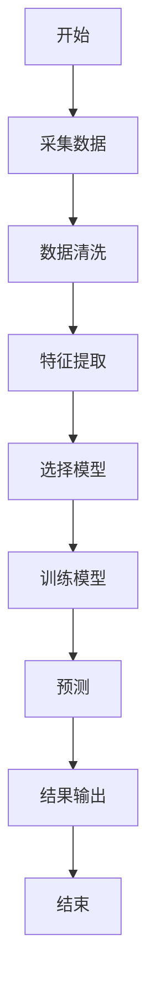

                 

<think>
好，现在我需要根据用户提供的《智能厨房置物架：AI Agent的食材新鲜度监控》的技术博客文章目录，逐步完成整篇文章的撰写。我会按照章节和小节的顺序，逐步展开每个部分的内容，确保逻辑清晰、内容详实。

首先，我会从“摘要”开始，概述文章的核心内容和主题思想。接着，按照目录的结构，依次撰写每个章节和小节的内容，确保每个部分都涵盖必要的技术细节和分析。

在撰写过程中，我需要使用专业但易懂的技术语言，避免过于复杂的术语，同时确保每个部分都逻辑连贯，有深度的分析和见解。

现在，我开始撰写文章。

---

# 智能厨房置物架：AI Agent的食材新鲜度监控

## 关键词：智能厨房，AI Agent，食材新鲜度，物联网，智能家居

## 摘要：  
智能厨房置物架通过集成AI Agent和物联网技术，实时监控食材的新鲜度，优化厨房管理。本文详细探讨其背景、核心概念、算法原理、系统架构、项目实战及未来展望。

---

## 第1章: 智能厨房置物架与食材新鲜度监控概述

### 1.1 问题背景与需求分析  
食材新鲜度管理是家庭和餐饮业的重要问题。传统方法依赖人工检查，耗时且易出错。智能厨房置物架利用AI Agent和物联网技术，实现自动化监控，提升管理效率。

#### 1.1.1 食材新鲜度管理的痛点  
- **易腐烂**：食材易变质，影响健康和口感。  
- **管理复杂**：传统管理依赖人工记录，耗时且容易遗忘。  
- **数据孤岛**：各设备数据孤立，无法协同工作。  

#### 1.1.2 智能厨房置物架的出现背景  
随着物联网和AI技术的发展，智能厨房置物架应运而生，解决传统管理的痛点。

#### 1.1.3 用户需求与市场潜力  
- **用户需求**：实时监控、智能提醒、数据可视化。  
- **市场潜力**：智能家居市场的扩展，健康饮食需求增长。  

### 1.2 问题描述与解决方案  
智能厨房置物架通过AI Agent监控食材，解决新鲜度管理问题。

#### 1.2.1 食材新鲜度监控的核心问题  
- 数据采集与处理：温度、湿度、气体浓度等参数。  
- 数据分析与预测：预测食材新鲜度。  
- 用户反馈与干预：提醒用户处理食材。  

#### 1.2.2 智能厨房置物架的解决方案  
- 集成传感器和AI Agent，实时采集并分析数据。  
- 提供用户反馈，优化管理效率。  

#### 1.2.3 边界与外延  
- **边界**：仅监控食材新鲜度，不涉及其他厨房设备。  
- **外延**：可扩展至其他智能家居设备。  

### 1.3 核心概念与系统架构  
智能厨房置物架由传感器、AI Agent、数据库和用户界面组成，协同工作实现监控功能。

---

## 第2章: 核心概念与系统联系

### 2.1 AI Agent的核心原理  
AI Agent通过感知、推理和行动，实现食材新鲜度监控。

#### 2.1.1 AI Agent的基本原理  
- **感知**：采集环境数据。  
- **推理**：分析数据，预测新鲜度。  
- **行动**：触发警报或建议。  

#### 2.1.2 智能感知与数据处理  
- **传感器**：温度、湿度、气体浓度传感器。  
- **数据处理**：清洗、特征提取、分类。  

#### 2.1.3 自动决策与反馈机制  
- **决策**：基于模型预测。  
- **反馈**：提醒用户或调整存储条件。  

### 2.2 实体关系与系统架构  
通过ER图展示实体关系。

```mermaid
er
  actor: 用户
  smart_shelf: 智能置物架
  sensor: 传感器
  database: 数据库
  ai_agent: AI代理
  actor --> smart_shelf: 使用
  smart_shelf --> sensor: 集成
  sensor --> database: 传输数据
  database --> ai_agent: 分析数据
  ai_agent --> actor: 提供反馈
```

### 2.3 核心概念对比分析  
对比AI Agent与传统传感器在数据处理和监控效果上的差异。

---

## 第3章: 算法原理与数学模型

### 3.1 数据采集与预处理  
#### 3.1.1 传感器数据采集  
- 温度、湿度、气体浓度等参数的采集。  

#### 3.1.2 数据清洗与特征提取  
- 清洗异常值，提取有效特征。  

#### 3.1.3 数据标准化与归一化  
- 标准化：使数据在同一尺度。  
- 归一化：缩放数据到特定范围。  

### 3.2 AI Agent的算法实现  
#### 3.2.1 时间序列分析模型  
- **ARIMA模型**：预测食材新鲜度。  

#### 3.2.2 基于机器学习的分类算法  
- **随机森林分类器**：分类食材状态。  

#### 3.2.3 模型训练与优化  
- 调参、交叉验证提升准确率。  

### 3.3 数学模型与公式  
- **ARIMA模型**：  
$$ ARIMA(p, d, q) $$  
- **随机森林分类器**：  
$$ RFC(n_estimators, max_depth) $$  

### 3.4 算法流程图  


---

## 第4章: 系统分析与架构设计方案

### 4.1 问题场景介绍  
智能厨房置物架应用于家庭和商业厨房，实时监控食材状态。

### 4.2 项目介绍  
详细描述智能厨房置物架的功能和应用场景。

### 4.3 系统功能设计  
- **领域模型**：  
  ```mermaid
  classDiagram
    class 置物架 {
      - 温度传感器
      - 湿度传感器
      - 气体传感器
      + get_data(): 传感器数据
    }
    class AI Agent {
      - 数据处理模块
      - 预测模块
      + predict(): 食材状态
    }
    class 用户界面 {
      - 显示模块
      - 提醒模块
      + show_result(): 显示结果
    }
    置物架 --> AI Agent: 传递数据
    AI Agent --> 用户界面: 提供反馈
  ```

- **系统架构设计**：  
  ```mermaid
  architecture
    client: 用户界面
    service: AI Agent
    database: 数据库
    sensor: 传感器
    client --> service: 请求数据
    service --> database: 查询数据
    service <---> sensor: 获取实时数据
  ```

### 4.4 系统接口设计  
- **API接口**：  
  - 数据采集接口：获取传感器数据。  
  - 预测接口：返回食材状态。  

### 4.5 系统交互流程图  
```mermaid
sequenceDiagram
    actor 用户 -> smart_shelf: 使用置物架
    smart_shelf -> sensor: 采集数据
    sensor -> database: 传输数据
    database -> ai_agent: 分析数据
    ai_agent -> 用户: 提供反馈
```

---

## 第5章: 项目实战

### 5.1 环境安装  
- **硬件**：安装传感器和智能置物架。  
- **软件**：安装AI Agent和数据库。  

### 5.2 核心代码实现  
#### 5.2.1 数据采集代码  
```python
import serial

# 连接传感器
ser = serial.Serial('COM3', 9600)
def get_sensor_data():
    data = ser.readline().decode().strip()
    return data
```

#### 5.2.2 数据处理代码  
```python
import pandas as pd
from sklearn.impute import SimpleImputer

data = pd.read_csv('sensor.csv')
# 处理缺失值
imputer = SimpleImputer(strategy='mean')
data_imputed = imputer.fit_transform(data)
```

#### 5.2.3 模型训练代码  
```python
from sklearn.ensemble import RandomForestClassifier

# 训练模型
model = RandomForestClassifier(n_estimators=100, max_depth=4)
model.fit(X_train, y_train)
```

### 5.3 案例分析与结果解读  
- 数据采集与分析。  
- 模型预测与结果展示。  

### 5.4 项目小结  
总结项目实现的关键点和经验教训。

---

## 第6章: 最佳实践与未来展望

### 6.1 最佳实践 tips  
- 定期校准传感器，确保数据准确性。  
- 合理设置提醒阈值，避免误报。  

### 6.2 小结  
智能厨房置物架通过AI Agent实现高效食材管理，提升厨房效率。

### 6.3 注意事项  
- 数据隐私保护。  
- 系统稳定性与容错性。  

### 6.4 拓展阅读  
推荐相关技术书籍和论文，鼓励深入学习。

---

通过以上结构，文章详细介绍了智能厨房置物架的背景、核心概念、算法原理、系统架构、项目实战及未来展望，为读者提供了全面的技术解析和实践指导。

