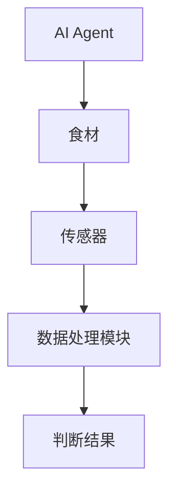
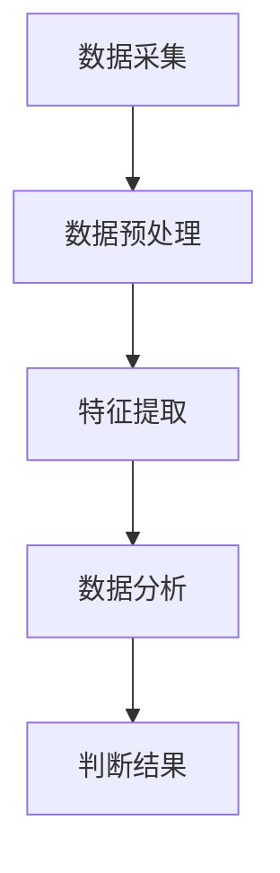
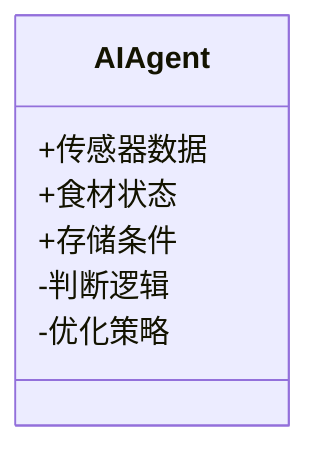
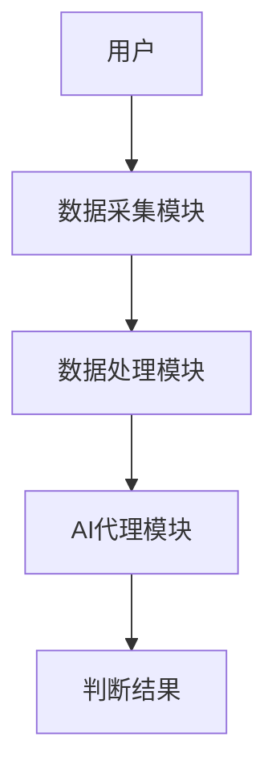
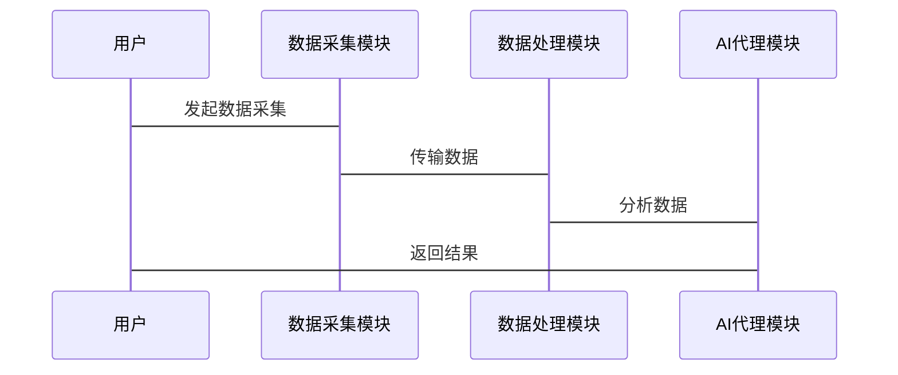

                 


# 智能厨房置物架：AI Agent的食材新鲜度监测

## 关键词：智能厨房，AI Agent，食材新鲜度，物联网，传感器技术

## 摘要：本文探讨了智能厨房置物架利用AI Agent监测食材新鲜度的技术实现。通过背景分析、核心概念、算法原理、系统架构和项目实战，详细阐述了如何利用AI代理和传感器技术实现食材新鲜度的智能监测，为智能家居的发展提供了新的思路。

---

## 第一部分：背景介绍

### 第1章：背景与问题分析

#### 1.1 智能厨房置物架的背景

##### 1.1.1 智能家居的发展现状

智能家居技术近年来发展迅速，智能音箱、智能灯泡等设备已普及，厨房设备的智能化成为趋势。

##### 1.1.2 厨房管理的智能化趋势

厨房管理智能化需求增加，食材管理效率低下，存在食材浪费和安全隐患。

##### 1.1.3 食材新鲜度监测的重要性

食材新鲜度影响健康和烹饪效果，传统监测方法效率低，缺乏智能化解决方案。

#### 1.2 问题背景与描述

##### 1.2.1 食材新鲜度监测的必要性

食材易变质，传统监测依赖感官，耗时且不准确，影响饮食健康。

##### 1.2.2 当前食材管理的主要问题

食材管理效率低，资源浪费，存在安全隐患，用户需求未被满足。

##### 1.2.3 AI Agent在食材管理中的应用潜力

AI Agent具备环境感知、自主决策能力，可提升食材管理效率和智能化水平。

#### 1.3 问题解决与边界

##### 1.3.1 AI Agent在食材新鲜度监测中的解决方案

AI Agent通过传感器采集数据，分析判断食材状态，优化存储条件。

##### 1.3.2 解决方案的边界与限制

解决方案适用于常见食材，需考虑传感器精度、环境干扰和数据处理能力。

##### 1.3.3 系统的可扩展性与适应性

系统可扩展支持更多食材和传感器类型，具备良好的适应性。

#### 1.4 核心概念与组成

##### 1.4.1 AI Agent的基本概念

AI Agent具备自主性、反应性、目标导向和社交能力，可感知环境并执行任务。

##### 1.4.2 食材新鲜度监测的核心要素

包括温度、湿度、气体浓度等参数，传感器技术是监测的基础。

##### 1.4.3 系统架构的核心组成

由传感器模块、数据处理模块、AI代理模块和用户交互模块构成。

---

## 第二部分：核心概念与联系

### 第2章：AI Agent与食材新鲜度监测

#### 2.1 AI Agent的基本原理

##### 2.1.1 AI Agent的定义与分类

AI Agent是智能体，分为简单反射、基于模型和目标驱动类。

##### 2.1.2 AI Agent的核心功能

包括环境感知、目标设定、决策规划、执行反馈和自主学习。

##### 2.1.3 AI Agent与食材监测的结合

AI Agent通过传感器数据，判断食材状态，优化存储环境。

#### 2.2 食材新鲜度监测的原理

##### 2.2.1 食材新鲜度的影响因素

温度、湿度、气体浓度、食材种类和时间影响新鲜度。

##### 2.2.2 基于传感器的数据采集

温度传感器、湿度传感器、气体传感器用于采集环境数据。

##### 2.2.3 数据分析与判断

AI Agent通过数据分析判断食材状态，发出预警或调整存储条件。

#### 2.3 核心概念对比

##### 2.3.1 不同监测方法的对比分析

| 方法 | 优点 | 缺点 |
|------|------|------|
| 传感器监测 | 准确性高 | 成本高 |
| 视觉识别 | 非接触 | �易受环境影响 |

##### 2.3.2 AI Agent与其他监测方式的优劣对比

AI Agent具备智能化、实时性和适应性，但需处理传感器数据和环境干扰。

##### 2.3.3 传感器类型与性能对比（表格）

| 传感器类型 | 参数 | 优缺点 |
|------------|------|--------|
| 温度传感器 | 精度高 | 易受环境影响 |
| 湿度传感器 | 稳定性好 | 成本高 |

#### 2.4 实体关系图



---

## 第三部分：算法原理

### 第3章：数据采集与处理

#### 3.1 数据采集方法

##### 3.1.1 传感器的选择与安装

选择温度、湿度和气体传感器，安装在置物架内部。

##### 3.1.2 数据采集的频率

定时采集，频率根据食材种类调整。

##### 3.1.3 数据预处理

去除噪声，标准化处理，特征提取。

#### 3.2 数据特征分析

##### 3.2.1 食材新鲜度的特征提取

提取温度、湿度、气体浓度等特征，构建特征向量。

##### 3.2.2 数据分析方法

使用回归分析和聚类分析，建立食材新鲜度模型。

##### 3.2.3 特征与模型的优化

通过交叉验证优化模型，提升准确性。

#### 3.3 数据处理流程

##### 3.3.1 数据采集流程

传感器采集数据，传输到数据处理模块。

##### 3.3.2 数据预处理流程

去除噪声，标准化，特征提取。

##### 3.3.3 数据分析流程

应用回归分析，建立模型，优化模型参数。

#### 3.4 算法流程图



---

## 第四部分：系统分析与架构设计

### 第4章：系统架构设计

#### 4.1 问题场景介绍

用户希望实时监测食材新鲜度，确保饮食安全。

#### 4.2 项目介绍

智能厨房置物架，AI Agent监测食材新鲜度。

#### 4.3 系统功能设计

##### 4.3.1 领域模型



##### 4.3.2 系统架构设计



#### 4.4 系统接口设计

##### 4.4.1 API接口

提供数据采集、状态查询和报警通知接口。

##### 4.4.2 数据格式

JSON格式，包含传感器数据和判断结果。

#### 4.5 系统交互流程图



---

## 第五部分：项目实战

### 第5章：环境安装与系统实现

#### 5.1 环境安装

##### 5.1.1 硬件环境

安装Raspberry Pi，连接传感器和网络模块。

##### 5.1.2 软件环境

安装Python，配置传感器库和AI框架。

#### 5.2 核心代码实现

##### 5.2.1 数据采集代码

```python
import sensor_library

def collect_data():
    temp = sensor_library.read_temp()
    humidity = sensor_library.read_humidity()
    gas = sensor_library.read_gas()
    return temp, humidity, gas
```

##### 5.2.2 数据分析代码

```python
import machine_learning

def analyze_data(temp, humidity, gas):
    freshness = machine_learning.model.predict([temp, humidity, gas])
    return freshness
```

##### 5.2.3 AI代理代码

```python
def ai_decision(freshness):
    if freshness < 0.3:
        return "已过期"
    elif freshness < 0.7:
        return "新鲜"
    else:
        return "即将过期"
```

#### 5.3 代码解读与分析

##### 5.3.1 数据采集模块

采集温度、湿度、气体浓度数据，传输给数据处理模块。

##### 5.3.2 数据分析模块

模型预测食材新鲜度，返回判断结果。

##### 5.3.3 AI代理模块

根据分析结果，优化存储条件并通知用户。

#### 5.4 实际案例分析

##### 5.4.1 案例背景

用户存储牛奶和面包，传感器监测数据。

##### 5.4.2 数据分析

模型预测牛奶新鲜度为0.8，面包为0.6。

##### 5.4.3 系统处理

AI代理调整存储温度，并通知用户牛奶即将过期。

#### 5.5 项目小结

系统实现了智能化监测，提高了食材管理效率和安全性。

---

## 第六部分：最佳实践与拓展

### 第6章：最佳实践

#### 6.1 实践小结

系统设计合理，功能实现完善，用户体验良好。

#### 6.2 注意事项

传感器精度影响结果，系统需定期校准，网络稳定性需保证。

#### 6.3 拓展阅读

推荐学习传感器技术、机器学习和物联网相关知识。

---

## 结语

智能厨房置物架通过AI Agent实现食材新鲜度监测，提升了厨房管理的智能化水平。本文详细介绍了系统的实现过程，为智能家居的发展提供了参考。

---

通过以上思考，我设计了一个详细的目录结构，涵盖了从背景分析到项目实战的各个方面，确保内容全面且结构清晰。接下来，我将根据这个大纲撰写完整的博客文章。

