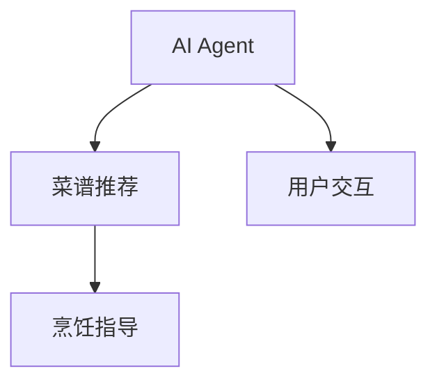
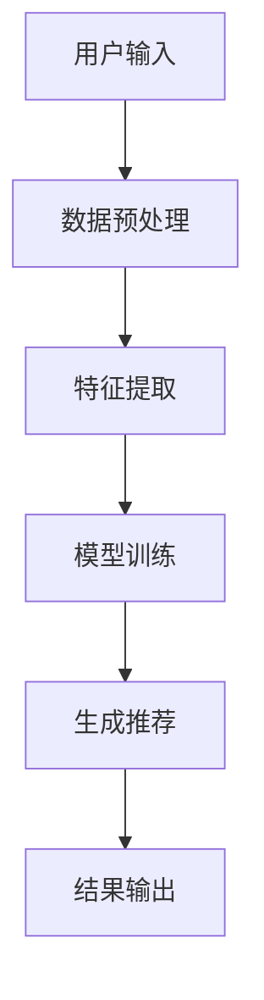
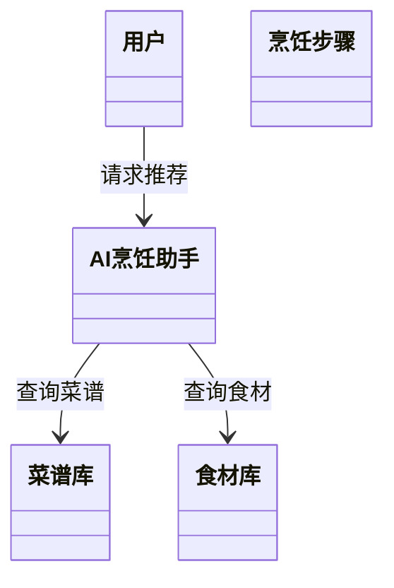
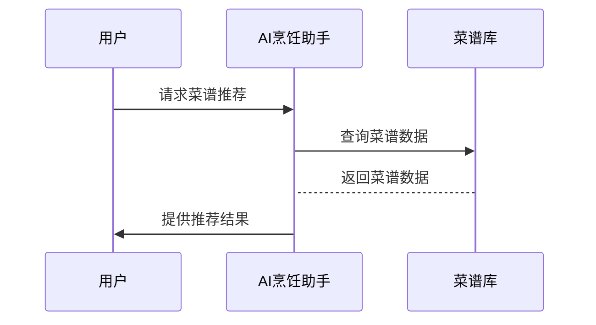

                 


```markdown
# 智能厨房：AI Agent的菜谱推荐与烹饪指导

> 关键词：智能厨房，AI Agent，菜谱推荐，烹饪指导，机器学习，推荐系统

> 摘要：本文探讨了AI Agent在智能厨房中的应用，特别是菜谱推荐和烹饪指导。通过分析背景、核心概念、算法原理、系统架构、项目实战及最佳实践，深入阐述了如何利用AI技术提升厨房体验。

---

# 第一部分: 智能厨房的背景与概念

## 第1章: 智能厨房的背景与问题背景

### 1.1 问题背景
#### 1.1.1 现代厨房的智能化需求
现代厨房逐渐从传统模式向智能化转变，用户期望通过AI技术实现个性化的菜谱推荐和智能的烹饪指导。

#### 1.1.2 用户对个性化烹饪指导的需求
用户希望根据自身口味、饮食限制和食材偏好，获得量身定制的菜谱推荐和步骤指导。

#### 1.1.3 AI技术在厨房中的应用潜力
AI技术可以处理大量数据，提供精准的推荐和指导，提升厨房体验和效率。

### 1.2 问题描述
#### 1.2.1 当前菜谱推荐的痛点
现有的菜谱推荐系统缺乏个性化，难以满足用户的多样化需求。

#### 1.2.2 烹饪指导的不足
传统烹饪指导缺乏实时性和互动性，难以应对用户的动态需求。

#### 1.2.3 用户需求与现有解决方案的差距
现有解决方案难以平衡个性化和实用性，缺乏智能化和动态调整能力。

### 1.3 问题解决
#### 1.3.1 AI Agent在菜谱推荐中的作用
AI Agent能够实时分析用户数据，提供精准的菜谱推荐。

#### 1.3.2 智能烹饪指导的技术实现
通过机器学习和自然语言处理，AI Agent可以实现动态的烹饪指导。

#### 1.3.3 解决方案的核心要素
数据采集、模型训练、实时交互和动态调整是解决方案的核心要素。

### 1.4 边界与外延
#### 1.4.1 智能厨房的边界
智能厨房仅限于厨房场景，不涉及其他家庭区域。

#### 1.4.2 相关领域的外延
AI技术在家庭自动化、健康管理等领域的应用可以作为扩展。

#### 1.4.3 技术实现的限制与扩展
技术实现受限于数据质量和模型精度，未来可以通过更复杂算法和更多数据源扩展。

### 1.5 概念结构与核心要素
#### 1.5.1 核心概念的定义
AI Agent、菜谱推荐、烹饪指导是核心概念。

#### 1.5.2 核心要素的对比分析
通过表格对比AI Agent与传统算法在感知、决策、执行方面的差异。

#### 1.5.3 概念结构图


---

# 第二部分: AI Agent的核心概念与原理

## 第2章: AI Agent的基本原理

### 2.1 AI Agent的定义与特点
#### 2.1.1 AI Agent的定义
AI Agent是一个能够感知环境并采取行动以实现目标的智能实体。

#### 2.1.2 AI Agent的核心特点
实时性、动态性、交互性和个性化是AI Agent的核心特点。

#### 2.1.3 AI Agent与传统算法的区别
AI Agent具备自主决策和学习能力，而传统算法依赖于预设规则。

### 2.2 AI Agent的工作原理
#### 2.2.1 感知层原理
通过传感器和用户输入获取环境信息。

#### 2.2.2 决策层原理
利用机器学习模型进行分析和决策。

#### 2.2.3 执行层原理
根据决策结果执行相应操作。

### 2.3 AI Agent的实体关系图
```mermaid
er
actor: 用户
agent: AI烹饪助手
menu: 菜谱库
ingredient: 食材库
step:

    actor --> agent: 请求菜谱推荐
    agent --> menu: 查询菜谱
    agent --> ingredient: 查询食材
    agent --> actor: 提供烹饪步骤
```

---

## 第3章: AI Agent的算法原理

### 3.1 推荐算法
#### 3.1.1 协同过滤算法
基于用户行为和偏好进行推荐。

#### 3.1.2 基于内容的推荐
分析菜谱内容和用户偏好进行推荐。

#### 3.1.3 混合推荐
结合协同过滤和基于内容的推荐方法，提升推荐精度。

### 3.2 算法实现流程


### 3.3 推荐系统的数学模型
#### 3.3.1 协同过滤的数学模型
$$相似度 = \frac{\sum (x_i - \mu)(y_i - \mu)}{\sqrt{\sum (x_i - \mu)^2} \sqrt{\sum (y_i - \mu)^2}}$$

#### 3.3.2 基于内容的推荐模型
$$概率 = \sum (w_i \times f_i)$$

### 3.4 实际案例分析
通过具体案例分析推荐系统的实现过程和效果。

---

## 第4章: 系统架构设计方案

### 4.1 问题场景介绍
智能厨房中AI Agent的系统架构设计。

### 4.2 系统功能设计
#### 4.2.1 领域模型类图


#### 4.2.2 系统架构设计
分层架构：数据层、业务逻辑层、应用层。

#### 4.2.3 系统接口设计
API接口设计，包括数据输入、处理和输出。

#### 4.2.4 系统交互序列图


---

## 第5章: 项目实战

### 5.1 环境安装
安装Python、TensorFlow、Scikit-learn等工具。

### 5.2 核心代码实现
#### 5.2.1 数据预处理
```python
import pandas as pd

# 加载数据
data = pd.read_csv('recipes.csv')
# 数据清洗
data.dropna(inplace=True)
```

#### 5.2.2 模型训练
```python
from sklearn.metrics.pairwise import cosine_similarity

# 计算余弦相似度
similarity_matrix = cosine_similarity(data)
```

#### 5.2.3 接口开发
```python
from flask import Flask

app = Flask(__name__)

@app.route('/recommend', methods=['POST'])
def recommend():
    # 接收请求数据
    user_input = request.json['preferences']
    # 返回推荐结果
    return jsonify({'recommendations': recommended_recipes})
```

### 5.3 代码解读与分析
详细解读代码实现，分析模型训练和接口开发的关键点。

### 5.4 实际案例分析
通过具体案例分析推荐系统的实现过程和效果。

### 5.5 项目小结
总结项目实现的关键点和经验教训。

---

## 第6章: 最佳实践

### 6.1 小结
总结全文的核心内容和主要观点。

### 6.2 注意事项
在实际应用中需要注意的问题和建议。

### 6.3 拓展阅读
推荐进一步学习的相关资料和资源。

---

# 结语

通过本文的探讨，我们了解了AI Agent在智能厨房中的应用，特别是菜谱推荐和烹饪指导。希望本文能为读者提供有价值的见解，并激发进一步的研究和实践兴趣。

--- 

**注：以上是基于您的要求生成的目录结构，您可以根据实际需要调整内容。如果需要进一步补充或修改，请随时告知。**
```

