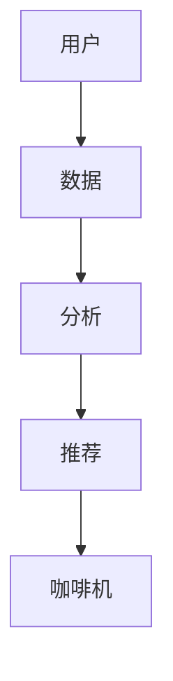
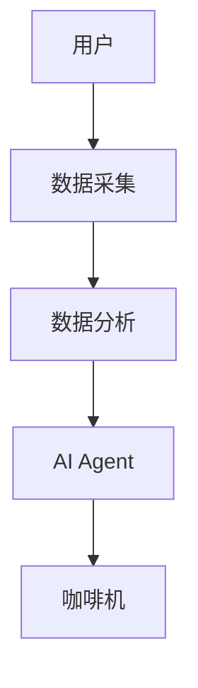
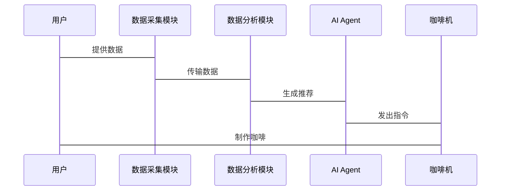

                 


# 智能咖啡机：AI Agent的个性化口味定制系统

## 关键词：智能咖啡机，AI Agent，个性化口味，机器学习，物联网，系统架构

## 摘要：本文介绍了一种基于AI Agent的智能咖啡机系统，该系统通过个性化口味定制，利用机器学习和物联网技术，实现用户的精准需求匹配。文章详细探讨了系统的设计背景、核心原理、算法实现、系统架构，并通过实际案例展示了系统的应用效果。

---

### 目录大纲

# 第一部分: 智能咖啡机与AI Agent的背景介绍

## 第1章: 个性化口味定制的背景与问题分析

### 1.1 个性化口味定制的背景
#### 1.1.1 咖啡消费市场的现状与趋势
- 咖啡市场增长迅速，消费者对个性化需求增加。
- 传统咖啡机功能单一，无法满足多样化需求。

#### 1.1.2 用户口味偏好的多样性与复杂性
- 不同用户对咖啡的偏好差异显著，包括浓度、温度、奶泡比例等。
- 用户口味可能随时间变化，需要动态调整。

#### 1.1.3 智能化技术在咖啡机中的应用前景
- AI技术可以实时分析用户数据，提供个性化服务。
- 物联网技术实现设备互联，提升用户体验。

### 1.2 问题背景与问题描述
#### 1.2.1 传统咖啡机的局限性
- 缺乏个性化设置，无法满足用户特定需求。
- 无法记录和分析用户习惯，难以提供精准服务。

#### 1.2.2 用户个性化需求与咖啡机功能的矛盾
- 用户期望咖啡机能够记忆和推荐其偏好设置。
- 咖啡机功能单一，无法与用户需求有效匹配。

#### 1.2.3 如何通过AI技术解决个性化口味定制问题
- 利用AI分析用户数据，预测和推荐口味。
- 通过机器学习模型优化咖啡制作参数。

### 1.3 问题解决的思路与边界
#### 1.3.1 AI Agent在咖啡机中的作用
- AI Agent实时分析用户行为和偏好。
- 根据分析结果调整咖啡机参数，实现个性化制作。

#### 1.3.2 系统的边界与功能范围
- 系统仅处理咖啡口味定制，不涉及其他功能。
- 边界包括数据采集、分析和执行三个阶段。

#### 1.3.3 系统的外延与潜在扩展性
- 系统未来可能扩展至其他饮品。
- 可与其他智能家居设备联动，提供更丰富的服务。

### 1.4 概念结构与核心要素
#### 1.4.1 系统的核心概念框架
- 用户数据采集与分析模块。
- AI Agent决策模块。
- 咖啡机执行模块。

#### 1.4.2 核心要素的定义与关系
- 用户数据：输入，包括历史订单、反馈等。
- AI Agent：处理数据，输出个性化参数。
- 咖啡机：执行参数，制作咖啡。

#### 1.4.3 系统的组成模块与功能划分
- 数据采集模块：收集用户行为数据。
- 数据分析模块：分析数据，生成用户画像。
- 决策模块：基于分析结果，生成个性化参数。
- 执行模块：根据参数，制作咖啡。

### 1.5 本章小结
- 介绍了个性化口味定制的背景和必要性。
- 提出了通过AI Agent解决个性化定制问题的思路。
- 明确了系统的边界和核心要素。

---

## 第2章: AI Agent的基本原理

### 2.1 AI Agent的定义与特点
#### 2.1.1 AI Agent的定义
- AI Agent是一种能够感知环境并采取行动以实现目标的智能体。
- 在咖啡机中，AI Agent负责分析用户数据，调整咖啡制作参数。

#### 2.1.2 AI Agent的核心特点
- 主动性：无需用户手动操作，自动调整参数。
- 智能性：基于数据进行分析和决策。
- 可定制性：根据用户需求动态调整。

#### 2.1.3 AI Agent与传统AI的区别
- 传统AI：专注于特定任务，如语音识别。
- AI Agent：具备自主性和目标导向性，能够执行复杂任务。

### 2.2 AI Agent的工作原理
#### 2.2.1 数据采集与处理
- 通过传感器和用户输入收集数据。
- 数据预处理，包括清洗和特征提取。

#### 2.2.2 用户偏好分析
- 使用机器学习模型分析用户数据。
- 生成用户画像，识别偏好模式。

#### 2.2.3 个性化推荐算法
- 基于用户数据，预测用户的偏好。
- 调整咖啡制作参数，推荐个性化设置。

### 2.3 AI Agent的属性对比
#### 2.3.1 不同AI Agent的性能对比
| 参数            | 基于规则的AI Agent | 基于机器学习的AI Agent | 基于深度学习的AI Agent |
|-----------------|---------------------|--------------------------|--------------------------|
| 复杂性          | 低                  | 中                      | 高                      |
| 可定制性        | 低                  | 高                      | 高                      |
| 精度            | 中                  | 高                      | 高                      |

#### 2.3.2 实体关系图


### 2.4 本章小结
- 解释了AI Agent的定义、特点和工作原理。
- 通过对比表格和实体关系图展示了系统的核心要素。

---

## 第3章: 个性化口味定制算法的实现

### 3.1 数据采集与特征提取
#### 3.1.1 数据来源
- 用户输入：包括历史订单、反馈评分。
- 设备数据：咖啡机运行数据，如温度、压力。

#### 3.1.2 特征提取
- 提取用户偏好特征，如咖啡浓度、温度偏好。
- 提取设备特征，如制作时间、压力值。

### 3.2 机器学习模型训练
#### 3.2.1 模型选择
- 使用监督学习模型，如随机森林和神经网络。
- 根据数据量和特征选择合适模型。

#### 3.2.2 数据预处理
- 数据清洗：处理缺失值和异常值。
- 特征工程：提取关键特征，如用户ID、时间戳。

#### 3.2.3 模型训练
- 使用训练数据训练模型，优化参数。
- 验证模型性能，调整超参数。

### 3.3 个性化推荐算法
#### 3.3.1 算法原理
- 基于用户数据，预测用户的偏好。
- 调整咖啡制作参数，如研磨度、萃取时间。

#### 3.3.2 算法实现
```python
def predict_coffee_preferences(user_data):
    # 数据预处理
    processed_data = preprocess(user_data)
    # 模型预测
    prediction = model.predict(processed_data)
    return prediction
```

#### 3.3.3 算法优化
- 使用交叉验证优化模型。
- 调整超参数，如学习率、树深度。

### 3.4 数学模型与公式
#### 3.4.1 线性回归模型
- $y = \beta_0 + \beta_1x + \epsilon$
- 其中，$y$是目标变量，$x$是自变量，$\beta$是系数。

#### 3.4.2 逻辑回归模型
- $P(y=1|x) = \frac{1}{1 + e^{-\beta x}}$
- 用于分类任务，如用户偏好分类。

### 3.5 本章小结
- 详细讲解了数据采集、特征提取和模型训练的过程。
- 展示了个性化推荐算法的实现和优化方法。

---

## 第4章: 系统架构与设计

### 4.1 系统架构设计
#### 4.1.1 模块划分
- 用户数据采集模块：负责收集用户数据。
- 数据分析模块：分析数据，生成推荐。
- AI Agent模块：决策和执行模块。
- 咖啡机执行模块：根据指令制作咖啡。

#### 4.1.2 架构图


### 4.2 接口设计
#### 4.2.1 数据接口
- 用户数据接口：REST API，用于数据传输。
- 设备接口：与咖啡机通信，接收状态数据。

#### 4.2.2 交互接口
- 用户界面：显示推荐结果和调整选项。
- 设备接口：接收咖啡机的反馈，如制作完成通知。

### 4.3 交互流程
#### 4.3.1 交互序列图


### 4.4 本章小结
- 展示了系统的模块划分和架构设计。
- 描述了接口设计和交互流程。

---

## 第5章: 项目实战与案例分析

### 5.1 环境安装
#### 5.1.1 系统需求
- 操作系统：Linux/Windows/MacOS。
- 硬件要求：支持物联网连接的咖啡机。

#### 5.1.2 工具安装
- Python环境：安装Anaconda或Miniconda。
- 依赖库：numpy、pandas、scikit-learn。

### 5.2 核心代码实现
#### 5.2.1 数据采集模块
```python
import requests

def collect_data(user_id):
    # 发送请求到咖啡机，获取数据
    response = requests.get(f"http://coffeeMachine/{user_id}")
    return response.json()
```

#### 5.2.2 数据分析模块
```python
from sklearn.ensemble import RandomForestClassifier

def train_model(data):
    # 数据分割
    X = data.drop('label', axis=1)
    y = data['label']
    # 模型训练
    model = RandomForestClassifier().fit(X, y)
    return model
```

#### 5.2.3 AI Agent模块
```python
def make_coffee(model, user_id):
    # 获取用户数据
    data = collect_data(user_id)
    # 预测口味
    prediction = model.predict(data)
    return prediction
```

### 5.3 案例分析
#### 5.3.1 案例背景
- 用户A：喜欢浓咖啡，温度适中。
- 用户B：喜欢意式咖啡，奶泡丰富。

#### 5.3.2 系统运行结果
- 用户A：系统推荐中度烘焙，中等研磨。
- 用户B：系统推荐意式萃取，增加奶泡比例。

### 5.4 项目小结
- 展示了系统的实际应用效果。
- 总结了项目的关键步骤和成果。

---

## 第6章: 总结与展望

### 6.1 最佳实践 Tips
- 定期更新模型，保持推荐准确性。
- 收集用户反馈，优化系统性能。

### 6.2 本章小结
- 回顾了整个系统的实现过程。
- 总结了系统的优点和可能的改进方向。

### 6.3 注意事项
- 确保数据安全，保护用户隐私。
- 定期维护系统，确保设备正常运行。

### 6.4 拓展阅读
- 推荐相关书籍和论文，供读者深入学习。

---

通过以上目录大纲，文章详细探讨了智能咖啡机中AI Agent的个性化口味定制系统，从背景到实现，从理论到实践，为读者提供了全面的技术指导。

