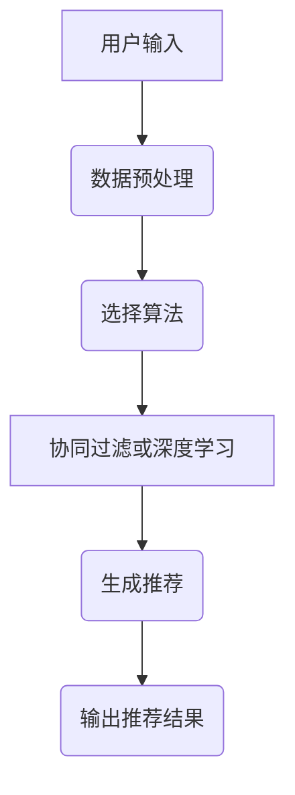
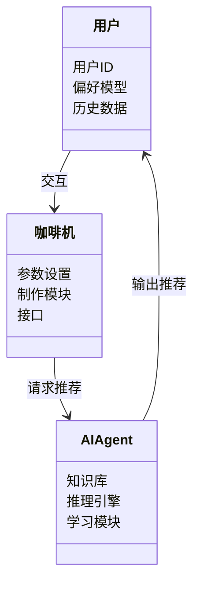
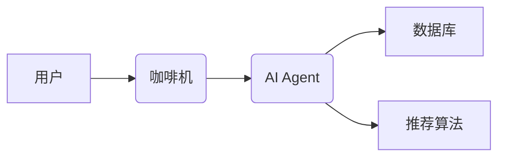
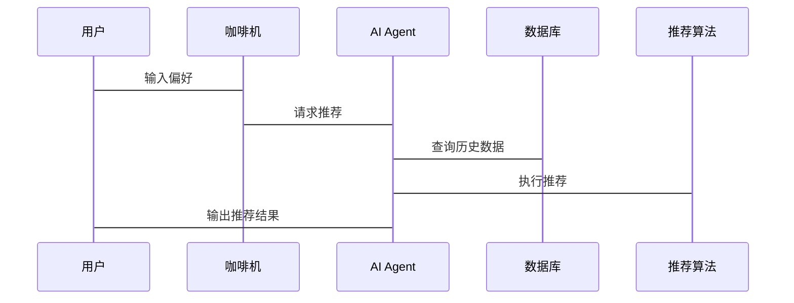

                 


# 智能咖啡机：AI Agent的咖啡口味个性化定制

---

## 关键词：
智能咖啡机, AI Agent, 个性化定制, 咖啡口味, 推荐系统, 深度学习

---

## 摘要：
本文探讨了AI Agent技术在智能咖啡机中的应用，特别是如何通过个性化定制咖啡口味来提升用户体验。文章详细分析了AI Agent的核心原理，介绍了基于协同过滤和深度学习的推荐算法，并通过系统架构设计和项目实战展示了如何实现这一技术。通过本文，读者将了解如何利用AI Agent优化咖啡制作过程，满足用户的个性化需求。

---

## 第一部分：智能咖啡机与AI Agent的背景介绍

### 第1章：智能咖啡机的发展历程

#### 1.1 传统咖啡机的局限性
- **1.1.1 传统咖啡机的功能与不足**
  传统咖啡机虽然功能多样，但缺乏智能化，无法根据用户的口味偏好自动调整咖啡参数。
- **1.1.2 用户需求的多样化与个性化**
  用户对咖啡的口味、浓度、温度等有不同的偏好，传统咖啡机难以满足个性化需求。
- **1.1.3 咖啡机智能化的必要性**
  随着科技的发展，用户对智能设备的需求增加，智能化咖啡机成为趋势。

#### 1.2 AI Agent的基本概念
- **1.2.1 什么是AI Agent**
  AI Agent（人工智能代理）是一种能够感知环境并采取行动以实现目标的智能体。
- **1.2.2 AI Agent的核心特征**
  | 特征 | 描述 |
  |------|------|
  | 感知 | 能够接收并处理环境中的信息 |
  | 推理 | 能够基于感知信息进行推理 |
  | 行动 | 能够根据推理结果采取行动 |
  | 学习 | 能够通过经验改进性能 |
- **1.2.3 AI Agent在智能咖啡机中的应用**
  AI Agent可以实时感知用户的口味偏好，并通过调整咖啡机参数提供个性化的咖啡体验。

#### 1.3 咖啡口味个性化定制的背景与意义
- **1.3.1 咖啡文化的发展趋势**
  咖啡文化逐渐普及，用户对咖啡品质和个性化的追求增加。
- **1.3.2 用户对个性化咖啡的需求**
  用户希望根据自己的口味偏好定制咖啡，而不仅仅是固定的选择。
- **1.3.3 个性化定制对咖啡机技术的要求**
  个性化定制需要咖啡机具备智能化和自适应能力，能够根据用户反馈调整制作参数。

---

## 第二部分：AI Agent与咖啡口味个性化的核心概念

### 第2章：AI Agent与咖啡口味个性化的核心概念

#### 2.1 AI Agent的核心原理
- **2.1.1 知识表示与推理**
  AI Agent通过知识表示（如语义网络）进行推理，理解用户的偏好。
- **2.1.2 自然语言处理（NLP）在咖啡机中的应用**
  用户可以通过自然语言输入偏好，AI Agent通过NLP技术理解并转化为咖啡机的操作指令。
- **2.1.3 动态学习与优化**
  AI Agent能够根据用户的反馈动态调整推荐策略，优化咖啡口味。

#### 2.2 咖啡口味个性化的核心要素
- **2.2.1 用户口味偏好分析**
  通过收集用户的历史数据，分析用户的口味偏好，建立用户画像。
- **2.2.2 咖啡豆与制作工艺的多样性**
  不同的咖啡豆和制作工艺会影响咖啡的口感，AI Agent需要考虑这些因素。
- **2.2.3 环境因素对咖啡口感的影响**
  温度、湿度等环境因素会影响咖啡的口感，AI Agent需要实时感知并调整。

#### 2.3 AI Agent与咖啡口味个性化的联系
- **2.3.1 AI Agent如何理解用户需求**
  AI Agent通过用户输入和历史数据，建立用户偏好模型，理解用户的口味需求。
- **2.3.2 AI Agent如何优化咖啡制作过程**
  AI Agent根据用户的偏好和环境因素，优化咖啡机的参数设置，提升制作效率和口感。
- **2.3.3 AI Agent如何实现个性化推荐**
  AI Agent通过推荐算法，为用户提供个性化的咖啡配方建议，满足用户的多样化需求。

---

## 第三部分：AI Agent的算法原理与数学模型

### 第3章：AI Agent的算法原理

#### 3.1 基于协同过滤的推荐算法
- **3.1.1 协同过滤的基本原理**
  协同过滤通过寻找与目标用户具有相似偏好的其他用户，推荐他们喜欢的物品。
- **3.1.2 基于用户的协同过滤**
  - **步骤**：
    1. 找到与目标用户相似的用户群体。
    2. 推荐这些用户喜欢的咖啡配方。
  - **公式**：
    $$相似度 = \frac{\sum (r_i - \bar{r}) \times (r_j - \bar{r})}{\sqrt{\sum (r_i - \bar{r})^2} \times \sqrt{\sum (r_j - \bar{r})^2}}$$
- **3.1.3 基于物品的协同过滤**
  - **步骤**：
    1. 找到与目标用户喜欢的咖啡配方相似的其他配方。
    2. 推荐这些配方给目标用户。
  - **公式**：
    $$相似度 = \frac{\sum r_i \times r_j}{\sqrt{\sum r_i^2} \times \sqrt{\sum r_j^2}}$$

#### 3.2 基于深度学习的推荐算法
- **3.2.1 神经网络在推荐系统中的应用**
  神经网络可以处理复杂的非线性关系，捕捉用户的隐式偏好。
- **3.2.2 基于Transformer的推荐模型**
  - **步骤**：
    1. 将用户偏好和咖啡属性映射到嵌入空间。
    2. 使用自注意力机制进行特征提取。
    3. 输出推荐结果。
  - **公式**：
    $$\text{输出} = \text{Self-Attention}(Q, K, V)$$
- **3.2.3 深度强化学习在咖啡机中的应用**
  - **步骤**：
    1. 状态空间：用户偏好、环境因素。
    2. 动作空间：咖啡机参数调整。
    3. 奖励函数：用户满意度评分。
  - **公式**：
    $$Q(s, a) = Q(s, a) + \alpha (r + \gamma \max Q(s', a') - Q(s, a))$$

#### 3.3 算法流程图（Mermaid）


---

## 第四部分：系统分析与架构设计

### 第4章：系统分析与架构设计

#### 4.1 系统场景介绍
- 用户通过智能咖啡机输入口味偏好，系统根据AI Agent的推荐生成个性化的咖啡配方。

#### 4.2 项目介绍
- 本项目旨在开发一款支持AI Agent的智能咖啡机，实现咖啡口味的个性化定制。

#### 4.3 系统功能设计（领域模型）


#### 4.4 系统架构设计（架构图）


#### 4.5 系统交互设计（交互序列图）


---

## 第五部分：项目实战

### 第5章：项目实战

#### 5.1 环境安装
- 安装Python、TensorFlow、Keras等依赖库。

#### 5.2 系统核心实现源代码
```python
import numpy as np
from sklearn.metrics.pairwise import cosine_similarity

# 示例协同过滤算法实现
class CollaborativeFiltering:
    def __init__(self, user_data):
        self.user_data = user_data
        self.user_ids = user_data.index
        self.item_ids = user_data.columns
        self.user_item_matrix = user_data.values

    def compute_similarities(self):
        self.similarities = cosine_similarity(self.user_item_matrix)

    def recommend(self, user_id, top_n=3):
        user_index = np.where(self.user_ids == user_id)[0][0]
        similarities = self.similarities[user_index]
        recommendations = []
        for i in range(len(similarities)):
            if i != user_index:
                recommendations.append((self.item_ids[i], similarities[i]))
        recommendations.sort(key=lambda x: x[1], reverse=True)
        return recommendations[:top_n]

# 使用示例
user_data = pd.DataFrame({
    'user1': [5, 3, 0, 0],
    'user2': [3, 4, 0, 0],
    'user3': [0, 0, 5, 4],
    'user4': [0, 0, 4, 5]
})
cf = CollaborativeFiltering(user_data)
cf.compute_similarities()
print(cf.recommend('user1'))
```

#### 5.3 代码应用解读与分析
- 以上代码实现了基于用户的协同过滤算法，用户可以通过输入偏好，获得个性化的咖啡推荐。

#### 5.4 实际案例分析
- 案例：用户A偏好浓咖啡，系统根据历史数据推荐深度烘焙的咖啡豆和较长的萃取时间。

#### 5.5 项目小结
- 通过该项目，读者可以掌握AI Agent在智能咖啡机中的实现方法，理解推荐系统的原理和应用。

---

## 第六部分：总结与展望

### 6.1 最佳实践 Tips
- 定期更新用户偏好模型，保持推荐的准确性。
- 结合用户反馈优化推荐算法，提升用户体验。

### 6.2 小结
本文详细介绍了AI Agent在智能咖啡机中的应用，从背景介绍到系统设计，再到项目实战，全面展示了如何实现咖啡口味的个性化定制。

### 6.3 注意事项
- 数据隐私保护：确保用户数据的安全性。
- 系统稳定性：保证推荐系统的实时性和可靠性。

### 6.4 拓展阅读
- 深入学习深度学习在推荐系统中的应用。
- 探索多模态推荐技术在咖啡机中的潜力。

---

通过本文的学习，读者可以掌握AI Agent在智能咖啡机中的实现方法，理解推荐系统的原理和应用，为未来的智能化咖啡机开发提供参考。

