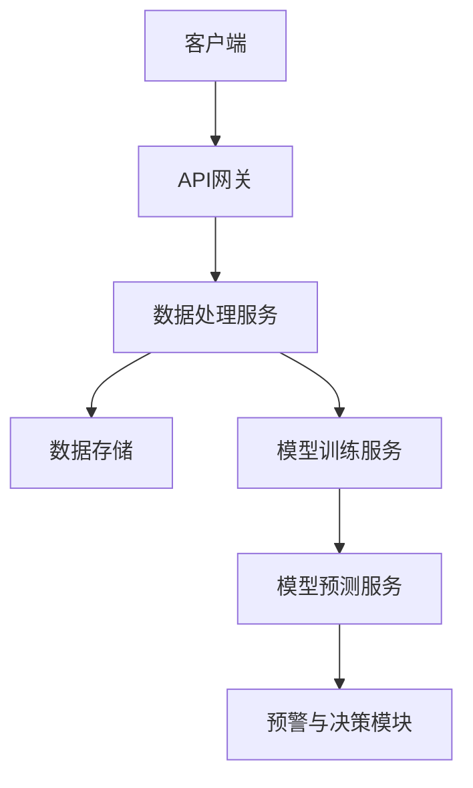
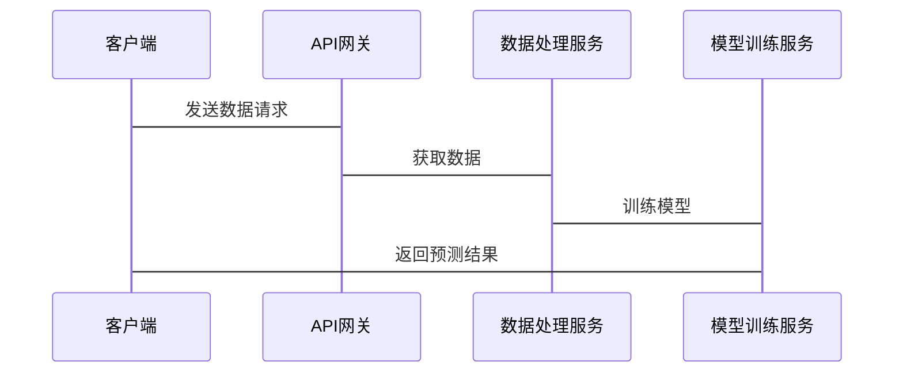

                 


# 智能商业银行存款流失预测

> 关键词：智能商业银行，存款流失预测，机器学习，深度学习，数据分析

> 摘要：本文详细探讨了智能商业银行中存款流失预测的背景、核心概念、算法原理、系统架构以及实际应用。通过分析客户行为、市场环境和产品服务等关键因素，结合逻辑回归、随机森林和深度学习模型，提出了一套高效的预测方法，并通过系统设计和实战案例展示了其在实际业务中的应用价值。

---

# 第一部分: 智能商业银行存款流失预测背景与核心概念

## 第1章: 商业银行存款流失预测的背景与问题描述

### 1.1 问题背景

#### 1.1.1 商业银行存款流失的现状

近年来，随着金融市场的竞争加剧，商业银行存款流失问题日益严重。客户流失不仅影响银行的收入，还可能导致客户信任度下降，影响银行的声誉。传统预测方法依赖人工分析，效率低下且精度不足，难以应对日益复杂的市场环境。

#### 1.1.2 智能化预测的重要性

智能化预测能够通过数据分析和机器学习模型，快速识别潜在流失客户，帮助银行制定精准的营销策略，从而降低存款流失率。智能化预测能够实时监控客户行为，提前预警，显著提升预测效率和准确性。

#### 1.1.3 传统预测方法的局限性

传统预测方法通常依赖历史数据分析，缺乏实时性和动态性，难以捕捉客户的短期行为变化。此外，传统方法往往忽视客户个体差异，导致预测结果不够精准。

### 1.2 问题描述

#### 1.2.1 存款流失的定义与分类

存款流失是指客户在一定时期内减少存款金额或完全终止存款关系的行为。根据流失的时间和方式，可以将其分为短期流失和长期流失两类。

#### 1.2.2 问题的边界与外延

存款流失预测不仅关注客户流失的直接原因，还需要考虑市场环境、宏观经济指标等因素。预测的边界包括客户的基本信息、交易行为和市场环境数据，而外延则涉及客户流失后的复挽回策略。

#### 1.2.3 核心要素与概念结构

存款流失预测的核心要素包括客户特征、交易行为和市场环境。客户特征包括年龄、性别和职业等，交易行为包括存款金额和交易频率，市场环境包括经济指标和行业竞争情况。

## 第2章: 智能商业银行存款流失预测的核心概念

### 2.1 智能商业银行的定义与特征

#### 2.1.1 智能商业银行的定义

智能商业银行是指通过人工智能技术实现业务流程自动化、客户行为分析和风险管理的现代化商业银行。

#### 2.1.2 智能化的核心特征

智能化商业银行具有实时性、个性化和数据驱动三大特征。实时性体现在对客户行为的即时响应，个性化体现在根据客户需求定制服务，数据驱动体现在依靠数据分析制定决策。

#### 2.1.3 数据驱动的业务模式

数据驱动的业务模式通过收集和分析客户数据，优化业务流程，提升服务质量，增强客户满意度。

### 2.2 存款流失预测的关键要素

#### 2.2.1 客户行为分析

客户行为分析包括对客户的存款余额、交易频率和账户活跃度的分析。通过分析这些行为数据，可以识别潜在的流失客户。

#### 2.2.2 市场环境因素

市场环境因素包括宏观经济指标、行业竞争情况和政策法规变化。这些因素会影响客户的存款行为和银行的经营策略。

#### 2.2.3 产品与服务的影响

产品与服务的影响体现在银行产品的创新和客户服务的质量上。优质的金融产品和服务能够有效降低存款流失率。

### 2.3 智能预测的核心流程

#### 2.3.1 数据采集与处理

数据采集与处理包括数据清洗、特征提取和数据标准化。这些步骤确保数据质量和一致性，为后续建模做好准备。

#### 2.3.2 特征提取与分析

特征提取与分析是通过统计分析和可视化方法，识别影响存款流失的关键特征。常用的方法包括相关性分析和主成分分析（PCA）。

#### 2.3.3 模型训练与优化

模型训练与优化包括选择合适的机器学习算法、调整模型参数和评估模型性能。通过交叉验证和网格搜索等方法，优化模型的准确性和稳定性。

---

# 第二部分: 算法原理与数学模型

## 第3章: 机器学习算法原理

### 3.1 常见算法概述

#### 3.1.1 逻辑回归

逻辑回归是一种常用的分类算法，适用于二分类问题。其核心思想是通过sigmoid函数将线性回归的输出映射到概率空间。

$$ P(y=1|x) = \frac{1}{1 + e^{- (w \cdot x + b)}} $$

#### 3.1.2 支持向量机

支持向量机通过构建超平面实现数据的线性可分。对于非线性问题，可以使用核函数将数据映射到高维空间。

#### 3.1.3 随机森林

随机森林是一种基于决策树的集成算法，通过随机采样和特征选择，提升模型的泛化能力。

### 3.2 算法选择与优化

#### 3.2.1 算法性能对比

通过准确率、召回率和F1分数等指标，对比不同算法的性能表现。

#### 3.2.2 超参数调优

使用网格搜索和交叉验证方法，优化模型的超参数，如逻辑回归的C值和随机森林的树数。

#### 3.2.3 模型评估指标

准确率、精确率、召回率和F1分数是常用的模型评估指标。

## 第4章: 深度学习算法原理

### 4.1 神经网络基础

#### 4.1.1 感知机与多层感知机

感知机是线性分类器的基础，而多层感知机通过引入隐藏层，能够处理非线性问题。

#### 4.1.2 长短期记忆网络（LSTM）

LSTM通过门控机制，有效捕捉时间序列数据中的长距离依赖关系。

#### 4.1.3 注意力机制（Attention）

注意力机制通过计算输入序列中各元素的重要性，提升模型的语义理解能力。

### 4.2 深度学习模型构建

#### 4.2.1 模型结构设计

设计一个包含输入层、LSTM层、全连接层和输出层的深度学习模型。

#### 4.2.2 梯度下降与反向传播

使用交叉熵损失函数和Adam优化器，通过反向传播算法更新模型参数。

#### 4.2.3 模型训练与验证

通过训练集和验证集的分离，监控模型的过拟合问题，调整模型结构和超参数。

## 第5章: 数学模型与公式解析

### 5.1 逻辑回归模型

#### 5.1.1 概率函数

$$ P(y=1|x) = \frac{1}{1 + e^{-(w \cdot x + b)}} $$

#### 5.1.2 损失函数

$$ L = - \sum_{i=1}^{n} [y_i \ln h(x_i) + (1 - y_i) \ln (1 - h(x_i))] $$

其中，$h(x_i) = \frac{1}{1 + e^{-(w \cdot x_i + b)}}$。

---

# 第三部分: 系统分析与架构设计

## 第6章: 系统分析与架构设计

### 6.1 问题场景介绍

商业银行需要实时监控客户存款行为，预测潜在流失客户，并制定精准的营销策略。

### 6.2 系统功能设计

#### 6.2.1 数据采集模块

通过API接口和数据库查询，采集客户的交易数据和基本信息。

#### 6.2.2 数据预处理模块

对采集到的数据进行清洗、标准化和特征提取，确保数据质量。

#### 6.2.3 模型训练模块

基于预处理后的数据，训练机器学习和深度学习模型，优化模型参数。

#### 6.2.4 预警与决策模块

根据模型预测结果，生成客户流失预警，并制定针对性的营销策略。

### 6.3 系统架构设计

#### 6.3.1 系统架构图



#### 6.3.2 系统接口设计

系统接口包括数据采集接口、模型训练接口和预警通知接口。

#### 6.3.3 系统交互流程图



---

# 第四部分: 项目实战与总结

## 第7章: 项目实战

### 7.1 环境安装

安装Python和必要的库，如scikit-learn、TensorFlow和Pandas。

### 7.2 核心代码实现

#### 7.2.1 数据预处理代码

```python
import pandas as pd
from sklearn.preprocessing import StandardScaler

# 读取数据
data = pd.read_csv('customer_data.csv')

# 分离特征与标签
X = data.drop('label', axis=1)
y = data['label']

# 标准化处理
scaler = StandardScaler()
X_scaled = scaler.fit_transform(X)
```

#### 7.2.2 逻辑回归模型训练

```python
from sklearn.linear_model import LogisticRegression
from sklearn.metrics import accuracy_score

# 训练模型
model = LogisticRegression()
model.fit(X_scaled, y)

# 预测与评估
y_pred = model.predict(X_scaled)
print(accuracy_score(y, y_pred))
```

#### 7.2.3 LSTM模型实现

```python
import tensorflow as tf
from tensorflow.keras.layers import LSTM, Dense, Dropout

# 构建模型
model = tf.keras.Sequential([
    LSTM(64, return_sequences=True),
    Dropout(0.2),
    LSTM(32),
    Dense(1, activation='sigmoid')
])

# 编译模型
model.compile(loss='binary_crossentropy', optimizer='adam', metrics=['accuracy'])

# 训练模型
model.fit(X_train, y_train, epochs=10, batch_size=32)
```

### 7.3 案例分析与解读

通过实际案例分析，展示模型如何预测客户流失，并制定相应的营销策略。

### 7.4 项目小结

总结项目的实施过程，分析模型的优缺点，并提出改进建议。

---

## 第8章: 总结与展望

### 8.1 总结

本文详细探讨了智能商业银行存款流失预测的方法和实现过程，展示了如何通过机器学习和深度学习技术，提升预测的准确性和效率。

### 8.2 展望

未来，随着人工智能技术的不断发展，存款流失预测将更加智能化和个性化。银行可以进一步优化模型，引入更多数据源，提升预测的精度和实时性。

---

# 附录

## 附录A: 数据集描述

描述数据集的字段含义和获取方式。

## 附录B: 参考文献

列出文章中引用的主要文献和资料。

---

通过本文的详细分析，读者可以全面了解智能商业银行存款流失预测的实现方法和应用价值，为实际业务提供有力支持。

