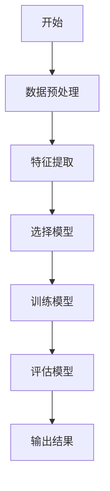
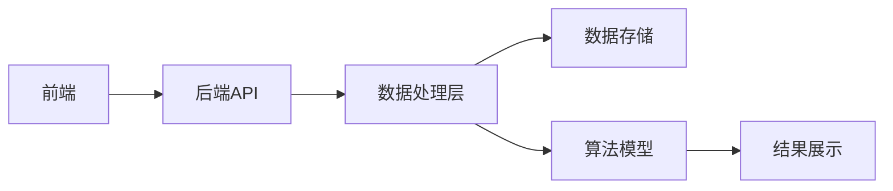
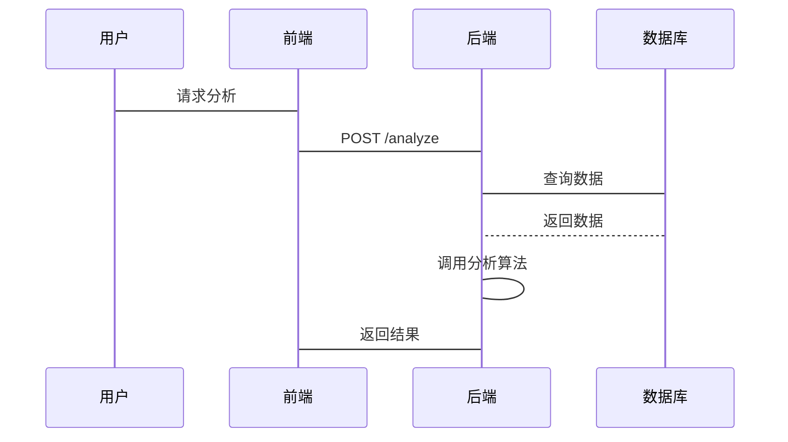

                 


# 《智能商业银行客户价值分析》

---

## 关键词：
智能商业银行、客户价值分析、人工智能、大数据、RFM模型、聚类分析、机器学习

---

## 摘要：
智能商业银行通过人工智能和大数据技术，对客户价值进行深度分析，优化客户服务和运营效率。本文系统介绍智能商业银行的概念、客户价值分析的核心理论、算法原理、系统架构设计以及实际应用案例，帮助读者全面理解智能商业银行客户价值分析的实现方法和应用价值。

---

# 第一部分: 智能商业银行客户价值分析概述

## 第1章: 智能商业银行与客户价值分析概述

### 1.1 智能商业银行的定义与特点

#### 1.1.1 智能商业银行的定义
智能商业银行是一种结合人工智能和大数据技术，提供智能化服务的现代商业银行。它通过自动化决策、智能推荐和实时数据分析，优化客户体验和运营效率。

#### 1.1.2 智能商业银行的核心特点
- **智能化服务**：利用AI技术实现自动化服务，如智能客服和自动推荐。
- **个性化体验**：通过数据分析为客户提供定制化服务。
- **实时决策**：基于实时数据进行快速决策，提升风险控制能力。
- **数据驱动**：以数据为基础，优化业务流程和决策。

#### 1.1.3 智能商业银行与传统商业银行的区别
| 特性             | 智能商业银行                   | 传统商业银行                   |
|------------------|-------------------------------|-------------------------------|
| 服务模式         | 数据驱动、自动化               | 人工驱动、流程化               |
| 技术基础         | AI、大数据                     | 线下业务、传统技术             |
| 客户体验         | 个性化、实时反馈             | 标准化、延迟反馈               |

### 1.2 客户价值分析的定义与重要性

#### 1.2.1 客户价值分析的定义
客户价值分析是通过分析客户的行为、特征和贡献，评估客户对银行的价值，并制定相应的策略以提升客户价值的过程。

#### 1.2.2 客户价值分析的重要性
- **提高客户满意度**：通过分析客户需求，提供个性化服务。
- **优化资源配置**：识别高价值客户，集中资源提升其价值。
- **提升银行利润**：通过精准营销和风险管理，提高收益。

#### 1.2.3 客户价值分析在智能商业银行中的应用
- **客户分群**：基于行为数据进行客户细分，制定差异化策略。
- **风险控制**：通过数据分析识别高风险客户，降低不良率。
- **精准营销**：基于客户价值进行精准营销，提高转化率。

### 1.3 智能商业银行客户价值分析的背景与意义

#### 1.3.1 问题背景
- 金融市场竞争加剧，客户需求多样化。
- 传统银行服务难以满足现代客户需求。

#### 1.3.2 问题描述
- 客户流失率高，客户体验差。
- 营销策略不够精准，资源浪费。

#### 1.3.3 问题解决
- 引入AI和大数据技术，提升客户分析能力。
- 实现个性化服务和精准营销。

#### 1.3.4 边界与外延
- **边界**：聚焦于客户价值分析，不涉及银行其他业务。
- **外延**：技术可扩展至其他金融领域，如股票交易和保险业务。

#### 1.3.5 核心要素组成
- 数据采集：收集客户行为、交易数据。
- 数据分析：使用算法模型进行客户分群和价值预测。
- 结果应用：制定策略优化客户服务。

---

## 第2章: 智能商业银行客户价值分析的核心概念与联系

### 2.1 核心概念原理

#### 2.1.1 客户价值的核心要素
- **客户生命周期**：从获取到流失的全过程。
- **客户满意度**：客户对服务的满意程度。
- **客户忠诚度**：客户持续使用银行服务的程度。

#### 2.1.2 智能分析的技术基础
- **大数据技术**：处理海量数据，提取有价值的信息。
- **人工智能**：实现自动化分析和预测。
- **机器学习**：通过训练模型优化分析结果。

#### 2.1.3 数据驱动的决策机制
- 数据采集：收集客户行为数据。
- 数据分析：利用算法处理数据，生成洞察。
- 决策优化：根据分析结果优化策略。

### 2.2 核心概念属性特征对比

| 概念        | 特征               | 重要性     |
|-------------|--------------------|------------|
| Recency     | 最近交易时间       | 高         |
| Frequency    | 交易频率           | 中         |
| Monetary     | 交易金额           | 高         |
| Satisfaction | 客户满意度         | 高         |
| Loyalty      | 客户忠诚度         | 高         |

### 2.3 ER实体关系图架构

```mermaid
erDiagram
    customer {
        id
        name
        email
        phone
    }
    transaction {
        id
        amount
        datetime
        customer_id
    }
    product {
        id
        name
        type
    }
    customer --| many : owns -> transaction
    customer --| many : owns -> product
    transaction --| one : belongs_to -> product
```

---

## 第3章: 智能商业银行客户价值分析的算法原理

### 3.1 算法原理概述

#### 3.1.1 基于RFM模型的客户价值分析
RFM模型通过客户最近一次交易（Recency）、交易频率（Frequency）和交易金额（Monetary）来评估客户价值。

#### 3.1.2 基于聚类分析的客户分群
聚类分析将客户分为不同的群组，便于制定差异化策略。

#### 3.1.3 基于机器学习的客户价值预测
机器学习模型（如随机森林）用于预测客户未来价值。

### 3.2 算法原理详细讲解

#### 3.2.1 RFM模型的数学公式
$$ RFM = Recency \times Frequency \times Monetary $$

#### 3.2.2 聚类分析的数学公式
$$ 距离公式：d(x,y) = \sqrt{(x_1 - y_1)^2 + (x_2 - y_2)^2} $$

#### 3.2.3 机器学习模型的数学公式
$$ y = \beta_0 + \beta_1 x_1 + \beta_2 x_2 + \dots + \beta_n x_n + \epsilon $$

#### 3.2.4 算法流程图



### 3.3 算法实现代码

#### 3.3.1 Python代码实现
```python
import pandas as pd
from sklearn.cluster import KMeans

# 数据预处理
data = pd.read_csv('customer_data.csv')
data.dropna(inplace=True)

# 特征提取
features = data[['recency', 'frequency', 'monetary']]

# 模型训练
model = KMeans(n_clusters=5)
model.fit(features)

# 预测结果
clusters = model.predict(features)
```

#### 3.3.2 代码功能解读
- 数据预处理：清洗数据，处理缺失值。
- 特征提取：选择相关特征，如recency、frequency、monetary。
- 模型训练：使用K-Means算法进行聚类分析。
- 预测结果：对客户进行分群，生成客户价值评分。

---

## 第4章: 智能商业银行客户价值分析的系统分析与架构设计

### 4.1 系统分析

#### 4.1.1 项目背景
银行希望通过智能分析提升客户价值，优化服务策略。

#### 4.1.2 系统功能设计
- 数据采集：收集客户交易数据。
- 数据分析：使用算法模型进行客户分群。
- 结果展示：生成可视化报告，辅助决策。

#### 4.1.3 系统架构设计



### 4.2 接口设计与交互流程

#### 4.2.1 RESTful API接口
- GET /customers：获取客户数据。
- POST /analyze：触发分析任务。
- GET /results：获取分析结果。

#### 4.2.2 交互流程图



---

## 第5章: 智能商业银行客户价值分析的项目实战

### 5.1 项目实战环境安装

#### 5.1.1 安装Python
```bash
python --version
pip install --upgrade pip
```

#### 5.1.2 安装依赖库
```bash
pip install pandas scikit-learn matplotlib
```

### 5.2 核心代码实现

#### 5.2.1 数据预处理
```python
import pandas as pd
import numpy as np

data = pd.read_csv('customer.csv')
data.dropna(inplace=True)
```

#### 5.2.2 特征工程
```python
from sklearn.preprocessing import StandardScaler

features = data[['recency', 'frequency', 'monetary']]
scaler = StandardScaler()
features_scaled = scaler.fit_transform(features)
```

#### 5.2.3 模型训练
```python
from sklearn.cluster import KMeans

model = KMeans(n_clusters=5)
model.fit(features_scaled)
```

#### 5.2.4 可视化
```python
import matplotlib.pyplot as plt

plt.scatter(features_scaled[:,0], features_scaled[:,1], c=model.labels_)
plt.xlabel('Recency')
plt.ylabel('Frequency')
plt.show()
```

### 5.3 实际案例分析

#### 5.3.1 数据分析结果
- **客户分群**：分为高价值、中价值、低价值客户。
- **价值预测**：预测未来三个月的交易金额。

#### 5.3.2 案例解读
- 高价值客户：集中资源提升满意度，增加交叉销售。
- 低价值客户：制定提升计划，避免客户流失。

---

## 第6章: 智能商业银行客户价值分析的最佳实践

### 6.1 小结
智能商业银行客户价值分析通过AI和大数据技术，优化客户服务和运营效率。本文详细介绍了理论、算法和实践，为读者提供全面的指导。

### 6.2 注意事项
- **数据隐私**：确保数据处理符合隐私保护法规。
- **模型选择**：根据具体情况选择合适的算法。
- **持续优化**：定期更新模型，适应市场变化。

### 6.3 拓展阅读
- 书籍推荐：《机器学习实战》、《大数据分析与应用》。
- 在线资源：Kaggle数据集、Scikit-learn文档。

---

## 第7章: 结论与展望

智能商业银行客户价值分析是银行数字化转型的重要组成部分。通过本文的系统介绍，读者可以掌握理论知识和实践技能，应对未来的挑战。未来，随着技术进步，客户价值分析将更加智能化和个性化。

---

# 《智能商业银行客户价值分析》完

