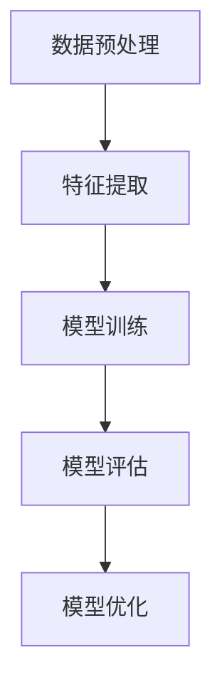
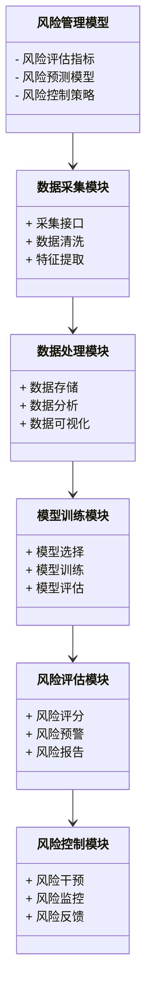

                 


# 《智能商业银行风险管理系统》

> 关键词：智能商业银行、风险管理、机器学习、系统架构、风险评估

> 摘要：本文详细探讨了智能商业银行风险管理系统的设计与实现，从背景、核心概念、算法原理、系统架构到项目实战，全面解析了如何利用人工智能技术提升银行的风险管理能力。通过深入分析和实际案例，展示了系统在风险评估、预测和控制方面的优势。

---

# 第一部分: 智能商业银行风险管理系统概述

## 第1章: 背景介绍

### 1.1 问题背景

#### 1.1.1 传统商业银行风险管理的局限性

传统的商业银行风险管理依赖于人工审核和简单的规则模型，存在效率低、覆盖面窄、响应慢等问题。随着金融业务的复杂化和数字化，传统方法难以应对日益复杂的金融风险。

#### 1.1.2 智能化风险管理的必要性

智能化风险管理能够通过大数据分析和机器学习技术，实时捕捉和预测潜在风险，帮助银行在风险发生前采取有效措施。这不仅提高了风险管理的效率，还降低了风险发生的概率。

#### 1.1.3 智能商业银行的风险管理优势

智能商业银行通过整合人工智能、大数据和区块链等技术，构建了智能化的风险管理系统。该系统能够实时监控交易数据，识别潜在风险，并提供个性化的风险管理策略。

### 1.2 问题描述

#### 1.2.1 风险管理的核心问题

风险管理的核心问题是如何准确识别、评估和控制风险。传统方法在数据处理能力和模型复杂性方面存在局限性，难以应对复杂的金融环境。

#### 1.2.2 智能化风险管理的关键挑战

智能化风险管理的关键挑战包括数据的多样性和实时性、算法的可解释性、模型的泛化能力等。这些挑战需要通过技术创新和方法改进来解决。

#### 1.2.3 系统边界与外延

智能商业银行风险管理系统涵盖了从数据采集、处理到风险评估、预测、控制的全过程。系统边界包括前端的数据采集模块和后端的风险控制模块，外延则涉及数据分析平台和风险报告生成。

### 1.3 问题解决

#### 1.3.1 智能化风险管理的解决方案

通过引入机器学习算法、大数据分析和区块链技术，构建智能化的风险评估和预测模型。利用这些技术，系统能够实时监控风险，并提供个性化的风险管理策略。

#### 1.3.2 系统功能与目标

系统的功能包括风险数据采集、风险评估、风险预测、风险控制和风险报告生成。目标是通过智能化手段，提高风险管理的效率和准确性，降低银行的财务损失。

#### 1.3.3 系统实现的技术路线

技术路线包括数据采集与处理、模型训练与优化、系统集成与部署。通过这些步骤，构建一个高效、准确的智能风险管理平台。

### 1.4 系统核心要素

#### 1.4.1 核心概念与组成

系统的核心概念包括风险管理模型、数据特征、算法模型、评分系统和预警机制。这些概念共同构成了智能化风险管理的核心框架。

#### 1.4.2 系统架构与模块划分

系统架构分为数据采集模块、数据处理模块、模型训练模块、风险评估模块和风险控制模块。每个模块负责特定的功能，共同实现智能化风险管理。

#### 1.4.3 系统功能与流程

系统功能包括数据采集、特征提取、模型训练、风险评估和风险控制。流程是数据采集模块将数据传输到数据处理模块，进行清洗和特征提取，然后通过模型训练模块生成风险评估模型，最后通过风险控制模块实现风险控制。

---

## 第2章: 核心概念与联系

### 2.1 风险管理模型

#### 2.1.1 风险评估模型

风险评估模型通过分析客户的信用记录、收入情况等数据，评估客户的风险等级。常用的模型包括逻辑回归和随机森林。

#### 2.1.2 风险预测模型

风险预测模型利用历史数据和机器学习算法，预测未来可能发生的金融风险。常用算法包括支持向量机和深度学习模型。

#### 2.1.3 风险控制模型

风险控制模型通过制定风险控制策略，降低风险的发生概率。策略包括调整贷款额度、设置预警机制等。

### 2.2 数据特征

#### 2.2.1 风险相关数据特征

风险相关数据特征包括客户的信用历史、收入水平、资产状况、交易频率等。这些特征能够帮助模型准确评估客户的风险等级。

#### 2.2.2 数据特征提取方法

数据特征提取方法包括统计特征提取和基于机器学习的特征提取。统计特征提取通过计算均值、方差等统计指标提取特征，基于机器学习的特征提取则利用主成分分析等方法。

#### 2.2.3 数据特征与风险的关系

数据特征与风险之间存在密切关系。例如，客户的信用历史越好，风险等级越低。通过分析数据特征，可以准确预测客户的风险等级。

### 2.3 算法模型

#### 2.3.1 机器学习算法

机器学习算法包括监督学习、无监督学习和强化学习。监督学习用于风险评估，无监督学习用于风险预测，强化学习用于风险控制。

#### 2.3.2 深度学习算法

深度学习算法通过多层神经网络模型，提取数据的深层特征，提高风险预测的准确性。常用模型包括卷积神经网络和循环神经网络。

#### 2.3.3 混合算法

混合算法结合了机器学习和深度学习的优势，通过集成学习方法，提高模型的准确性和稳定性。

### 2.4 风险评分系统

#### 2.4.1 风险评分模型

风险评分模型通过综合评估客户的信用状况、收入水平、资产状况等，生成客户的风险评分。评分越高，风险越低。

#### 2.4.2 评分标准与规则

评分标准和规则是根据银行的内部政策和监管要求制定的。评分标准包括评分范围、评分权重等，评分规则包括评分计算方法、评分更新频率等。

#### 2.4.3 评分结果的应用

评分结果用于客户贷款审批、信用额度调整等业务决策。评分高的客户可以享受更高的信用额度，评分低的客户可能被拒绝贷款申请。

### 2.5 风险预警机制

#### 2.5.1 预警规则

预警规则是根据客户的风险评分和市场环境变化制定的。规则包括预警触发条件、预警级别划分等。

#### 2.5.2 预警触发条件

预警触发条件包括客户风险评分低于一定值、市场环境剧烈波动等。当触发条件满足时，系统会发出预警信号。

#### 2.5.3 预警响应流程

预警响应流程包括发出预警信号、通知相关业务部门、采取风险控制措施等。通过及时响应，可以有效降低风险的发生概率。

---

## 第3章: 算法原理

### 3.1 机器学习算法

#### 3.1.1 线性回归

线性回归是一种简单的回归算法，用于预测连续型变量。其数学模型可以表示为：

$$ y = \beta_0 + \beta_1 x + \epsilon $$

其中，$y$ 是目标变量，$x$ 是自变量，$\beta_0$ 和 $\beta_1$ 是回归系数，$\epsilon$ 是误差项。

#### 3.1.2 支持向量机

支持向量机是一种分类算法，通过构造超平面将数据分成不同的类别。其数学模型可以表示为：

$$ y = \text{sign}(\omega \cdot x + b) $$

其中，$\omega$ 是权重向量，$x$ 是输入数据，$b$ 是偏置项，$\text{sign}$ 是符号函数。

#### 3.1.3 随机森林

随机森林是一种集成学习算法，通过构建多个决策树并进行投票或平均，提高模型的准确性和稳定性。其核心思想是通过随机采样和特征选择，减少过拟合的风险。

### 3.2 深度学习算法

#### 3.2.1 神经网络

神经网络是一种模仿人脑结构和功能的算法，通过多层神经元之间的连接，实现数据的特征提取和分类。其数学模型可以表示为：

$$ y = \sigma(w x + b) $$

其中，$w$ 是权重矩阵，$x$ 是输入数据，$b$ 是偏置项，$\sigma$ 是激活函数。

#### 3.2.2 卷积神经网络

卷积神经网络是一种专门用于处理图像数据的深度学习算法，通过卷积操作提取图像的特征。其数学模型可以表示为：

$$ f(x) = \sum_{i=1}^{n} w_i x_i + b $$

其中，$w_i$ 是权重，$x_i$ 是输入数据，$b$ 是偏置项。

#### 3.2.3 循环神经网络

循环神经网络是一种用于处理序列数据的深度学习算法，通过循环结构捕捉数据的时间依赖关系。其数学模型可以表示为：

$$ h_t = \tanh(w h_{t-1} + u x_t + b) $$

其中，$h_t$ 是当前时刻的隐藏状态，$w$ 和 $u$ 是权重矩阵，$x_t$ 是当前时刻的输入数据，$b$ 是偏置项，$\tanh$ 是双曲正切函数。

### 3.3 算法流程图



### 3.4 算法实现

#### 3.4.1 数据预处理代码

```python
import pandas as pd
from sklearn.preprocessing import StandardScaler

# 读取数据
data = pd.read_csv('data.csv')

# 分离特征和目标变量
X = data.drop('target', axis=1)
y = data['target']

# 标准化处理
scaler = StandardScaler()
X_scaled = scaler.fit_transform(X)
```

#### 3.4.2 模型训练代码

```python
from sklearn.ensemble import RandomForestClassifier
from sklearn.metrics import accuracy_score

# 初始化模型
model = RandomForestClassifier(n_estimators=100, max_depth=2, random_state=42)

# 训练模型
model.fit(X_scaled, y)

# 预测结果
y_pred = model.predict(X_scaled)

# 计算准确率
print('Accuracy:', accuracy_score(y, y_pred))
```

---

## 第4章: 系统分析与架构设计

### 4.1 问题场景介绍

智能商业银行风险管理系统的目标是通过智能化手段，提高风险管理的效率和准确性。系统需要处理大量的金融数据，实时监控风险，并提供个性化的风险管理策略。

### 4.2 系统功能设计

#### 4.2.1 领域模型



### 4.3 系统架构设计

#### 4.3.1 系统架构图


#### 4.3.2 系统模块交互

用户通过界面提交数据，数据采集模块接收数据并进行清洗和特征提取，然后传输到数据处理模块。数据处理模块对数据进行存储和分析，生成特征向量，传输到模型训练模块。模型训练模块训练风险评估模型，生成风险评分和预警信号，传输到风险评估模块。风险评估模块根据评分和预警信号，触发风险控制模块，采取相应的风险控制措施。

---

## 第5章: 项目实战

### 5.1 环境安装

#### 5.1.1 安装Python

```bash
python --version
```

#### 5.1.2 安装依赖库

```bash
pip install pandas scikit-learn matplotlib
```

### 5.2 系统核心实现

#### 5.2.1 数据采集模块

```python
import pandas as pd

# 读取数据
data = pd.read_csv('data.csv')

# 数据清洗
data.dropna(inplace=True)

# 特征提取
X = data.drop('target', axis=1)
y = data['target']
```

#### 5.2.2 模型训练模块

```python
from sklearn.ensemble import RandomForestClassifier

# 初始化模型
model = RandomForestClassifier(n_estimators=100, max_depth=2, random_state=42)

# 训练模型
model.fit(X, y)
```

#### 5.2.3 风险评估模块

```python
from sklearn.metrics import accuracy_score

# 预测结果
y_pred = model.predict(X)

# 计算准确率
print('Accuracy:', accuracy_score(y, y_pred))
```

### 5.3 代码应用解读与分析

#### 5.3.1 代码功能解读

数据采集模块负责读取和清洗数据，提取特征；模型训练模块负责训练风险评估模型；风险评估模块负责生成风险评分和预警信号。

#### 5.3.2 实际案例分析

通过实际案例分析，展示系统在风险评估和预测中的应用。例如，通过分析客户的信用历史和收入情况，评估客户的信用风险等级。

### 5.4 项目小结

通过项目实战，验证了智能商业银行风险管理系统的可行性和有效性。系统能够准确评估和预测风险，帮助银行制定科学的风险管理策略。

---

## 第6章: 总结与展望

### 6.1 最佳实践 tips

- 数据预处理是关键，确保数据的准确性和完整性。
- 选择合适的算法模型，提高系统的准确性和效率。
- 定期更新模型，适应市场环境的变化。

### 6.2 小结

智能商业银行风险管理系统通过智能化手段，提高了风险管理的效率和准确性。系统的核心是风险管理模型和算法模型，通过数据分析和机器学习技术，实现风险的精准识别和控制。

### 6.3 注意事项

- 数据隐私和安全问题需要高度重视。
- 模型的可解释性和稳定性需要进一步优化。
- 系统的实时性和响应速度需要不断提升。

### 6.4 拓展阅读

建议读者进一步阅读相关领域的书籍和论文，深入了解机器学习和深度学习在金融风险管理中的应用。

---

通过以上章节的内容，读者可以系统地了解智能商业银行风险管理系统的构建与实现，掌握其核心技术和实际应用。

