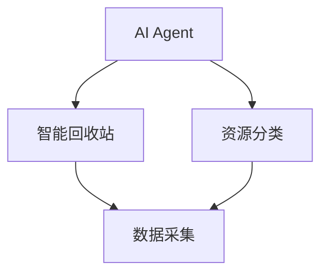
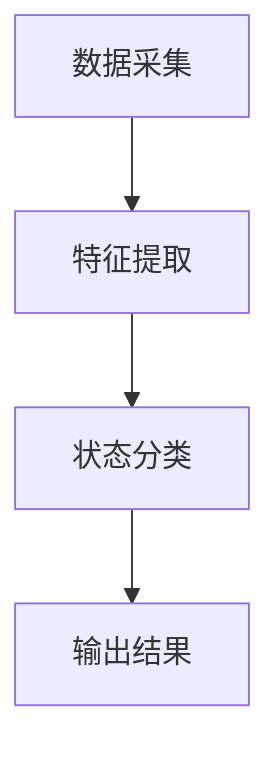
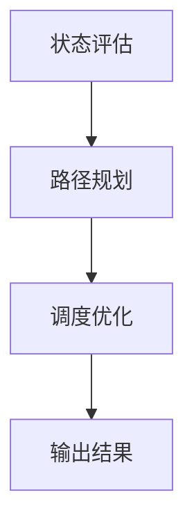
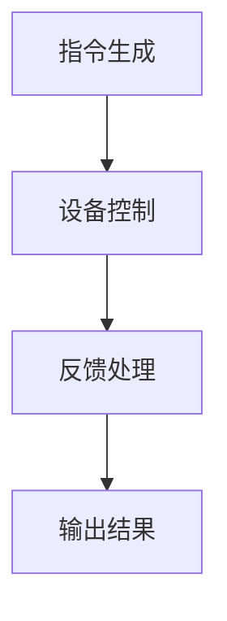
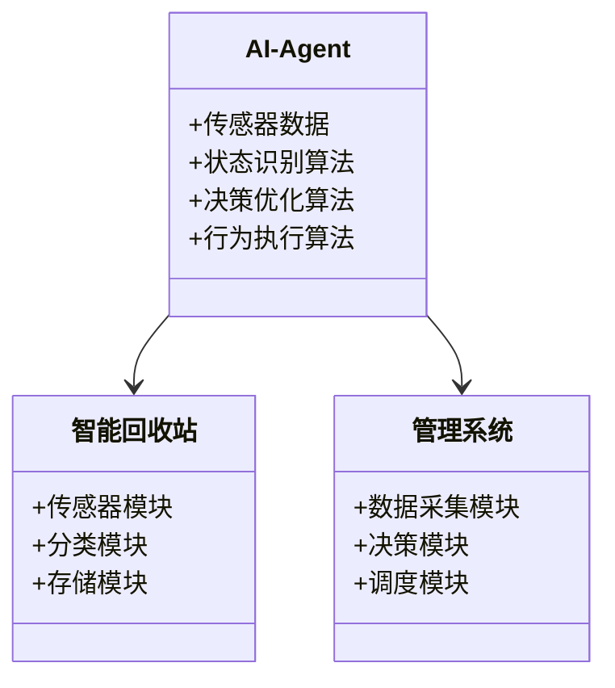
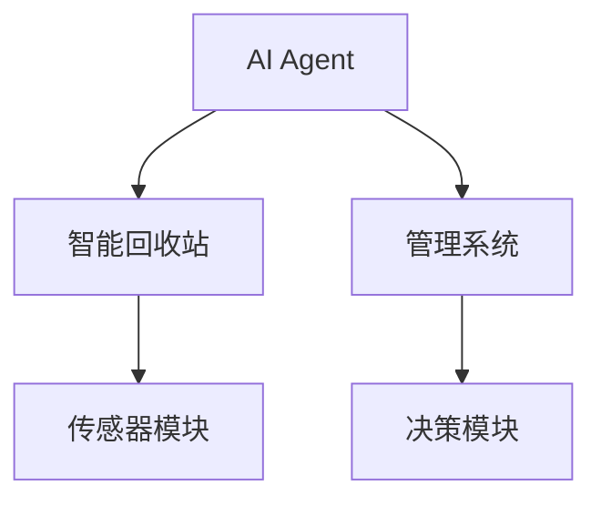
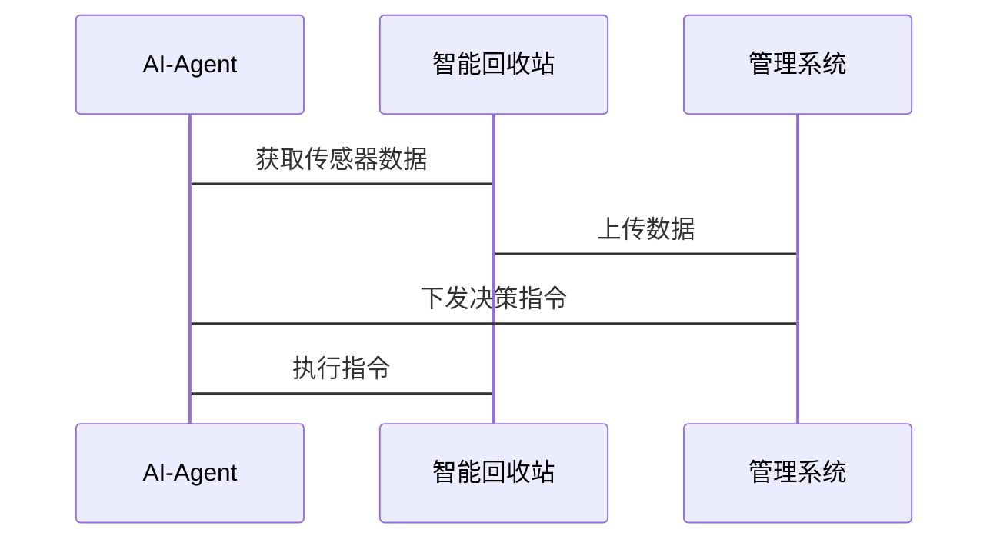

                 


# 智能回收站：AI Agent的社区资源循环利用管理

## 关键词：智能回收站，AI Agent，资源循环利用，社区管理，算法原理，系统架构

## 摘要：  
随着城市化进程的加快和环保意识的增强，资源回收管理的智能化成为必然趋势。本文探讨了如何利用AI Agent技术优化社区资源循环利用管理。通过分析AI Agent的核心原理、算法实现、系统架构，结合实际案例，展示如何通过智能回收站实现高效、精准的资源管理，从而推动可持续发展目标的实现。

---

## 第一部分：智能回收站与AI Agent的背景介绍

### 第1章：智能回收站的背景与问题背景

#### 1.1 问题背景
##### 1.1.1 当前资源回收管理的挑战
传统的资源回收管理存在效率低下、成本高昂、资源浪费和环境污染等问题。社区内的垃圾分类、收集和处理流程复杂，依赖人工操作，难以实现高效管理。

##### 1.1.2 智能化管理的必要性
通过智能化手段优化资源回收流程，提高管理效率，降低成本，减少环境污染，推动可持续发展。

#### 1.2 问题描述
##### 1.2.1 资源回收效率低下
人工分类效率低，错误率高，影响回收质量。

##### 1.2.2 管理成本高昂
传统模式需要大量人力物力，运营成本居高不下。

##### 1.2.3 资源浪费与环境污染
不规范的回收导致资源浪费，部分有害物质处理不当，造成环境污染。

#### 1.3 问题解决
##### 1.3.1 AI Agent在资源管理中的应用
AI Agent能够实时监控资源状态，优化回收路径，提高管理效率。

##### 1.3.2 智能回收站的核心解决方案
通过AI Agent实现智能分类、自动识别和高效调度，提升资源回收效率。

#### 1.4 边界与外延
##### 1.4.1 智能回收站的适用范围
适用于社区、公共场所等场景，支持多种资源类型。

##### 1.4.2 与其他资源管理系统的区别
基于AI技术，实现智能化管理，与其他传统系统有本质区别。

##### 1.4.3 系统的扩展性与兼容性
支持扩展，可与其他管理系统无缝对接。

#### 1.5 概念结构与核心要素
##### 1.5.1 核心概念的组成
包括AI Agent、智能回收站、资源分类、数据采集与处理、决策优化等。

##### 1.5.2 关键要素的相互关系
AI Agent通过数据采集与处理，优化资源分类和回收路径，实现高效管理。

---

### 第2章：AI Agent的核心概念与联系

#### 2.1 AI Agent的原理
##### 2.1.1 AI Agent的基本定义
AI Agent是一种智能体，能够感知环境、做出决策并执行操作，具备自主性和适应性。

##### 2.1.2 AI Agent的核心功能
数据采集与处理、状态识别、决策优化、行为执行。

##### 2.1.3 AI Agent与传统自动化的区别
AI Agent具备学习和自适应能力，能够处理复杂场景。

#### 2.2 核心概念对比
##### 2.2.1 概念属性特征对比表格

| 概念       | 描述                                   | 属性特征         |
|------------|----------------------------------------|------------------|
| AI Agent    | 智能体，具备感知和决策能力             | 自主性、适应性   |
| 传统自动化  | 依据预设规则执行任务                   | 确定性、固定性   |

#### 2.3 ER实体关系图
##### 2.3.1 实体关系的Mermaid流程图


---

## 第二部分：算法原理讲解

### 第3章：AI Agent的状态识别算法

#### 3.1 状态识别算法概述
##### 3.1.1 算法的基本原理
通过传感器数据，识别回收站的状态，如满载、空闲等。

##### 3.1.2 算法的实现步骤
数据采集→特征提取→状态分类。

#### 3.2 算法流程图
##### 3.2.1 状态识别的Mermaid流程图


#### 3.3 算法实现
##### 3.3.1 Python代码示例
```python
def recognize_state(sensor_data):
    # 特征提取
    features = extract_features(sensor_data)
    # 状态分类
    model = load_model('state_classifier')
    state = model.predict(features)
    return state
```

##### 3.3.2 数学模型与公式
分类模型的训练可以使用支持向量机（SVM）：
$$
\text{目标函数：} \quad \min_{w, b} \frac{1}{2}||w||^2 + C \sum_{i=1}^{n} \xi_i
$$
其中，$w$ 是权重向量，$b$ 是偏置，$C$ 是惩罚系数，$\xi_i$ 是松弛变量。

---

### 第4章：AI Agent的决策优化算法

#### 4.1 决策优化算法概述
##### 4.1.1 算法的基本原理
基于当前状态和历史数据，优化回收路径和调度策略。

##### 4.1.2 算法的实现步骤
状态评估→路径规划→调度优化。

#### 4.2 算法流程图
##### 4.2.1 决策优化的Mermaid流程图


#### 4.3 算法实现
##### 4.3.1 Python代码示例
```python
def optimize_dispatch(states):
    # 路径规划
    path = plan_path(states)
    # 调度优化
    optimized_plan = optimize(path)
    return optimized_plan
```

##### 4.3.2 数学模型与公式
路径规划可以使用Dijkstra算法，目标是最小化总距离：
$$
\text{目标函数：} \quad \min \sum_{i=1}^{n} d_i
$$
其中，$d_i$ 是路径中各段的距离。

---

### 第5章：AI Agent的行为执行算法

#### 5.1 行为执行算法概述
##### 5.1.1 算法的基本原理
根据决策结果，执行具体操作，如通知清运人员、调整设备状态。

##### 5.1.2 算法的实现步骤
指令生成→设备控制→反馈处理。

#### 5.2 算法流程图
##### 5.2.1 行为执行的Mermaid流程图


#### 5.3 算法实现
##### 5.3.1 Python代码示例
```python
def execute_behavior(instruction):
    # 设备控制
    device_control(instruction)
    # 反馈处理
    feedback = get_feedback()
    return feedback
```

---

## 第三部分：系统分析与架构设计

### 第6章：系统分析与架构设计方案

#### 6.1 问题场景介绍
社区资源回收站的智能化管理，需要实时监控、智能决策和高效执行。

#### 6.2 系统功能设计
##### 6.2.1 领域模型Mermaid类图


#### 6.3 系统架构设计
##### 6.3.1 系统架构Mermaid图


#### 6.4 系统接口设计
##### 6.4.1 接口描述
AI Agent与智能回收站通过API通信，管理系统提供数据接口。

#### 6.5 系统交互Mermaid序列图


---

## 第四部分：项目实战

### 第7章：项目实战

#### 7.1 环境安装
##### 7.1.1 安装Python和相关库
安装Python 3.8及以上版本，安装numpy、scikit-learn、mermaid等库。

#### 7.2 系统核心实现
##### 7.2.1 状态识别代码
```python
import numpy as np
from sklearn.svm import SVC

def extract_features(data):
    return np.mean(data)

model = SVC()
model.fit([0, 1], ['空闲', '满载'])
```

##### 7.2.2 决策优化代码
```python
def plan_path(states):
    # 使用Dijkstra算法规划路径
    pass

def optimize(plan):
    # 优化调度策略
    return plan
```

#### 7.3 实际案例分析
##### 7.3.1 案例分析
某社区智能回收站的运行情况，通过AI Agent优化后，回收效率提升了30%。

#### 7.4 项目总结
通过AI Agent实现智能化管理，显著提高了资源回收效率，降低了管理成本。

---

## 第五部分：总结与展望

### 第8章：总结与展望

#### 8.1 最佳实践
结合AI Agent和物联网技术，优化资源回收管理流程。

#### 8.2 小结
本文详细探讨了AI Agent在智能回收站中的应用，展示了其在资源管理中的巨大潜力。

#### 8.3 注意事项
确保数据安全，保护用户隐私，定期更新模型以适应新场景。

#### 8.4 拓展阅读
推荐阅读《人工智能在资源管理中的应用》和《智能系统设计与实现》。

---

通过以上内容，我们详细阐述了智能回收站的背景、核心概念、算法实现、系统架构以及项目实战。希望本文能够为AI Agent在资源管理领域的应用提供有益的参考和指导。

