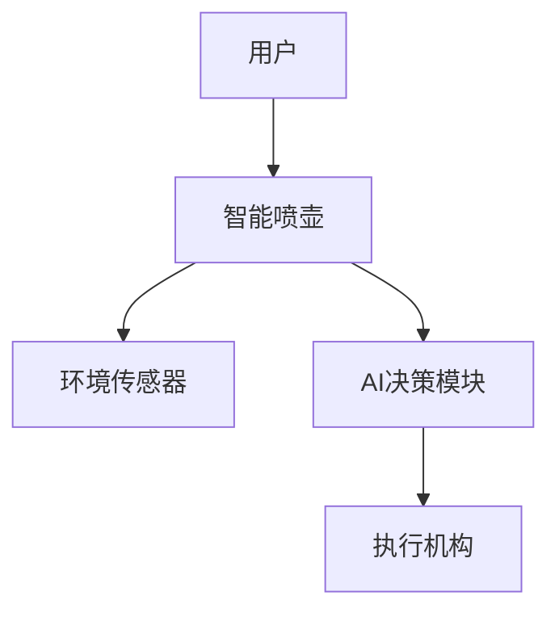
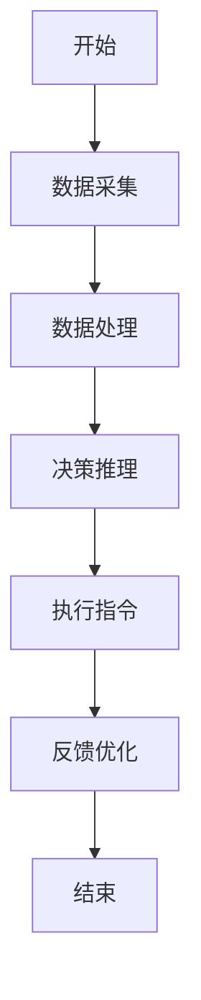
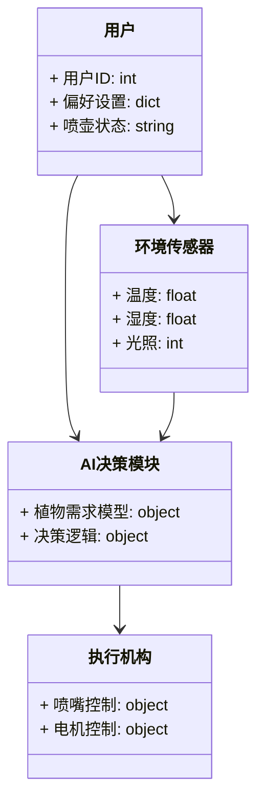
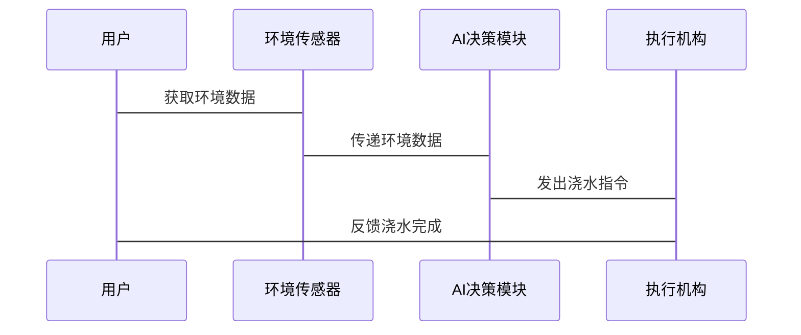

                 


# 智能园艺喷壶：AI Agent的植物浇水优化

## 关键词：智能喷壶，AI Agent，植物浇水，优化算法，系统设计，项目实战

## 摘要：本文详细介绍了基于AI Agent的智能园艺喷壶的设计与实现，从问题背景、AI Agent的核心原理、算法优化、系统架构到项目实战，全面解析了如何利用人工智能优化植物浇水过程，实现精准农业。

---

# 第1章: 问题背景与描述

## 1.1 问题背景
### 1.1.1 智能园艺喷壶的发展背景
随着城市化进程的加快，家庭园艺越来越普及，但传统浇水方式存在效率低、水量浪费等问题。AI Agent的引入为智能浇水提供了新的解决方案。

### 1.1.2 植物浇水的传统方法与局限性
传统浇水依赖人工操作，无法根据环境变化实时调整，导致水资源浪费和植物生长不佳。

### 1.1.3 AI技术在农业自动化中的应用趋势
AI技术在农业中的应用日益广泛，特别是在环境监测和自动化控制方面，为智能浇水系统提供了技术基础。

## 1.2 问题描述
### 1.2.1 植物浇水的精准化需求
植物生长需要精准的水分供应，不同植物在不同生长阶段对水分的需求不同。

### 1.2.2 环境感知与智能决策的重要性
环境因素如光照、湿度、温度等直接影响植物的生长状态，智能喷壶需要实时感知并做出决策。

### 1.2.3 用户对智能喷壶的核心诉求
用户希望喷壶能够自动感知环境并智能调整浇水策略，减少人工干预，提高浇水效率。

## 1.3 问题解决与边界
### 1.3.1 AI Agent在植物浇水优化中的作用
AI Agent通过感知环境数据，分析植物需求，制定最优浇水策略。

### 1.3.2 系统的边界与功能范围
系统主要针对家庭园艺场景，支持多种植物类型，但不包括施肥和病虫害防治。

### 1.3.3 系统的外延与扩展性
系统设计具有扩展性，未来可以增加更多功能，如土壤养分检测和病虫害识别。

## 1.4 概念结构与核心要素
### 1.4.1 智能园艺喷壶的核心组成
包括环境传感器、AI决策模块、执行机构和用户交互界面。

### 1.4.2 AI Agent的决策机制
基于感知数据，结合植物需求模型，生成浇水指令。

### 1.4.3 系统与环境的交互关系
系统通过传感器感知环境，通过执行机构与环境交互，形成闭环控制系统。

## 1.5 本章小结
本章介绍了智能园艺喷壶的背景、问题和解决方案，明确了系统的边界和核心组成。

---

# 第2章: AI Agent的核心概念与联系

## 2.1 AI Agent的原理与特点
### 2.1.1 什么是AI Agent
AI Agent是一种能够感知环境、自主决策并执行任务的智能体。

### 2.1.2 AI Agent的核心算法
包括感知、推理和决策算法，如机器学习和规则引擎。

### 2.1.3 AI Agent的感知与决策机制
通过多传感器融合，AI Agent能够准确感知环境并做出决策。

## 2.2 AI Agent的特点对比
| 特性 | 传统自动喷灌系统 | 基于规则的系统 | 基于AI的智能系统 |
|------|------------------|----------------|------------------|
| 智能性 | 无                | 低              | 高                |
| 精准性 | 低                | 中              | 高                |
| 灵活性 | 无                | 低              | 高                |

## 2.3 实体关系图


## 2.4 本章小结
本章详细讲解了AI Agent的原理和特点，并通过对比分析明确了智能喷壶的优势。

---

# 第3章: AI Agent的算法原理

## 3.1 算法流程


## 3.2 算法实现
### 3.2.1 数据采集
使用温湿度传感器、光照传感器等采集环境数据。

### 3.2.2 数据处理
将采集到的数据进行预处理，提取特征。

### 3.2.3 决策推理
基于决策树模型，生成浇水指令。

### 3.2.4 执行反馈
通过喷壶执行指令，并收集反馈数据用于优化模型。

## 3.3 数学模型
$$
决策树模型：基于特征的分裂，选择最优特征进行分类。
$$
$$
回归模型：预测土壤湿度，调整浇水量。
$$

## 3.4 代码示例
```python
import numpy as np
from sklearn.tree import DecisionTreeRegressor

# 示例数据
X = np.array([[25, 60], [23, 55], [28, 70]])
y = np.array([10, 8, 15])

# 训练模型
model = DecisionTreeRegressor()
model.fit(X, y)

# 预测
new_data = np.array([[25, 65]])
print(model.predict(new_data))
```

## 3.5 本章小结
本章详细讲解了AI Agent的算法流程，结合代码示例和数学模型，展示了如何实现智能浇水决策。

---

# 第4章: 系统分析与架构设计

## 4.1 项目背景
本项目旨在开发一款基于AI的智能园艺喷壶，优化植物浇水过程。

## 4.2 系统功能设计
### 4.2.1 领域模型


## 4.3 系统架构设计
### 4.3.1 模块划分
- 用户交互模块：接收用户指令
- 数据采集模块：采集环境数据
- AI决策模块：分析数据并生成指令
- 执行模块：控制喷壶执行

### 4.3.2 架构图


## 4.4 接口设计
### 4.4.1 系统接口
- 用户与系统交互接口：手机APP或网页
- 系统与传感器接口：I2C或UART
- 系统与执行机构接口：PWM或GPIO

### 4.4.2 交互序列图


## 4.5 本章小结
本章详细分析了系统的架构设计，包括功能模块划分、架构图和接口设计。

---

# 第5章: 项目实战

## 5.1 环境安装
安装Python、TensorFlow、Raspberry Pi等工具，配置硬件设备。

## 5.2 核心代码实现
```python
import RPi.GPIO as GPIO
import time

# 初始化GPIO
GPIO.setmode(GPIO.BCM)
GPIO.setup(18, GPIO.OUT)

# 控制喷壶
def water_plant(duration=5):
    GPIO.output(18, GPIO.HIGH)
    time.sleep(duration)
    GPIO.output(18, GPIO.LOW)

# 执行浇水
water_plant()
```

## 5.3 实际案例分析
通过实际案例分析，展示系统在不同环境下的浇水效果。

## 5.4 项目小结
总结项目成果，分析遇到的问题及解决方案。

---

# 第6章: 最佳实践

## 6.1 小结
通过本项目，我们掌握了AI Agent在智能园艺中的应用。

## 6.2 注意事项
- 硬件安装需注意防潮防锈
- 数据采集需保证准确性
- 系统需定期维护和校准

## 6.3 拓展阅读
推荐相关领域的书籍和论文，供进一步学习。

---

# 附录

## 附录A: 参考文献
列出本文参考的文献和资料。

## 附录B: 术语表
解释文中使用的专业术语。

---

# 结束语

感谢您的阅读，希望本文对您理解智能园艺喷壶的AI Agent优化有所帮助。

--- 

（以上为文章的完整目录大纲，您可以根据实际内容进行调整和补充。）

