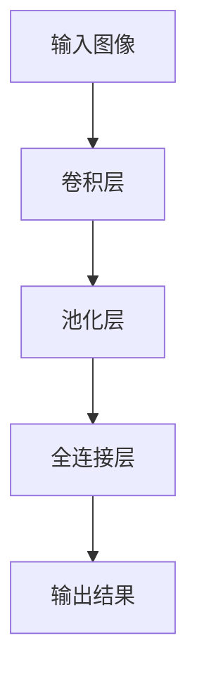
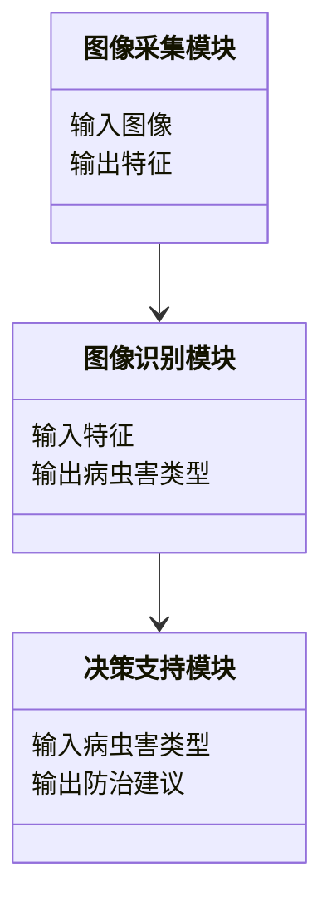
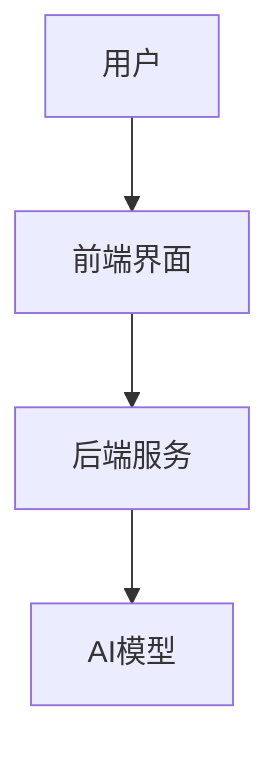
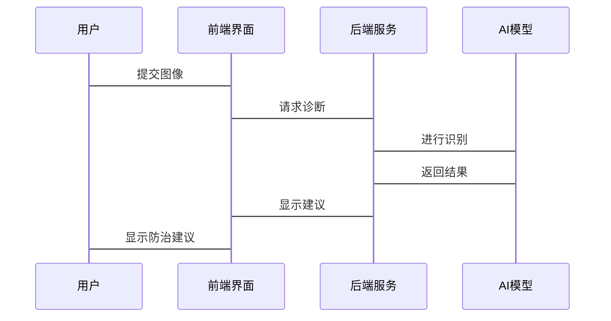

                 


# 智能园艺工具：AI Agent的植物病虫害诊断

---

## 关键词：
智能园艺工具，AI Agent，植物病虫害，诊断，图像识别，深度学习

---

## 摘要：
本文探讨了AI Agent在植物病虫害诊断中的应用，详细分析了智能园艺工具的核心技术、算法原理、系统架构及实际应用。通过结合图像识别、深度学习和自然语言处理等技术，AI Agent能够高效、准确地诊断植物病虫害，为现代农业提供智能化支持。本文还提供了项目实战和最佳实践，帮助读者快速掌握AI Agent在智能园艺工具中的实现与应用。

---

## 第一部分：背景与概念

### 第1章：植物病虫害诊断的背景与挑战

#### 1.1 植物病虫害诊断的重要性
植物病虫害是农业生产的重大威胁，直接影响作物产量和质量。传统诊断方法依赖于人工经验，效率低且准确性有限。随着AI技术的发展，智能园艺工具通过AI Agent实现了高效、精准的病虫害诊断，为现代农业提供了新的解决方案。

#### 1.2 AI Agent在农业中的应用
AI Agent是一种智能代理，能够感知环境、处理信息并做出决策。在植物病虫害诊断中，AI Agent通过图像识别和数据分析，帮助农民快速识别病虫害类型，提供防治建议。

#### 1.3 智能园艺工具的核心功能
智能园艺工具集成了图像识别、自然语言处理和数据分析功能，能够实现以下核心任务：
- **图像识别**：快速识别病虫害类型和症状。
- **自然语言处理**：提供防治建议和操作指南。
- **数据采集与分析**：记录病虫害数据，分析趋势，预测风险。

---

## 第二部分：AI Agent的核心原理与技术

### 第2章：AI Agent的工作原理

#### 2.1 AI Agent的基本原理
AI Agent通过以下步骤实现植物病虫害诊断：
1. **数据采集**：使用摄像头采集植物图像。
2. **图像预处理**：调整图像亮度、对比度和分辨率。
3. **图像识别**：利用深度学习模型识别病虫害类型。
4. **决策支持**：根据识别结果提供防治建议。

#### 2.2 AI Agent的核心技术
AI Agent的核心技术包括：
- **图像识别**：基于深度学习的卷积神经网络（CNN）模型。
- **自然语言处理**：生成自然语言描述和防治建议。
- **数据分析**：分析病虫害数据，预测未来风险。

#### 2.3 AI Agent与传统诊断方法的对比
| 对比维度 | AI Agent | 传统方法 |
|----------|-----------|-----------|
| **效率** | 高效快速 | 低效耗时 |
| **准确性** | 高 | 中等 |
| **成本** | 低 | 高 |
| **可扩展性** | 强 | 弱 |

---

## 第三部分：算法原理与数学模型

### 第3章：图像识别算法原理

#### 3.1 基于卷积神经网络的图像分类
CNN是一种深度学习模型，广泛应用于图像识别任务。其核心步骤包括：
1. **卷积层**：提取图像特征。
2. **池化层**：降低计算复杂度，防止过拟合。
3. **全连接层**：分类图像。

#### 3.2 卷积神经网络的数学模型
卷积层的数学表达式为：
$$
f(x) = \sum_{k=1}^{K} w_k \cdot x_k + b
$$

池化层的数学表达式为：
$$
f(x) = \max(x_1, x_2, ..., x_n)
$$

全连接层的数学表达式为：
$$
f(x) = \sum_{i=1}^{N} w_i \cdot x_i + b
$$

#### 3.3 图像识别流程图


---

## 第四部分：系统分析与架构设计

### 第4章：系统功能设计

#### 4.1 领域模型类图


#### 4.2 系统架构设计


#### 4.3 系统接口设计
- **输入接口**：图像采集模块接收输入图像。
- **输出接口**：决策支持模块输出防治建议。

#### 4.4 系统交互流程图


---

## 第五部分：项目实战

### 第5章：环境安装与核心代码实现

#### 5.1 环境安装
安装必要的库：
```bash
pip install tensorflow numpy opencv-python
```

#### 5.2 核心代码实现
```python
import tensorflow as tf
from tensorflow.keras import layers

# 定义卷积神经网络模型
model = tf.keras.Sequential([
    layers.Conv2D(32, (3,3), activation='relu', input_shape=(224, 224, 3)),
    layers.MaxPooling2D((2,2)),
    layers.Conv2D(64, (3,3), activation='relu'),
    layers.MaxPooling2D((2,2)),
    layers.Flatten(),
    layers.Dense(128, activation='relu'),
    layers.Dense(10, activation='softmax')
])

# 编译模型
model.compile(optimizer='adam', loss='sparse_categorical_crossentropy', metrics=['accuracy'])
```

#### 5.3 代码功能解读
- **卷积层**：提取图像特征。
- **池化层**：降低计算复杂度。
- **全连接层**：分类病虫害类型。

#### 5.4 实际案例分析
通过实际案例分析，展示AI Agent如何识别病虫害类型并提供防治建议。

---

## 第六部分：最佳实践与总结

### 第6章：最佳实践

#### 6.1 小结
AI Agent在植物病虫害诊断中的应用显著提高了诊断效率和准确性，为现代农业提供了智能化支持。

#### 6.2 注意事项
- 数据质量：确保数据标注准确。
- 模型优化：定期更新模型以提高准确率。
- 用户体验：优化交互设计，提升用户体验。

#### 6.3 拓展阅读
建议阅读以下书籍和论文：
- 《Deep Learning》
- 《Python机器学习实战》

---

## 总结
本文详细探讨了AI Agent在植物病虫害诊断中的应用，从背景介绍、算法原理到系统设计和项目实战，全面解析了智能园艺工具的核心技术。通过本文的学习，读者可以掌握AI Agent的实现方法，并将其应用于实际场景中。

