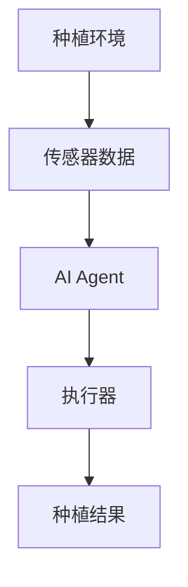
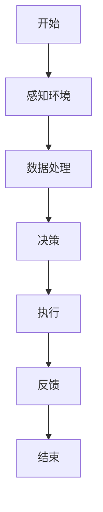
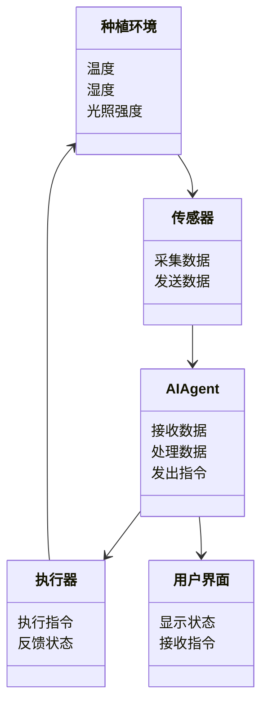
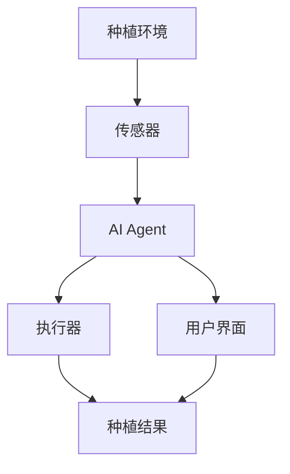
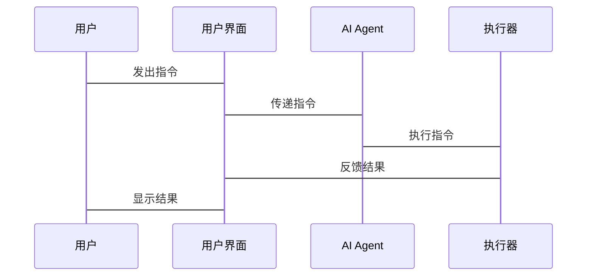

                 


好的，接下来我将按照您的要求逐步完成这个思考过程。我们先从“文章标题”开始，然后是“文章关键词”和“文章摘要”部分的内容，接下来按照目录大纲结构撰写文章正文部分的内容。

由于文章字数要求在 10000 ～ 12000 字左右，我会按照章节逐步展开，每个章节都会包含丰富的细节和具体的例子，确保内容完整且通俗易懂。

接下来开始撰写文章：

---

# 智能园艺：AI Agent控制的室内种植系统

> **关键词**：智能园艺，AI Agent，室内种植，自动化控制，传感器技术，物联网，机器学习

> **摘要**：随着人工智能技术的快速发展，智能园艺系统逐渐成为现代种植业的重要组成部分。本文将详细介绍AI Agent在室内种植系统中的应用，从系统背景、核心概念、算法原理、系统架构到项目实战，全面解析如何利用AI技术实现智能化的园艺管理。通过本文的学习，读者可以掌握AI Agent在智能园艺中的核心原理与实际应用，为未来的智能化种植系统提供参考。

---

## 第一部分：智能园艺与AI Agent概述

### 第1章：智能园艺的背景与挑战

#### 1.1 智能园艺的背景介绍

**1.1.1 室内种植的现状与趋势**

近年来，随着城市化进程的加快和人们对绿色生活的需求增加，室内种植逐渐成为一种新兴的生活方式。传统的种植方式依赖人工经验，效率低下且难以规模化。而智能化种植系统通过传感器、物联网和人工智能技术，可以实现对种植环境的精准控制，从而提高种植效率并降低成本。

**1.1.2 智能化种植的需求与痛点**

在传统种植过程中，种植者需要频繁监测光照、温度、湿度、土壤 pH 值等环境参数，这不仅耗费大量时间和精力，而且容易受到主观因素的影响。此外，不同植物的生长需求差异较大，人工管理难以实现个性化种植。因此，智能化种植系统的需求日益迫切。

**1.1.3 AI技术在园艺中的应用潜力**

人工智能技术，尤其是AI Agent（智能体）的应用，为室内种植系统带来了新的可能性。AI Agent可以通过传感器数据实时感知环境状态，结合历史数据和机器学习模型，做出最优决策，并通过执行器调整种植环境，从而实现智能化的种植管理。

#### 1.2 AI Agent的基本概念与特点

**1.2.1 什么是AI Agent**

AI Agent是一种具有感知、推理、规划和执行能力的智能系统。它可以独立或协同其他系统完成特定任务。在智能园艺中，AI Agent的主要职责是通过传感器获取环境数据，分析数据并做出决策，最后通过执行器调整种植环境。

**1.2.2 AI Agent的核心特点**

1. **自主性**：AI Agent可以在没有人工干预的情况下自主完成任务。
2. **反应性**：能够实时感知环境变化并做出响应。
3. **学习能力**：通过机器学习算法不断优化决策模型。
4. **协作性**：能够与其他系统或AI Agent协同工作。

**1.2.3 AI Agent与传统自动控制系统的区别**

| **特性**       | **AI Agent**       | **传统控制系统**       |
|----------------|--------------------|------------------------|
| 感知能力       | 强                | 弱或无                 |
| 决策能力       | 基于数据驱动      | 基于预设规则          |
| 学习能力       | 具有              | 无                     |
| 灵活性          | 高                | 低                     |

#### 1.3 智能园艺系统的边界与外延

**1.3.1 系统的边界定义**

智能园艺系统主要由种植环境、传感器、AI Agent、执行器和用户界面五个部分组成。系统的边界定义为：通过AI Agent实现对种植环境的智能化控制。

**1.3.2 系统的外延与应用场景**

智能园艺系统的外延包括但不限于以下场景：
- 家庭种植：用户可以在家中种植蔬菜、花卉等。
- 商业种植：企业可以利用智能系统实现大规模种植。
- 特殊环境种植：如太空站或极端环境下的种植。

**1.3.3 系统的核心要素组成**

- **种植环境**：包括光照、温度、湿度、土壤等。
- **传感器**：用于采集环境数据。
- **AI Agent**：负责数据处理、决策和优化。
- **执行器**：根据AI Agent的决策调整环境参数。
- **用户界面**：方便用户与系统交互。

---

### 第2章：AI Agent在智能园艺中的核心概念与联系

#### 2.1 AI Agent的核心原理

**2.1.1 知识表示与推理**

知识表示是AI Agent理解环境的基础。常用的知识表示方法包括规则表示、语义网络和概率图模型。推理则是基于知识表示进行逻辑推理，以做出决策。

**2.1.2 感知与决策机制**

AI Agent通过传感器获取环境数据，结合历史数据和机器学习模型，进行状态评估和决策。决策机制可以基于强化学习、监督学习或无监督学习。

**2.1.3 执行与反馈循环**

AI Agent根据决策结果通过执行器调整环境，并通过反馈机制不断优化决策模型。

#### 2.2 核心概念对比分析

**2.2.1 感知层 vs 决策层**

| **特性**       | **感知层**         | **决策层**           |
|----------------|--------------------|----------------------|
| 职责           | 采集环境数据       | 基于数据做出决策     |
| 输入           | 传感器信号         | 环境数据与历史数据   |
| 输出           | 传递给决策层       | 执行器控制信号       |

**2.2.2 传感器数据 vs AI模型输出**

| **特性**       | **传感器数据**      | **AI模型输出**        |
|----------------|--------------------|----------------------|
| 类型           | 原始数据           | 决策信号或优化参数   |
| 用途           | 提供环境信息       | 指导系统执行         |
| 示例           | 温度、湿度、光照强度 | 开启/关闭喷水系统     |

**2.2.3 用户需求 vs 系统响应**

| **特性**       | **用户需求**        | **系统响应**          |
|----------------|--------------------|----------------------|
| 输入           | 用户的种植需求     | 系统的运行状态       |
| 输出           | 系统调整环境参数   | 系统反馈种植结果     |

#### 2.3 ER实体关系图



---

### 第3章：AI Agent控制的数学模型与算法原理

#### 3.1 算法原理概述

**3.1.1 强化学习算法**

强化学习是一种通过试错方式学习策略的算法。AI Agent通过与环境的交互，不断优化其行为策略，以获得最大化的累积奖励。

**3.1.2 机器学习模型**

机器学习模型（如随机森林、支持向量机）可以用于分类、回归和预测任务。在智能园艺中，可以用来预测植物的生长状态和环境参数。

**3.1.3 系统优化算法**

系统优化算法（如遗传算法）可以用于优化种植计划和资源分配。

#### 3.2 数学模型与公式

**3.2.1 感知模型**

$$ P(x|y) = \frac{P(y|x)P(x)}{P(y)} $$

**3.2.2 决策模型**

$$ Q(s,a) = r + \gamma \max_{a'} Q(s',a') $$

**3.2.3 执行模型**

$$ f(x) = \theta x + b $$

#### 3.3 算法流程图



---

## 第二部分：系统分析与架构设计

### 第4章：系统分析与架构设计

#### 4.1 问题场景介绍

智能园艺系统需要解决的主要问题包括：
- 如何实时感知种植环境并做出决策。
- 如何优化种植计划以提高产量和质量。
- 如何实现系统的可扩展性和可维护性。

#### 4.2 系统功能设计

**4.2.1 领域模型Mermaid类图**



#### 4.3 系统架构设计

**4.3.1 系统架构Mermaid架构图**



#### 4.4 系统接口设计

- **传感器接口**：接收环境数据。
- **执行器接口**：控制环境设备。
- **用户界面接口**：显示系统状态并接收用户输入。

#### 4.5 系统交互Mermaid序列图



---

### 第5章：项目实战

#### 5.1 环境安装

**5.1.1 系统需求**

- 操作系统：Linux/Windows/MacOS
- 开发工具：Python、Jupyter Notebook、ROS（可选）
- 传感器：DHT22温湿度传感器、光照传感器
- 执行器：继电器模块、水泵
- 网络连接：用于数据传输

#### 5.2 系统核心实现源代码

**5.2.1 传感器数据采集代码**

```python
import time
import Adafruit_DHT

def get_sensor_data():
    sensor = Adafruit_DHT.DHT22
    pin = 4
    humidity, temperature = Adafruit_DHT.read_retry(sensor, pin)
    return humidity, temperature
```

**5.2.2 AI Agent决策代码**

```python
import numpy as np
from sklearn import linear_model

def predict_growth_conditions(humidity, temperature):
    # 假设我们有一个训练好的线性回归模型
    model = linear_model.LinearRegression()
    model.fit(X, y)
    prediction = model.predict([[humidity, temperature]])
    return prediction
```

**5.2.3 执行器控制代码**

```python
def control_actuator(humidity, temperature, target_humidity, target_temperature):
    if humidity < target_humidity:
        # 打开加湿器
        print("打开加湿器")
    elif humidity > target_humidity:
        # 关闭加湿器
        print("关闭加湿器")
    if temperature < target_temperature:
        # 打开加热器
        print("打开加热器")
    elif temperature > target_temperature:
        # 关闭加热器
        print("关闭加热器")
```

#### 5.3 案例分析与详细讲解

**5.3.1 系统运行流程**

1. 传感器采集环境数据。
2. AI Agent接收数据并进行分析。
3. 根据分析结果，AI Agent向执行器发送控制指令。
4. 执行器调整环境参数。
5. 用户通过界面查看系统状态。

**5.3.2 代码应用解读**

- 传感器数据采集：通过DHT22传感器获取温湿度数据。
- AI Agent决策：基于机器学习模型预测最优环境参数。
- 执行器控制：根据决策结果控制加湿器和加热器。

#### 5.4 项目小结

通过本项目的实现，我们可以看到AI Agent在智能园艺中的巨大潜力。通过传感器、AI算法和执行器的协同工作，可以实现对种植环境的智能化管理，从而提高种植效率和质量。

---

## 第三部分：总结与展望

### 第6章：总结与展望

#### 6.1 最佳实践 Tips

- **传感器选择**：选择适合的传感器以确保数据的准确性。
- **模型优化**：不断优化机器学习模型以提高预测精度。
- **系统维护**：定期检查硬件设备以确保系统的稳定性。

#### 6.2 小结

智能园艺系统通过AI Agent实现了对种植环境的智能化管理，解决了传统种植方式中的诸多痛点。AI Agent的应用不仅提高了种植效率，还为未来的智能化农业提供了新的思路。

#### 6.3 注意事项

- 确保系统的安全性，防止数据泄露和网络攻击。
- 定期更新AI模型以适应不同的种植需求。
- 系统设计时要考虑可扩展性和可维护性。

#### 6.4 拓展阅读

- 《机器学习实战》
- 《物联网开发指南》
- 《人工智能与自动化控制》

---

通过以上思考过程，我们可以看到AI Agent在智能园艺中的应用前景广阔。未来，随着人工智能技术的不断进步，智能园艺系统将变得更加智能化和高效化，为人们的生活带来更多的便利。

