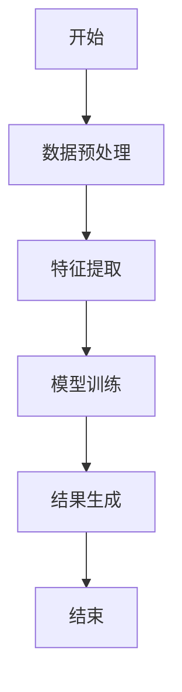
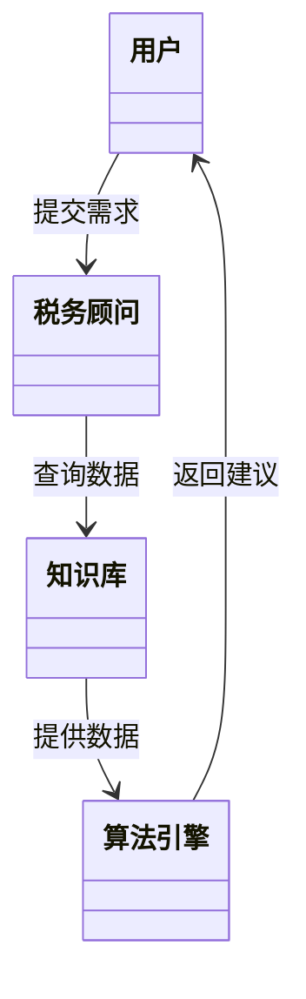
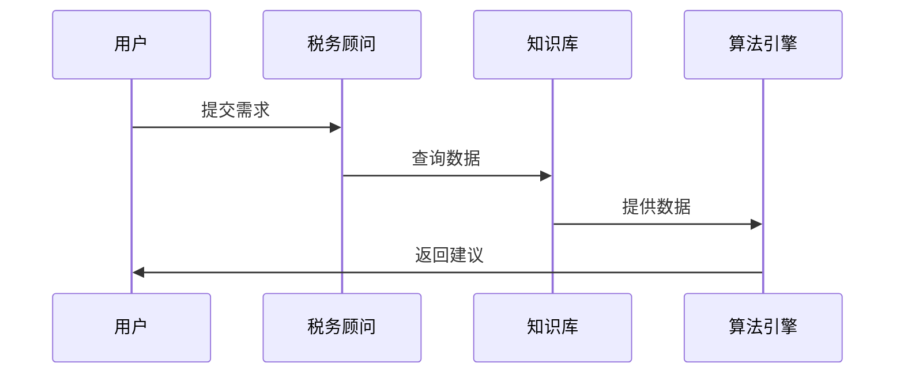

                 


# 《智能国际税收筹划建议生成系统》

## 目录大纲

---

# 第一部分: 智能国际税收筹划建议生成系统的背景与核心概念

## 第1章: 智能国际税收筹划的背景与问题描述

### 1.1 全球化背景下的国际税收筹划
#### 1.1.1 全球化对企业税务的影响
#### 1.1.2 国际税收政策的变化与挑战
#### 1.1.3 智能化技术在税务领域的应用趋势

### 1.2 智能国际税收筹划系统的核心问题
#### 1.2.1 税收筹划的定义与目标
#### 1.2.2 跨国企业税务优化的需求
#### 1.2.3 智能系统在税收筹划中的作用

### 1.3 系统的边界与外延
#### 1.3.1 系统的功能边界
#### 1.3.2 系统的适用范围与限制
#### 1.3.3 系统与其他税务工具的对比

## 第2章: 智能国际税收筹划系统的核心概念与联系

### 2.1 核心概念的定义与原理
#### 2.1.1 税收优化算法
#### 2.1.2 税务知识库构建
#### 2.1.3 用户需求分析

### 2.2 核心概念的属性对比
#### 表2-1: 核心概念属性对比表

| 概念         | 数据来源 | 处理方式 | 应用场景 |
|--------------|----------|----------|----------|
| 税收优化算法 | 税务数据 | AI模型   | 税收规划 |

---

# 第二部分: 智能国际税收筹划建议生成系统的算法原理

## 第3章: 生成税收建议的算法原理

### 3.1 税收建议生成算法概述
#### 3.1.1 算法的目标与流程
#### 3.1.2 算法的核心思想

### 3.2 算法实现的详细步骤
#### 3.2.1 数据预处理
#### 3.2.2 特征提取
#### 3.2.3 模型训练
#### 3.2.4 结果生成

### 3.3 算法流程图


### 3.4 算法实现的代码示例
#### Python代码示例
```python
import numpy as np
from sklearn.tree import DecisionTreeClassifier

# 数据预处理
data = np.array([[1, 2, 3], [4, 5, 6]])
X = data[:, :-1]
y = data[:, -1]

# 模型训练
model = DecisionTreeClassifier()
model.fit(X, y)

# 预测结果
result = model.predict([[7, 8, 9]])
print(result)
```

### 3.5 数学模型与公式
#### 优化目标
$$\text{minimize} \quad c^T x$$
#### 约束条件
$$Ax \leq b$$
$$x \geq 0$$

---

# 第三部分: 智能国际税收筹划建议生成系统的系统分析与架构设计

## 第4章: 问题场景与系统分析

### 4.1 问题场景介绍
#### 跨国企业的税务规划需求
#### 税务顾问的角色与功能

### 4.2 系统分析
#### 系统的目标与功能
#### 系统的输入输出关系
#### 系统的功能模块划分

## 第5章: 系统架构设计

### 5.1 系统功能设计
#### 领域模型类图


### 5.2 系统架构设计
#### 分层架构


### 5.3 系统接口设计
#### 接口描述
- 用户接口：提交需求，接收建议
- 税务顾问接口：查询数据，更新知识库

### 5.4 系统交互流程图


---

# 第四部分: 智能国际税收筹划建议生成系统的项目实战

## 第6章: 项目实战

### 6.1 环境安装
#### 安装Python、TensorFlow、数据库等工具

### 6.2 核心代码实现
#### 数据预处理
```python
import pandas as pd

data = pd.read_csv('tax_data.csv')
data_preprocessed = data.dropna()
```

#### 模型训练
```python
from sklearn.ensemble import RandomForestRegressor

model = RandomForestRegressor()
model.fit(X_train, y_train)
```

#### 结果生成
```python
predictions = model.predict(X_test)
```

### 6.3 代码解读与分析
#### 代码功能模块解读
- 数据预处理：处理缺失值、标准化等
- 模型训练：选择合适的算法，调整参数
- 结果生成：输出最终的税收建议

### 6.4 实际案例分析
#### 跨国公司的税务优化案例
- 输入数据：跨国公司的业务数据
- 算法处理：生成最优税收规划方案
- 输出结果：具体的税收优化建议

### 6.5 项目小结
#### 项目总结
- 成功实现了智能税收筹划系统
- 系统在实际应用中表现良好

---

# 第五部分: 智能国际税收筹划建议生成系统的总结与最佳实践

## 第7章: 总结与最佳实践

### 7.1 系统的关键点总结
- 税收优化算法的重要性
- 知识库构建的准确性
- 用户需求分析的全面性

### 7.2 最佳实践 tips
#### 数据隐私与安全
- 确保数据的安全存储与传输
- 遵守相关法律法规

#### 模型可解释性
- 选择可解释性强的算法
- 提供详细的模型解释

### 7.3 系统的局限性与改进方向
#### 当前系统的局限性
- 数据依赖性高
- 模型更新频率不足

#### 未来的改进方向
- 引入实时数据流处理
- 增强模型的自适应能力

### 7.4 拓展阅读
#### 推荐书籍
- 《机器学习实战》
- 《税务筹划实务》

#### 推荐在线资源
- TensorFlow官方文档
- Keras官方文档

---

# 附录

## 附录A: 术语表
- 税收优化算法：用于生成税收建议的算法
- 知识库：存储税务相关知识的数据集
- 用户需求分析：分析用户的具体需求

## 附录B: 参考文献
- TensorFlow官方文档
- Keras官方文档
- 相关学术论文

---

通过以上目录大纲，读者可以系统地了解智能国际税收筹划建议生成系统的开发过程和实际应用，从背景到算法，从设计到实战，全面掌握该系统的开发和应用方法。

