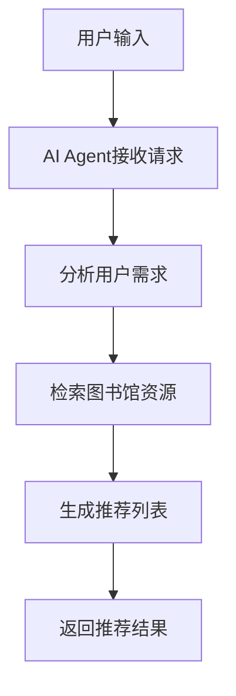
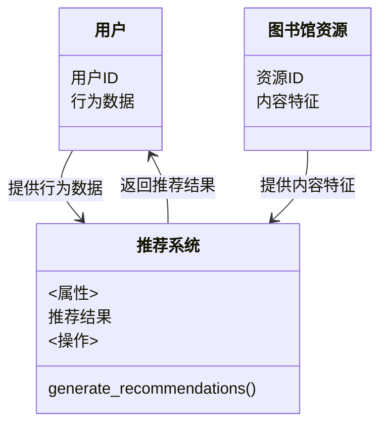

                 


# 智能图书馆：AI Agent的资源推荐系统

## 关键词：
智能图书馆，AI Agent，资源推荐系统，协同过滤，深度学习，自然语言处理

## 摘要：
本文探讨了AI Agent在智能图书馆资源推荐系统中的应用，分析了推荐系统的算法原理、系统架构设计及项目实战，展示了如何利用AI技术提升图书馆资源推荐的准确性和效率。

---

# 第一部分: 智能图书馆与AI Agent的背景介绍

## 第1章: 智能图书馆的定义与应用

### 1.1 智能图书馆的定义
#### 1.1.1 传统图书馆的演进
- 传统图书馆依赖人工管理，用户需自行查找资源。
- 数字化图书馆引入了在线资源和电子目录，提升了便利性。
- 智能图书馆通过AI和大数据技术，实现自动化推荐和个性化服务。

#### 1.1.2 智能图书馆的核心特征
- 自动化资源管理
- 个性化推荐
- 实时数据处理
- 多模态交互

#### 1.1.3 智能图书馆的应用场景
- 学术研究支持
- 公共阅读服务
- 特定主题资源推荐

### 1.2 AI Agent的基本概念
#### 1.2.1 什么是AI Agent
- AI Agent是能够感知环境并执行任务的智能实体。
- 具备学习、推理和自适应能力。
- 可以是软件或硬件形式。

#### 1.2.2 AI Agent的分类
- 简单反射式Agent
- 基于模型的反射式Agent
- 目标驱动的Agent
- 情境驱动的Agent

#### 1.2.3 AI Agent在智能图书馆中的作用
- 用户行为分析
- 资源检索与推荐
- 交互界面设计

### 1.3 资源推荐系统的核心概念
#### 1.3.1 资源推荐系统的定义
- 通过算法分析用户需求，推荐相关资源的系统。
- 包括图书、文章、视频等多种资源类型。

#### 1.3.2 资源推荐系统的应用场景
- 图书馆借阅推荐
- 在线学习资源推荐
- 研究资料推荐

#### 1.3.3 资源推荐系统与智能图书馆的结合
- 提高资源利用率
- 增强用户体验
- 优化图书馆运营

---

## 第2章: AI Agent与资源推荐系统的背景

### 2.1 问题背景
#### 2.1.1 图书馆资源管理的挑战
- 资源数量庞大，难以手动分类。
- 用户需求多样，难以精准匹配。
- 信息更新迅速，需要实时响应。

#### 2.1.2 用户信息需求的多样性
- 用户可能对同一主题有不同的兴趣点。
- 需要支持多语言、多格式的需求。

#### 2.1.3 资源推荐的必要性
- 提高用户满意度。
- 提升资源使用效率。
- 降低用户寻找资源的时间成本。

### 2.2 问题描述
#### 2.2.1 用户需求与资源匹配的难点
- 用户需求隐含，难以直接获取。
- 资源描述复杂，难以准确解析。
- 推荐结果需动态调整。

#### 2.2.2 资源推荐的准确性问题
- 数据稀疏性导致推荐误差。
- 用户偏好变化快，推荐模型需实时更新。
- 多样性与精确性的平衡难题。

#### 2.2.3 系统性能的优化需求
- 高效的数据处理能力。
- 实时响应用户请求。
- 节省计算资源。

### 2.3 问题解决
#### 2.3.1 AI Agent在资源推荐中的优势
- 能够实时感知用户需求。
- 具备自主学习和优化能力。
- 可以处理复杂的数据关系。

#### 2.3.2 基于AI的推荐算法
- 协同过滤：基于用户行为相似性推荐。
- 基于内容的推荐：分析资源内容特征。
- 深度学习模型：如神经网络协同过滤。

#### 2.3.3 系统设计的创新点
- 结合AI Agent实现动态推荐。
- 利用自然语言处理技术解析资源内容。
- 引入强化学习优化推荐策略。

### 2.4 边界与外延
#### 2.4.1 系统的边界条件
- 仅推荐系统内的资源。
- 系统性能受硬件限制。
- 用户隐私保护范围。

#### 2.4.2 系统的外延功能
- 支持多语言推荐。
- 个性化定制推荐策略。
- 提供反馈机制优化推荐结果。

#### 2.4.3 系统与其他模块的交互
- 与图书馆管理系统集成。
- 与其他AI服务（如NLP引擎）交互。
- 接收用户的实时反馈。

### 2.5 概念结构与核心要素
#### 2.5.1 概念图的构建
- 用户需求、资源库、推荐算法、推荐结果。
- AI Agent作为核心连接模块。

#### 2.5.2 核心要素的分析
- 用户：需求明确性、行为数据。
- 资源：内容特征、分类标签。
- 算法：推荐策略、模型复杂度。
- 系统：处理能力、响应速度。

#### 2.5.3 概念之间的关系
- 用户需求驱动资源检索。
- 资源特征影响推荐算法。
- 算法结果反馈用户需求。

---

## 第3章: AI Agent与资源推荐系统的原理

### 3.1 核心概念与联系
#### 3.1.1 AI Agent的核心原理
- 感知环境：收集用户行为数据。
- 推理需求：分析数据得出推荐目标。
- 执行推荐：基于推理结果生成推荐列表。

#### 3.1.2 资源推荐系统的原理
- 数据收集：获取用户行为和资源信息。
- 数据处理：清洗和预处理。
- 推荐生成：基于算法计算推荐结果。
- 反馈优化：根据用户反馈调整推荐策略。

#### 3.1.3 两者的结合与协同
- AI Agent作为资源推荐系统的执行者。
- 资源推荐系统的数据为AI Agent提供决策依据。

### 3.2 核心概念的特征对比
| 特征 | AI Agent | 资源推荐系统 |
|------|-----------|--------------|
| 核心功能 | 执行任务 | 提供推荐列表 |
| 输入 | 用户请求 | 用户行为、资源数据 |
| 输出 | 推荐结果 | 无 |
| 依赖 | 数据分析能力 | 算法模型 |
| 优势 | 自适应能力强 | 推荐准确性高 |

### 3.3 ER实体关系图
```mermaid
er
    图书馆资源推荐系统
    图书馆资源表
    用户表
    推荐记录表
    用户-资源关系
    图书馆资源-推荐记录关系
```

### 3.4 核心算法的流程图


---

## 第4章: 算法原理讲解

### 4.1 协同过滤算法
```python
def collaborative_filtering(user_id, user_matrix):
    # 找出与目标用户相似的用户
    similar_users = find_similar_users(user_id, user_matrix)
    # 计算推荐分数
    recommendations = []
    for user in similar_users:
        for resource in user.resources:
            if resource not in user_matrix[user.id]:
                recommendations.append((resource, calculate_recommendation_score(user.id, resource)))
    return recommendations
```

### 4.2 深度学习模型
$$ \text{损失函数} = \sum_{i=1}^{n}(y_i - \hat{y}_i)^2 $$
$$ \text{预测值} = \text{模型}(\text{输入特征}) $$

### 4.3 自然语言处理应用
- 使用TF-IDF提取资源关键词。
- 利用Word2Vec生成资源向量表示。
- 通过余弦相似度计算推荐资源。

---

## 第5章: 系统分析与架构设计

### 5.1 需求分析
- 用户需求：个性化推荐、实时响应。
- 系统需求：高效处理、可扩展性。

### 5.2 领域模型


### 5.3 系统架构


### 5.4 接口设计
- 用户接口：API调用。
- 数据接口：数据库查询。
- 推荐结果接口：返回JSON格式。

### 5.5 交互流程图
```mermaid
sequenceDiagram
    用户 ->> 接收请求
    接收请求 ->> 分析需求
    分析需求 ->> 检索资源
    检索资源 ->> 生成推荐
    生成推荐 ->> 返回结果
```

---

## 第6章: 项目实战

### 6.1 环境搭建
- 安装Python、TensorFlow、Scikit-learn等库。
- 配置数据库和API接口。

### 6.2 核心实现
```python
def train_model(data):
    model = SomeAlgorithm()
    model.fit(data)
    return model
```

### 6.3 案例分析
- 数据预处理：清洗和归一化。
- 模型训练：选择最佳算法。
- 测试与优化：调整参数，提升准确率。

### 6.4 小结
- 项目实现的关键步骤。
- 遇到的问题及解决方案。
- 经验总结。

---

## 第7章: 总结与展望

### 7.1 总结
- AI Agent在资源推荐中的核心作用。
- 系统设计的关键点和实现难点。

### 7.2 未来展望
- 更加智能的推荐算法。
- 多模态数据的应用。
- 全球化资源推荐。

### 7.3 最佳实践 tips
- 数据预处理的重要性。
- 模型选择的策略。
- 系统优化的建议。

### 7.4 小结
- 回顾文章内容。
- 强调AI在图书馆中的应用前景。

### 7.5 注意事项
- 数据隐私保护。
- 系统稳定性和安全性。
- 用户体验优化。

### 7.6 拓展阅读
- 推荐系统相关文献。
- AI Agent最新研究进展。
- 多模态数据处理技术。

---

通过以上结构，您可以撰写一篇详细的、有深度的智能图书馆AI Agent资源推荐系统的博客文章。

