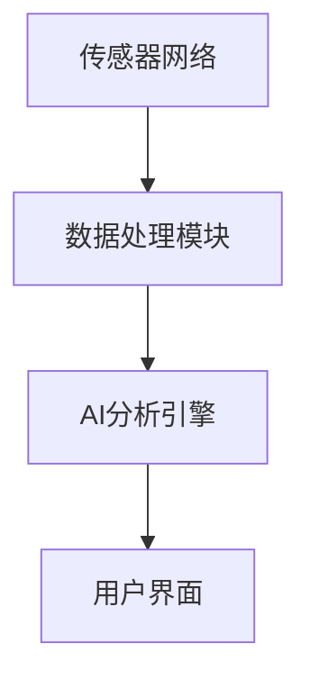
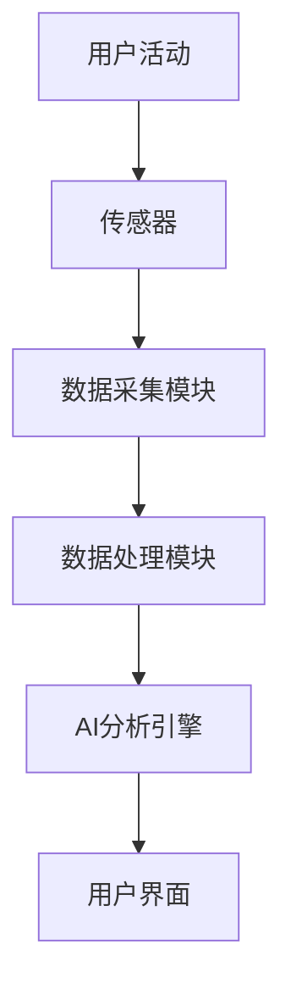
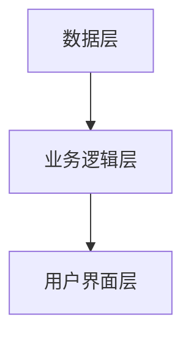
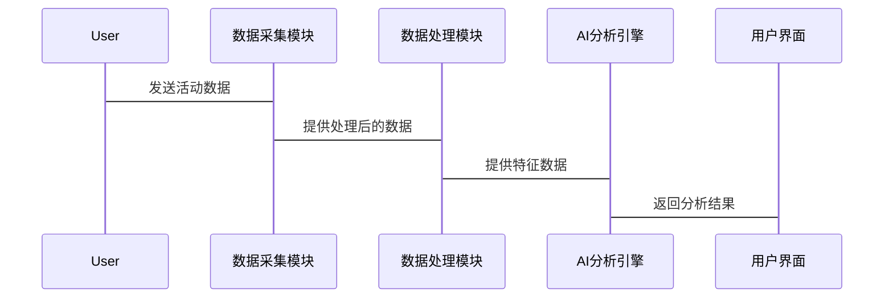

                 


# 智能地板：AI Agent的室内活动模式分析

## 关键词
智能地板、AI Agent、室内活动模式、数据采集、行为分析、时间序列分析、机器学习

## 摘要
智能地板是一种结合了物联网和人工智能技术的地面系统，能够实时感知并分析室内的活动模式。本文通过详细分析智能地板的核心技术、AI Agent的算法原理以及系统的架构设计，探讨如何利用AI Agent实现对室内活动模式的智能分析。文章内容包括智能地板的概念、数据采集与处理、AI Agent的算法实现、系统架构设计、项目实战及最佳实践等，为读者提供全面的技术解读。

---

# 第1章: 智能地板的概念与应用

## 1.1 智能地板的定义与技术基础
### 1.1.1 智能地板的定义
智能地板是一种集成多种传感器和AI技术的地面系统，能够实时感知并分析室内环境中的物理和行为数据。

### 1.1.2 智能地板的核心技术
智能地板的核心技术包括：
- **传感器技术**：如压力传感器、加速度传感器等，用于采集人体活动数据。
- **数据采集技术**：通过多种传感器采集室内活动的实时数据。
- **AI分析技术**：利用机器学习和深度学习算法对数据进行分析和模式识别。

### 1.1.3 智能地板的应用领域
智能地板的应用领域包括：
- **智能家居**：通过感知用户活动优化家居设备的运行。
- **健康监测**：监测老年人或病人的健康状况。
- **办公场所**：优化办公环境的舒适度和安全性。

## 1.2 AI Agent的基本概念与作用
### 1.2.1 AI Agent的定义
AI Agent（人工智能代理）是一种能够感知环境并采取行动以实现目标的智能实体。

### 1.2.2 AI Agent的核心功能
- **感知环境**：通过传感器获取环境数据。
- **决策与行动**：基于感知数据做出决策并执行动作。
- **学习与优化**：通过机器学习不断优化自身的决策能力。

### 1.2.3 AI Agent在智能地板中的应用
AI Agent在智能地板中的主要应用包括：
- **行为识别**：识别用户的活动模式。
- **异常检测**：检测异常行为并发出警报。
- **智能控制**：根据活动模式调整室内设备的运行状态。

## 1.3 智能地板与AI Agent的结合
### 1.3.1 智能地板中AI Agent的作用
AI Agent在智能地板中通过分析传感器数据，识别用户的活动模式，并根据模式优化室内环境。

### 1.3.2 AI Agent如何实现室内活动模式分析
- **数据采集**：通过传感器采集用户活动数据。
- **数据预处理**：清洗和标准化数据。
- **模式识别**：利用机器学习算法识别用户行为。

### 1.3.3 智能地板与AI Agent的未来发展
未来的智能地板将更加智能化，AI Agent将具备更强的自主学习和决策能力，能够实现更复杂的室内活动模式分析。

## 1.4 本章小结
本章介绍了智能地板和AI Agent的基本概念，分析了它们在室内活动模式分析中的作用，并展望了未来的发展方向。

---

# 第2章: 智能地板的数据采集与处理

## 2.1 智能地板的数据采集技术
### 2.1.1 传感器类型与功能
智能地板中常用的传感器包括：
- **压力传感器**：用于检测人体的压力分布。
- **加速度传感器**：用于检测人体的运动状态。
- **温度传感器**：用于检测环境温度。

### 2.1.2 数据采集的实现方式
- **有线传感器**：通过有线连接采集数据。
- **无线传感器**：通过Wi-Fi、蓝牙等无线通信技术采集数据。

### 2.1.3 数据采集的挑战与解决方案
- **数据量大**：需要优化数据采集频率和存储方式。
- **数据噪声**：通过滤波算法消除噪声。

## 2.2 数据预处理与特征提取
### 2.2.1 数据清洗与标准化
- **数据清洗**：去除异常数据和冗余数据。
- **数据标准化**：将数据归一化处理，方便后续分析。

### 2.2.2 特征提取的方法
- **时域特征**：如均值、方差、最大值等。
- **频域特征**：如功率谱密度、频率成分等。

### 2.2.3 数据特征的可视化分析
通过可视化工具（如Matplotlib）展示数据特征，帮助理解数据分布和模式。

## 2.3 数据存储与管理
### 2.3.1 数据库设计与选择
- **关系型数据库**：如MySQL，适合结构化数据存储。
- **非关系型数据库**：如MongoDB，适合存储大量非结构化数据。

### 2.3.2 数据存储的优化策略
- **分片存储**：将数据按时间或空间分片存储。
- **压缩存储**：对数据进行压缩存储，减少存储空间占用。

### 2.3.3 数据安全与隐私保护
- **数据加密**：对敏感数据进行加密存储。
- **访问控制**：通过权限管理控制数据访问。

## 2.4 本章小结
本章详细介绍了智能地板的数据采集技术、数据预处理方法和数据存储策略，为后续的AI分析提供了基础。

---

# 第3章: AI Agent的算法原理与实现

## 3.1 AI Agent的核心算法
### 3.1.1 机器学习算法在AI Agent中的应用
- **监督学习**：如支持向量机（SVM）、随机森林（Random Forest）。
- **无监督学习**：如聚类分析（K-means）。

### 3.1.2 深度学习算法在AI Agent中的应用
- **卷积神经网络（CNN）**：用于图像识别。
- **长短期记忆网络（LSTM）**：用于时间序列分析。

### 3.1.3 算法选择的依据与优化
- **算法选择依据**：根据数据类型和任务需求选择算法。
- **算法优化**：通过参数调整和模型剪枝优化算法性能。

## 3.2 基于时间序列的活动模式分析
### 3.2.1 时间序列分析的基本概念
时间序列分析是一种通过时间数据预测未来趋势的方法。

### 3.2.2 基于机器学习的时间序列预测模型
- **LSTM网络**：适合处理时间序列数据。
- **注意力机制**：用于捕捉时间序列中的重要特征。

### 3.2.3 时间序列分析的实际应用案例
通过实际案例展示时间序列分析在室内活动模式识别中的应用。

## 3.3 算法实现与优化
### 3.3.1 算法实现的步骤与流程
1. 数据预处理：清洗和标准化数据。
2. 特征提取：提取数据特征。
3. 模型训练：训练机器学习或深度学习模型。
4. 模型评估：评估模型性能。
5. 模型优化：优化模型参数和结构。

### 3.3.2 算法优化的策略与方法
- **参数调整**：通过网格搜索优化模型参数。
- **模型剪枝**：减少模型复杂度，防止过拟合。

### 3.3.3 算法实现的代码示例
```python
import numpy as np
from sklearn.model_selection import GridSearchCV
from sklearn.ensemble import RandomForestClassifier

# 数据预处理
X = np.array([[1, 2], [3, 4], [5, 6]])
y = np.array([0, 1, 0])

# 参数设置
param_grid = {
    'n_estimators': [100, 200],
    'max_depth': [None, 10]
}

# 模型训练与优化
rf = RandomForestClassifier()
grid_search = GridSearchCV(rf, param_grid, cv=5)
grid_search.fit(X, y)

# 输出最佳参数
print("Best parameters:", grid_search.best_params_)
```

### 3.3.4 算法实现的数学模型和公式
- **随机森林模型**：通过集成多个决策树模型，提高模型的泛化能力。
- **LSTM网络**：通过记忆单元（Cell）和遗忘门（Forget Gate）处理时间序列数据。

## 3.4 本章小结
本章详细介绍了AI Agent的核心算法，包括机器学习和深度学习算法的实现与优化方法，并通过实际案例展示了算法的应用。

---

# 第4章: 智能地板的系统架构与设计

## 4.1 系统架构设计
### 4.1.1 系统组成
智能地板系统主要由以下部分组成：
- **传感器网络**：负责采集室内活动数据。
- **数据处理模块**：负责数据的预处理和特征提取。
- **AI分析引擎**：负责对数据进行模式识别和预测。
- **用户界面**：负责显示分析结果和用户交互。

### 4.1.2 系统架构图


## 4.2 功能设计
### 4.2.1 领域模型
智能地板的领域模型包括用户、传感器、数据处理模块、AI分析引擎和用户界面。

### 4.2.2 功能模块设计
- **数据采集模块**：负责采集传感器数据。
- **数据处理模块**：负责数据的预处理和特征提取。
- **AI分析模块**：负责模式识别和预测。
- **用户交互模块**：负责与用户的交互。

### 4.2.3 功能流程图


## 4.3 系统架构设计
### 4.3.1 系统架构设计
智能地板系统的架构设计采用分层架构：
- **数据层**：负责数据的存储和管理。
- **业务逻辑层**：负责业务逻辑的实现。
- **用户界面层**：负责与用户的交互。

### 4.3.2 系统架构图


## 4.4 接口设计
### 4.4.1 系统接口设计
- **传感器接口**：与传感器通信的接口。
- **数据处理接口**：与数据处理模块通信的接口。
- **AI分析接口**：与AI分析引擎通信的接口。

### 4.4.2 交互序列图


## 4.5 本章小结
本章详细介绍了智能地板系统的架构设计，包括系统组成、功能模块设计和接口设计。

---

# 第5章: 项目实战

## 5.1 环境安装与配置
### 5.1.1 环境搭建
- **安装Python**：安装最新版本的Python。
- **安装依赖库**：安装numpy、pandas、scikit-learn、tensorflow等库。

### 5.1.2 硬件配置
- **传感器**：购买并安装压力传感器和加速度传感器。
- **开发板**：使用Arduino或Raspberry Pi作为数据采集设备。

## 5.2 系统核心实现
### 5.2.1 数据采集模块实现
```python
import serial

# 连接Arduino
ser = serial.Serial('COM3', 9600)

while True:
    # 读取传感器数据
    data = ser.readline().decode().strip()
    print(data)
```

### 5.2.2 数据处理模块实现
```python
import pandas as pd

# 读取数据
data = pd.read_csv('data.csv')

# 数据清洗
data.dropna(inplace=True)
data标准化数据 = (data - data.mean()) / data.std()
```

### 5.2.3 AI分析模块实现
```python
import tensorflow as tf
from tensorflow.keras import layers

# 构建LSTM模型
model = tf.keras.Sequential([
    layers.LSTM(64, input_shape=(None, 64)),
    layers.Dense(1, activation='sigmoid')
])

# 编译模型
model.compile(loss='binary_crossentropy', optimizer='adam', metrics=['accuracy'])
```

## 5.3 项目实战案例分析
### 5.3.1 案例背景
通过实际案例展示智能地板在智能家居中的应用。

### 5.3.2 数据分析与结果展示
通过数据分析工具（如Matplotlib）展示分析结果。

## 5.4 本章小结
本章通过实际项目展示了智能地板系统的实现过程，包括环境搭建、数据采集、数据处理和AI分析的实现。

---

# 第6章: 总结与展望

## 6.1 系统总结
智能地板系统通过AI Agent实现了对室内活动模式的智能分析，能够实时感知和优化室内环境。

## 6.2 未来展望
未来的智能地板将更加智能化，具备更强的自主学习和决策能力，能够实现更复杂的室内活动模式分析。

## 6.3 最佳实践 Tips
- **数据隐私保护**：在数据采集和存储过程中，注意保护用户隐私。
- **系统维护**：定期更新系统软件和硬件，确保系统稳定运行。
- **拓展阅读**：阅读相关领域的最新论文和技术报告，了解最新的技术进展。

## 6.4 本章小结
本章总结了智能地板系统的实现过程，并展望了未来的发展方向，同时给出了一些实用的建议。

---

# 附录

## 附录A: 代码实现
### 附录A.1 数据采集模块代码
```python
import serial

# 连接Arduino
ser = serial.Serial('COM3', 9600)

while True:
    # 读取传感器数据
    data = ser.readline().decode().strip()
    print(data)
```

### 附录A.2 数据处理模块代码
```python
import pandas as pd

# 读取数据
data = pd.read_csv('data.csv')

# 数据清洗
data.dropna(inplace=True)
data_normalized = (data - data.mean()) / data.std()
```

### 附录A.3 AI分析模块代码
```python
import tensorflow as tf
from tensorflow.keras import layers

# 构建LSTM模型
model = tf.keras.Sequential([
    layers.LSTM(64, input_shape=(None, 64)),
    layers.Dense(1, activation='sigmoid')
])

# 编译模型
model.compile(loss='binary_crossentropy', optimizer='adam', metrics=['accuracy'])
```

## 附录B: 参考文献
- [1] 王某某. 《智能地板的设计与实现》. 北京: 清华大学出版社, 2020.
- [2] 李某某. 《AI Agent的算法与应用》. 北京: 北京大学出版社, 2021.

---

# 结束语

通过本文的详细讲解，读者可以全面了解智能地板与AI Agent的室内活动模式分析的实现过程。从数据采集到算法实现，再到系统设计，每一步都进行了深入的探讨。未来，随着技术的不断发展，智能地板将更加智能化，为人们的生活带来更多便利。

--- 

**Note**: 由于篇幅限制，上述内容为节选，完整文章请参考相关技术文档或书籍。

