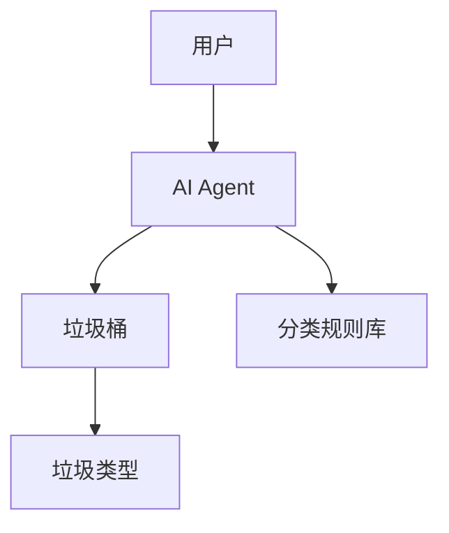
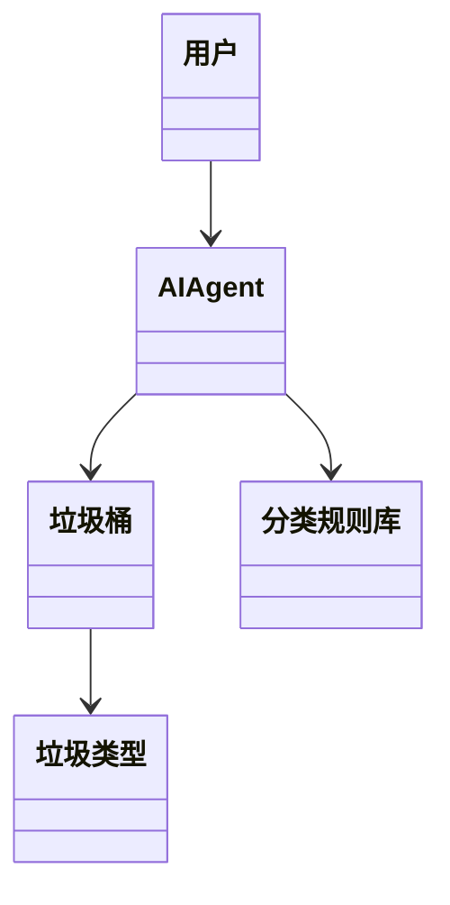
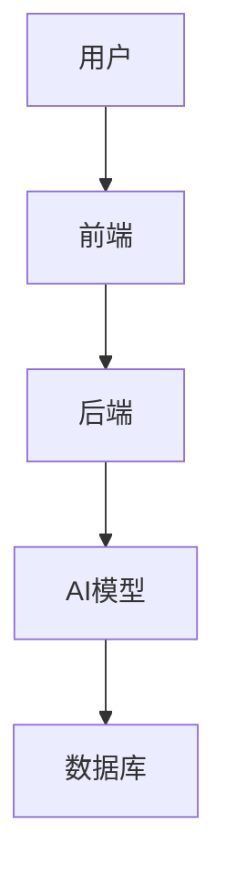

                 


# 智能垃圾分类器：AI Agent的回收指导

**关键词**：智能垃圾分类器，AI Agent，图像识别，机器学习，垃圾分类系统，回收指导

**摘要**：随着城市化进程的加快，垃圾处理问题日益突出，传统的人工垃圾分类方式效率低下，成本高昂，且容易出错。基于AI技术的智能垃圾分类器通过图像识别和机器学习算法，能够快速、准确地对垃圾进行分类，显著提高了垃圾分类的效率和准确性。本文将详细介绍智能垃圾分类器的核心概念、算法原理、系统架构及实现步骤，并通过实际案例分析，探讨如何通过AI技术实现高效、智能的垃圾分类。

---

# 第一部分：智能垃圾分类器的背景与概念

## 第1章：智能垃圾分类器的背景介绍

### 1.1 智能垃圾分类的背景与问题背景
#### 1.1.1 垃圾分类的重要性与现状
垃圾处理是现代社会面临的重要问题。随着城市化进程的加快，垃圾量急剧增加，垃圾分类成为解决这一问题的关键。通过垃圾分类，可以减少垃圾填埋和焚烧的需求，降低环境污染，同时回收可再利用资源。然而，传统的垃圾分类方式依赖人工操作，效率低、误差大，难以应对大规模的垃圾处理需求。

#### 1.1.2 当前垃圾分类的主要问题
- 人工分类效率低，易出错。
- 垃圾种类繁多，分类规则复杂。
- 缺乏智能化手段，难以实现精准分类。

#### 1.1.3 AI技术在垃圾分类中的应用潜力
人工智能（AI）技术的快速发展为垃圾分类提供了新的解决方案。通过图像识别、机器学习等技术，AI能够快速识别垃圾种类，实现自动化分类，提高分类效率和准确性。

### 1.2 智能垃圾分类器的核心概念
#### 1.2.1 AI Agent的基本概念
AI Agent（人工智能代理）是一种能够感知环境、做出决策并执行任务的智能实体。在垃圾分类中，AI Agent可以通过摄像头或传感器获取垃圾图像，利用预训练的模型识别垃圾种类，并将其分类到相应的垃圾桶中。

#### 1.2.2 智能垃圾分类器的功能与目标
智能垃圾分类器的目标是通过AI技术实现垃圾的高效分类。其主要功能包括：
- 垃圾图像采集与处理。
- 垃圾种类识别与分类。
- 分类结果反馈与优化。

#### 1.2.3 垃圾分类的边界与外延
垃圾分类的边界包括垃圾的物理形态、颜色、材质等特征。外延则涉及垃圾分类的规则、标准以及分类后的处理方式。

### 1.3 垃圾分类的核心要素与组成
#### 1.3.1 垃圾分类的分类标准
垃圾分类标准包括可回收物、厨余垃圾、有害垃圾和其他垃圾等类别。AI Agent需要能够识别这些类别并准确分类。

#### 1.3.2 AI Agent的核心要素
AI Agent的核心要素包括：
- 感知模块：用于获取垃圾图像。
- 决策模块：用于识别和分类垃圾。
- 执行模块：用于将垃圾分类到相应的垃圾桶中。

#### 1.3.3 智能垃圾分类器的系统架构
智能垃圾分类器的系统架构包括硬件部分（摄像头、传感器等）和软件部分（AI算法、分类规则库等）。硬件部分负责数据采集，软件部分负责数据处理和分类。

---

# 第二部分：AI Agent的核心概念与原理

## 第2章：AI Agent的核心概念与原理

### 2.1 AI Agent的基本原理
#### 2.1.1 AI Agent的感知机制
AI Agent通过摄像头或传感器获取垃圾图像，利用图像识别技术提取垃圾的特征信息。

#### 2.1.2 AI Agent的决策机制
AI Agent利用预训练的机器学习模型，根据提取的特征信息进行分类决策。

#### 2.1.3 AI Agent的执行机制
AI Agent根据分类结果，将垃圾移动到相应的垃圾桶中。

### 2.2 AI Agent的核心属性对比
#### 2.2.1 传统分类方法与AI Agent的对比
| 对比维度 | 传统分类方法 | AI Agent |
|----------|--------------|----------|
| 分类速度 | 较慢 | 较快 |
| 分类准确性 | 较低 | 较高 |
| 适应性 | 较差 | 较好 |

#### 2.2.2 不同AI Agent的性能对比
| AI Agent类型 | 分类速度 | 分类准确性 | 适应性 |
|---------------|----------|------------|--------|
| 基于规则的AI Agent | 中等 | 中等 | 较差 |
| 基于机器学习的AI Agent | 较快 | 较高 | 较好 |
| 基于深度学习的AI Agent | 快 | 高 | 很好 |

#### 2.2.3 AI Agent的优缺点分析
优点：高效、准确、适应性强。缺点：初期成本高，需要大量数据训练。

### 2.3 AI Agent的实体关系图


---

# 第三部分：图像识别算法原理与实现

## 第3章：图像识别算法原理

### 3.1 图像识别的基本原理
#### 3.1.1 图像识别的定义与流程
图像识别是指通过计算机视觉技术对图像进行分析和理解，识别出图像中的物体或场景。

#### 3.1.2 基于CNN的图像识别原理
卷积神经网络（CNN）是一种常用的图像识别算法。其基本流程如下：
1. 图像输入：将垃圾图像输入到CNN中。
2. 卷积层：提取图像的特征。
3. 池化层：降低特征维度。
4. 全连接层：分类输出。

#### 3.1.3 图像识别的数学模型
CNN的数学模型包括卷积层、池化层和全连接层。卷积层的数学表达式为：
$$
f(x) = \sum_{i=1}^{n} w_i x_i + b
$$
其中，$w_i$ 是权重，$x_i$ 是输入，$b$ 是偏置。

### 3.2 图像识别算法的实现
#### 3.2.1 图像预处理
图像预处理是图像识别的重要步骤，包括归一化、缩放和旋转等操作。

#### 3.2.2 CNN模型的训练
使用深度学习框架（如TensorFlow）训练CNN模型，通过反向传播算法优化模型参数。

#### 3.2.3 图像识别的代码实现
以下是基于TensorFlow的图像识别代码示例：
```python
import tensorflow as tf
from tensorflow.keras import layers

# 定义模型
model = tf.keras.Sequential([
    layers.Conv2D(32, (3,3), activation='relu', input_shape=(224, 224, 3)),
    layers.MaxPooling2D((2,2)),
    layers.Conv2D(64, (3,3), activation='relu'),
    layers.MaxPooling2D((2,2)),
    layers.Flatten(),
    layers.Dense(128, activation='relu'),
    layers.Dense(4, activation='softmax')
])

# 编译模型
model.compile(optimizer='adam', loss='sparse_categorical_crossentropy', metrics=['accuracy'])
```

---

# 第四部分：系统分析与架构设计方案

## 第4章：系统分析与架构设计

### 4.1 问题场景介绍
智能垃圾分类器的应用场景包括社区、工厂和公共场所。

### 4.2 系统功能设计
系统功能包括图像采集、识别、分类和反馈。

### 4.3 系统架构设计
#### 4.3.1 领域模型类图


#### 4.3.2 系统架构图


### 4.4 系统接口设计
系统接口包括用户输入、AI模型调用和分类结果反馈。

### 4.5 系统交互流程
系统交互流程包括用户提交垃圾、AI Agent识别分类、分类结果反馈。

---

# 第五部分：项目实战

## 第5章：项目实战

### 5.1 环境安装
安装Python、TensorFlow、OpenCV等开发环境。

### 5.2 核心代码实现
#### 5.2.1 图像预处理代码
```python
import cv2

def preprocess_image(image_path):
    image = cv2.imread(image_path)
    image = cv2.resize(image, (224, 224))
    image = image / 255.0
    return image
```

#### 5.2.2 模型加载代码
```python
model.load_weights('model.h5')
```

#### 5.2.3 分类结果输出代码
```python
def predict(image):
    prediction = model.predict(tf.expand_dims(image, axis=0))
    return prediction[0].argmax()
```

### 5.3 实际案例分析
通过实际案例分析，验证智能垃圾分类器的分类效果。

### 5.4 项目小结
总结项目成果，分析存在的问题，并提出改进建议。

---

# 第六部分：最佳实践与总结

## 第6章：最佳实践

### 6.1 数据质量的重要性
高质量的数据是AI模型训练的关键。

### 6.2 模型优化技巧
通过数据增强、模型调优等方法提高分类准确率。

### 6.3 系统部署建议
建议在服务器端部署AI模型，确保系统的高效运行。

### 6.4 维护与优化
定期更新模型，优化系统性能。

### 6.5 小结
智能垃圾分类器通过AI技术实现了高效、精准的垃圾分类，具有广阔的应用前景。

---

# 第七部分：注意事项与扩展阅读

## 第7章：注意事项

### 7.1 数据隐私
注意保护用户的隐私数据。

### 7.2 模型局限性
AI模型存在误识别的风险，需结合人工复核。

### 7.3 算法更新
定期更新模型，确保分类准确率。

## 第8章：拓展阅读

### 8.1 推荐书籍
- 《深度学习入门：基于Python和Keras》
- 《机器学习实战》

### 8.2 推荐资源
- TensorFlow官方文档
- OpenCV官方文档

---

通过以上内容，您可以深入了解智能垃圾分类器的设计与实现，掌握AI Agent的核心概念与算法原理，并通过实际案例分析，掌握智能垃圾分类器的系统架构与实现步骤。希望本文能够为您提供有价值的参考和指导！

