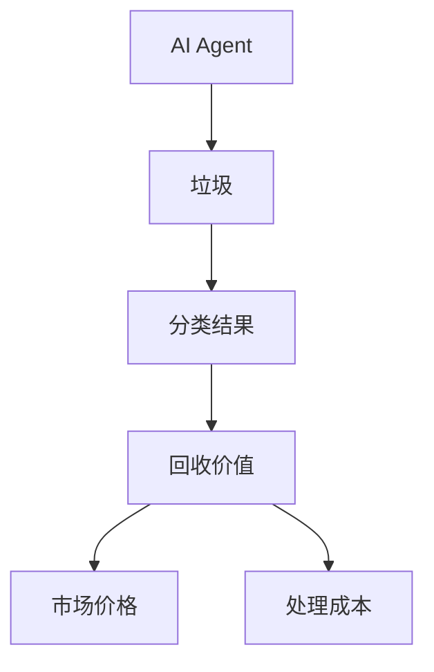
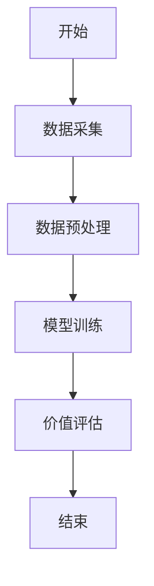
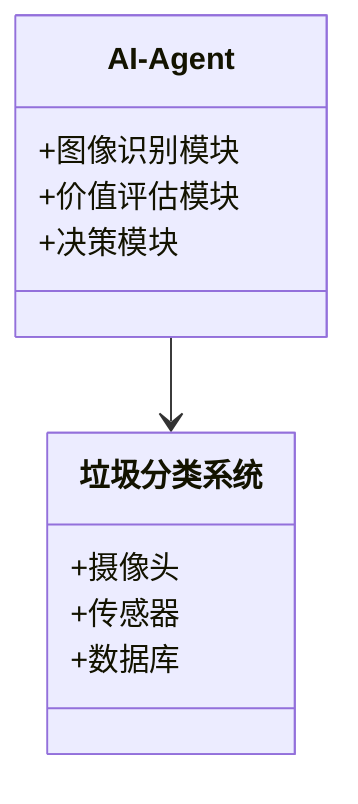
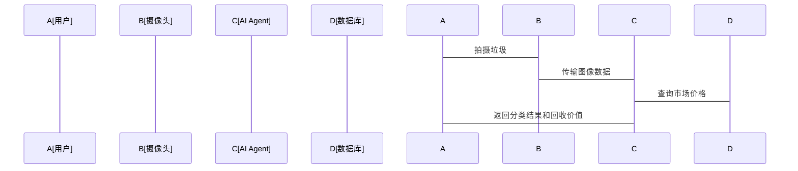

                 


# 智能垃圾分类站：AI Agent的回收价值评估

> **关键词**：智能垃圾分类站、AI Agent、回收价值评估、图像识别、机器学习、垃圾分类系统、智能回收

> **摘要**：随着城市化进程的加快，垃圾分类成为全球关注的焦点。本文探讨了AI Agent在智能垃圾分类站中的应用，重点分析了回收价值评估的核心算法和系统设计。通过详细的技术分析，本文揭示了AI Agent如何优化垃圾分类流程，提升回收价值，为智能垃圾分类站的设计与实现提供了理论依据和实践指导。

---

## 第一部分：背景介绍

### 第1章：智能垃圾分类站的背景与挑战

#### 1.1 问题背景
- **1.1.1 当前垃圾分类的现状与问题**
  - 全球范围内，垃圾量激增，传统的人工分类方式效率低下，且易出错。
  - 垃圾分类不准确会导致资源浪费，甚至对环境造成二次污染。
  - 随着人工智能技术的发展，智能化垃圾分类成为趋势。

- **1.1.2 智能化垃圾分类的必要性**
  - 提高分类效率，降低人工成本。
  - 通过智能分类，提升可回收资源的价值。
  - 实现垃圾分类的实时监控与优化。

- **1.1.3 AI Agent在垃圾分类中的作用**
  - AI Agent能够实时分析垃圾种类，指导分类操作。
  - 通过学习和优化，AI Agent可以提升分类准确率。
  - AI Agent能够结合市场价格，动态评估垃圾的回收价值。

#### 1.2 问题描述
- **1.2.1 垃圾分类的基本概念与分类标准**
  - 垃圾分类是根据垃圾的成分、属性、利用价值和对环境的影响，将垃圾分为不同类别。
  - 常见的分类标准包括可回收物、厨余垃圾、有害垃圾和其他垃圾。

- **1.2.2 智能垃圾分类站的核心问题**
  - 如何高效、准确地识别垃圾种类。
  - 如何动态评估垃圾的回收价值。
  - 如何优化垃圾分类流程，降低成本。

- **1.2.3 回收价值评估的定义与意义**
  - 回收价值评估是通过分析垃圾的市场价值、处理成本等因素，确定垃圾的经济价值。
  - 价值评估能够指导垃圾分类决策，提升资源利用率。

#### 1.3 问题解决
- **1.3.1 AI Agent如何实现智能分类**
  - AI Agent通过图像识别和机器学习算法，实现垃圾种类的自动识别。
  - AI Agent能够实时调整分类策略，优化分类效率。

- **1.3.2 回收价值评估的关键步骤**
  - 数据收集与分析：收集垃圾的市场价格、处理成本等数据。
  - 价值模型构建：建立垃圾回收价值的数学模型。
  - 价值评估与优化：根据模型结果，优化垃圾分类策略。

- **1.3.3 系统设计的目标与实现路径**
  - 系统目标：实现高效、智能的垃圾分类与价值评估。
  - 实现路径：通过AI Agent实现垃圾识别，结合价值评估模型优化分类流程。

#### 1.4 边界与外延
- **1.4.1 智能垃圾分类站的边界条件**
  - 系统仅负责垃圾的识别与分类，不涉及垃圾的实际处理。
  - 系统依赖于外部数据源（如市场价格数据）进行价值评估。

- **1.4.2 回收价值评估的外延范围**
  - 评估范围包括可回收物、有害垃圾等高价值垃圾。
  - 对于低价值垃圾，系统可以提供降级处理建议。

- **1.4.3 系统与其他模块的交互边界**
  - 与前端设备（如摄像头、传感器）的交互接口。
  - 与后端数据处理系统的接口。

#### 1.5 概念结构与核心要素
- **1.5.1 智能垃圾分类站的核心要素**
  - AI Agent：负责垃圾识别与分类决策。
  - 价值评估模型：用于计算垃圾的经济价值。
  - 数据采集模块：采集垃圾图像和市场数据。

- **1.5.2 AI Agent的组成与功能**
  - 视觉识别模块：基于图像识别技术，识别垃圾种类。
  - 价值评估模块：结合市场价格数据，评估垃圾价值。
  - 决策模块：根据评估结果，优化分类策略。

- **1.5.3 回收价值评估的指标体系**
  - 垃圾种类：可回收物、厨余垃圾等。
  - 市场价格：不同垃圾的回收价格。
  - 处理成本：分类和处理垃圾的成本。

---

### 第2章：核心概念与联系

#### 2.1 AI Agent的基本原理
- **2.1.1 AI Agent的定义与分类**
  - AI Agent是一种能够感知环境并采取行动以实现目标的智能体。
  - 分类：基于智能水平，分为反应式AI Agent和认知式AI Agent。

- **2.1.2 AI Agent的核心算法与技术**
  - 图像识别技术：基于深度学习的卷积神经网络（CNN）。
  - 机器学习模型：随机森林、支持向量机（SVM）等。

- **2.1.3 AI Agent在垃圾分类中的应用场景**
  - 实时图像识别：快速识别垃圾种类。
  - 动态调整分类策略：根据市场价格变化优化分类。

#### 2.2 回收价值评估的原理
- **2.2.1 价值评估的基本概念**
  - 回收价值是垃圾的市场价值减去处理成本。
  - 价值评估需要考虑垃圾的种类、数量、市场价格等因素。

- **2.2.2 AI Agent如何评估垃圾的回收价值**
  - 数据采集：收集垃圾种类、市场价格、处理成本等数据。
  - 模型构建：建立垃圾回收价值的数学模型。
  - 价值评估：根据模型计算垃圾的回收价值。

- **2.2.3 价值评估的数学模型与公式**
  - 回收价值 = 市场价格 × 回收率 - 处理成本。
  - 其中，回收率是垃圾实际可回收的比例。

#### 2.3 核心概念之间的关系
- **2.3.1 AI Agent与垃圾分类的关系**
  - AI Agent通过图像识别实现垃圾分类。
  - 分类结果为价值评估提供基础数据。

- **2.3.2 价值评估与系统设计的关系**
  - 价值评估指导垃圾分类策略的优化。
  - 系统设计为价值评估提供数据支持。

- **2.3.3 核心概念的对比分析表**

| 概念 | 描述 | 关系 |
|------|------|------|
| AI Agent | 智能体，用于垃圾识别和分类决策 | 核心技术模块 |
| 垃圾分类 | 根据垃圾属性进行分类 | 系统目标 |
| 回收价值评估 | 评估垃圾的经济价值 | 指导分类决策 |

#### 2.4 实体关系图（Mermaid）


---

### 第3章：算法原理讲解

#### 3.1 AI Agent的核心算法
- **3.1.1 垃圾分类的图像识别算法**
  - 使用深度学习模型（如ResNet、Faster R-CNN）进行图像分类。
  - 算法流程：图像采集 → 预处理 → 特征提取 → 分类预测。

- **3.1.2 基于深度学习的分类模型**
  - 模型结构：卷积层 → 池化层 → 全连接层。
  - 训练数据：标注的垃圾图像数据集。

- **3.1.3 算法的优化与调优**
  - 超参数优化：学习率、批量大小等。
  - 模型剪枝：减少计算复杂度。

#### 3.2 回收价值评估的算法
- **3.2.1 价值评估的数学模型**
  - 回收价值 = 市场价格 × 回收率 - 处理成本。
  - 回收率 = 分类准确率 × 垃圾质量。

- **3.2.2 算法的实现步骤**
  1. 数据采集：获取垃圾种类、市场价格、处理成本。
  2. 数据预处理：清洗数据，去除异常值。
  3. 模型训练：训练分类模型和价值评估模型。
  4. 价值评估：根据分类结果和市场数据，计算回收价值。

- **3.2.3 算法的优化与改进**
  - 使用回归模型（如线性回归、随机森林）预测回收价值。
  - 实时更新市场价格数据，动态调整评估结果。

#### 3.3 算法流程图（Mermaid）


---

## 第四部分：系统分析与架构设计方案

### 第4章：系统分析与架构设计

#### 4.1 问题场景介绍
- 智能垃圾分类站的应用场景：社区、公共场所、工业园区。
- 系统需要解决的主要问题：高效分类、动态评估、实时监控。

#### 4.2 系统功能设计
- **领域模型（Mermaid类图）**


- **系统架构设计（Mermaid架构图）**
```mermaid
docker
    service ai-agent {
        image: ai-agent:latest
        ports: "5000:5000"
    }
    service 分类系统 {
        image: classification-system:latest
        ports: "8000:8000"
    }
    service 数据库 {
        image: mysql:8.0
        ports: "3306:3306"
    }
```

- **系统接口设计**
  - AI Agent与摄像头的接口：实时图像数据传输。
  - 价值评估模块与市场价格数据库的接口：动态获取市场价格数据。

- **系统交互序列图（Mermaid）**


---

## 第五部分：项目实战

### 第5章：项目实战

#### 5.1 环境安装
- 安装Python、TensorFlow、Keras、Mermaid等工具。
- 安装数据库：MySQL或MongoDB。

#### 5.2 系统核心实现
- **垃圾分类系统的Python代码实现**
  ```python
  import tensorflow as tf
  from tensorflow.keras import layers

  model = tf.keras.Sequential([
      layers.Conv2D(32, (3, 3), activation='relu', input_shape=(224, 224, 3)),
      layers.MaxPooling2D((2, 2)),
      layers.Conv2D(64, (3, 3), activation='relu'),
      layers.MaxPooling2D((2, 2)),
      layers.Flatten(),
      layers.Dense(128, activation='relu'),
      layers.Dense(10, activation='softmax')
  ])
  model.compile(optimizer='adam', loss='sparse_categorical_crossentropy', metrics=['accuracy'])
  model.fit(X_train, y_train, epochs=10, validation_data=(X_val, y_val))
  ```

- **价值评估模块的实现**
  ```python
  import pandas as pd
  from sklearn.ensemble import RandomForestRegressor

  df = pd.read_csv('market_data.csv')
  features = df[['price', 'cost', 'quantity']]
  target = df['value']
  model = RandomForestRegressor(n_estimators=100, random_state=42)
  model.fit(features, target)
  ```

#### 5.3 实际案例分析
- 案例1：某社区智能垃圾分类站的部署与运行。
- 案例2：工业园区有害垃圾的高效分类与回收。

#### 5.4 项目小结
- 系统实现的关键点：AI Agent的图像识别算法、价值评估模型的优化。
- 系统的优势：高效、智能、动态调整分类策略。
- 系统的局限性：依赖于外部数据源，硬件成本较高。

---

## 第六部分：总结与展望

### 第6章：总结与展望

#### 6.1 最佳实践 tips
- 数据质量：确保训练数据的多样性和准确性。
- 模型优化：定期更新模型，提升分类准确率。
- 系统维护：及时修复硬件故障，确保系统稳定运行。

#### 6.2 小结
- AI Agent在智能垃圾分类站中的应用前景广阔。
- 通过回收价值评估，可以显著提升垃圾分类的效率和资源利用率。

#### 6.3 注意事项
- 数据隐私保护：避免用户数据泄露。
- 系统兼容性：确保系统能够适配不同硬件设备。

#### 6.4 拓展阅读
- 推荐阅读《深度学习实战》、《机器学习算法与应用》等书籍。
- 关注AI在环保领域的最新应用。

---

通过以上详细的技术分析和实践案例，我们可以看到，AI Agent在智能垃圾分类站中的应用不仅提升了垃圾分类的效率，还通过回收价值评估优化了资源利用。未来，随着技术的不断进步，智能垃圾分类站将在更多领域发挥重要作用。

