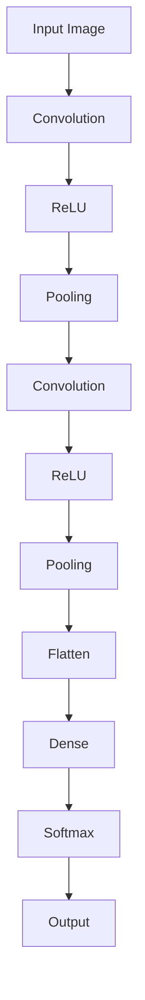
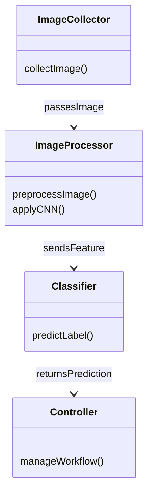

                 


# 智能垃圾分类：AI Agent的识别系统

## 关键词：智能垃圾分类，AI Agent，图像识别，深度学习，系统设计

## 摘要：  
本文深入探讨了智能垃圾分类系统中AI Agent的核心作用，分析了其识别系统的算法原理、系统架构及实际应用场景。通过对比传统方法与AI Agent的优势，结合具体的数学模型和系统设计案例，详细阐述了如何利用深度学习技术实现高效、准确的垃圾分类，为环保事业提供技术支持。

---

# 第一部分: 智能垃圾分类的背景与价值

## 第1章: 背景介绍

### 1.1 智能垃圾分类的背景

#### 1.1.1 垃圾分类的必要性  
随着城市化进程的加快，垃圾量急剧增加，垃圾分类成为全球关注的焦点。通过智能垃圾分类，可以减少环境污染、提高资源利用率，同时降低垃圾处理成本。AI Agent在这一领域的应用，为垃圾分类提供了高效、精准的技术支持。

#### 1.1.2 人工智能的基本概念  
人工智能（AI）是指通过计算机模拟人类智能的技术，包括学习、推理、感知和执行等能力。AI Agent是一种能够感知环境、自主决策并执行任务的智能体。

#### 1.1.3 AI Agent在垃圾分类中的应用价值  
AI Agent可以实时感知垃圾图像，通过深度学习算法快速分类，显著提高分类效率和准确性，降低人工成本。

---

### 1.2 AI Agent的基本概念

#### 1.2.1 AI Agent的定义与特点  
AI Agent是一种智能体，具备感知、推理和执行能力，能够独立完成任务。其特点包括自主性、反应性、目标导向和学习能力。

#### 1.2.2 AI Agent在垃圾分类中的应用价值  
通过AI Agent，垃圾分类系统能够实现自动化的图像识别和分类，显著提升分类效率和准确率。

---

## 第2章: 智能垃圾分类的核心概念与联系

### 2.1 AI Agent的原理与机制

#### 2.1.1 AI Agent的感知模块  
感知模块通过摄像头采集垃圾图像，并利用图像处理技术提取特征。

#### 2.1.2 AI Agent的推理模块  
推理模块基于训练好的深度学习模型，对图像特征进行分类，确定垃圾类型。

#### 2.1.3 AI Agent的执行模块  
执行模块根据分类结果，将垃圾引导至相应的收集容器。

---

### 2.2 核心概念对比分析

#### 2.2.1 传统分类方法与AI Agent的对比  
| 方法 | 优点 | 缺点 |
|------|------|------|
| 人工分类 | 准确率高 | 成本高，效率低 |
| 单一算法分类 | 实现简单 | 准确率低 |
| AI Agent | 高效、准确 | 开发成本高 |

#### 2.2.2 实体关系图与领域模型类图  
```mermaid
erDiagram
    actor User {
        string name
        string id
    }
    class Image {
        string id
        blob data
    }
    class Classification {
        string label
        date timestamp
    }
    Image --> Classification : belongsTo
```

---

## 第3章: 垃圾分类AI Agent的算法原理

### 3.1 算法原理概述

#### 3.1.1 卷积神经网络（CNN）的工作流程  


#### 3.1.2 损失函数与优化器  
损失函数：  
$$ L = -\sum_{i=1}^{n} y_i \log(p_i) + (1 - y_i)\log(1 - p_i) $$  

优化器：Adam  
$$ \theta_{t+1} = \theta_t - \eta \frac{ \beta_1 S_t + (1-\beta_1)G_t }{1 - \beta_2^t} $$  

---

## 第4章: 系统分析与架构设计

### 4.1 问题场景介绍  
智能垃圾分类系统需要在各种环境下稳定运行，支持多种垃圾类型识别。

### 4.2 系统功能设计

#### 4.2.1 数据采集模块  
负责采集垃圾图像，并进行预处理。

#### 4.2.2 图像识别模块  
基于CNN模型进行图像分类，输出垃圾类型。

#### 4.2.3 决策控制模块  
根据分类结果，控制机械臂或滑道进行垃圾分拣。

### 4.3 系统架构设计



---

## 第5章: 项目实战

### 5.1 环境安装

#### 5.1.1 安装Python与TensorFlow  
```bash
pip install numpy
pip install tensorflow
pip install opencv-python
```

### 5.2 核心代码实现

#### 5.2.1 数据采集与预处理  
```python
import cv2
def capture_image():
    cap = cv2.VideoCapture(0)
    ret, frame = cap.read()
    cv2.imwrite("input.jpg", frame)
    cap.release()
```

#### 5.2.2 图像识别模型  
```python
import tensorflow as tf
model = tf.keras.models.load_model("model.h5")
def classify_image(image_path):
    img = cv2.imread(image_path)
    img = cv2.resize(img, (224, 224))
    img = img / 255.0
    prediction = model.predict(tf.expand_dims(img, axis=0))
    return prediction[0].argmax()
```

---

## 第6章: 最佳实践与小结

### 6.1 小结  
通过AI Agent实现智能垃圾分类，显著提高了分类效率和准确率，为环保事业提供了技术支持。

### 6.2 注意事项  
- 确保模型训练数据的多样性，避免过拟合。  
- 系统部署时考虑环境稳定性，避免网络中断。  
- 定期更新模型，适应新垃圾类型的变化。

### 6.3 拓展阅读  
推荐阅读《深度学习实战》和《人工智能导论》等书籍，深入了解相关技术。

---

通过以上分析和设计，智能垃圾分类系统能够高效、准确地完成任务，为环保事业贡献力量。

