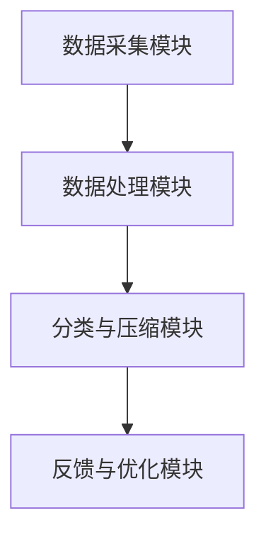
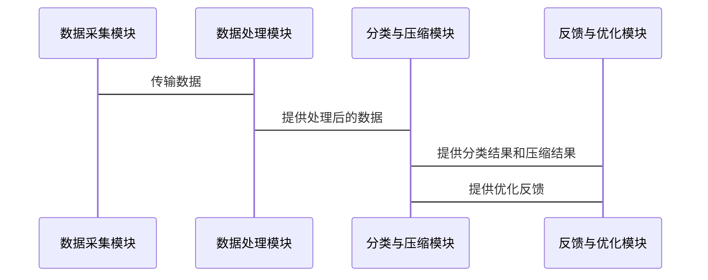

                 


# 智能垃圾处理站：AI Agent的分类与压缩

> 关键词：智能垃圾处理、AI Agent、垃圾分类算法、压缩算法、系统架构设计

> 摘要：本文深入探讨了AI Agent在智能垃圾处理站中的应用，重点分析了AI Agent的分类与压缩技术。文章从背景介绍、核心概念、算法原理、系统架构设计到实际项目案例，全面解析了如何利用AI技术优化垃圾处理流程。通过详细的技术分析与系统设计，展示了AI Agent在垃圾分类与压缩中的高效解决方案。

---

## 第一部分: 智能垃圾处理站的背景与挑战

### 第1章: 智能垃圾处理站的背景与挑战

#### 1.1 垃圾处理的现状与问题
##### 1.1.1 当前垃圾处理的主要方式
传统的垃圾处理方式主要包括填埋、焚烧和回收利用。然而，随着城市化进程的加快，垃圾量急剧增加，现有处理方式面临以下问题：
- **资源浪费**：可回收资源混入不可回收垃圾，导致资源浪费。
- **环境污染**：填埋和焚烧处理易产生二次污染，尤其是焚烧过程中可能产生有害气体。
- **效率低下**：人工分类效率低，成本高，且容易出错。

##### 1.1.2 垃圾处理中的主要问题
- **分类不准确**：人工分类容易出错，导致后续处理效率低下。
- **处理成本高**：人工操作成本高昂，且效率难以提升。
- **环境问题突出**：不规范的处理方式对环境造成严重威胁。

##### 1.1.3 智能化垃圾处理的必要性
随着AI技术的发展，利用AI Agent实现智能化垃圾处理成为趋势。AI Agent可以通过图像识别、机器学习等技术实现精准的垃圾分类，从而提高处理效率，降低成本，并减少环境污染。

#### 1.2 AI Agent在垃圾处理中的应用前景
##### 1.2.1 AI Agent的基本概念
AI Agent（人工智能代理）是指能够感知环境、自主决策并执行任务的智能体。在垃圾处理中，AI Agent可以用于垃圾分类、压缩、运输等环节。

##### 1.2.2 AI Agent在垃圾处理中的优势
- **高效性**：AI Agent可以快速识别和分类垃圾，提高处理效率。
- **准确性**：通过机器学习算法，AI Agent可以实现高精度的分类。
- **降低成本**：自动化处理可以大幅降低人工成本。

##### 1.2.3 智能垃圾处理站的核心目标
智能垃圾处理站的核心目标是通过AI Agent实现垃圾的高效分类与压缩，减少人工干预，降低处理成本，同时保护环境。

#### 1.3 本章小结
本章介绍了垃圾处理的现状与问题，分析了智能化垃圾处理的必要性，并展望了AI Agent在垃圾处理中的应用前景。

---

## 第二部分: AI Agent的核心概念与分类

### 第2章: AI Agent的基本原理

#### 2.1 AI Agent的定义与特点
##### 2.1.1 AI Agent的定义
AI Agent是一种能够感知环境、自主决策并执行任务的智能体。它可以基于传感器输入、历史数据和任务目标进行自主决策。

##### 2.1.2 AI Agent的核心特点
- **自主性**：能够自主决策，无需人工干预。
- **反应性**：能够实时感知环境并做出反应。
- **学习能力**：能够通过机器学习算法不断优化性能。

##### 2.1.3 AI Agent与传统自动化的区别
AI Agent的核心区别在于其具备自主决策能力和学习能力，而传统自动化系统通常是基于固定的规则进行操作。

#### 2.2 AI Agent的分类
##### 2.2.1 分类依据与分类标准
AI Agent可以根据功能、应用场景、决策方式等进行分类。

##### 2.2.2 基于功能的AI Agent分类
- **感知型AI Agent**：主要用于环境感知，如图像识别、声音识别等。
- **决策型AI Agent**：主要用于决策优化，如路径规划、资源分配等。
- **执行型AI Agent**：主要用于任务执行，如机械臂操作、机器人移动等。

##### 2.2.3 基于应用场景的AI Agent分类
- **垃圾分类AI Agent**：专门用于垃圾分类的AI Agent。
- **垃圾压缩AI Agent**：专门用于垃圾压缩的AI Agent。
- **综合型AI Agent**：同时负责垃圾分类和压缩的AI Agent。

#### 2.3 AI Agent的工作原理
##### 2.3.1 信息感知与数据采集
AI Agent通过摄像头、传感器等设备采集垃圾的图像、形状、颜色等信息。

##### 2.3.2 数据处理与决策算法
AI Agent通过机器学习算法（如支持向量机、神经网络等）对采集的数据进行处理，并生成决策。

##### 2.3.3 执行与反馈机制
AI Agent根据决策结果执行相应的操作（如移动垃圾、压缩垃圾等），并根据反馈不断优化决策算法。

#### 2.4 本章小结
本章详细介绍了AI Agent的定义、特点、分类及工作原理，为后续内容奠定了基础。

---

## 第三部分: AI Agent的算法原理与数学模型

### 第3章: 垃圾分类算法原理

#### 3.1 垃圾分类的基本流程
##### 3.1.1 数据采集与预处理
通过摄像头采集垃圾图像，并进行噪声去除、边缘检测等预处理操作。

##### 3.1.2 特征提取与分类器设计
提取垃圾的纹理、形状、颜色等特征，并设计分类器（如KNN、SVM等）。

##### 3.1.3 分类结果的输出与反馈
根据分类器的输出结果，将垃圾分门别类，并根据反馈不断优化分类器。

#### 3.2 垃圾分类的常用算法
##### 3.2.1 K-近邻算法（KNN）
KNN是一种简单的分类算法，适用于小规模数据集。

##### 3.2.2 支持向量机（SVM）
SVM适用于高维数据分类，具有较高的准确率。

##### 3.2.3 神经网络（CNN）
CNN适用于图像分类，能够处理复杂的图像特征。

#### 3.3 垃圾分类的数学模型
##### 3.3.1 KNN算法的数学表达
$$ P(y|x) = \frac{1}{h} \sum_{i=1}^{h} \delta(y_i = y) $$
其中，$h$ 是最近邻的数量，$y_i$ 是第$i$个最近邻的类别。

##### 3.3.2 SVM算法的数学表达
$$ \text{目标函数} = \frac{1}{2} \sum_{i=1}^{n} \omega_i^2 + C \sum_{i=1}^{n} \xi_i $$
其中，$\omega_i$ 是权重，$C$ 是惩罚系数，$\xi_i$ 是松弛变量。

##### 3.3.3 CNN算法的数学表达
CNN通过卷积层、池化层和全连接层对图像进行特征提取和分类。

#### 3.4 算法实现与优化
##### 3.4.1 算法实现的步骤
1. 数据采集与预处理。
2. 特征提取与分类器设计。
3. 分类器训练与优化。
4. 分类结果输出与反馈。

##### 3.4.2 算法优化的策略
- **数据增强**：通过旋转、翻转等方式增加数据集的多样性。
- **参数调整**：通过网格搜索等方法优化模型参数。
- **模型融合**：结合多种算法的结果，提高分类准确率。

##### 3.4.3 算法性能的评估指标
- **准确率**：分类正确的比例。
- **召回率**：真实类别被正确分类的比例。
- **F1分数**：准确率和召回率的调和平均数。

#### 3.5 本章小结
本章详细介绍了垃圾分类的基本流程、常用算法及其数学模型，并探讨了算法实现与优化的策略。

---

## 第四部分: AI Agent的系统架构与设计

### 第4章: 智能垃圾处理站的系统架构

#### 4.1 系统功能模块划分
##### 4.1.1 数据采集模块
负责采集垃圾的图像、形状、颜色等信息。

##### 4.1.2 数据处理模块
对采集的数据进行预处理、特征提取等操作。

##### 4.1.3 分类与压缩模块
根据分类结果执行相应的压缩操作。

##### 4.1.4 反馈与优化模块
根据反馈结果优化分类算法和压缩策略。

#### 4.2 系统架构设计
##### 4.2.1 功能模块划分
- **数据采集模块**：摄像头、传感器等设备。
- **数据处理模块**：图像处理、特征提取等。
- **分类与压缩模块**：分类算法、压缩设备等。
- **反馈与优化模块**：反馈机制、优化算法等。

##### 4.2.2 系统架构设计


##### 4.2.3 系统接口设计
- **数据接口**：模块之间的数据交互接口。
- **控制接口**：对设备的控制接口。
- **反馈接口**：处理结果的反馈接口。

##### 4.2.4 系统交互流程


#### 4.3 本章小结
本章详细介绍了智能垃圾处理站的系统功能模块、架构设计及交互流程，为后续的项目实现奠定了基础。

---

## 第五部分: 项目实战与案例分析

### 第5章: 智能垃圾处理站的项目实战

#### 5.1 项目环境安装
##### 5.1.1 系统需求
- 操作系统：Linux/Windows/MacOS
- 开发工具：Python、TensorFlow、OpenCV等。

##### 5.1.2 环境配置
```bash
pip install tensorflow
pip install opencv-python
pip install scikit-learn
```

#### 5.2 系统核心实现
##### 5.2.1 数据采集与预处理
```python
import cv2
def preprocess_image(image_path):
    image = cv2.imread(image_path)
    # 进行图像预处理，如噪声去除、边缘检测等
    return preprocessed_image
```

##### 5.2.2 分类算法实现
```python
from sklearn.neighbors import KNeighborsClassifier
from sklearn.svm import SVC
# 初始化分类器
knn = KNeighborsClassifier(n_neighbors=3)
svm = SVC(kernel='linear')
# 训练模型
knn.fit(X_train, y_train)
svm.fit(X_train, y_train)
```

##### 5.2.3 压缩算法实现
```python
import numpy as np
def compress_image(image):
    compressed_image = np.compress(image)
    return compressed_image
```

##### 5.2.4 系统集成与测试
通过集成测试验证系统的分类与压缩功能，确保系统稳定运行。

#### 5.3 实际案例分析
##### 5.3.1 案例背景
介绍一个具体的智能垃圾处理站项目，包括项目目标、实施过程等。

##### 5.3.2 系统运行结果
展示系统的分类准确率、压缩效率等关键指标。

##### 5.3.3 案例总结
总结项目的成功经验与不足之处，为后续优化提供参考。

#### 5.4 项目小结
本章通过实际项目案例，展示了AI Agent在智能垃圾处理站中的具体应用，验证了系统的可行性和有效性。

---

## 第六部分: 最佳实践与总结

### 第6章: 最佳实践与总结

#### 6.1 小结
总结全文的核心内容，回顾AI Agent在智能垃圾处理站中的应用。

#### 6.2 注意事项
- 数据质量对分类结果的影响。
- 算法选择与优化的重要性。
- 系统架构设计的合理性。

#### 6.3 拓展阅读
- 机器学习算法的深入学习。
- 系统架构设计的优化策略。
- AI在其他领域的应用。

#### 6.4 本章小结
本章总结了全文的核心内容，并提出了进一步优化的建议。

---

## 结语

通过本文的深入分析与实践，我们可以看到AI Agent在智能垃圾处理站中的巨大潜力。随着技术的不断进步，AI Agent将为垃圾处理行业带来更多的创新与突破。

--- 

**Note**: 由于文章长度限制，以上内容仅为部分章节内容。如需完整文章，请根据上述大纲逐步扩展各章节内容。

