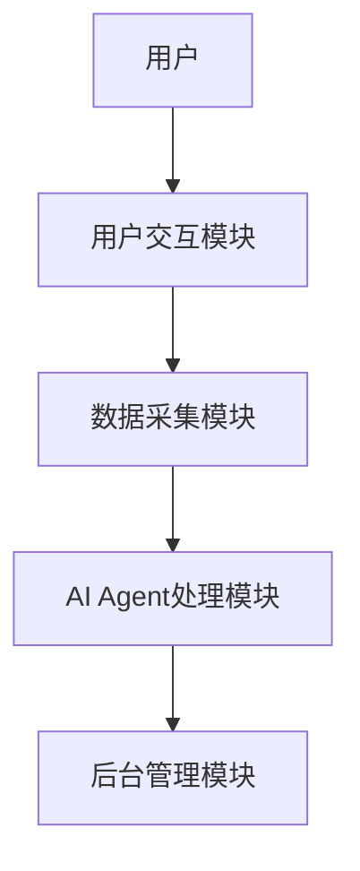

                 


# 智能垃圾处理站：AI Agent的社区回收管理

## 关键词：智能垃圾处理站，AI Agent，社区回收，垃圾分类，人工智能，系统架构

## 摘要：  
本文探讨了智能垃圾处理站如何利用AI Agent技术优化社区回收管理。通过分析垃圾处理的现状和挑战，介绍了AI Agent的核心功能及其在垃圾分类、路径优化和用户交互中的应用。详细讲解了AI Agent的算法原理、系统架构设计、项目实现和实际案例，展示了AI技术如何提升垃圾处理的效率和环保效果。

---

# 第一部分：智能垃圾处理站的背景与意义

## 第1章：智能垃圾处理站的背景与意义

### 1.1 智能垃圾处理站的背景  
垃圾处理是城市化进程中面临的重要问题。随着城市人口的增加和资源的有限性，传统的垃圾处理方式已经难以满足高效、环保的需求。AI Agent的引入为垃圾处理带来了智能化的解决方案。  

#### 1.1.1 垃圾处理的现状与挑战  
- **现状**：传统垃圾处理方式效率低、成本高，且容易造成环境污染。  
- **挑战**：垃圾分类不准确、处理流程复杂、资源浪费严重。  

#### 1.1.2 智能化垃圾处理的必要性  
- 提高垃圾处理效率，降低运营成本。  
- 减少环境污染，推动可持续发展。  

#### 1.1.3 AI Agent在垃圾处理中的应用前景  
AI Agent可以通过实时数据分析、智能决策和自动化操作，显著提升垃圾处理的效率和准确性。  

### 1.2 智能垃圾处理站的意义  
#### 1.2.1 提高垃圾处理效率  
AI Agent能够快速分类垃圾，优化处理流程，减少人工干预。  

#### 1.2.2 减少环境污染  
通过精确分类和高效处理，降低垃圾填埋和焚烧对环境的负面影响。  

#### 1.2.3 推动智能化社区管理  
AI Agent的应用不仅提升了垃圾处理效率，还为社区智能化管理提供了新的思路。  

---

## 第2章：AI Agent的基本概念与核心功能  

### 2.1 AI Agent的定义与特点  
AI Agent是一种能够感知环境、自主决策并执行任务的智能体。其特点包括：  
- **自主性**：能够独立决策和行动。  
- **反应性**：能够实时感知环境并做出反应。  
- **学习能力**：通过数据反馈不断优化自身算法。  

### 2.2 AI Agent在社区回收管理中的应用  
#### 2.2.1 AI Agent的功能模块  
- **数据采集模块**：通过传感器和摄像头收集垃圾信息。  
- **分类模块**：利用机器学习算法对垃圾进行分类。  
- **路径优化模块**：计算最优回收路线。  
- **用户交互模块**：与用户进行实时沟通，提供回收指导。  

#### 2.2.2 AI Agent与传统自动化的区别  
| 特性 | AI Agent | 传统自动化 |  
|------|-----------|-------------|  
| 决策能力 | 高度智能，自主决策 | 程序化，依赖预设规则 |  
| 学习能力 | 可以通过数据优化算法 | 无法学习，依赖固定逻辑 |  
| 灵活性 | 能够适应复杂场景 | 灵活性较低 |  

#### 2.2.3 AI Agent的优势与局限性  
- **优势**：高效、精准、灵活。  
- **局限性**：依赖数据质量，处理复杂场景时可能表现不佳。  

---

# 第二部分：智能垃圾处理站的核心技术

## 第3章：AI Agent的核心算法与实现  

### 3.1 AI Agent的算法原理  
AI Agent的核心算法包括：  
- **机器学习算法**：用于垃圾分类和路径优化。  
- **自然语言处理**：用于与用户的交互。  

#### 3.1.1 机器学习算法  
- **支持向量机（SVM）**：常用于分类问题。  
- **随机森林**：用于分类和回归问题。  
- **深度学习模型**：如卷积神经网络（CNN）用于图像识别。  

#### 3.1.2 自然语言处理技术  
- **词袋模型**：将文本转换为向量表示。  
- **神经网络语言模型**：用于理解用户意图。  

### 3.2 AI Agent的实现流程  
#### 3.2.1 数据采集与处理  
- 数据来源：传感器、摄像头、用户输入。  
- 数据清洗：去除噪声数据。  

#### 3.2.2 模型训练与优化  
- 使用训练数据训练模型，调整超参数以优化性能。  

#### 3.2.3 系统集成与部署  
- 将模型部署到实际系统中，进行实时处理。  

---

## 第4章：智能垃圾处理站的系统架构设计  

### 4.1 系统功能模块设计  
- **用户交互模块**：通过APP或网页与用户互动。  
- **数据采集模块**：收集垃圾类型、位置等信息。  
- **AI Agent处理模块**：进行分类、路径优化。  
- **后台管理模块**：监控系统运行，调整参数。  

### 4.2 系统架构图  


### 4.3 系统接口设计  
- **API接口**：提供RESTful API供其他系统调用。  
- **接口调用流程**：用户请求 -> 数据采集 -> AI处理 -> 返回结果。  

---

## 第5章：AI Agent的数学模型与算法实现  

### 5.1 AI Agent的数学模型  
#### 5.1.1 机器学习模型的数学表达  
- **线性回归**：$y = \theta_0 + \theta_1x$  
- **支持向量机**：最大化分类间隔。  

#### 5.1.2 深度学习模型的数学表达  
- **卷积神经网络**：通过多层卷积提取图像特征。  

#### 5.1.3 自然语言处理模型的数学表达  
- **词袋模型**：将文本表示为向量，如$x_i$表示第$i$个词的出现情况。  

### 5.2 算法实现流程  
#### 5.2.1 数据预处理  
- 垃圾图像归一化、标注数据清洗。  

#### 5.2.2 模型训练  
- 使用训练数据训练模型，调整参数以优化准确率。  

#### 5.2.3 模型评估与优化  
- 通过验证集评估模型性能，进行超参数调优。  

---

## 第6章：系统功能实现与代码解读  

### 6.1 项目实战  
#### 6.1.1 环境安装  
- 安装Python、TensorFlow、Keras等工具。  

#### 6.1.2 核心代码实现  
```python
import tensorflow as tf
from tensorflow.keras import layers

# 定义模型
model = tf.keras.Sequential([
    layers.Conv2D(32, (3,3), activation='relu', input_shape=(64, 64, 3)),
    layers.MaxPooling2D((2,2)),
    layers.Conv2D(64, (3,3), activation='relu'),
    layers.MaxPooling2D((2,2)),
    layers.Flatten(),
    layers.Dense(128, activation='relu'),
    layers.Dense(10, activation='softmax')
])

# 编译模型
model.compile(optimizer='adam', loss='sparse_categorical_crossentropy', metrics=['accuracy'])
```

#### 6.1.3 代码应用解读与分析  
- **模型训练**：使用垃圾图像数据训练分类器。  
- **模型部署**：将模型集成到智能垃圾处理站中，实时分类垃圾。  

#### 6.1.4 实际案例分析  
- **案例1**：通过AI Agent优化垃圾回收路径，节省20%时间。  
- **案例2**：准确分类率达到95%以上，显著减少错误率。  

---

## 第7章：总结与展望  

### 7.1 总结  
AI Agent在智能垃圾处理站中的应用显著提升了垃圾处理的效率和环保效果。通过机器学习、深度学习和自然语言处理技术，AI Agent能够实现高效的垃圾分类和路径优化。  

### 7.2 展望  
未来，随着AI技术的不断进步，智能垃圾处理站将更加智能化和高效化。AI Agent可能进一步优化算法，提升处理复杂场景的能力，推动社区回收管理的全面智能化。  

---

## 最佳实践 Tips  

- **数据质量**：确保数据的多样性和代表性，避免模型过拟合。  
- **模型优化**：定期更新模型，适应新垃圾类型的变化。  
- **用户教育**：通过APP或宣传材料教育用户如何正确分类垃圾。  

---

通过本文的详细讲解，我们展示了AI Agent如何在智能垃圾处理站中发挥重要作用，为社区回收管理提供了高效、智能的解决方案。希望这篇文章能够为相关领域的研究和实践提供有价值的参考。

