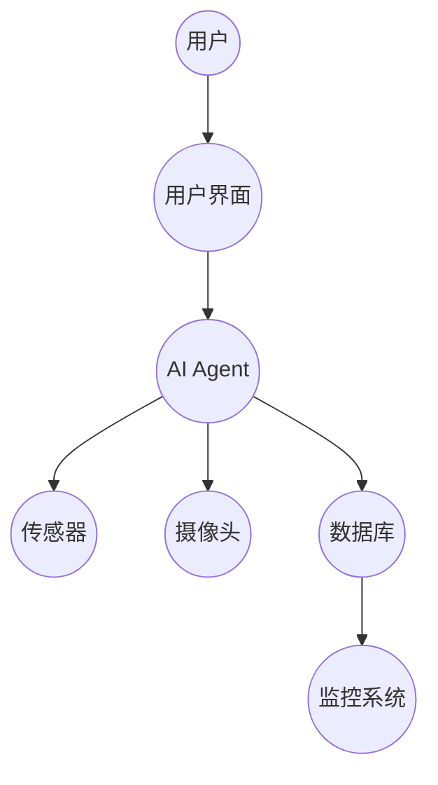

                 


# 智能垃圾处理站：AI Agent的社区回收管理

> 关键词：智能垃圾处理站、AI Agent、社区回收管理、人工智能、垃圾分类、系统架构

> 摘要：本文探讨了AI Agent在社区垃圾回收管理中的应用，分析了其背景、核心概念、算法原理、系统架构，并通过项目实战展示了其具体实现。文章详细讲解了AI Agent在垃圾分类、处理流程优化中的作用，探讨了其系统设计、数学模型及算法实现，最后通过实际案例总结了AI Agent的优势与局限性，提出了改进建议和未来发展方向。

---

## 第1章：智能垃圾处理站的背景与意义

### 1.1 智能垃圾处理站的背景

#### 1.1.1 垃圾处理的现状与挑战
随着城市化进程的加快，垃圾产生量急剧增加，传统的垃圾处理方式面临效率低、成本高等问题。垃圾处理不当会导致环境污染，影响居民健康和生活质量。

#### 1.1.2 智能化垃圾处理的必要性
智能化垃圾处理能够提高效率，降低成本，减少环境污染。通过AI技术，垃圾处理站可以实现自动化分类、高效处理和智能管理。

#### 1.1.3 AI Agent在垃圾处理中的应用前景
AI Agent能够实时感知环境，自主决策，与系统和用户交互，是实现智能化垃圾处理的关键技术。其应用前景广阔，尤其是在社区回收管理中。

### 1.2 智能垃圾处理站的意义

#### 1.2.1 提高垃圾处理效率
AI Agent能够快速分类垃圾，优化处理流程，显著提高处理效率。

#### 1.2.2 减少环境污染
智能化处理减少有害垃圾的漏处理，促进资源回收利用，降低环境污染。

#### 1.2.3 推动智能化社区管理
AI Agent的应用推动了社区管理的智能化，提升了整体管理效率和居民生活质量。

---

## 第2章：AI Agent的基本概念与核心功能

### 2.1 AI Agent的定义与特点

#### 2.1.1 AI Agent的定义
AI Agent是一种智能体，能够感知环境、自主决策并执行任务，具备学习和自适应能力。

#### 2.1.2 AI Agent的核心特点
- **自主性**：无需外部干预，自主执行任务。
- **反应性**：实时感知环境并做出反应。
- **学习能力**：通过数据学习优化决策。
- **协作性**：与其他系统和用户协作完成任务。

#### 2.1.3 AI Agent与传统自动化的区别
AI Agent具备自主决策和学习能力，能够处理复杂任务，而传统自动化仅执行预设程序。

### 2.2 AI Agent在社区回收管理中的应用

#### 2.2.1 AI Agent的功能模块
- **数据采集**：收集垃圾类型、数量等信息。
- **分类识别**：利用视觉识别技术分类垃圾。
- **决策优化**：优化处理流程，减少资源浪费。
- **用户交互**：与用户和系统交互，提供实时反馈。

#### 2.2.2 AI Agent与社区回收管理的结合
AI Agent通过实时分类、优化流程和智能管理，提升社区垃圾回收效率和资源利用率。

#### 2.2.3 AI Agent的优势与局限性
- **优势**：高效、精准、节省成本。
- **局限性**：依赖传感器和算法，硬件成本高，复杂环境适应性有限。

---

## 第3章：AI Agent的核心算法与实现

### 3.1 AI Agent的算法原理

#### 3.1.1 机器学习算法在AI Agent中的应用
- **监督学习**：基于标注数据训练分类模型。
- **无监督学习**：发现数据中的潜在结构。
- **强化学习**：通过试错优化决策策略。

#### 3.1.2 自然语言处理技术在AI Agent中的应用
- **垃圾类型识别**：通过文本分析识别垃圾类型。
- **用户交互**：理解用户的自然语言指令。

#### 3.1.3 视觉识别技术在AI Agent中的应用
- **图像分类**：识别垃圾类型和状态。
- **目标检测**：定位和识别垃圾位置。

### 3.2 AI Agent的实现流程

#### 3.2.1 数据采集与处理
- **数据采集**：使用摄像头、传感器采集垃圾信息。
- **数据预处理**：清洗、归一化和特征提取。

#### 3.2.2 模型训练与优化
- **选择算法**：根据任务选择合适的模型。
- **训练数据**：使用训练集训练模型。
- **优化调整**：调整超参数和模型结构。

#### 3.2.3 系统集成与部署
- **模块集成**：将各功能模块整合到系统中。
- **部署测试**：在实际环境中测试系统性能。

---

## 第4章：智能垃圾处理站的系统架构设计

### 4.1 系统功能模块设计

#### 4.1.1 用户交互模块
- **用户界面**：提供友好的操作界面。
- **交互功能**：接收用户指令，反馈处理结果。

#### 4.1.2 数据采集模块
- **传感器**：采集垃圾重量、位置等信息。
- **摄像头**：拍摄垃圾图像，识别类型。

#### 4.1.3 AI Agent处理模块
- **分类识别**：识别垃圾类型，优化处理流程。
- **决策优化**：根据实时数据调整处理策略。

#### 4.1.4 后台管理模块
- **数据存储**：存储垃圾处理数据。
- **系统监控**：监控系统运行状态，处理异常情况。

### 4.2 系统架构图

#### 4.2.1 系统架构的Mermaid图


### 4.3 系统接口设计

#### 4.3.1 API接口设计
- `/api/classify`：接收垃圾图像，返回分类结果。
- `/api/optimization`：接收处理数据，返回优化策略。

#### 4.3.2 接口调用流程
用户提交垃圾图像，系统调用分类接口，AI Agent处理后返回结果。

---

## 第5章：AI Agent的数学模型与算法实现

### 5.1 AI Agent的数学模型

#### 5.1.1 机器学习模型的数学表达
- **线性回归**：$y = \beta x + \epsilon$
- **支持向量机**：最大化间隔分类。
- **神经网络**：多层感知机结构。

#### 5.1.2 深度学习模型的数学表达
- **卷积神经网络（CNN）**：用于图像分类。
- **循环神经网络（RNN）**：用于序列数据处理。

#### 5.1.3 自然语言处理模型的数学表达
- **词嵌入**：使用词向量表示。
- **Transformer模型**：基于注意力机制。

### 5.2 算法实现流程

#### 5.2.1 数据预处理
- 归一化：$x' = \frac{x - \mu}{\sigma}$
- 特征提取：使用主成分分析。

#### 5.2.2 模型训练
- 使用训练数据训练模型，调整权重。

#### 5.2.3 模型评估与优化
- 使用验证集评估模型性能，调整超参数。

---

## 第6章：系统功能实现与代码解读

### 6.1 项目实战

#### 6.1.1 环境安装
- 安装Python、TensorFlow、OpenCV等库。

#### 6.1.2 系统核心实现源代码
```python
import tensorflow as tf
from tensorflow.keras import layers

model = tf.keras.Sequential([
    layers.Conv2D(32, (3,3), activation='relu', input_shape=(64,64,3)),
    layers.MaxPooling2D((2,2)),
    layers.Conv2D(64, (3,3), activation='relu'),
    layers.MaxPooling2D((2,2)),
    layers.Flatten(),
    layers.Dense(128, activation='relu'),
    layers.Dense(10, activation='softmax')
])

model.compile(optimizer='adam', loss='sparse_categorical_crossentropy', metrics=['accuracy'])
model.fit(x_train, y_train, epochs=10, validation_data=(x_val, y_val))
```

#### 6.1.3 代码应用解读与分析
- 上述代码实现了一个简单的CNN模型，用于图像分类。模型通过训练识别不同类型的垃圾。

#### 6.1.4 实际案例分析
- 案例：AI Agent识别并分类塑料瓶和纸张，优化处理流程，提高效率。

---

## 第7章：总结与展望

### 7.1 总结
AI Agent在社区垃圾回收管理中展现了巨大潜力，通过智能化分类和优化处理流程，显著提高了效率和资源利用率。

### 7.2 优缺点分析
- **优点**：高效、精准、节省成本。
- **缺点**：依赖传感器，硬件成本高，复杂环境适应性有限。

### 7.3 改进建议
- **硬件优化**：降低传感器成本，提高可靠性。
- **算法优化**：改进模型，提高识别精度。
- **系统集成**：优化系统架构，提升整体性能。

### 7.4 最佳实践 tips
- 定期维护系统，更新模型。
- 培训用户，提高使用效率。
- 监控系统运行，及时处理异常。

### 7.5 拓展阅读
推荐相关书籍和论文，深入学习AI Agent和垃圾处理技术。

---

通过以上内容，我们详细探讨了AI Agent在社区垃圾回收管理中的应用，分析了其算法、系统架构和实际案例。希望本文能为相关领域的研究和实践提供有价值的参考。

