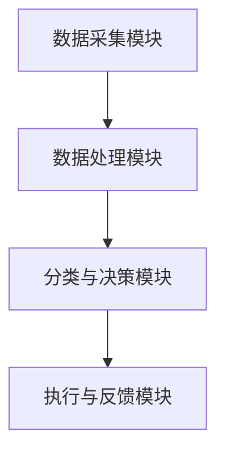
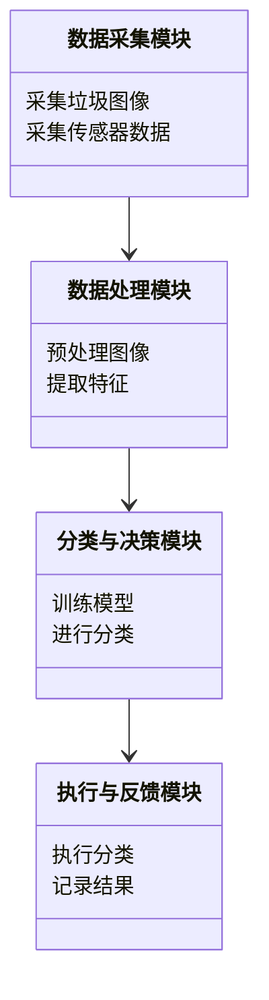
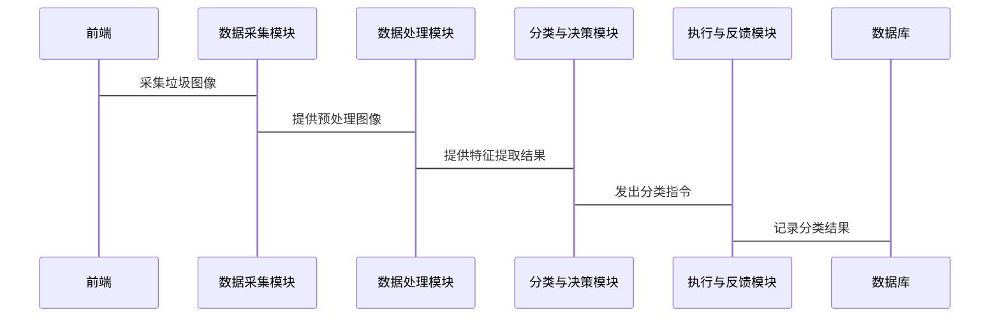

                 


# 智能垃圾处理：AI Agent的分类与回收系统

> 关键词：智能垃圾处理，AI Agent，垃圾分类，回收系统，图像识别，机器学习

> 摘要：本文探讨了利用人工智能代理（AI Agent）优化垃圾处理系统的分类与回收过程。通过分析AI Agent的分类方法和系统架构设计，结合实际案例，详细讲解了AI在垃圾处理中的应用，包括算法实现、数学模型和系统优化。本文旨在为垃圾处理行业提供一种高效、智能的解决方案。

---

# 第1章: 智能垃圾处理的背景与问题描述

## 1.1 传统垃圾处理的挑战

### 1.1.1 现有垃圾处理方式的不足

传统的垃圾处理方式主要依赖人工分类和处理，存在以下问题：
- **效率低下**：人工分类速度慢，尤其是在处理大量垃圾时，效率显著降低。
- **分类不准确**：人工分类容易出错，导致垃圾无法有效回收，造成资源浪费。
- **成本高昂**：人工处理需要大量劳动力，增加了垃圾处理的成本。

### 1.1.2 垃圾分类与回收的重要性

垃圾分类与回收是环境保护的重要环节，直接关系到资源的再利用和环境的可持续发展。有效的垃圾分类可以减少填埋垃圾的数量，降低环境污染，并提高资源的利用率。

### 1.1.3 智能化垃圾处理的必要性

随着城市化进程的加快，垃圾产生量急剧增加，传统的垃圾处理方式已无法满足需求。引入人工智能技术，可以提高垃圾处理的效率和准确性，降低处理成本，同时实现资源的高效回收。

---

## 1.2 AI Agent在垃圾处理中的应用前景

### 1.2.1 AI Agent的基本概念

AI Agent是一种能够感知环境、自主决策并执行任务的智能实体。它可以在无需人类干预的情况下，完成特定任务，例如分类、识别和回收垃圾。

### 1.2.2 AI Agent在垃圾处理中的优势

AI Agent在垃圾处理中的优势主要体现在以下几个方面：
- **高效性**：AI Agent可以在短时间内处理大量垃圾，显著提高处理效率。
- **准确性**：通过机器学习和图像识别技术，AI Agent能够准确识别和分类垃圾。
- **可持续性**：AI Agent可以24小时不间断工作，减少人力资源的投入。

### 1.2.3 智能垃圾处理系统的潜在价值

智能垃圾处理系统的引入，不仅能够提高垃圾处理的效率和准确性，还能通过数据驱动的方式优化整个处理流程，减少资源浪费，降低环境污染，推动可持续发展。

---

## 1.3 本章小结

本章主要介绍了智能垃圾处理的背景和问题，探讨了传统垃圾处理方式的不足，以及AI Agent在垃圾处理中的应用前景。通过分析，我们认识到引入AI技术在垃圾处理中的重要性，为后续章节的深入探讨奠定了基础。

---

# 第2章: AI Agent的分类与核心原理

## 2.1 AI Agent的基本分类

### 2.1.1 基于规则的AI Agent

基于规则的AI Agent通过预设的规则和逻辑进行分类和处理。这种方法简单易懂，适用于规则明确的场景，例如特定类型的垃圾分类。

### 2.1.2 基于机器学习的AI Agent

基于机器学习的AI Agent通过训练数据学习分类规则，能够处理复杂多样的垃圾类型。这种方法具有较高的灵活性和适应性，但需要大量的数据支持。

### 2.1.3 基于深度学习的AI Agent

基于深度学习的AI Agent利用神经网络进行特征提取和分类，能够处理高度复杂的垃圾图像和数据。这种方法在垃圾识别和分类方面表现出色。

---

## 2.2 AI Agent的核心原理

### 2.2.1 感知模块

感知模块是AI Agent的“眼睛”和“耳朵”，负责采集垃圾的相关信息，例如图像、颜色和形状。通过感知模块，AI Agent能够获取垃圾的特征数据。

### 2.2.2 决策模块

决策模块是AI Agent的“大脑”，负责根据感知到的信息进行分类和决策。基于训练好的模型，决策模块能够准确识别垃圾的类型，并制定相应的处理策略。

### 2.2.3 执行模块

执行模块是AI Agent的“手”，负责根据决策模块的指令执行具体的分类和回收操作。例如，将不同类型的垃圾分拣到指定的收集容器中。

---

## 2.3 AI Agent与垃圾处理的结合

### 2.3.1 垃圾识别与分类的AI Agent设计

通过AI Agent的设计，可以实现垃圾的自动识别和分类。例如，利用卷积神经网络（CNN）对垃圾图像进行特征提取和分类。

### 2.3.2 垃圾处理流程的优化

AI Agent可以通过优化垃圾处理流程，减少资源浪费和提高处理效率。例如，通过预测垃圾的类型和数量，优化垃圾运输和处理的路径。

### 2.3.3 AI Agent在垃圾回收系统中的角色

AI Agent在垃圾回收系统中扮演着多重角色，既是分类器，也是执行者，能够协调整个系统的运行，确保垃圾处理的高效和准确。

---

## 2.4 本章小结

本章详细介绍了AI Agent的基本分类和核心原理，并探讨了其在垃圾处理中的应用。通过分析，我们了解了AI Agent如何通过感知、决策和执行模块实现垃圾的智能分类和处理，为后续章节的系统设计奠定了基础。

---

# 第3章: 智能垃圾处理系统的架构设计

## 3.1 系统整体架构

### 3.1.1 系统模块划分

智能垃圾处理系统可以划分为以下几个模块：
- **数据采集模块**：负责采集垃圾的相关数据，例如图像和传感器信息。
- **数据处理模块**：对采集到的数据进行预处理和特征提取。
- **分类与决策模块**：利用机器学习模型对垃圾进行分类和决策。
- **执行与反馈模块**：根据决策结果执行分类操作，并提供反馈信息。

### 3.1.2 模块之间的关系

模块之间的关系可以用Mermaid图表示：



### 3.1.3 系统的输入与输出

- **输入**：垃圾图像、传感器数据
- **输出**：垃圾类型、分类结果、执行指令

---

## 3.2 数据流与信息处理流程

### 3.2.1 数据采集模块

数据采集模块负责采集垃圾的相关信息，例如使用摄像头拍摄垃圾图像，或者利用传感器检测垃圾的物理特性。

### 3.2.2 数据处理模块

数据处理模块对采集到的数据进行预处理和特征提取。例如，对垃圾图像进行灰度化、边缘检测等处理，提取有用的特征信息。

### 3.2.3 分类与决策模块

分类与决策模块利用训练好的机器学习模型对垃圾进行分类和决策。例如，使用支持向量机（SVM）或卷积神经网络（CNN）对垃圾图像进行分类。

### 3.2.4 执行与反馈模块

执行与反馈模块根据分类结果执行具体的分类操作，并提供反馈信息。例如，将垃圾分拣到指定的收集容器中，并记录分类结果。

---

## 3.3 系统的关键技术

### 3.3.1 图像识别技术

图像识别技术是智能垃圾处理系统的核心技术之一。通过图像识别，AI Agent能够准确识别垃圾的类型和特征。

### 3.3.2 自然语言处理技术

自然语言处理技术可以用于垃圾的描述和分类，例如通过分析垃圾的名称和描述信息，辅助分类决策。

### 3.3.3 机器学习算法

机器学习算法是实现垃圾分类和决策的关键。通过训练模型，AI Agent能够学习垃圾的特征，并进行准确的分类和决策。

---

## 3.4 本章小结

本章详细介绍了智能垃圾处理系统的整体架构和信息处理流程，探讨了系统的关键技术。通过分析，我们了解了AI Agent如何通过各模块的协同工作实现垃圾的智能分类和处理，为后续章节的实现提供了理论基础。

---

# 第4章: AI Agent的算法实现与数学模型

## 4.1 垃圾分类的算法选择

### 4.1.1 基于规则的分类算法

基于规则的分类算法通过预设的规则对垃圾进行分类。例如，根据垃圾的颜色和形状进行分类。

### 4.1.2 基于机器学习的分类算法

基于机器学习的分类算法通过训练数据学习分类规则，例如使用支持向量机（SVM）或随机森林（Random Forest）进行分类。

### 4.1.3 基于深度学习的分类算法

基于深度学习的分类算法通过神经网络进行特征提取和分类，例如使用卷积神经网络（CNN）对垃圾图像进行分类。

---

## 4.2 算法实现与数学模型

### 4.2.1 卷积神经网络（CNN）的实现

以下是使用Python实现的垃圾图像分类的CNN模型：

```python
import tensorflow as tf
from tensorflow.keras import layers

model = tf.keras.Sequential([
    layers.Conv2D(32, (3,3), activation='relu', input_shape=(224, 224, 3)),
    layers.MaxPooling2D((2,2)),
    layers.Conv2D(64, (3,3), activation='relu'),
    layers.MaxPooling2D((2,2)),
    layers.Flatten(),
    layers.Dense(128, activation='relu'),
    layers.Dense(10, activation='softmax')
])

model.compile(optimizer='adam', loss='sparse_categorical_crossentropy', metrics=['accuracy'])
model.fit(train_images, train_labels, epochs=10, batch_size=32)
```

### 4.2.2 模型训练的数学公式

模型的训练过程涉及损失函数和优化器的选择。常用的损失函数是交叉熵损失，优化器是Adam。数学公式如下：

$$
\text{损失函数} = -\sum_{i=1}^{n} y_i \log(p_i) + (1 - y_i) \log(1 - p_i)
$$

$$
\text{优化器} = \text{Adam}(\text{学习率}=0.001)
$$

---

## 4.3 本章小结

本章详细介绍了垃圾分类的算法选择和数学模型，探讨了AI Agent的算法实现。通过分析，我们了解了如何利用机器学习和深度学习技术实现垃圾的智能分类和处理，为后续章节的系统实现提供了技术支持。

---

# 第5章: 系统分析与架构设计方案

## 5.1 问题场景介绍

智能垃圾处理系统的应用场景包括家庭、社区和工业场所。系统需要能够处理多种类型的垃圾，并实现高效分类和回收。

## 5.2 系统功能设计

系统功能设计可以通过Mermaid类图表示：



---

## 5.3 系统架构设计

系统架构设计可以通过Mermaid架构图表示：


---

## 5.4 系统接口设计

系统接口设计需要考虑模块之间的交互，例如数据采集模块与数据处理模块之间的接口，分类与决策模块与执行与反馈模块之间的接口。

## 5.5 系统交互流程图

系统交互流程图可以通过Mermaid序列图表示：



---

## 5.6 本章小结

本章详细介绍了智能垃圾处理系统的分析与架构设计方案，探讨了系统的功能设计、架构设计和接口设计。通过分析，我们了解了如何通过各模块的协同工作实现智能垃圾处理系统的高效运行。

---

# 第6章: 项目实战

## 6.1 环境安装

### 6.1.1 安装Python和TensorFlow

安装Python和TensorFlow的命令如下：

```bash
pip install python==3.8
pip install tensorflow==2.5
```

---

### 6.1.2 安装OpenCV和图像处理库

安装OpenCV和图像处理库的命令如下：

```bash
pip install opencv-python
pip install scikit-image
```

---

## 6.2 系统核心实现

### 6.2.1 数据预处理

以下是数据预处理的Python代码：

```python
import cv2
import numpy as np

def preprocess_image(image_path):
    image = cv2.imread(image_path)
    image = cv2.resize(image, (224, 224))
    image = image / 255.0
    return image

preprocessed_image = preprocess_image("garbage.jpg")
```

---

### 6.2.2 模型训练

以下是模型训练的Python代码：

```python
import tensorflow as tf
from tensorflow.keras import layers

def create_model():
    model = tf.keras.Sequential([
        layers.Conv2D(32, (3,3), activation='relu', input_shape=(224, 224, 3)),
        layers.MaxPooling2D((2,2)),
        layers.Conv2D(64, (3,3), activation='relu'),
        layers.MaxPooling2D((2,2)),
        layers.Flatten(),
        layers.Dense(128, activation='relu'),
        layers.Dense(10, activation='softmax')
    ])
    return model

model = create_model()
model.compile(optimizer='adam', loss='sparse_categorical_crossentropy', metrics=['accuracy'])
model.fit(train_images, train_labels, epochs=10, batch_size=32)
```

---

### 6.2.3 垃圾分类与执行

以下是垃圾分类与执行的Python代码：

```python
import cv2
import numpy as np
from tensorflow.keras.models import load_model

model = load_model("garbage_classifier.h5")

def classify_garbage(image_path):
    image = cv2.imread(image_path)
    image = cv2.resize(image, (224, 224))
    image = image / 255.0
    image = np.expand_dims(image, axis=0)
    prediction = model.predict(image)
    predicted_class = np.argmax(prediction)
    return predicted_class

predicted_class = classify_garbage("garbage.jpg")
print(f"预测的垃圾类型为：{predicted_class}")
```

---

## 6.3 实际案例分析

### 6.3.1 案例介绍

以一张塑料瓶的图像为例，系统需要准确识别并将其分类到“可回收物”类别。

### 6.3.2 分类结果分析

通过模型预测，系统能够准确识别塑料瓶，并将其分类到“可回收物”类别。

### 6.3.3 优化建议

根据分类结果，可以优化模型的训练数据，提高分类的准确率。

---

## 6.4 本章小结

本章通过实际案例分析，详细讲解了智能垃圾处理系统的实现过程，包括环境安装、核心代码实现和分类结果分析。通过分析，我们了解了如何通过实际操作实现智能垃圾处理系统，为后续章节的优化和扩展提供了参考。

---

# 第7章: 最佳实践与系统优化

## 7.1 最佳实践

### 7.1.1 数据质量的重要性

数据质量直接影响模型的性能，因此需要确保训练数据的多样性和代表性。

### 7.1.2 模型调优的技巧

通过调整模型的参数和优化算法，可以提高模型的分类准确率。

### 7.1.3 系统维护的建议

定期更新模型和优化系统架构，确保系统的高效运行。

---

## 7.2 注意事项

### 7.2.1 数据隐私问题

在处理垃圾图像时，需要注意数据隐私问题，避免泄露个人信息。

### 7.2.2 系统安全问题

确保系统的安全性，防止恶意攻击和数据泄露。

### 7.2.3 环境适应性问题

考虑系统的环境适应性，确保在不同环境下能够正常运行。

---

## 7.3 拓展阅读

### 7.3.1 AI在环保领域的应用

AI在环保领域的应用不仅限于垃圾处理，还包括大气污染监测、水资源保护等方面。

### 7.3.2 深度学习在图像识别中的应用

深度学习在图像识别中的应用广泛，例如医学图像分析、自动驾驶等。

### 7.3.3 绿色AI的发展趋势

绿色AI是未来的发展趋势，旨在通过优化算法和减少资源消耗，实现更加环保的AI技术。

---

## 7.4 本章小结

本章总结了智能垃圾处理系统的最佳实践和优化建议，探讨了系统维护和拓展阅读的内容。通过分析，我们了解了如何通过优化模型和系统架构，进一步提高智能垃圾处理系统的性能和效率。

---

# 结语

智能垃圾处理：AI Agent的分类与回收系统是一门结合人工智能与环境保护的前沿技术。通过本文的探讨，我们了解了AI Agent在垃圾处理中的应用前景和实现方法。未来，随着技术的不断发展，智能垃圾处理系统将更加高效和智能化，为环境保护和资源回收做出更大的贡献。

--- 

# 附录: 参考文献

1. LeCun, Y., Bengio, Y., & Hinton, G. (2015). Deep learning. Nature, 521(7555), 436-444.
2. Krizhevsky, A., Sutskever, I., & Hinton, G. E. (2012). ImageNet classification with deep convolutional neural networks. Communications of the ACM, 55(6), 32-40.
3. Goodfellow, I., Bengio, Y., & Courville, A. (2016). Deep learning. MIT Press.

