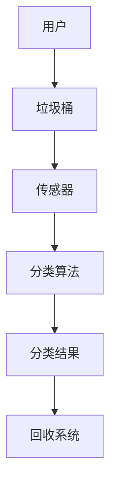
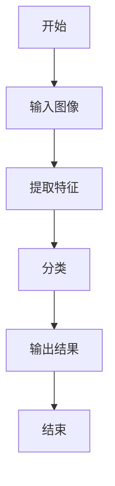
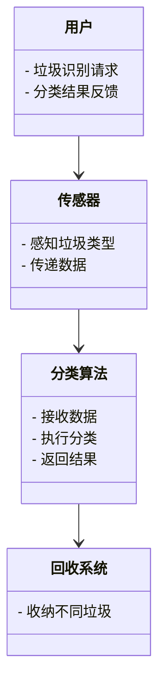
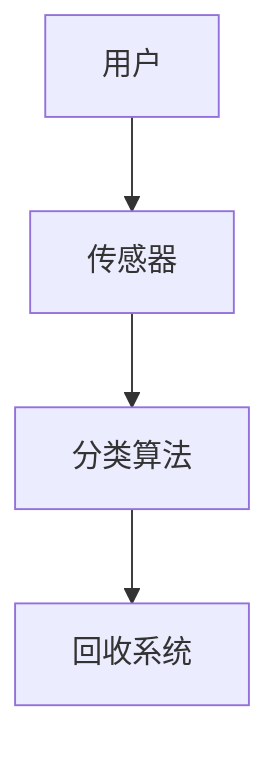
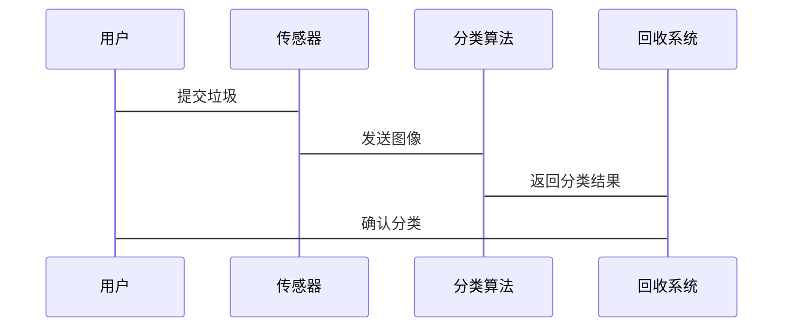

                 


# 智能垃圾桶：AI Agent的废物分类与回收建议

## 关键词：智能垃圾桶、AI Agent、废物分类、回收建议、图像识别、机器学习、环保技术

## 摘要：本文探讨AI Agent在智能垃圾桶中的应用，详细介绍废物分类与回收的技术实现，涵盖算法原理、系统架构和项目实战。

---

# 第一部分: 智能垃圾桶的背景与核心概念

## 第1章: 智能垃圾桶的背景与问题背景

### 1.1 问题背景

#### 1.1.1 废物分类与回收的重要性
废物分类是环保的重要环节，有助于资源再利用和减少环境污染。AI Agent通过自动化分类提高了效率和准确性。

#### 1.1.2 当前废物分类的痛点与挑战
传统分类依赖人工，效率低且容易出错。AI Agent通过图像识别和机器学习，解决了这些问题。

#### 1.1.3 AI Agent在废物分类中的潜力
AI Agent能够实时分类，降低成本并提高回收效率，是未来废物管理的关键技术。

### 1.2 问题描述

#### 1.2.1 废物分类的复杂性
不同类型的垃圾需要准确识别，AI Agent能够处理复杂的分类任务。

#### 1.2.2 传统分类方法的局限性
人工分类效率低，错误率高，且成本高昂。

#### 1.2.3 AI Agent如何解决这些问题
通过自动化识别和分类，AI Agent提高了分类的准确性和效率，降低了成本。

### 1.3 问题解决思路

#### 1.3.1 AI Agent的基本概念
AI Agent是一种智能体，能够感知环境并执行任务，适用于废物分类的实时处理。

#### 1.3.2 AI Agent在废物分类中的应用场景
AI Agent可以实时识别垃圾类型，指导分类并优化回收流程。

#### 1.3.3 AI Agent的核心功能与目标
识别垃圾类型、优化分类流程、提高回收效率。

### 1.4 边界与外延

#### 1.4.1 智能垃圾桶的功能边界
专注于分类和回收，不涉及垃圾处理的其他环节。

#### 1.4.2 与传统垃圾桶的区别
传统垃圾桶依赖人工分类，而智能垃圾桶使用AI技术实现自动化。

#### 1.4.3 与其他AI应用的对比
相比其他AI应用，智能垃圾桶更专注于特定任务，但技术实现类似。

### 1.5 概念结构与核心要素

#### 1.5.1 系统架构的核心要素
传感器、AI算法、分类模块、回收系统。

#### 1.5.2 各要素之间的关系
传感器收集数据，AI算法进行分类，分类模块指导回收系统。

#### 1.5.3 系统的整体框架
传感器→数据处理→分类→回收。

## 第2章: AI Agent的核心概念与联系

### 2.1 核心概念原理

#### 2.1.1 AI Agent的基本原理
AI Agent通过感知环境和学习，执行分类任务。

#### 2.1.2 废物分类的算法原理
基于卷积神经网络的图像识别，训练模型进行分类。

#### 2.1.3 系统的核心功能模块
传感器采集、AI处理、分类执行。

### 2.2 核心概念属性特征对比

#### 2.2.1 不同分类算法的特征对比
- 线性回归：简单，适合线性问题。
- 支持向量机：适用于小数据集。
- 神经网络：适合复杂数据。

#### 2.2.2 不同AI Agent的性能对比
- 基于规则的AI：简单，但适应性差。
- 基于机器学习的AI：灵活，但需要大量数据。
- 深度学习AI：处理能力强，但计算资源需求高。

#### 2.2.3 不同系统的功能对比
- 手动分类：低效，错误率高。
- 半自动系统：部分自动化，效率提升。
- 全自动AI系统：高效，准确。

### 2.3 ER实体关系图


---

# 第二部分: 废物分类算法原理

## 第3章: 废物分类算法原理

### 3.1 算法原理

#### 3.1.1 基于卷积神经网络的分类算法
卷积神经网络（CNN）擅长图像处理，适合废物分类任务。

#### 3.1.2 其他分类算法的对比
- KNN：简单，但需要大量样本。
- 决策树：易于解释，但准确率低。
- 随机森林：高准确率，计算资源需求高。

#### 3.1.3 算法的优缺点分析
CNN优点：高效，适合图像识别。缺点：需要大量数据，计算资源需求高。

### 3.2 算法流程图


### 3.3 Python代码实现

```python
import tensorflow as tf
from tensorflow.keras import layers

model = tf.keras.Sequential([
    layers.Conv2D(32, (3,3), activation='relu', input_shape=(224, 224, 3)),
    layers.MaxPooling2D((2,2)),
    layers.Conv2D(64, (3,3), activation='relu'),
    layers.MaxPooling2D((2,2)),
    layers.Flatten(),
    layers.Dense(128, activation='relu'),
    layers.Dense(10, activation='softmax')
])

model.compile(optimizer='adam', loss='sparse_categorical_crossentropy', metrics=['accuracy'])
model.fit(train_images, train_labels, epochs=10, validation_data=(test_images, test_labels))
```

---

# 第三部分: 系统分析与架构设计

## 第4章: 系统分析与架构设计

### 4.1 系统功能设计

#### 4.1.1 领域模型


### 4.2 系统架构设计

#### 4.2.1 架构图


### 4.3 接口设计

#### 4.3.1 接口定义
- 传感器接口：收集垃圾图像。
- 分类算法接口：接收图像，返回分类结果。
- 回收系统接口：根据分类结果收纳垃圾。

### 4.4 交互流程

#### 4.4.1 序列图


---

# 第四部分: 项目实战

## 第5章: 项目实战

### 5.1 环境安装

#### 5.1.1 安装Python
下载并安装Python 3.8及以上版本。

#### 5.1.2 安装TensorFlow
使用pip安装：`pip install tensorflow`

### 5.2 系统核心实现

#### 5.2.1 分类算法实现
使用TensorFlow训练CNN模型，实现垃圾分类。

#### 5.2.2 传感器集成
集成摄像头或其他传感器，采集垃圾图像。

### 5.3 案例分析

#### 5.3.1 应用场景
家庭、办公室、公共场所的垃圾桶。

#### 5.3.2 案例分析
训练模型识别可回收物和不可回收物，指导分类。

### 5.4 项目总结

#### 5.4.1 成功经验
AI Agent显著提高了分类效率和准确性。

#### 5.4.2 经验教训
需要大量数据和计算资源，实际部署需考虑环境因素。

---

# 第五部分: 总结与展望

## 第6章: 总结与展望

### 6.1 总结

#### 6.1.1 核心内容回顾
AI Agent在智能垃圾桶中的应用，提高了废物分类的效率和准确性。

### 6.2 应用前景

#### 6.2.1 技术发展趋势
深度学习和边缘计算的进步将进一步提升AI Agent的性能。

#### 6.2.2 未来的挑战
数据隐私、计算资源、传感器精度等问题需要解决。

### 6.3 最佳实践

#### 6.3.1 技术实现
选择合适的算法，确保数据质量，优化模型。

#### 6.3.2 项目实施
从小规模试点开始，逐步推广。

#### 6.3.3 维护与优化
定期更新模型，监控系统性能。

---

# 结语

智能垃圾桶通过AI Agent实现了高效的废物分类与回收，推动了环保技术的发展。未来，随着技术的进步，AI Agent将在更多领域发挥重要作用。

