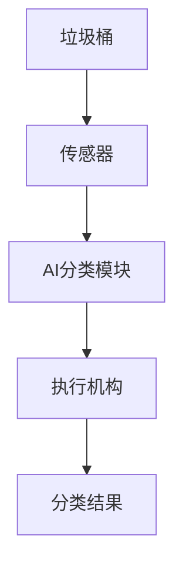
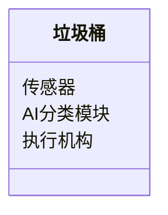
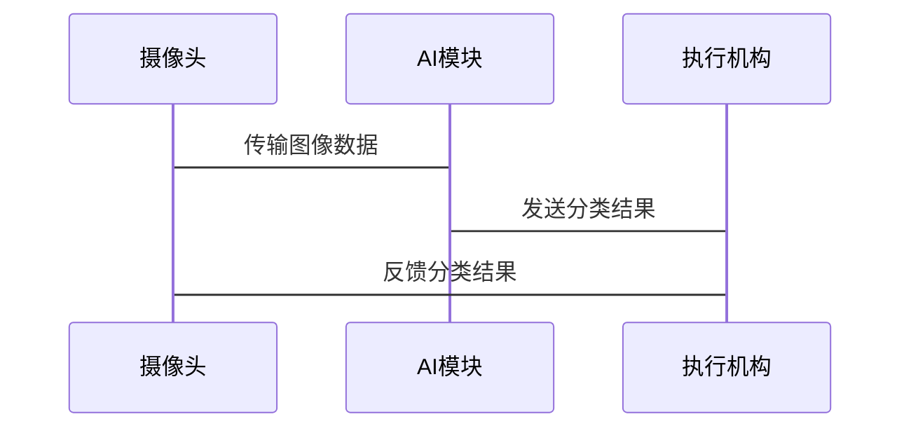

                 


```markdown
# 智能垃圾桶：AI Agent的自动分类系统

> 关键词：智能垃圾桶、AI Agent、自动分类系统、垃圾分类、机器学习、物联网、智能硬件

> 摘要：本文介绍了一种基于AI Agent的智能垃圾桶系统，详细讲解了其核心概念、算法原理、系统架构及实现方案，旨在为读者提供一个全面的技术视角，展示如何利用AI技术实现垃圾的自动分类。

---

# 第一部分: 智能垃圾桶的背景与核心概念

# 第1章: 智能垃圾桶的背景与问题描述

## 1.1 智能垃圾桶的背景

### 1.1.1 现代垃圾分类的挑战
随着城市化进程的加快，垃圾产量急剧增加，垃圾分类成为一项紧迫的任务。传统的垃圾桶依赖人工分类，效率低且容易出错。

### 1.1.2 传统垃圾桶的局限性
传统垃圾桶无法自动分类，依赖人工操作，分类效率低，且容易产生二次污染。

### 1.1.3 AI技术在垃圾桶领域的应用潜力
AI技术的快速发展为垃圾桶的智能化提供了可能，通过图像识别和机器学习，垃圾桶可以实现自动分类。

## 1.2 问题背景与目标

### 1.2.1 当前垃圾分类的主要问题
- 人工分类效率低
- 分类错误率高
- 环境污染严重

### 1.2.2 智能垃圾桶的目标与意义
智能垃圾桶的目标是通过AI技术实现垃圾的自动分类，提高分类效率，减少环境污染。

### 1.2.3 边界与外延
智能垃圾桶系统仅关注垃圾的分类，不涉及垃圾的收集和处理过程。

## 1.3 系统核心要素与组成

### 1.3.1 智能垃圾桶的核心要素
- 传感器：用于采集垃圾的物理特征
- AI分类模块：负责识别和分类垃圾
- 执行机构：负责将垃圾放入相应的收集容器

### 1.3.2 系统组成与功能模块
- 数据采集模块
- AI分类模块
- 执行机构模块

### 1.3.3 系统架构的初步设想
初步设想采用分层架构，分为数据采集层、AI分类层和执行层。

## 1.4 本章小结

---

# 第二部分: 智能垃圾桶的核心概念与技术原理

# 第2章: AI Agent与自动分类系统的核心概念

## 2.1 AI Agent的基本原理

### 2.1.1 AI Agent的定义与特征
AI Agent是一种智能代理，能够感知环境并采取行动以实现目标。

### 2.1.2 AI Agent的核心技术
- 传感器数据处理
- 机器学习模型
- 执行机构控制

### 2.1.3 AI Agent与传统自动分类系统的区别
AI Agent能够自主学习和优化，而传统系统仅能执行预设任务。

## 2.2 自动分类系统的工作原理

### 2.2.1 数据采集与处理
- 使用摄像头采集垃圾图像
- 通过传感器获取垃圾的物理特征

### 2.2.2 分类算法的选择与实现
- 选择适合的分类算法（如SVM、CNN）
- 对数据进行预处理和训练

### 2.2.3 分类结果的反馈与优化
- 根据分类结果优化模型
- 反馈至执行机构完成分类

## 2.3 核心概念对比分析

### 2.3.1 AI Agent与传统分类算法的对比

| 特性          | AI Agent                | 传统分类算法          |
|---------------|--------------------------|-----------------------|
| 自主学习      | 是                      | 否                    |
| 环境感知      | 是                      | 否                    |
| 适应性        | 强                      | 弱                    |

### 2.3.2 自动分类系统的属性特征对比

| 特性          | 输入                  | 处理                  | 输出                  |
|---------------|------------------------|-----------------------|-----------------------|
| 数据采集      | 垃圾图像、物理特征     | 分类算法              | 分类结果              |
| 执行机构      | 执行机构              |                      |

### 2.3.3 系统实体关系的Mermaid图



## 2.4 本章小结

---

# 第三部分: 智能垃圾桶的算法原理与实现

# 第3章: 分类算法的原理与选择

## 3.1 分类算法概述

### 3.1.1 常见分类算法介绍
- 支持向量机（SVM）
- 卷积神经网络（CNN）

### 3.1.2 分类算法的优缺点对比

| 算法         | 优点                     | 缺点                     |
|--------------|--------------------------|--------------------------|
| SVM          | 高精度                   | 适合小数据集             |
| CNN          | 处理图像数据能力强       | 需要大量数据和计算资源    |

## 3.2 支持向量机（SVM）原理

### 3.2.1 SVM的基本原理
SVM通过找到一个超平面，将数据分为两类。

### 3.2.2 SVM的数学模型
$$ \text{目标函数：} \min \frac{1}{2}||w||^2 $$
$$ \text{约束条件：} y_i(w \cdot x_i + b) \geq 1 $$

### 3.2.3 SVM的Python实现示例

```python
import numpy as np
from sklearn import svm

# 数据预处理
X = ...
y = ...

# 训练模型
model = svm.SVC()
model.fit(X, y)

# 预测
model.predict(X)
```

## 3.3 卷积神经网络（CNN）原理

### 3.3.1 CNN的基本结构
- 卷积层
- 池化层
- 全连接层

### 3.3.2 CNN的数学模型
$$ \text{卷积操作：} (x_i + w) \ast \text{激活函数} $$

### 3.3.3 CNN的Python实现示例

```python
import tensorflow as tf
from tensorflow.keras import layers

# 定义模型
model = tf.keras.Sequential([
    layers.Conv2D(32, (3,3), activation='relu', input_shape=(64,64,3)),
    layers.MaxPooling2D((2,2)),
    layers.Flatten(),
    layers.Dense(128, activation='relu'),
    layers.Dense(10, activation='softmax')
])

# 编译模型
model.compile(optimizer='adam', loss='sparse_categorical_crossentropy', metrics=['accuracy'])

# 训练模型
model.fit(x_train, y_train, epochs=10, batch_size=32)
```

## 3.4 算法选择与优化

### 3.4.1 算法选择策略
- 数据量小选择SVM
- 数据量大选择CNN

### 3.4.2 算法优化方法
- 数据增强
- 调整模型参数
- 使用预训练模型

## 3.5 本章小结

---

# 第四部分: 智能垃圾桶的系统分析与架构设计

# 第4章: 系统分析与架构设计方案

## 4.1 系统分析

### 4.1.1 问题场景介绍
- 垃圾分类的场景描述
- 系统需要解决的问题

### 4.1.2 系统功能设计
- 数据采集
- 分类识别
- 执行机构控制

### 4.1.3 领域模型设计



## 4.2 系统架构设计

### 4.2.1 系统架构图


### 4.2.2 接口设计
- 传感器接口
- 分类模块接口
- 执行机构接口

### 4.2.3 系统交互流程图



## 4.3 本章小结

---

# 第五部分: 智能垃圾桶的项目实战

# 第5章: 项目实战与实现

## 5.1 项目实战

### 5.1.1 环境安装
- 安装Python
- 安装TensorFlow、Keras
- 安装OpenCV

### 5.1.2 系统核心实现

```python
import cv2
import numpy as np
from tensorflow.keras.models import load_model

# 加载预训练模型
model = load_model('garbage_classifier.h5')

# 拍摄照片
cap = cv2.VideoCapture(0)
while True:
    ret, frame = cap.read()
    cv2.imshow('frame', frame)
    if cv2.waitKey(1) & 0xFF == ord('q'):
        break
cap.release()

# 分类图像
image = frame
image = cv2.resize(image, (64, 64))
image = np.expand_dims(image, axis=0)
image = image / 255.0
prediction = model.predict(image)[0]
print(prediction)
```

### 5.1.3 实际案例分析
- 数据采集与处理
- 模型训练与优化
- 实际分类效果展示

## 5.2 本章小结

---

# 第六部分: 智能垃圾桶的最佳实践

# 第6章: 最佳实践与总结

## 6.1 最佳实践

### 6.1.1 数据采集
- 确保数据多样性
- 数据清洗与增强

### 6.1.2 模型调优
- 调整模型参数
- 使用数据增强

### 6.1.3 系统维护
- 定期更新模型
- 检查传感器和执行机构

## 6.2 本章小结

---

# 结语

智能垃圾桶的实现展示了AI技术在实际生活中的巨大潜力。通过本文的详细介绍，读者可以全面了解智能垃圾桶的设计与实现过程，并能够将其应用到实际项目中。

---

# 参考文献

[1] 《机器学习实战》
[2] 《深度学习入门》
[3] 《Python机器学习》
```

---

**注意事项：**
1. 本文基于假设场景编写，实际应用中需根据具体需求调整。
2. 代码示例仅供参考，实际使用需根据数据集进行训练和优化。
3. 传感器和执行机构的选择需根据实际场景进行匹配。

